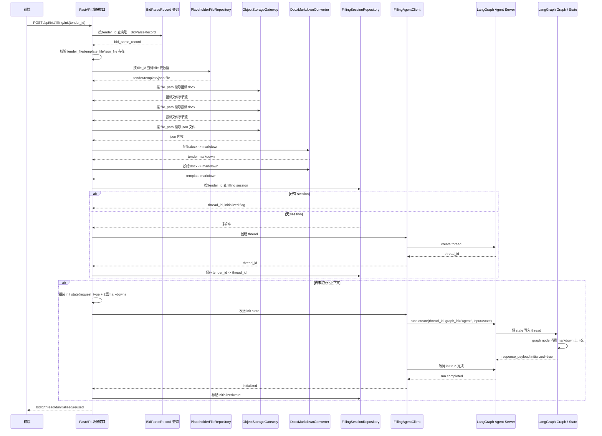
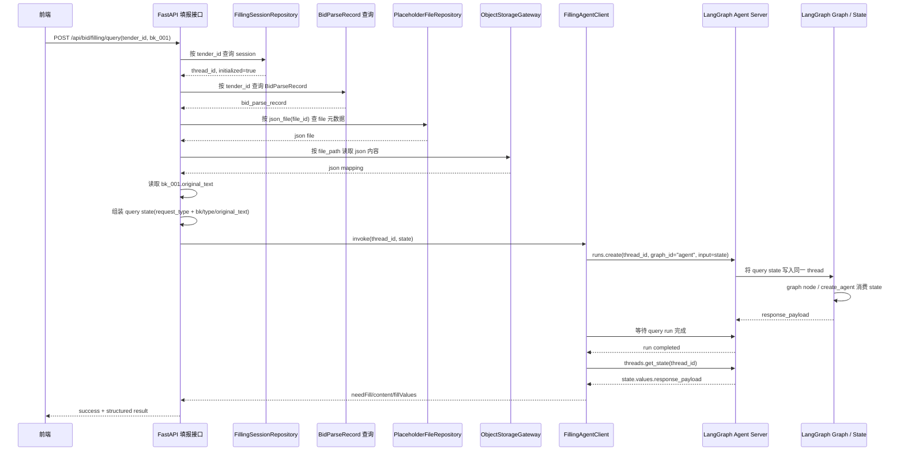
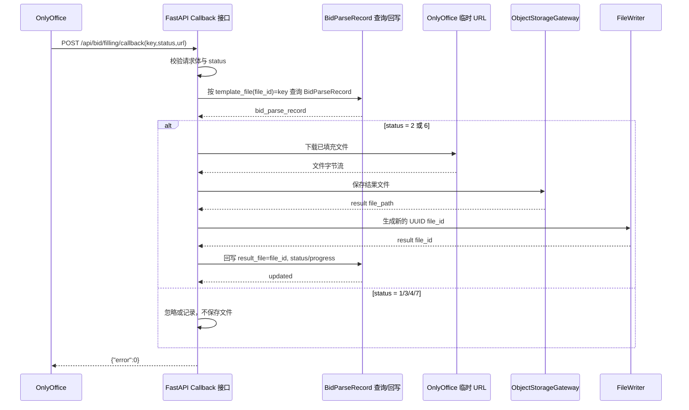

# AixBidder 填报流程 Agent 框架一期设计

> 本文档定义 AixBidder 在“投标文件填报”场景下的一期后端设计。目标是在现有 `BidParseRecord` 投标记录表基础上，补齐填报初始化、基于书签键的逐段查询、OnlyOffice 回调保存，以及面向 LangGraph agent server 的 thread 编排骨架，同时将真实 `file` 表、对象存储和 SQL Agent 能力保留为后续可替换适配层。

---

## 1. 背景与目标

当前仓库已经具备以下基础：

1. 独立的投标记录表 `bid`，实现位于 `backend/app/models/bid_parse_record.py`
2. `BidParseRecord` 已具备 `tender_file`、`template_file`、`json_file`、`result_file` 等文件关联字段
3. 真实业务中，这些字段保存的是 `file.file_id`，需要再关联 `file` 表获取文件元数据
4. 对象存储中的招标文件、投标文件均为 `docx`
5. JSON 解析结果文件中包含多条书签键到原文片段的映射，例如 `bk_001 -> { type, original_text }`
6. 后续填报能力需要使用 LangChain `create_agent` 构建 agent，并以 LangGraph server 方式运行
7. 业务后端需要通过 Python SDK 调用该 agent server，而不是让前端直接对接 agent

本次设计需要解决的问题是：

1. 只传 `tender_id` 时，如何定位当前投标记录与关联文件
2. 如何从招标文件和投标文件 `docx` 中提取两篇 markdown，并在整个填报过程中只初始化一次上下文
3. 如何基于 `bk_001` 这类书签键，在同一个 thread 中持续向 agent 发起逐段填报请求
4. 如何提供一个无鉴权的 OnlyOffice callback 接口，在文件填充完成后回写结果文件
5. 如何在本期不落地 `file` 表的前提下，为后续真实写 `file` 记录预留稳定扩展口

---

## 2. 一期范围

### 2.1 一期目标

一期必须完成以下设计：

1. 基于现有 `BidParseRecord` 扩展填报流程后端接口
2. 增加填报初始化接口，只负责创建或复用 thread，并注入两篇 markdown 上下文
3. 增加基于 `bk` 的逐段填报查询接口
4. 增加无鉴权的 OnlyOffice callback 接口
5. 增加 `docx -> markdown` 的通用文档转换能力
6. 增加面向未来 `file` 表与对象存储的占位仓储与网关
7. 增加面向 LangGraph agent server 的调用客户端与 thread 会话管理层
8. 增加占位 `FileWriter` 扩展口，为后续真实 `file` 表写入做准备

### 2.2 一期非目标

以下内容明确不纳入本期：

1. 不落地真实 `file` 表及其数据库迁移
2. 不落地真实对象存储读写
3. 不实现真实 SQL Agent 能力
4. 不在本期实现复杂的 thread 持久化中间件，例如 Redis
5. 不让前端直接调用 LangGraph agent server
6. 不将 `document_processing` 目录扩展为填报业务编排层

---

## 3. 核心业务结论

本期方案的核心约束如下：

1. `BidParseRecord` 是本期唯一真实存在的投标记录主实体，不新增第二张 `bid` 表
2. `tender_file`、`template_file`、`json_file`、`result_file` 都按 `file.file_id` 语义处理
3. 真实业务链路必须体现为：
   - `BidParseRecord.<file_field>` 取出 `file.file_id`
   - `file_id` 关联到 `file` 记录
   - 通过 `file.file_path` 从对象存储获取文件
4. 招标文件和投标文件都是 `docx`，在进入 agent 之前必须先转换为 markdown
5. 两篇 markdown 只在 `init` 阶段注入一次，后续 `query` 不重复注入
6. 前端后续每次只传 `bk_001` 这类完整书签键，不做裁剪或重命名
7. `query` 阶段从整份 JSON 映射中读取对应 `bk` 的 `original_text`，并在同一个 thread 中调用 agent
8. agent 以独立 server 方式运行，业务后端通过 Python SDK 调用
9. thread 由后端围绕 `tender_id` 管理，前端不直接管理 thread 生命周期
10. `init` 调用默认复用已有 thread，不重复创建
11. 现有 `/api/bid/parse` 链路本期不修改；填报流程默认认为 `tender_file`、`template_file`、`json_file` 已由外部流程提前写入 `BidParseRecord`
12. callback 使用 OnlyOffice 官方 `status` 语义，仅在 `status = 2` 和 `status = 6` 时保存文件
13. callback 请求中的 `key` 代表 `template_file` 保存的 `file.file_id`，不是 `BidParseRecord.id`
14. 本期 `file.file_id` 使用 UUID 风格字符串

---

## 4. 数据模型与占位对象设计

### 4.1 真实投标记录表

本期继续使用已有模型：

- `backend/app/models/bid_parse_record.py`

字段语义如下：

| 字段名 | 语义 |
| --- | --- |
| `id` | 投标记录主键 |
| `tender_id` | 招标记录 id |
| `tender_file` | 招标文件 `file.file_id` |
| `template_file` | 投标模板文件 `file.file_id` |
| `status` | 投标记录状态 |
| `result_file` | 最终填报结果文件 `file.file_id` |
| `progress` | 当前进度 |
| `json_file` | JSON 解析文件 `file.file_id` |
| `create_user` | 创建人 |
| `create_time` | 创建时间 |

说明：

1. 本期填报入口按 `tender_id` 查询对应投标记录
2. 本期业务前提为一个 `tender_id` 只对应一条 `BidParseRecord`
3. `init` 不负责为这些字段补值；若 `tender_file`、`template_file`、`json_file` 缺失，则直接返回业务错误

### 4.2 占位 `file` 对象

虽然本期不落地真实 `file` 表，但业务代码结构必须对齐未来模型。建议定义占位 `FileRecord` 对象，至少包含以下字段：

| 字段名 | 说明 |
| --- | --- |
| `id` | 文件表主键，本期不落地实现 |
| `file_id` | 对外文件标识，使用 UUID 风格字符串，对应 `BidParseRecord` 中保存的值 |
| `file_name` | 文件名 |
| `content_type` | 文件 MIME 类型 |
| `file_path` | 对象存储路径 |

说明：

1. 本期 `PlaceholderFileRepository` 根据 `file_id` 返回该对象
2. 后续切换真实 `file` 表时，业务层无需改动接口形状
3. `BidParseRecord` 中保存的是 `file.file_id`，不是 `file.id`

### 4.3 JSON 文件结构

`json_file` 对应内容必须按“多元素映射”处理，而不是单条记录。结构示例：

```json
{
  "bk_001": {
    "type": "paragraph",
    "original_text": "这是段落原文"
  },
  "bk_002": {
    "type": "table_cell",
    "original_text": "这是表格单元格原文"
  }
}
```

约束如下：

1. 顶层键为完整书签键，例如 `bk_001`
2. 每个元素至少包含：
   - `type`
   - `original_text`
3. `query` 接口只按完整键名查询，不做键名转换

### 4.4 填报会话对象

本期需要新增一个运行时会话对象，用于维护 `tender_id` 与 `thread_id` 的关系。建议定义 `FillingSession` 占位对象，至少包含以下字段：

| 字段名 | 说明 |
| --- | --- |
| `tender_id` | 招标记录 id |
| `bid_id` | 关联的投标记录 id |
| `thread_id` | agent server 返回的 thread id |
| `initialized` | 是否已完成上下文注入 |
| `created_at` | 创建时间 |
| `updated_at` | 更新时间 |

说明：

1. 一期先使用内存仓储保存该对象
2. 后续可切换为数据库或 Redis 持久化
3. 一期内存实现存在多进程或多实例丢失会话的限制，开发联调建议使用单进程运行

---

## 5. 推荐架构

本期推荐采用“业务后端 + 独立 agent server”的双进程结构。

### 5.1 系统分层

#### 业务后端（FastAPI）

职责：

1. 暴露填报初始化、逐段查询、OnlyOffice callback 接口
2. 查询 `BidParseRecord`
3. 根据 `file_id` 获取 `file` 元数据
4. 根据 `file.file_path` 读取对象存储文件
5. 将招标文件和投标文件从 `docx` 转为 markdown
6. 管理 `tender_id -> thread_id` 的填报会话映射
7. 通过 Python SDK 调用独立 agent server

#### 独立 agent server（LangGraph）

职责：

1. 通过 LangChain `create_agent` 构建填报 agent
2. 以 LangGraph server / dev 方式运行
3. 按 `thread_id` 维护会话上下文
4. 接收业务后端发送的初始化消息和逐段填报消息
5. 返回结构化填报结果

### 5.2 推荐目录结构

建议目录结构如下：

```text
backend/app/
├── agents/                                     # Agent 调用适配层
│   ├── __init__.py                             # Agent 模块导出
│   ├── filling_agent_client.py                 # Python SDK 调用 agent server
│   └── filling_agent_types.py                  # Agent 请求/响应类型
├── api/
│   ├── bid_parse.py                            # 现有投标解析接口
│   └── bid_filling.py                          # 填报初始化 / 查询 / callback 接口
├── document_processing/
│   ├── __init__.py                             # 文档处理模块入口
│   ├── docx_markdown_converter.py              # DOCX 转 Markdown
│   └── markdown_types.py                       # Markdown 转换结果类型
├── models/
│   ├── bid_parse_record.py                     # 已有投标记录表
│   └── user.py                                 # 现有用户模型
├── repositories/
│   ├── __init__.py                             # 仓储模块导出
│   ├── filling_session_repository.py           # tender_id -> thread_id 会话仓储
│   ├── placeholder_file_repository.py          # file_id -> 占位 file 对象
│   └── placeholder_object_storage_gateway.py   # file_path -> 文件内容
├── schemas/
│   ├── bid_parse.py                            # 现有投标解析 DTO
│   └── bid_filling.py                          # 填报接口 DTO
└── services/
    ├── bid_parse_service.py                    # 现有投标解析服务
    ├── filling_process_service.py              # 填报初始化与查询编排
    ├── file_writer.py                          # file 记录写入扩展口
    └── onlyoffice_callback_service.py          # OnlyOffice 回调保存服务

backend/agent_server/
├── __init__.py                                 # Agent server 模块入口
├── app.py                                      # graph app 描述与运行时元信息
├── filling_agent.py                            # create_agent 占位节点 / 后续 Agent 组装入口
├── graph.py                                    # LangGraph 图入口与 compiled_graph 导出
└── state.py                                    # LangGraph 线程状态定义

backend/
└── langgraph.json                              # LangGraph CLI 配置入口
```

### 5.3 `document_processing` 的职责边界

本期 `document_processing` 只新增“文件处理技术能力”，不承担填报业务编排职责。

允许进入该目录的能力：

1. `docx -> markdown` 转换
2. 文档转换结果类型定义

明确不放入该目录的能力：

1. `tender_id` 查询
2. `bk` 查找
3. thread 管理
4. agent 调用
5. callback 保存逻辑

### 5.4 LangGraph Project 结构约定

本期 `agent_server` 虽然仍是占位实现，但项目结构必须对齐未来真实 `langgraph dev` 运行方式。

#### 5.4.1 `langgraph.json` 约定

`backend/langgraph.json` 使用官方最小格式，约定如下：

```json
{
  "dependencies": ["."],
  "graphs": {
    "agent": "./agent_server/graph.py:compiled_graph"
  },
  "env": ".env"
}
```

说明：

1. `graphs.agent` 是后续 Python SDK 调用时使用的固定 `graph_id`
2. `compiled_graph` 由 `backend/agent_server/graph.py` 导出
3. `env` 继续复用 `backend/.env`
4. 本期先不要求在当前后端运行环境中安装 LangGraph 依赖，但结构必须提前对齐

#### 5.4.2 Agent Server 运行时边界

1. 主业务后端继续保持 Python `3.10+`
2. LangGraph 本地 `dev` 模式建议运行在独立 Python `3.11+` 环境
3. 业务后端不直接依赖 LangGraph CLI，而是通过 Python SDK client 调 agent server
4. 若当前环境缺少 `langgraph-sdk`，`FillingAgentClient` 允许回退到 stub，占位打通链路

### 5.5 一期 `docx -> markdown` 降级策略

为了避免转换选型阻塞实现，一期允许 `DocxMarkdownConverter` 使用占位降级策略：

1. 能提取正文纯文本时，先按段落顺序输出基础 markdown
2. 表格内容允许先序列化为基础文本块或简单 markdown table
3. 转换结果最小类型建议为：
   - `markdown: str`
   - `warnings: list[str]`

说明：

1. 一期目标是稳定生成“可注入 agent 上下文”的 markdown 文本
2. 不要求本期做到高保真版式还原

---

## 6. 详细流程设计

### 6.1 初始化流程

接口：

```http
POST /api/bid/filling/init
Content-Type: application/json
```

请求体：

```json
{
  "tender_id": 123
}
```

处理步骤：

1. 根据 `tender_id` 查询唯一一条 `BidParseRecord`
2. 校验 `tender_file`、`template_file`、`json_file` 是否存在
3. 用三个 `file_id` 到 `PlaceholderFileRepository` 获取占位 `file` 元数据
4. 基于 `file.file_path` 从对象存储网关读取：
   - 招标文件 `docx`
   - 投标文件 `docx`
   - JSON 文件内容
5. 调用 `DocxMarkdownConverter` 将招标文件和投标文件转换成 markdown
6. 解析 JSON 内容并校验其是否为合法映射
7. 查询 `FillingSessionRepository`：
   - 若已有会话，则直接复用其 `thread_id`
   - 若无会话，则调用 agent server 创建新 thread
8. 业务后端将初始化上下文转换为 LangGraph state 输入：
   - `request_type = "init"`
   - `tender_context_markdown = <招标文件 markdown>`
   - `template_context_markdown = <投标模板 markdown>`
9. 如果会话尚未初始化，则向 agent server 发送一次初始化消息，消息中包含上述 state
10. 将会话标记为 `initialized = true`
11. 返回初始化结果

返回体建议：

```json
{
  "success": true,
  "message": "填报会话初始化成功",
  "data": {
    "tenderId": 123,
    "bidId": 1001,
    "threadId": "thread_abc123",
    "initialized": true,
    "reused": true
  }
}
```

说明：

1. `init` 只负责“会话初始化”，不做逐段填报查询
2. 两篇 markdown 只在首次初始化时注入一次
3. 本期不修改 `/api/bid/parse` 既有链路，也不要求其回写 `template_file/json_file`
4. 本期初始化上下文是“先写入 LangGraph thread state，再由 graph node 内部消费”的模式，不是前端直接向 agent 传裸 prompt

初始化时序图：



### 6.2 逐段查询流程

接口：

```http
POST /api/bid/filling/query
Content-Type: application/json
```

请求体：

```json
{
  "tender_id": 123,
  "bk": "bk_001"
}
```

处理步骤：

1. 根据 `tender_id` 查找已初始化的 `FillingSession`
2. 若不存在会话，则返回“请先初始化填报会话”
3. 根据 `tender_id` 再次查询目标 `BidParseRecord`
4. 通过 `json_file -> file_id -> file_path` 读取 JSON 文件内容
5. 在 JSON 映射中查找完整键 `bk_001`
6. 读取该节点的：
   - `type`
   - `original_text`
7. 业务后端将查询上下文转换为 LangGraph state 输入：
   - `request_type = "query"`
   - `current_bk = "bk_001"`
   - `current_section_type = <type>`
   - `current_original_text = <original_text>`
8. 使用同一个 `thread_id` 调用 agent server
9. 从 thread state 中读取 `response_payload`
10. 将 `response_payload` 转换为前端稳定结构

返回体建议：

```json
{
  "success": true,
  "needFill": true,
  "bk": "bk_001",
  "content": "投标下浮系数4.50%。（下浮系数应≥5%）",
  "fillValues": ["4.50"]
}
```

约束如下：

1. 返回中的 `bk` 必须保留完整键名，例如 `bk_001`
2. 不将 `bk_001` 裁剪成 `001`
3. 本期 `needFill`、`content`、`fillValues` 可以先由占位 agent 返回
4. 若会话不存在，接口直接返回“请先初始化填报会话”
5. 后续真实 `create_agent` 接入时，只允许在 graph node 内部消费这些 state 字段，不改前端请求结构

逐段查询时序图：



### 6.3 OnlyOffice callback 流程

接口：

```http
POST /api/bid/filling/callback
Content-Type: application/json
```

要求：

1. 无鉴权
2. 仅用于接收 OnlyOffice 回调
3. 请求体按 OnlyOffice 官方结构处理，最小必须包含：
   - `key`
   - `status`
   - `url`（仅对 `status = 2/6` 强依赖）

处理步骤：

1. 接收回调请求体
2. 按 OnlyOffice 官方语义处理 `status`
3. 使用 `key` 作为 `template_file(file_id)` 去查询 `BidParseRecord`
4. 当 `status = 2` 或 `status = 6` 时：
   - 从临时 `url` 下载已填充文件
   - 上传到对象存储
   - 调用占位 `FileWriter` 生成新的 UUID 风格 `file_id`
   - 回写 `BidParseRecord.result_file = file_id`
   - 更新 `BidParseRecord.status` 与 `progress`
5. 对其他状态仅记录或忽略，不做文件保存
6. 按 OnlyOffice 规范返回 `{"error": 0}`

说明：

1. OnlyOffice 官方 `status` 取值为 `1、2、3、4、6、7`
2. 本期仅在 `status = 2` 和 `status = 6` 时保存文件
3. `key` 不是 `BidParseRecord.id`，而是 `BidParseRecord.template_file` 保存的 `file.file_id`
4. 本期不落地真实 `file` 表，由 `FileWriter` 返回占位 `file_id`

OnlyOffice callback 时序图：



### 6.4 最小状态推进建议

为了避免实现阶段各处随意写状态，本期建议在复用 `BidParseRecord.status` 时追加最小状态集合：

1. `filling_initialized`
   - `init` 成功完成上下文注入后写入
2. `filling_in_progress`
   - 首次 `query` 成功发起后可写入
3. `filled`
   - callback 在 `status = 2/6` 且成功保存结果文件后写入

对应进度建议：

1. `init` 成功后可推进到 `20`
2. 首次 `query` 后可推进到 `60`
3. callback 成功落结果后推进到 `100`

---

## 7. Thread 与 Agent Server 设计

### 7.1 Thread 设计原则

thread 不是前端直接管理的聊天会话，而是后端围绕 `tender_id` 维护的业务会话。

约束如下：

1. 一个 `tender_id` 在任一时刻最多对应一个活跃 filling thread
2. `init` 调用默认复用已有 thread
3. `query` 必须使用已经初始化完成的 thread
4. 前端不直接控制 thread 创建、销毁、重建
5. thread 主索引仍然使用 `tender_id`，前端无需显式传 `thread_id`

`FillingSessionRepository` 在本期的主要职责是维护运行时会话关系，而不是保存业务主数据。它至少负责：

1. 在首次 `init` 成功创建 thread 后，保存 `tender_id -> thread_id` 的映射
2. 在重复 `init` 时返回已有会话，实现同一 `tender_id` 复用同一个 thread
3. 记录 `initialized` 标记，区分“thread 已创建”与“上下文已注入完成”
4. 为 `query` 阶段提供前置校验，避免未初始化会话直接进入填报查询
5. 允许在 `metadata` 中缓存本次会话需要复用的运行时信息，例如 JSON 映射

说明：

1. 本期先使用内存实现，不要求持久化
2. 后续若系统进入多实例部署或需要跨进程复用 thread，需要将该仓储切换为 Redis、数据库或其他持久化实现

### 7.1.1 Thread 生命周期与销毁策略

本期对 thread 生命周期的约定如下：

1. thread 在首次 `init` 成功时创建
2. 只要同一个 `tender_id` 对应的会话仍有效，后续 `query` 一律复用同一个 thread
3. 本期不提供前端主动销毁 thread 的接口
4. 本期在 OnlyOffice callback 成功后也不自动销毁 thread
5. 若服务重启或内存会话仓储丢失，允许重新执行 `init` 来恢复 thread 关系

这样设计的原因是：

1. callback 成功后，业务上仍可能存在再次查看、再次查询、再次编辑和再次回调的需求
2. 若在 callback 后立即销毁 thread，会导致后续同一 `tender_id` 无法继续复用上下文
3. 一期目标优先保证填报链路稳定打通，不引入额外的 thread 清理复杂度

后续建议的销毁/失效策略如下：

1. 当用户主动触发“重新初始化填报会话”时，废弃旧 thread 并创建新 thread
2. 当业务进入最终归档态时，可由后端清理对应 thread
3. 后续可引入基于最后访问时间的超时清理，例如按小时或天级别失效

说明：

1. 本期“只有一个活跃 thread”并不等于“thread 永不失效”，只是暂不实现主动销毁
2. 后续一旦引入持久化 checkpointer 或 Redis/Postgres 会话存储，需要把 thread 失效策略同步落到存储层

### 7.2 初始化消息

初始化消息在首次 `init` 时发送给 agent，内容包含：

1. 招标文件 markdown
2. 投标文件 markdown
3. 固定系统提示，说明：
   - 你是投标填报助手
   - 后续会按 `bk_xxx` 分段提供原文
   - 你需要输出固定 JSON 结构

### 7.3 单次查询消息

后续每次 `query` 都只发送局部输入，内容包含：

1. `bk`
2. 当前 `bk` 对应的 `type`
3. 当前 `bk` 对应的 `original_text`

说明：

1. 不重复发送两篇 markdown
2. 依赖 thread 持续保留初始化上下文

### 7.4 Agent Server 运行模式

本期建议：

1. 使用 LangChain `create_agent` 构建填报 agent
2. 使用 LangGraph server / dev 方式运行 agent
3. 业务后端通过 Python SDK Client 适配层调用该 server
4. 业务侧将 SDK 访问细节封装在 `filling_agent_client.py` 中，避免路由和服务层直接依赖底层调用协议
5. `langgraph.json` 使用固定 `graph_id = "agent"`，并导出 `./agent_server/graph.py:compiled_graph`
6. 业务后端优先使用真实 `LangGraphFillingAgentClient`，若当前环境缺少 SDK 则允许回退到 stub

业务后端与 agent server 的职责边界如下：

| 层 | 职责 |
| --- | --- |
| FastAPI 业务后端 | 查表、读文件、转 markdown、解析 JSON、管理 thread、封装业务响应 |
| Agent Server | 维护 agent graph、按 thread 推理、返回结构化结果 |

### 7.5 LangGraph State 字段约定

为了让未来真实 `create_agent` 实现可以无缝接入，本期先约定 graph 层状态字段，不要求前端感知这些字段。

推荐的 `FillingGraphState` 字段如下：

| 字段名 | 类型 | 阶段 | 说明 |
| --- | --- | --- | --- |
| `request_type` | `str` | init/query | 当前请求类型，取值如 `init`、`query` |
| `tender_context_markdown` | `str` | init | 招标文件 markdown 上下文 |
| `template_context_markdown` | `str` | init | 投标模板 markdown 上下文 |
| `current_bk` | `str` | query | 当前书签键，例如 `bk_001` |
| `current_section_type` | `str` | query | 当前书签片段类型，例如 `paragraph` |
| `current_original_text` | `str` | query | 当前书签对应原文 |
| `response_payload` | `dict` | init/query | graph node 或 agent 写回的结构化结果 |

初始化阶段写入 state 的示例：

```json
{
  "request_type": "init",
  "tender_context_markdown": "# 招标文件\\n...",
  "template_context_markdown": "# 投标模板\\n..."
}
```

逐段查询阶段写入 state 的示例：

```json
{
  "request_type": "query",
  "current_bk": "bk_001",
  "current_section_type": "paragraph",
  "current_original_text": "这是原文片段"
}
```

说明：

1. 前端永远不直接传这些 state 字段
2. 这些字段由业务后端根据 `tender_id`、`bk` 和文件内容组装
3. 真实 `create_agent` 接入后，只允许在 graph node 内部消费这些字段
4. 后续如果 graph state 扩展新字段，也必须保持对现有字段的兼容

### 7.6 Agent 输出结构

建议 agent server 在 thread state 的 `response_payload` 中产出固定结构：

```json
{
  "success": true,
  "needFill": true,
  "bk": "bk_001",
  "content": "投标下浮系数4.50%。（下浮系数应≥5%）",
  "fillValues": ["4.50"]
}
```

其中：

1. `init` 阶段允许仅返回 `{"initialized": true}` 这类最小结构
2. `query` 阶段必须返回 `bk/needFill/content/fillValues`
3. 业务后端读取 `threads.get_state(thread_id)` 中的 `values.response_payload`
4. 后端 HTTP 层再按前端契约包裹外层 `success/message/data`

---

## 8. 错误处理

### 8.1 初始化阶段

初始化接口需要覆盖以下错误：

1. `tender_id` 对应记录不存在
2. 对应 `BidParseRecord` 缺少 `tender_file`
3. 对应 `BidParseRecord` 缺少 `template_file`
4. 对应 `BidParseRecord` 缺少 `json_file`
5. `file_id` 无法查到 `file` 元数据
6. 对象存储中找不到目标文件
7. `docx -> markdown` 转换失败
8. JSON 文件解析失败
9. agent server thread 创建失败
10. 初始化上下文注入失败

### 8.2 查询阶段

查询接口需要覆盖以下错误：

1. 会话未初始化
2. `bk` 为空
3. JSON 文件中不存在指定 `bk`
4. `original_text` 缺失
5. agent server 调用失败
6. agent 返回结构不合法

### 8.3 Callback 阶段

callback 接口需要覆盖以下错误：

1. 回调参数缺失
2. `key` 对应不到任何 `BidParseRecord`
3. `status = 2/6` 时缺少 `url`
4. 临时 `url` 下载失败
5. 对象存储保存失败
6. 占位 `FileWriter` 生成 `file_id` 失败
7. 回写 `BidParseRecord` 失败

---

## 9. 测试策略

本期测试需要覆盖以下场景：

1. `init` 成功创建 thread 并完成首次初始化
2. 重复调用 `init` 时复用已有 thread
3. `query` 在未初始化会话时返回明确错误
4. `query` 能正确读取 JSON 中的完整键 `bk_001`
5. `query` 返回中的 `bk` 保留完整键名
6. `query` 使用的是同一个 `thread_id`
7. `docx -> markdown` 转换器在合法输入下返回 markdown
8. callback 在 `status = 2` 时能成功回写 `result_file`
9. callback 在 `status = 6` 时能成功回写 `result_file`
10. callback 在 `status = 1/3/4/7` 时不会写入结果文件
11. callback 使用 `template_file(file_id)` 而不是 `bid_id` 查找记录
12. callback 为无鉴权接口，且成功响应固定返回 `{"error": 0}`

---

## 10. 实施建议

一期实现建议分为以下几块：

1. 增加 `docx -> markdown` 转换能力与测试
2. 增加占位 `file` 仓储、对象存储网关与测试
3. 增加 filling session 仓储与 thread 复用逻辑
4. 增加 agent client 与占位 server 协议
5. 增加占位 `FileWriter` 扩展口
6. 增加 `init/query/callback` 三个 API 及测试

本期最重要的目标不是做出真实智能填报能力，而是先把以下骨架做对：

1. 文件定位链路正确
2. markdown 上下文只初始化一次
3. 同一个 `tender_id` 稳定复用 thread
4. 前后端与 agent server 的职责边界清晰
