# AI Agent Skill 开发完全指南

> 📅 整理时间：2026-03-27  
> 🎯 适用平台：OpenClaw、Codex、自定义项目

---

## 📑 目录

1. [一、什么是 Skill？](#一什么是-skill)
2. [二、Skill 设计哲学](#二skill-设计哲学)
3. [三、Skill 结构详解](#三skill-结构详解)
4. [四、编写你的第一个 Skill](#四编写你的第一个-skill)
5. [五、实战案例：多个完整 Skill](#五实战案例多个完整-skill)
6. [六、在不同平台中引入 Skill](#六在不同平台中引入-skill)
7. [七、Skill 开发最佳实践](#七skill-开发最佳实践)
8. [八、进阶技巧](#八进阶技巧)

---

## 一、什么是 Skill？

### 1.1 核心概念

**Skill（技能）** 是智能体的能力模块，类似于人类的专业技能。它将通用智能体转化为具备特定领域能力的专家。

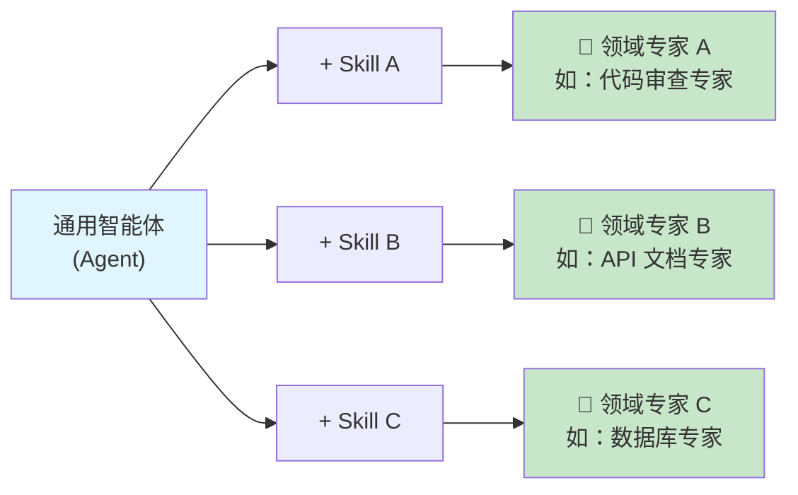

### 1.2 为什么需要 Skill？

| 😰 问题 | ✅ Skill 的解决方案 |
|:--------|:--------------------|
| LLM 缺乏领域知识 | 打包领域知识、流程、最佳实践 |
| 重复任务效率低 | 提供脚本、模板、自动化工具 |
| 输出质量不稳定 | 约束自由度、提供标准流程 |
| 上下文浪费 | 渐进式加载，按需读取 |

### 1.3 Skill vs Prompt vs Tool

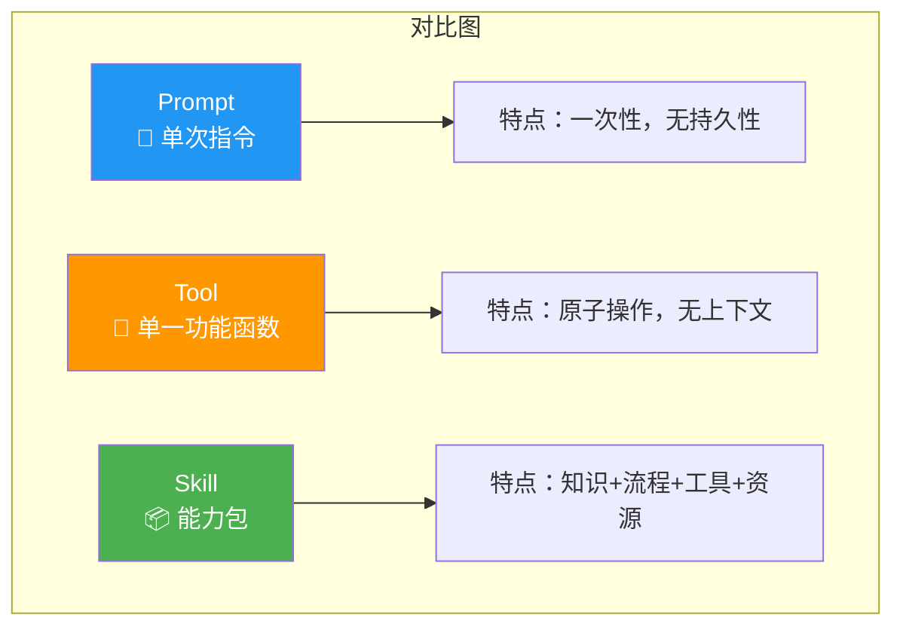

**组成关系**：

```
┌─────────────────────────────────────────────────────┐
│                    Skill 📦                          │
│  ┌─────────┐ ┌─────────┐ ┌─────────┐ ┌─────────┐   │
│  │ Prompt  │ │  Tool   │ │Knowledge│ │Resource │   │
│  │   📝    │ │   🔧    │ │   📚    │ │   📁    │   │
│  └─────────┘ └─────────┘ └─────────┘ └─────────┘   │
└─────────────────────────────────────────────────────┘
```

---

## 二、Skill 设计哲学

### 2.1 核心原则总览

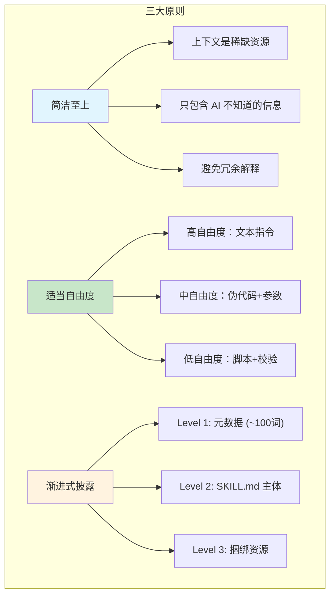

### 2.2 原则详解

#### 📌 原则一：简洁至上

上下文窗口是稀缺资源。Skill 必须精简，只包含 AI 不知道的信息。

| ❌ 冗余（不要这样做） | ✅ 精简（应该这样做） |
|:----------------------|:----------------------|
| 解释什么是 JSON | 提供 JSON Schema 定义 |
| 解释什么是 Git | 提供 commit 规范 |
| 解释什么是 API | 提供 API 文档模板 |

#### 📌 原则二：适当的自由度

根据任务的容错性调整约束程度：

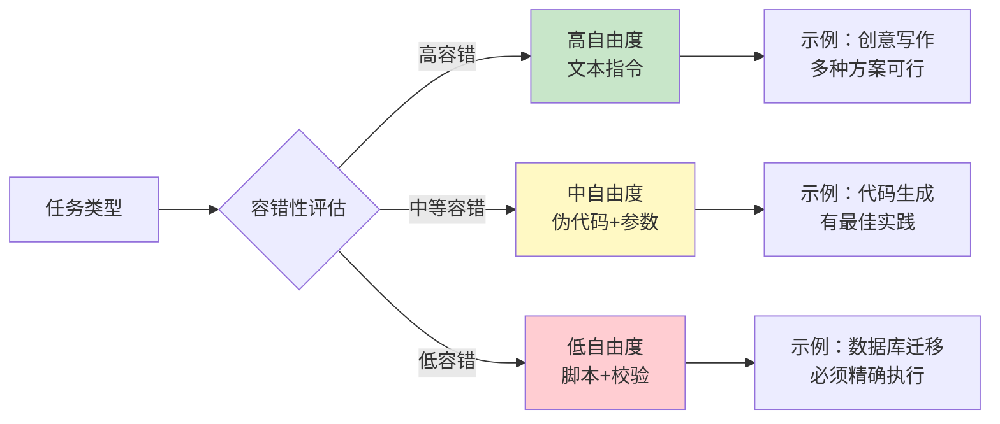

#### 📌 原则三：渐进式披露

三层加载机制，避免上下文膨胀：

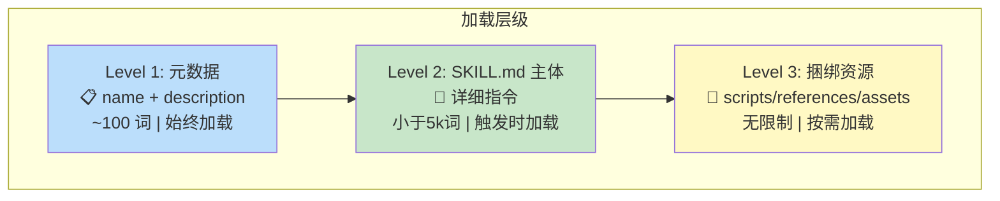

---

## 三、Skill 结构详解

### 3.1 目录结构总览

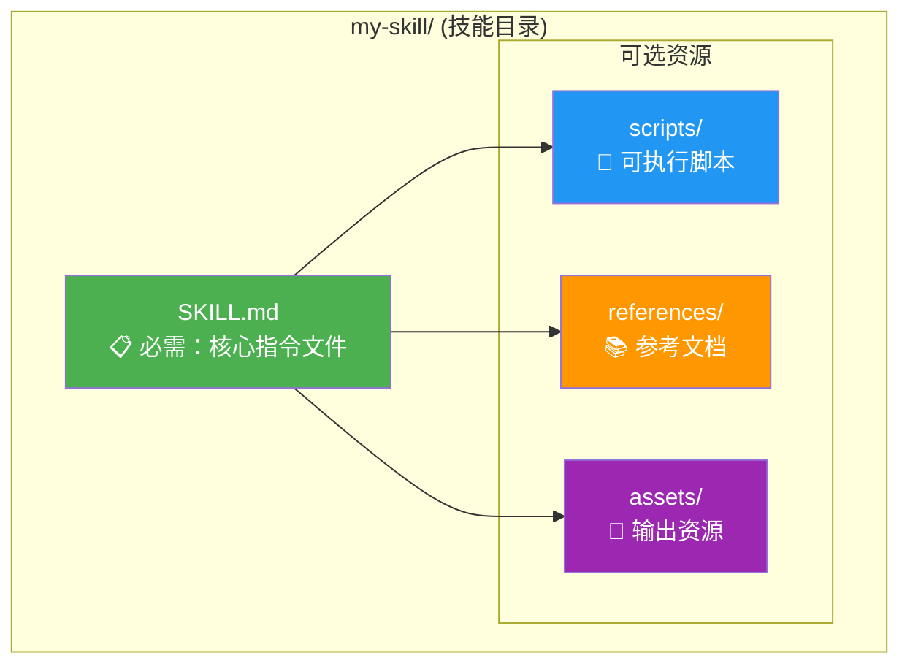

### 3.2 SKILL.md 文件结构

```yaml
---
name: my-skill
description: 技能描述，包含功能说明和触发条件
---

# 技能标题

## 快速开始
[核心用法示例]

## 详细说明
[可选，复杂场景]

## 参考资料
[指向 references/ 文件]
```

**Frontmatter 字段说明**：

| 字段 | 必需 | 说明 |
|:-----|:----:|:-----|
| `name` | ✅ | 技能名称，小写字母+连字符 |
| `description` | ✅ | 功能描述 + 触发条件（核心！） |

> ⚠️ **重要**：`description` 是触发机制，必须清晰描述"何时使用"。

### 3.3 捆绑资源详解

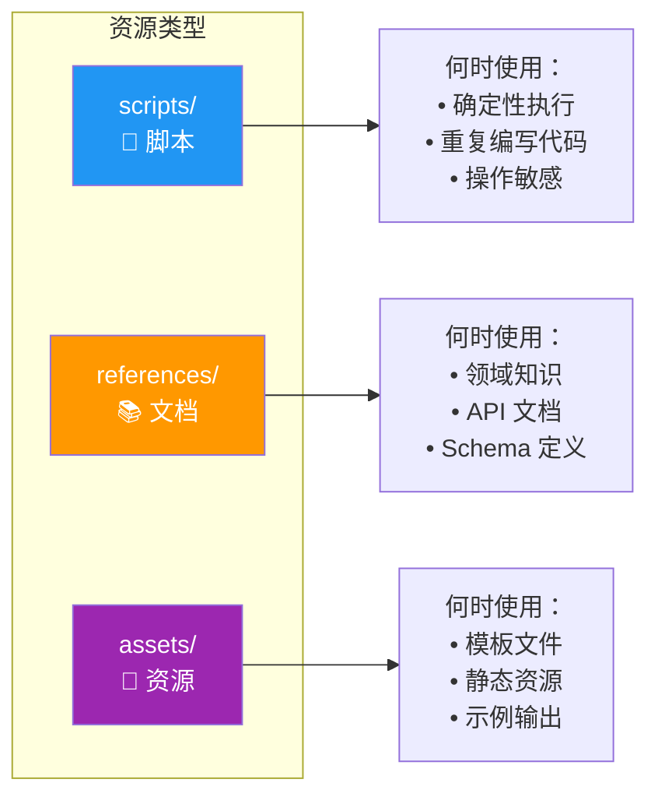

**具体示例**：

| 目录 | 示例文件 | 用途 |
|:-----|:---------|:-----|
| `scripts/` | `rotate_pdf.py`<br>`compress_image.sh`<br>`validate_schema.py` | 可执行脚本 |
| `references/` | `api_docs.md`<br>`database_schema.md`<br>`style_guide.md` | 参考文档 |
| `assets/` | `template.html`<br>`logo.png`<br>`sample_output.json` | 输出资源 |

---

## 四、编写你的第一个 Skill

### 4.0 创建流程概览


### 4.1 场景：创建一个 Git Commit 规范 Skill

**需求**：帮助开发者生成符合规范的 Git Commit 信息。

### 4.2 步骤一：理解需求

**示例场景**：
- 用户说："帮我提交代码"
- 用户说："生成一个 commit message"
- 用户说："这些改动应该怎么描述？"

**期望输出**：
```
feat: 添加用户登录功能

- 新增登录表单组件
- 集成 OAuth 2.0 认证
- 添加登录状态管理
```

### 4.3 步骤二：规划内容

| 分析项 | 决定 |
|:-------|:-----|
| 需要脚本吗？ | ✅ 是，自动分析 git diff |
| 需要参考文档吗？ | ❌ 否，规范简短可内联 |
| 需要资源文件吗？ | ❌ 否 |

### 4.4 步骤三：创建 Skill 目录

```bash
mkdir -p git-commit-skill/scripts
```

### 4.5 步骤四：编写脚本

**scripts/analyze_changes.py**：

```python
#!/usr/bin/env python3
"""分析 Git 变更并生成结构化报告"""

import subprocess
import sys
from pathlib import Path


def get_staged_diff():
    """获取暂存区的变更"""
    result = subprocess.run(
        ["git", "diff", "--cached", "--stat"],
        capture_output=True,
        text=True
    )
    return result.stdout


def get_diff_details():
    """获取详细的变更内容"""
    result = subprocess.run(
        ["git", "diff", "--cached"],
        capture_output=True,
        text=True
    )
    return result.stdout


def get_recent_commits(n=5):
    """获取最近的提交历史用于参考"""
    result = subprocess.run(
        ["git", "log", f"-{n}", "--oneline"],
        capture_output=True,
        text=True
    )
    return result.stdout


def analyze_changes():
    """主分析函数"""
    staged = get_staged_diff()

    if not staged:
        print("❌ 没有暂存的变更。请先 git add <files>")
        sys.exit(1)

    print("=== 暂存文件统计 ===")
    print(staged)

    print("\n=== 详细变更 ===")
    print(get_diff_details()[:3000])  # 限制长度

    print("\n=== 最近提交风格 ===")
    print(get_recent_commits())


if __name__ == "__main__":
    analyze_changes()
```

### 4.6 步骤五：编写 SKILL.md

**SKILL.md**：

```yaml
---
name: git-commit
description: 生成规范的 Git Commit 信息。当用户需要提交代码、生成 commit message、询问如何描述变更时触发。支持 Conventional Commits 规范。
---

# Git Commit 规范助手

帮助生成符合 Conventional Commits 规范的提交信息。

## 规范速查

```
<type>(<scope>): <subject>

<body>

<footer>
```

### Type 类型

| 类型 | 说明 | 示例 |
|------|------|------|
| feat | 新功能 | feat: 添加用户登录 |
| fix | Bug 修复 | fix: 修复登录验证 |
| docs | 文档变更 | docs: 更新 README |
| style | 代码格式 | style: 格式化代码 |
| refactor | 重构 | refactor: 重构登录逻辑 |
| test | 测试 | test: 添加登录测试 |
| chore | 构建/工具 | chore: 更新依赖 |

## 使用流程

1. 运行分析脚本获取变更信息：
   ```bash
   python scripts/analyze_changes.py
   ```

2. 根据变更内容，生成符合规范的 commit message

3. 格式要求：
   a) 标题不超过 50 字符
   b) 使用祈使语气（add 而非 added）
   c) 正文说明"做了什么"和"为什么"

## 示例

输入变更：
```
+ 用户登录表单
+ OAuth 集成
- 旧的登录代码
```

输出：
```
feat(auth): 添加 OAuth 2.0 登录支持

* 新增 OAuth 登录表单组件
* 集成 Google/GitHub OAuth
* 移除旧的 session 登录代码

Closes #123
```

### 4.7 步骤六：测试 Skill

```bash
# 1. 添加测试文件
git add scripts/analyze_changes.py

# 2. 运行脚本
python scripts/analyze_changes.py

# 3. 让 AI 生成 commit message
```

---

## 五、实战案例：多个完整 Skill

### 5.0 案例总览

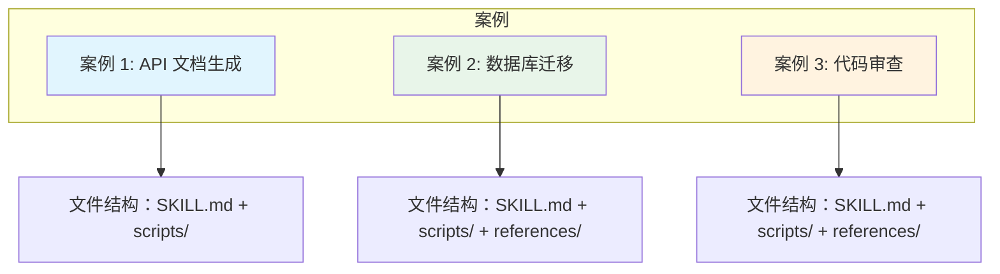

### 5.1 案例 1：API 文档生成 Skill

**场景**：自动为 API 端点生成文档。


**目录结构**：
```
api-doc-generator/
├── SKILL.md
└── scripts/
    └── extract_endpoints.py
```

**SKILL.md**：

```yaml
name: api-doc-generator
description: 为 REST API 自动生成文档。当用户需要生成 API 文档、编写接口说明、创建 API 参考手册时触发。支持 OpenAPI/Swagger 格式。
---
# API 文档生成器

自动分析代码并生成 API 文档。

## 支持的框架

- Express.js
- FastAPI
- Flask
- Spring Boot

## 使用方式

### 1. 提取端点

运行脚本分析代码：
```bash
python scripts/extract_endpoints.py <source-dir>
```

### 2. 生成文档

根据提取的信息，按以下格式生成：
...（省略详细内容）
```

**scripts/extract_endpoints.py**：

```python
#!/usr/bin/env python3
"""从代码中提取 API 端点信息"""

import re
import sys
from pathlib import Path


def extract_express_routes(content):
    """提取 Express.js 路由"""
    pattern = r'(app|router)\.(get|post|put|delete|patch)\([\'"]([^\'"]+)[\'"]'
    routes = []
    for match in re.finditer(pattern, content):
        routes.append({
            'method': match.group(2).upper(),
            'path': match.group(3)
        })
    return routes


def extract_fastapi_routes(content):
    """提取 FastAPI 路由"""
    pattern = r'@(app|router)\.(get|post|put|delete|patch)\([\'"]([^\'"]+)[\'"]'
    routes = []
    for match in re.finditer(pattern, content, re.IGNORECASE):
        routes.append({
            'method': match.group(2).upper(),
            'path': match.group(3)
        })
    return routes


def scan_directory(directory):
    """扫描目录提取所有端点"""
    all_routes = []
    path = Path(directory)

    for file in path.rglob('*'):
        if file.suffix in ['.js', '.ts', '.py']:
            content = file.read_text()
            all_routes.extend(extract_express_routes(content))
            all_routes.extend(extract_fastapi_routes(content))

    return all_routes


def main():
    if len(sys.argv) < 2:
        print("用法: python extract_endpoints.py <source-dir>")
        sys.exit(1)

    routes = scan_directory(sys.argv[1])

    print("=== 发现的 API 端点 ===\n")
    for route in routes:
        print(f"{route['method']:6} {route['path']}")

    print(f"\n总计: {len(routes)} 个端点")


if __name__ == "__main__":
    main()
```

---

### 5.2 案例 2：数据库迁移 Skill

**场景**：生成数据库迁移脚本。

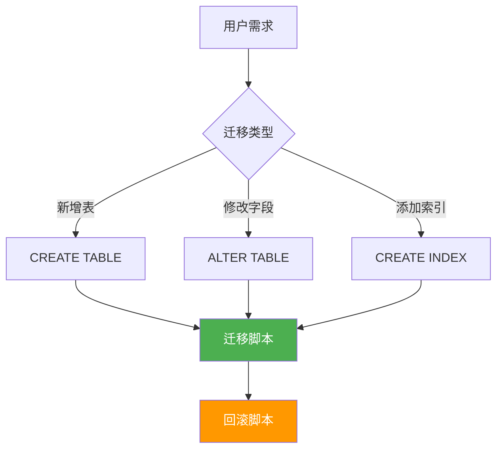

**目录结构**：
```
db-migration/
├── SKILL.md
├── scripts/
│   └── generate_migration.py
└── references/
    └── naming_conventions.md
```

**SKILL.md**：

```yaml
---
name: db-migration
description: 生成数据库迁移脚本。当用户需要创建数据表、修改字段、添加索引、执行数据库迁移时触发。支持多种数据库。
---

# 数据库迁移助手

生成标准化的数据库迁移脚本。

## 支持的数据库

- PostgreSQL
- MySQL
- SQLite
- MongoDB

## 使用流程

1. 理解用户需求（新增表/修改表/索引等）
2. 生成迁移脚本
3. 确保命名规范（见 references/naming_conventions.md）

## 迁移脚本模板

...（详细内容）
```

**references/naming_conventions.md**：

```markdown
# 数据库命名规范

## 表命名

| 规则 | 示例 |
|:-----|:-----|
| 小写字母+下划线 | `users`, `orders` |
| 使用复数形式 | `products` 而非 `product` |
| 关联表格式 | `user_roles`, `order_items` |

## 字段命名

| 类型 | 规范 |
|:-----|:-----|
| 主键 | `id` 或 `{table}_id` |
| 外键 | `{referenced_table}_id` |
| 时间戳 | `created_at`, `updated_at` |

## 索引命名

格式：`idx_{table}_{columns}`

示例：`idx_users_email`, `idx_orders_user_id`
```

---

### 5.3 案例 3：代码审查 Skill

**场景**：自动化代码审查流程。

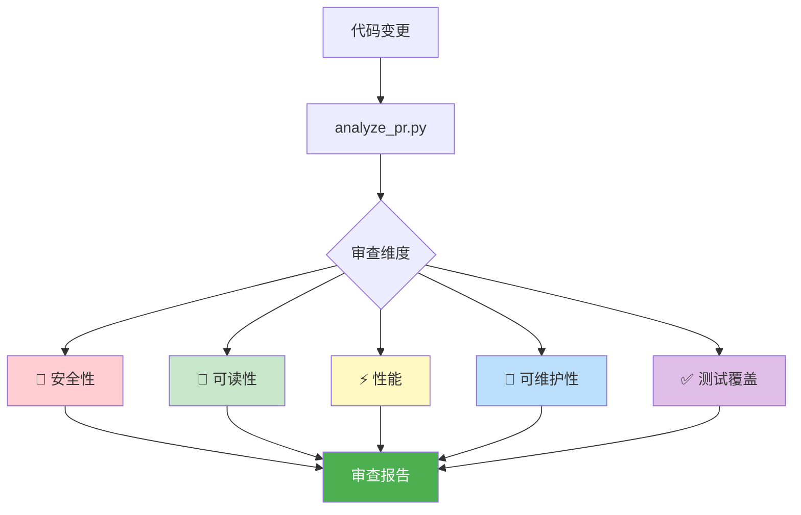

**目录结构**：
```
code-review/
├── SKILL.md
├── scripts/
│   └── analyze_pr.py
└── references/
    ├── security_checklist.md
    └── best_practices.md
```

**SKILL.md**：

```yaml
---
name: code-review
description: 执行代码审查。当用户请求代码审查、PR review、质量检查、安全审计时触发。提供全面的代码质量评估。
---

# 代码审查助手

执行结构化的代码审查流程。

## 审查维度

| 维度 | 说明 | 参考文档 |
|:-----|:-----|:---------|
| 🔐 安全性 | 漏洞、注入风险 | security_checklist.md |
| 📖 可读性 | 命名、注释、结构 | - |
| ⚡ 性能 | 潜在性能问题 | - |
| 🔧 可维护性 | 设计模式、耦合度 | best_practices.md |
| ✅ 测试覆盖 | 测试是否充分 | - |

## 审查输出格式

```markdown
## 代码审查报告

### 📊 概览
* 变更文件: X 个
* 新增行数: +XXX
* 删除行数: -XXX

### 🔴 严重问题
[必须修复]

### 🟡 建议改进
[推荐修复]

### 🟢 值得肯定
[好的实践]

### 📋 检查清单
* [ ] 安全性检查通过
* [ ] 无明显性能问题
* [ ] 测试覆盖充分
* [ ] 文档已更新
```
```

---

## 六、在不同平台中引入 Skill

### 6.0 平台集成概览

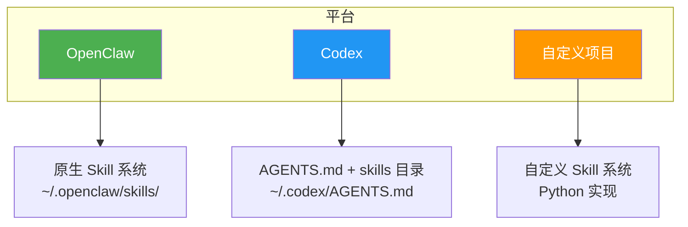

### 6.1 OpenClaw 中的 Skill

OpenClaw 原生支持 Skill 系统。

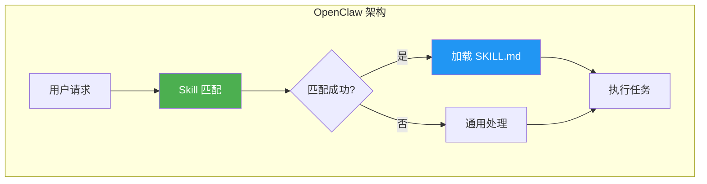

**Skill 目录位置**：
```
~/.openclaw/skills/
├── my-skill/
│   └── SKILL.md
└── another-skill/
    ├── SKILL.md
    └── scripts/
```

**安装 Skill**：

```bash
# 方法 1: 手动创建目录
mkdir -p ~/.openclaw/skills/my-skill
cp SKILL.md ~/.openclaw/skills/my-skill/

# 方法 2: 使用 .skill 包
# 将 .skill 文件放到指定目录，OpenClaw 会自动识别
```

**配置加载**：

```yaml
# ~/.openclaw/config.yaml
skills:
  directories:
    - ~/.openclaw/skills
  autoLoad: true
```

---

### 6.2 Codex 中的自定义指令

Codex 使用 `AGENTS.md` 实现类似 Skill 的功能。

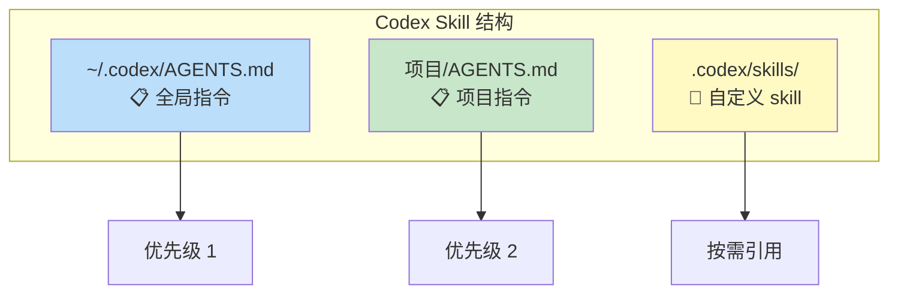

**将 Skill 概念引入 Codex**：

```
项目结构：
project/
├── .codex/
│   ├── AGENTS.md        # 主指令
│   └── skills/          # 自定义 skill 目录
│       ├── git-commit.md
│       └── code-review.md
└── ...
```

在 `AGENTS.md` 中引用：

```markdown
# 主指令

## 可用技能

根据任务需要，参考以下技能文件：
* Git 提交: 见 .codex/skills/git-commit.md
* 代码审查: 见 .codex/skills/code-review.md
```

---

### 6.3 在自定义项目中引入 Skill 概念

**架构设计**：

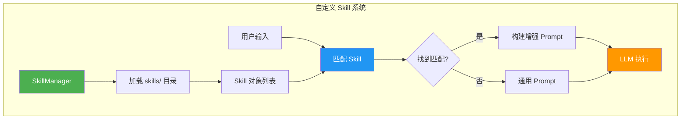

**核心代码实现**：

```python
# skill_system/skill.py

from dataclasses import dataclass
from typing import Optional
import yaml


@dataclass
class Skill:
    """技能基类"""
    name: str
    description: str
    instructions: str
    scripts: dict = None
    references: dict = None

    @classmethod
    def load(cls, path: str) -> 'Skill':
        """从目录加载 Skill"""
        skill_file = f"{path}/SKILL.md"

        with open(skill_file, 'r', encoding='utf-8') as f:
            content = f.read()

        # 解析 frontmatter
        parts = content.split('---')
        frontmatter = yaml.safe_load(parts[1])
        body = '---'.join(parts[2:])

        return cls(
            name=frontmatter['name'],
            description=frontmatter['description'],
            instructions=body.strip()
        )

    def should_trigger(self, user_input: str) -> bool:
        """判断是否应该触发此技能"""
        keywords = self.description.lower().split()
        user_lower = user_input.lower()
        return any(kw in user_lower for kw in keywords)


# skill_system/manager.py

class SkillManager:
    """技能管理器"""

    def __init__(self):
        self.skills: dict[str, Skill] = {}

    def load_skills(self, directory: str):
        """加载目录下所有技能"""
        import os
        for name in os.listdir(directory):
            skill_path = f"{directory}/{name}"
            if os.path.isdir(skill_path):
                skill = Skill.load(skill_path)
                self.skills[skill.name] = skill

    def find_matching_skills(self, user_input: str) -> list[Skill]:
        """找到匹配用户输入的技能"""
        return [
            skill for skill in self.skills.values()
            if skill.should_trigger(user_input)
        ]

    def build_prompt(self, skill: Skill, user_input: str) -> str:
        """构建包含技能指令的 Prompt"""
        return f"""
你是一个智能助手，当前激活了技能：{skill.name}

技能说明：{skill.description}

详细指令：
{skill.instructions}

用户请求：{user_input}

请根据技能指令完成任务。
"""
```

**项目目录结构**：

```
my-ai-project/
├── skills/
│   ├── git-commit/
│   │   └── SKILL.md
│   ├── code-review/
│   │   ├── SKILL.md
│   │   └── scripts/
│   └── api-doc/
│       └── SKILL.md
├── skill_system/
│   ├── skill.py
│   └── manager.py
└── main.py
```

---

## 七、Skill 开发最佳实践

### 7.1 设计清单

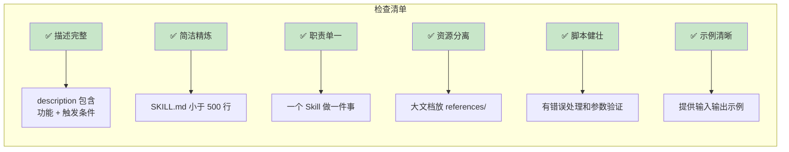

### 7.2 常见反模式

#### ❌ 反模式 1：描述过于简单

```yaml
# ❌ 错误
description: 代码工具

# ✅ 正确
description: 代码审查工具，检查安全性、性能、可读性。当用户请求 review、代码检查、质量评估时触发。
```

#### ❌ 反模式 2：SKILL.md 过长

```markdown
# ❌ 错误：SKILL.md 有 2000 行

# ✅ 正确：SKILL.md 保持精简
## 快速开始
[核心流程]

## 详细文档
见 references/api_docs.md
```

#### ❌ 反模式 3：重复造轮子

```markdown
# ❌ 错误：解释 AI 已知的知识
## 什么是 JSON
JSON 是一种数据格式...

# ✅ 正确：提供项目特定的信息
## 数据格式
使用项目的自定义 Schema，见 references/schema.md
```

---

## 八、进阶技巧

### 8.1 条件加载

根据用户输入动态加载不同的参考文档：

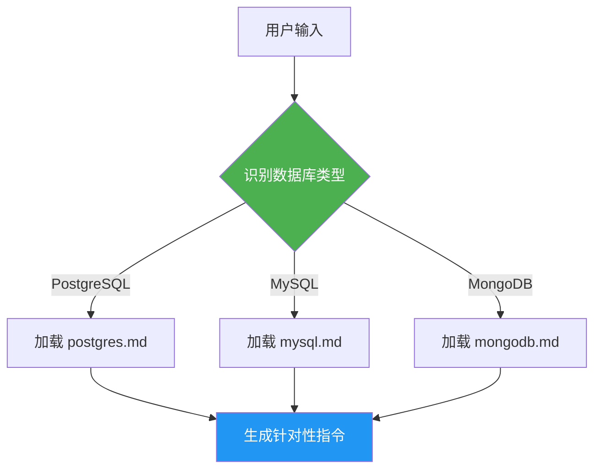

### 8.2 脚本组合

将多个脚本组合成工作流：

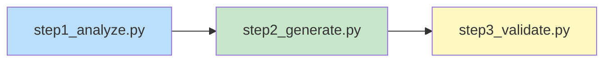

```python
# scripts/full_workflow.py

import subprocess

def run_workflow():
    subprocess.run(["python", "scripts/step1_analyze.py"])
    subprocess.run(["python", "scripts/step2_generate.py"])
    subprocess.run(["python", "scripts/step3_validate.py"])

if __name__ == "__main__":
    run_workflow()
```

### 8.3 状态管理

在脚本间传递状态：

```python
# scripts/state.py
import json

STATE_FILE = ".skill_state.json"

def save_state(data):
    with open(STATE_FILE, 'w') as f:
        json.dump(data, f)

def load_state():
    try:
        with open(STATE_FILE, 'r') as f:
            return json.load(f)
    except FileNotFoundError:
        return {}
```

---

## 📚 参考资源

| 资源 | 链接 |
|:-----|:-----|
| OpenClaw Skills 文档 | https://docs.openclaw.ai/skills |
| Codex AGENTS.md | https://github.com/openai/codex |
| Conventional Commits | https://www.conventionalcommits.org/ |

---

## 📝 更新日志

| 日期 | 更新内容 |
|:-----|:---------|
| 2026-03-27 | 初始版本，完整 Skill 开发指南 |
| 2026-03-29 | 修复 Mermaid 流程图乱码问题，使用更简洁的语法 |