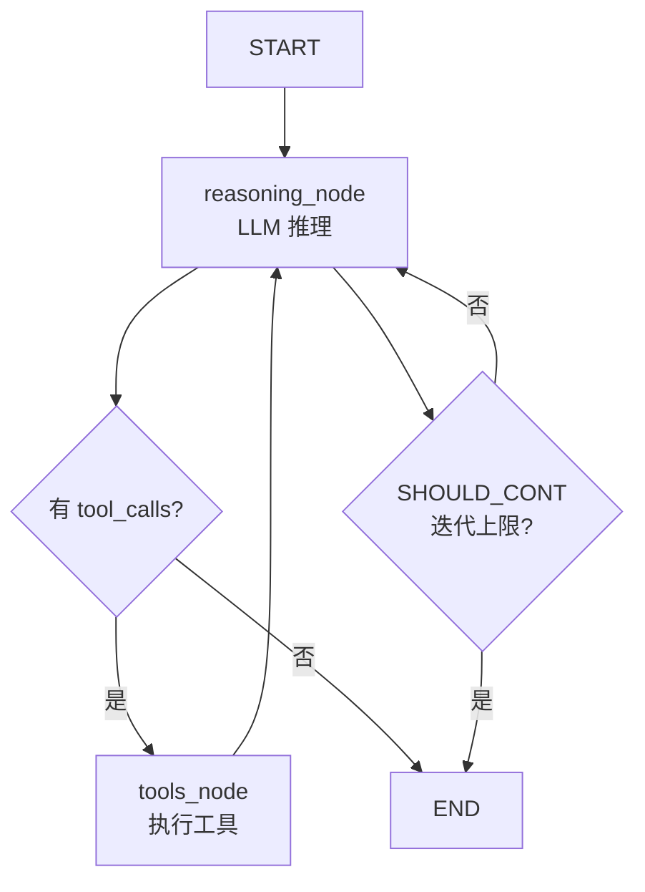
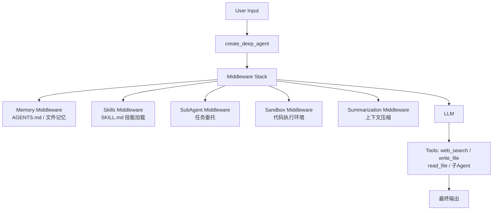

# Agent 构建核心方法对比：LangChain · LangGraph · DeepAgents

## 概述

本文从 **LangChain**、**LangGraph**、**DeepAgents** 三个层次化的 Agent 框架出发，梳理其核心构建方法、关键抽象和使用场景。

| 维度 | LangChain | LangGraph | DeepAgents |
|------|-----------|-----------|------------|
| 定位 | 高层 Agent 抽象库 | 图结构编排引擎 | Agent Harness（Agent 驾驶舱） |
| 核心抽象 | `create_agent` / `create_react_agent` | `StateGraph` + Nodes + Edges | `create_deep_agent` + Middleware |
| 状态管理 | 隐式，消息列表 | 显式 `State` 类 + Reducer | 中间件注入（Memory / Skills / Sandboxes） |
| 多步推理 | ReAct Loop / PlanAndExecute | 条件边 + 子图 | 自动 TODO 计划 + 子Agent + 上下文工程 |
| 持久化 | 无内置 | Checkpoint + Time Travel | Backend 抽象（文件系统/状态） |
| 适用场景 | 快速原型、工具调用型 Agent | 生产级复杂流程、多Agent编排 | 长周期任务、复杂推理、编码Agent |

---

## 一、LangChain Agent 核心方法

### 1.1 create_agent —— 统一入口

```python
from langchain.agents import create_agent
from langchain.chat_models import init_chat_model

model = init_chat_model("openai:gpt-4o")
agent = create_agent(model, tools=[search, calculator])
result = agent.invoke({"messages": [{"role": "user", "content": "..."}]})
```

**核心机制：**
- `Model` + `Tools` 绑定，由 `AgentExecutor` 驱动执行循环
- **Middleware 拦截**：可对 `ModelRequest`（ prompt 构造）和 `ToolCallRequest`（工具调用）进行动态修改

```python
from langchain.agents.middleware import wrap_model_call, ModelRequest, ModelResponse

def user_role_prompt(request: ModelRequest) -> str:
    # 动态注入角色 prompt
    return f"用户等级: VIP\n{request.prompt}"

wrapped_model = wrap_model_call(model, prompt_transform=user_role_prompt)
```

### 1.2 两种主流 Agent 架构

#### create_react_agent（ReAct 模式）

> Thought → Action → Observation → Thought 循环，**显式推理步骤**，可干预、可调试。

```python
from langchain.agents import create_react_agent

agent = create_react_agent(model, tools=[search, calculator])
# LLM 每次回复格式: "Thought: ...\nAction: tool_name\nAction Input: {...}\n"
# Agent 执行工具后，结果以 "Observation: ..." 注回 prompt
```

**特点：**
- 推理透明，每步可见
- 适合需要中途干预、调试的场景
- 代价：每次循环都要把完整历史发给 LLM，token 消耗大

#### create_tool_calling_agent（工具调用模式）

> 模型直接输出结构化 Tool Call，由框架执行，不走 Observation 循环。

```python
from langchain.agents import create_tool_calling_agent

agent = create_tool_calling_agent(model, tools=[search, calculator])
# LLM 直接输出: {"name": "search", "arguments": {"query": "..."}}
# 框架直接执行，无 Observation 回填
```

**特点：**
- 效率更高（无反复 prompt 构造）
- 依赖模型的 tool-calling 能力（GPT-4 / Claude 3.5+ 效果较好）
- 不适合需要"纠正路线"的复杂推理

**对比总结：**

| | ReAct Agent | Tool Calling Agent |
|--|------------|-------------------|
| 推理可见性 | 高（每步可追溯） | 低（黑盒） |
| Token 消耗 | 高 | 低 |
| 干预能力 | 强（可在任意步骤介入） | 弱 |
| 适用场景 | 复杂多步推理 | 高频简单工具调用 |

### 1.3 PlanAndExecute（规划-执行分离架构）

```
┌─────────────┐     ┌──────────────────────────────────┐
│   Planner   │────▶│  Execute: 各Tool独立执行，收集结果 │
│ (LLM 生成计划)│     └──────────────────────────────────┘
└─────────────┘                      │
         ▲                            ▼
         └────────── Replan（根据执行结果重规划）─────────┘
```

```python
# LangChain Blog: Plan and Execute Agents
# 三种实现: 经典 PlanAndExecute / ReWOO / LLMCompiler
```

**核心价值：** Planner 与 Executor 解耦，Planner 只做规划，Executor 并行执行子任务，结果回填后再统一决策是否继续。

---

## 二、LangGraph 核心方法

### 2.1 核心概念：StateGraph

LangGraph 把 Agent 建模为**有状态的有向图**，以节点（Node）和边（Edge）为基本元素。

```
State 定义 ──▶ Node 函数 ──▶ Edge（条件路由）──▶ 编译运行
```

### 2.2 State 定义

```python
from pydantic import BaseModel
from typing import List, Dict

class AgentState(BaseModel):
    messages: List[BaseMessage]          # 消息历史（add_messages reducer 自动追加）
    current_input: str = ""
    should_continue: bool = True          # 路由信号
    iteration_count: int = 0              # 循环控制
```

### 2.3 Node（节点）

Node 是**纯函数**，接收当前状态，返回状态更新：

```python
def reasoning_node(state: AgentState) -> dict:
    """推理节点——调用 LLM"""
    response = llm.invoke(state["messages"])
    return {"messages": [response], "iteration_count": state.get("iteration_count", 0) + 1}

def action_node(state: AgentState) -> dict:
    """行动节点——执行工具"""
    last_msg = state["messages"][-1]
    tool_name = last_msg.tool_calls[0]["name"]
    tool_args = last_msg.tool_calls[0]["args"]
    result = tools[tool_name].invoke(tool_args)
    return {"messages": [ToolMessage(content=str(result), tool_call_id=last_msg.id)]}
```

### 2.4 Edge（边）

#### 固定边（普通跳转）

```python
workflow.add_edge("action", "reasoning")   # action 节点完成后无条件跳转 reasoning
```

#### 条件边（条件路由）

```python
def should_continue(state: AgentState) -> str:
    if state["iteration_count"] >= 5:
        return "end"
    if state["messages"][-1].tool_calls:
        return "tools"
    return "end"

workflow.add_conditional_edges(
    "agent",
    should_continue,
    {
        "tools": "tools_node",
        "end": END
    }
)
```

#### Command（合并状态更新+路由）

```python
from langgraph.types import Command

def route_and_update(state: AgentState) -> Command:
    return Command(
        update={"iteration_count": state["iteration_count"] + 1},
        goto="reasoning" if state["should_continue"] else END
    )
```

### 2.5 ReAct 在 LangGraph 中的实现



```python
workflow = StateGraph(AgentState)
workflow.add_node("reasoning", reasoning_node)
workflow.add_node("tools", tools_node)
workflow.set_entry_point("reasoning")
workflow.add_conditional_edges("reasoning", route_based_on_tools, {
    "tools": "tools",
    "end": END
})
workflow.add_edge("tools", "reasoning")
app = workflow.compile()
```

### 2.6 多Agent编排（Subgraph）

```python
# 子图作为节点嵌入父图
workflow.add_node("multi_agent", sub_workflow.compile())
workflow.add_edge("multi_agent", END)
```

### 2.7 关键特性

| 特性 | 说明 |
|------|------|
| **Checkpoint** | 快照保存任意状态点，支持断点恢复 |
| **Time Travel** | 回溯到历史 Checkpoint 重跑 |
| **Interrupt** | 在任意节点暂停，等待 Human-in-the-loop |
| **Streaming** | 支持 Token 级流式输出 |
| **Persistence** | 状态持久化到数据库（PostgreSQL 等） |

---

## 三、DeepAgents 核心方法

### 3.1 定位：Agent Harness

DeepAgents 是 **Agent Harness（驾驶舱）**，不是具体的 Agent 实现，而是构建、管理 Agent 的框架。它建立在 LangChain 之上，适合构建**复杂、长周期、深度推理**的 Agent。

### 3.2 create_deep_agent

```python
from deepagents import create_deep_agent
from langchain.chat_models import init_chat_model
from tavily import TavilyClient

model = init_chat_model("openai:gpt-4o")
tavily = TavilyClient(api_key=os.getenv("TAVILY_API_KEY"))

def web_search(query: str, max_results: int = 5, **kwargs):
    return tavily.search(query=query, max_results=max_results, **kwargs)

SYSTEM_PROMPT = """你是一名简洁的研究助手。
你会自动将复杂任务拆解为 TODO 计划，使用工具执行，
并将大量中间结果写入文件（write_file），最终综合输出。"""

agent = create_deep_agent(
    model=model,
    tools=[web_search],
    system_prompt=SYSTEM_PROMPT,
)

result = agent.invoke({
    "messages": [{"role": "user", "content": "研究 Deep Agent 的最新发展"}]
})
```

### 3.3 核心能力：自动 TODO 计划

Deep Agents 的灵魂能力——无需显式编排，Agent **自动**生成 TODO 并逐步执行：

```python
# Deep Agent 内部会调用内置的 write_todos 工具
# 任务示例流程：
# 1. write_todos: [{"content": "搜索 Deep Agent 定义", "status": "in_progress"}, ...]
# 2. web_search: 查询 Deep Agent 相关资料
# 3. write_file: 将大量搜索结果保存到文件（避免 context overflow）
# 4. 读取文件，综合回答
```

### 3.4 上下文工程（Context Engineering）

DeepAgents 的核心设计思想：**分层管理上下文，避免 LLM Context 膨胀**。

| 上下文类型 | 说明 | 生命周期 |
|-----------|------|---------|
| **Input Context** | 系统 prompt、Memory、Skills | 每次运行静态注入 |
| **Runtime Context** | 用户元数据、API Key、连接信息 | Per-run，传播到子 Agent |
| **Context Isolation** | 子 Agent 独立上下文，主 Agent 只取结果 | Per subagent |

#### 上下文压缩

- **Offloading**：将大结果写入虚拟文件系统（`write_file` / `read_file`），不填入 LLM Context
- **Summarization**：对话历史过长时自动压缩

```python
# Memory middleware — 从 AGENTS.md 文件加载记忆
from deepagents.middleware import createMemoryMiddleware
agent = create_deep_agent(
    model=model,
    tools=[...],
    system_prompt=SYSTEM_PROMPT,
    middleware=[createMemoryMiddleware()]
)
```

### 3.5 子 Agent（Subagents）

DeepAgents 支持**层次化 Agent 分解**，主 Agent 将复杂任务委托给子 Agent：

```python
from deepagents.middleware import createSubAgentMiddleware

agent = create_deep_agent(
    model=model,
    tools=[web_search, code_interpreter],
    system_prompt=SYSTEM_PROMPT,
    middleware=[createSubAgentMiddleware()],
    # 子 Agent 可独立配置：不同 model、不同工具集、不同 system prompt
)
```

- 子 Agent 在隔离上下文中运行，结果（而非中间过程）传回主 Agent
- 支持**异步子 Agent**，可并行执行多个子任务

### 3.6 Sandboxes（沙箱执行）

DeepAgents 内置代码执行能力，支持多种沙箱后端：

```python
# Agent in Sandbox 模式：Agent 拥有自己的代码执行环境
system_prompt = "你是一个 Python 编程助手，可以在沙箱中创建和运行代码。"

# Sandbox as Tool 模式：沙箱作为工具被调用
```

**支持的后端：** Modal · Daytona · AgentCore · 本地 Docker

### 3.7 架构图



---

## 四、生产应用案例

### LangGraph 生产案例

| 公司 | 场景 | 特点 |
|------|------|------|
| **Uber** | AI 驱动开发者生产力 | 多 Agent 协调 |
| **AppFolio** | 物业管理关键流程 | 可控 Agent 架构 |
| **Komodo Health** | 医疗领域 AI 助手 | 高监管领域 |
| **Athena Intelligence** | 研究 Agent 平台 | 高级研究任务 |
| **Elastic** | Elastic AI 助手 | Agent + 可观测性 |

**核心收获：** CrewAI 等框架容易失控，LangGraph 提供了**可控的多 Agent 编排**，是企业级生产部署的首选。

### DeepAgents 典型场景

- **编码 Agent（Deep Agents CLI）**：命令行编程助手，类 Codex/Claude Code
- **深度研究 Agent**：自动规划、多步搜索、文件管理、结果综合
- **复杂法律/合规分析**：多领域并行子 Agent，协调推理

---

## 五、框架选型指南

```
快速原型 / 简单工具调用
└──▶ LangChain create_agent（create_tool_calling_agent）
      │
      │ 需要精细控制、复杂流程、生产级可靠性
      ▼
LangGraph StateGraph（Node + Conditional Edge）
      │
      │ 需要长周期任务、自动 TODO、子 Agent 协作、沙箱执行
      ▼
DeepAgents create_deep_agent（Middleware 架构）
```

**记住：**
- LangChain = **工具库**（用什么搭都行）
- LangGraph = **编排引擎**（搭出来怎么跑）
- DeepAgents = **驾驶舱**（跑的过程中怎么管）

---

## 参考资料

- [LangChain Agents — Docs](https://docs.langchain.com/oss/python/langchain/agents)
- [LangGraph Overview — Docs](https://docs.langchain.com/oss/python/langgraph/overview)
- [LangGraph Graph API](https://docs.langchain.com/oss/python/langgraph/graph-api)
- [DeepAgents Overview — Docs](https://docs.langchain.com/oss/python/deepagents/overview)
- [DeepAgents Context Engineering](https://docs.langchain.com/oss/python/deepagents/context-engineering)
- [DeepAgents Sandboxes](https://docs.langchain.com/oss/python/deepagents/sandboxes)
- [Plan and Execute Agents — LangChain Blog](https://blog.langchain.com/planning-agents/)
- [Top 5 LangGraph Agents in Production 2024](https://blog.langchain.com/top-5-langgraph-agents-in-production-2024/)
- [Building ReAct Agents with LangGraph — ML Mastery](https://machinelearningmastery.com/building-react-agents-with-langgraph-a-beginners-guide/)
- [What are Deep Agents — Nutrient.io](https://www.nutrient.io/blog/langchain-deep-agents-comprehensive-developers-guide/)
