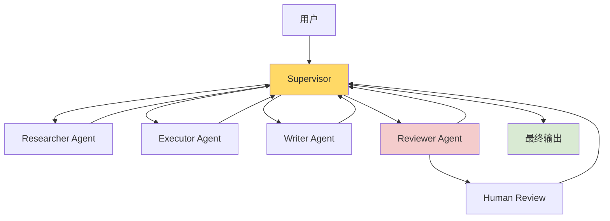
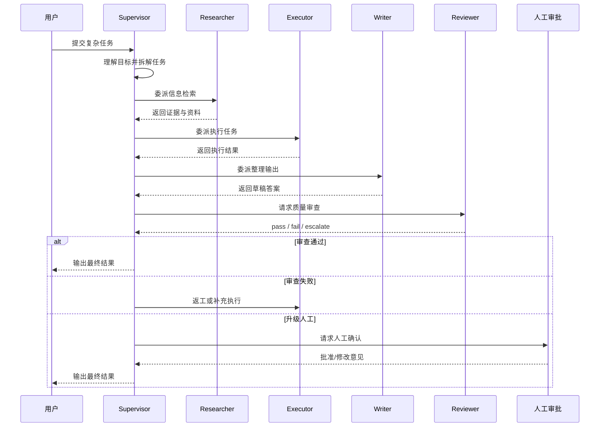
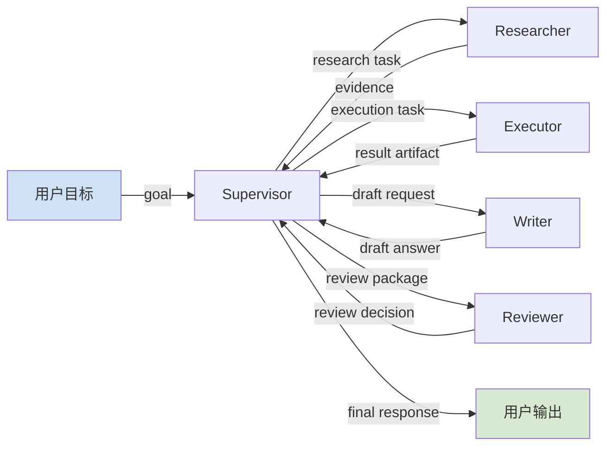
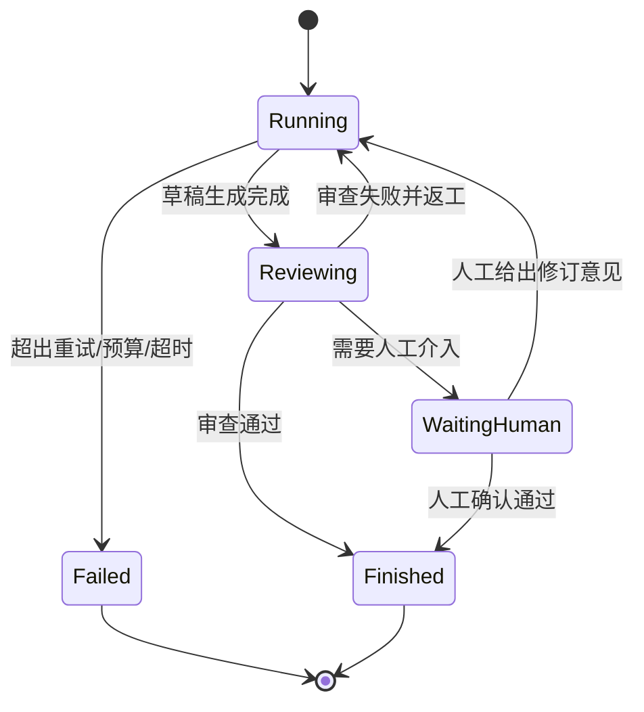

# 基于 LangChain + LangGraph 的高质量多子代理智能体设计文档

## 概述

本文面向**通用任务型**智能体系统，给出一套基于 **LangChain + LangGraph** 的高质量多子代理设计方案。核心思想是：

- 用 **LangChain** 负责子代理能力封装：模型、工具、结构化输出、Agent 行为
- 用 **LangGraph** 负责流程编排：状态、路由、循环、返工、人工介入、持久化
- 用 **Reviewer**、**Checkpoint**、**Human Gate** 保证质量、可控性与可恢复性

本文重点不是“堆更多 Agent”，而是构建一个**可拆解、可审查、可返工、可恢复、可观测、可扩展**的多子代理系统。

---

## 核心概念

### 1. 多子代理不等于更多 Agent

高质量多子代理系统的关键不在数量，而在以下几点：

- 路由是否稳定
- 职责是否清晰
- 上下文是否隔离
- 输出是否可验收
- 状态是否可恢复
- 成本是否可控
- 全链路是否可观测

### 2. 推荐主架构：Supervisor + Specialist Subagents + Reviewer

推荐采用以下角色分工：

| 角色 | 核心职责 |
|------|----------|
| Supervisor | 理解目标、拆解任务、路由调度、控制收敛 |
| Researcher | 检索、查证、提炼证据 |
| Executor | 调用工具执行任务，如代码、SQL、API、文件处理 |
| Writer | 将结果整理为用户可读输出 |
| Reviewer | 基于验收规则审查结果，决定通过 / 返工 / 升级人工 |
| Human Gate | 在高风险或多次失败时进行人工审批 |

### 3. LangChain 与 LangGraph 的分工

| 层级 | 技术 | 作用 |
|------|------|------|
| 能力层 | LangChain | 子代理、工具、结构化输出、Middleware |
| 编排层 | LangGraph | 状态图、路由、循环、人工中断、持久化 |
| 观测层 | LangSmith | Trace、耗时、错误、Token 用量 |
| 存储层 | Checkpointer / DB | 任务状态恢复、线程持久化、审计回放 |

---

## 推荐架构

### 组件关系图



### 设计原则

1. **职责单一**：每个子代理只负责一类核心职责。
2. **显式状态**：所有中间结果放在状态中，不隐式藏在 prompt 里。
3. **结构化输出**：路由、审查、验收使用结构化 schema。
4. **审查优先**：必须保留 Reviewer，不直接信任草稿结果。
5. **人机协同**：高风险步骤允许人工审批。
6. **可恢复**：通过 Checkpoint 支持长任务恢复。

---

## 状态设计

建议定义一个全局共享状态 `AgentState`，至少包含：

| 字段 | 类型 | 说明 |
|------|------|------|
| `user_goal` | string | 用户原始目标 |
| `messages` | list | 共享消息历史 |
| `plan` | list | Supervisor 生成的任务计划 |
| `current_task` | string | 当前执行子任务 |
| `next_agent` | enum | 下一跳代理 |
| `artifacts` | dict | 各代理输出结果 |
| `review_result` | object | 审查结果 |
| `retry_count` | int | 当前任务返工次数 |
| `step_count` | int | 总执行步数 |
| `status` | enum | running / waiting_human / finished / failed |
| `error_info` | object | 错误信息 |
| `cost_usage` | object | token / 调用统计 |

---

## 处理流程

### 时序图



### 数据流转图



### 状态机



---

## 关键设计要点

### 1. 子代理要专而小

不要让每个 Agent 同时拥有搜索、执行、写作、审查等全部能力。正确做法是让每个 Agent 在边界内专注。

### 2. 路由必须结构化

Supervisor 的输出建议至少包含：

- `next_agent`
- `task_description`
- `reason`
- `finish_flag`

避免依赖模糊自然语言做节点跳转。

### 3. 上下文要最小充分

不同子代理只读取其必需上下文：

- Researcher：任务说明 + 已知约束
- Executor：子任务描述 + research 结果
- Writer：已有产物 + 输出风格要求
- Reviewer：草稿 + 验收标准

### 4. Reviewer 必须存在

没有 Reviewer 的多子代理系统，往往只是“更贵的单代理”。

### 5. 控制逻辑写在 LangGraph，不写死在 prompt

以下逻辑应进入图编排：

- 最大步数
- 最大返工次数
- 超时与预算控制
- 人工审批节点
- 中断恢复

---

## 异常与边界处理

| 场景 | 处理方式 |
|------|----------|
| 子代理调用失败 | 写入 `error_info`，由 Supervisor 决策是否重试 |
| 工具超时 | 可重试 1~2 次，超过后进入人工审批或失败 |
| 连续返工失败 | 超过阈值后进入 `Human Gate` |
| 上下文过长 | 触发摘要压缩或上下文裁剪 |
| 路由异常 | 回退到 Supervisor 重新决策 |
| 成本超预算 | 停止执行并输出当前最佳结果 |
| 死循环 | 使用 `step_count` / `retry_count` 强制终止 |

---

## 测试与评估

### 测试策略

- **单元测试**：路由 schema、状态更新、review 规则
- **集成测试**：Research → Execute → Review 主链路
- **异常链路测试**：工具失败、返工、人工审批
- **评测测试**：比较单 Agent 与多 Agent 的成功率、成本、返工率

### 观测指标

建议监控：

- 每个节点耗时
- 每个节点 token 消耗
- reviewer fail 原因分布
- 平均返工次数
- 工具失败率
- 人工介入频率

---

## 建议目录结构

```tree
agent-platform/
├── app/
│   ├── graph/                          # LangGraph 编排层
│   │   ├── state.py                    # 全局状态定义
│   │   ├── builder.py                  # 图构建入口
│   │   ├── routes.py                   # 条件路由逻辑
│   │   └── checkpoints.py              # 持久化配置
│   ├── agents/                         # 子代理定义
│   │   ├── supervisor.py               # Supervisor
│   │   ├── researcher.py               # Researcher
│   │   ├── executor.py                 # Executor
│   │   ├── writer.py                   # Writer
│   │   └── reviewer.py                 # Reviewer
│   ├── tools/                          # 工具层
│   │   ├── search_tools.py             # 搜索与检索工具
│   │   ├── execution_tools.py          # 执行类工具
│   │   └── file_tools.py               # 文件类工具
│   ├── schemas/                        # 结构化输出模型
│   │   ├── routing.py                  # 路由输出 schema
│   │   ├── review.py                   # 审查结果 schema
│   │   └── artifacts.py                # 产物 schema
│   ├── memory/                         # 记忆与上下文管理
│   │   ├── summarizer.py               # 上下文压缩
│   │   └── thread_store.py             # 线程持久化
│   └── observability/
│       └── tracing.py                  # LangSmith/日志封装
├── docs/
│   └── design.md                       # 设计文档
└── tests/
    ├── unit/
    ├── integration/
    └── evals/
```

---

## 实践建议

### 第一版建议范围

推荐先做一个最小可用版本：

- 1 个 Supervisor
- 2~3 个子代理：Researcher / Executor / Reviewer
- LangGraph 持久化
- LangSmith tracing
- 结构化路由
- 有限返工次数

### 不建议一开始就做的内容

- 过多 Agent 并行
- 复杂记忆系统
- 过度自动化的无限自治
- 工具权限完全开放

---

## 结论

高质量多子代理系统的核心，不是增加更多角色，而是构建一个：

- **职责清晰** 的角色体系
- **显式状态** 的编排系统
- **结构化决策** 的路由机制
- **可审查、可返工、可恢复** 的质量闭环

在工程实践上，**LangChain 适合做能力层，LangGraph 适合做流程层**。二者组合，是目前构建高质量、多子代理、生产可控 Agent 系统的一种非常稳妥的路线。

---

## 相关资料

- [[AgentFramework/Agent构建核心方法对比：LangChain_LangGraph_DeepAgents]]
- [[AgentFramework/构建支持Skill的多智能体系统]]
- [[AI-Agent/AI Agent开发实践指南：经典范式与实例]]
- [[wiki/concepts/Agent Harness]]
- [[wiki/concepts/Harness Engineering]]
- [[wiki/concepts/Agent 可控性]]
