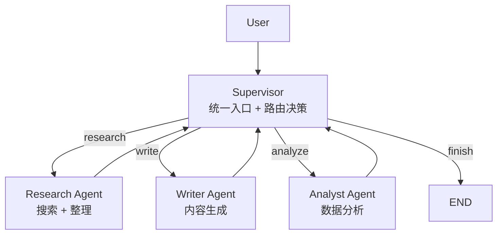
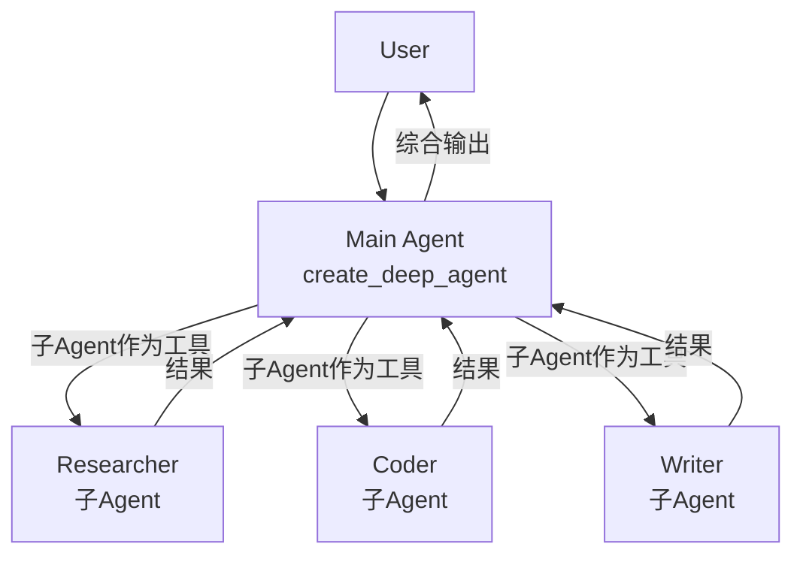
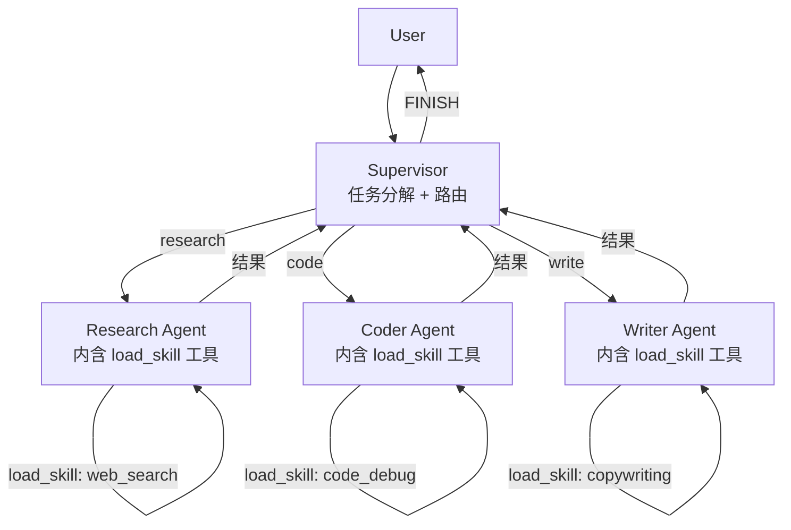

# 构建支持 Skill 的多智能体系统

## 概述

本文介绍如何基于 LangChain / LangGraph / DeepAgents 三大框架，构建一个**支持 Skill 按需加载**的**多智能体系统**。涵盖四大核心多 Agent 架构模式，并提供完整代码骨架。

---

## 一、多 Agent 四大架构模式

LangChain 官方定义了四种基础模式，适用于不同场景：

| 模式 | 核心思想 | Agent 调用数（单轮） | 适用场景 |
|------|---------|-------------------|---------|
| **Supervisor** | 一个监督者节点统一调度所有子 Agent | N+1（N个子Agent） | 需要强管控、明确流程 |
| **Subagents** | 主 Agent 将子 Agent 当作工具调用 | N（一次性并行） | 任务可分解、结果需汇总 |
| **Handoffs** | Agent 之间通过工具调用转移控制权 | 顺序链路 | 多轮对话、角色切换 |
| **Router** | 分类器把请求路由到对应专家 Agent | N（并行或串行） | 多领域、快速分发 |
| **Skills** | 单个 Agent 按需加载专业上下文 | 1（渐进披露） | 大量垂直能力、不需子 Agent 独立运行 |

> **模式可以组合**——例如 Supervisor + Skills：监督者调度多个子 Agent，每个子 Agent 内用 Skills 模式管理专业能力。

---

## 二、模式一：Supervisor 模式（LangGraph）

**核心思路**：一个 `supervisor` 节点负责任务分发，子 Agent 完成后返回 supervisor，Supervisor 决定下一步。



### 2.1 定义共享状态

```python
from typing import List, TypedDict, Literal
from langchain_core.messages import BaseMessage
from pydantic import Field

class MultiAgentState(TypedDict):
    messages: List[BaseMessage]                        # 共享消息历史
    next_agent: Literal["researcher", "writer", "analyst", "finish"]  # 路由信号
    task_results: dict                                  # 各 Agent 执行结果
```

### 2.2 创建子 Agent 节点工厂

```python
from langchain.chat_models import init_chat_model
from langchain_core.messages import HumanMessage, SystemMessage
from langgraph.types import Command

def create_agent_node(name: str, system_prompt: str, tools: list):
    """子 Agent 节点工厂——每个 Agent 返回 Command(goto=supervisor)"""
    model = init_chat_model("openai:gpt-4o")

    def node(state: MultiAgentState) -> Command:
        # 调用当前 Agent 的 LLM
        response = model.bind_tools(tools).invoke(state["messages"])
        # 结果写入 task_results，控制在 Supervisor
        return Command(
            goto="supervisor",
            update={
                "messages": [response],
                "task_results": {**state.get("task_results", {}), name: response.content}
            }
        )
    return node
```

### 2.3 Supervisor 节点

```python
from enum import Enum

class NextStep(str, Enum):
    RESEARCH = "researcher"
    WRITE = "writer"
    ANALYZE = "analyst"
    FINISH = "finish"

def supervisor_node(state: MultiAgentState) -> Command:
    """Supervisor——根据消息内容决定下一个调度哪个 Agent"""
    model = init_chat_model("openai:gpt-4o")

    # Supervisor 的 prompt 包含调度指令
    supervisor_prompt = """你是一个任务调度 Supervisor。
根据用户请求，决定下一步调度哪个 Agent：
- researcher：需要搜索和收集信息
- writer：需要生成文本内容
- analyst：需要数据分析
- finish：任务完成，结束流程"""

    response = model.invoke(
        [SystemMessage(content=supervisor_prompt)] + state["messages"]
    )

    # 解析 LLM 返回的 next_agent（可强制用 structured output）
    decision = ...  # 解析 decision.next_agent

    return Command(
        goto=decision.next_agent,
        update={"next_agent": decision.next_agent}
    )
```

### 2.4 构建图

```python
from langgraph.graph import StateGraph, START, END

builder = StateGraph(MultiAgentState)

# 注册 Supervisor
builder.add_node("supervisor", supervisor_node)

# 注册子 Agent（使用工厂函数）
builder.add_node("researcher", create_agent_node("researcher", researcher_prompt, [web_search]))
builder.add_node("writer",     create_agent_node("writer",     writer_prompt,     []))
builder.add_node("analyst",    create_agent_node("analyst",    analyst_prompt,   [python REPL]))

# 固定边：子 Agent 完成 → 返回 Supervisor
for agent in ["researcher", "writer", "analyst"]:
    builder.add_edge(agent, "supervisor")

builder.add_edge(START, "supervisor")

# Supervisor 条件边：finish → 结束
def route_supervisor(state: MultiAgentState) -> str:
    return state.get("next_agent", "finish")

graph = builder.compile()
```

---

## 三、模式二：Skills 模式（LangChain Agent）

**核心思路**：单个 Agent，但通过 `load_skill` 工具**按需渐进式加载**专业提示词，避免一次性注入大量上下文。

### 3.1 Skill 定义（SKILL.md 格式）

每个 Skill 本身就是一个 Markdown 文件，包含 `name`、`description`、`prompt` 等 metadata：

```markdown
---
name: sql-analyst
description: 专业 SQL 分析，擅长复杂查询和性能优化
---

# SQL Analyst Skill

## 能力范围
- 复杂 JOIN 查询编写
- 索引优化建议
- 查询计划分析

## 提示词模板
你是一名资深 SQL 分析师。用户将提供数据库 Schema 和问题，
请用最優雅的 SQL 解决...
```

### 3.2 load_skill 工具实现

```python
from langchain.tools import tool
from typing import Literal

# 模拟 Skill 仓库（实际可从文件系统或远端加载）
SKILLS_REGISTRY = {
    "sql-analyst": {"description": "专业 SQL 分析", "content": "..."},
    "code-review": {"description": "代码审查", "content": "..."},
    "research":   {"description": "深度研究", "content": "..."},
}

@tool
def load_skill(skill_name: str) -> str:
    """加载专业 Skill 到当前对话上下文（渐进披露）"""
    skill = SKILLS_REGISTRY.get(skill_name)
    if not skill:
        return f"Skill '{skill_name}' 不存在，可用: {list(SKILLS_REGISTRY.keys())}"

    # 将 Skill 内容追加到 Agent 上下文（不覆盖原 system prompt）
    return f"[Skill Loaded: {skill_name}]\n\n{skill['content']}"

@tool
def list_skills() -> str:
    """列出所有可用 Skills"""
    return "\n".join([f"- {k}: {v['description']}" for k, v in SKILLS_REGISTRY.items()])
```

### 3.3 Agent + Skills 组合

```python
from langchain.agents import create_agent
from langchain.chat_models import init_chat_model

model = init_chat_model("openai:gpt-4o")

agent = create_agent(
    model=model,
    tools=[load_skill, list_skills, web_search, python_repl],
    system_prompt="""你是一个多能力助手。
你有多个专业 Skills，可以通过 load_skill 工具按需加载。
规则：
1. 当用户请求涉及特定领域时，先用 load_skill 加载对应能力
2. 不要在第一次见面时就加载所有 Skills——按需渐进披露
3. 每次只加载当前任务需要的 Skill"""
)
```

### 3.4 进阶：将 SKILL.md 解析为 Agent Skills

DeepAgents 的 `createSkillsMiddleware` 支持直接加载 `SKILL.md`：

```python
from deepagents.middleware import createSkillsMiddleware

# 按 Agent Skills 规范编写的 skill 目录
agent = create_deep_agent(
    model=model,
    tools=[web_search, file_tools],
    system_prompt=SYSTEM_PROMPT,
    middleware=[
        createSkillsMiddleware(skills_dir="./skills")  # 目录含 SKILL.md
    ]
)
```

---

## 四、模式三：Subagents 模式（DeepAgents）

**核心思路**：主 Agent 把子 Agent 当作工具调用，子 Agent 在独立上下文中执行，结果传回主 Agent。



### 4.1 子 Agent 定义

```python
from deepagents import create_deep_agent
from langchain.chat_models import init_chat_model

# 子 Agent 1：研究专家
researcher_agent = create_deep_agent(
    model=init_chat_model("openai:gpt-4o"),
    tools=[web_search, write_file],
    system_prompt="你是一名专业研究员，擅长多角度搜集信息并整理成结构化报告。"
)

# 子 Agent 2：编码专家
coder_agent = create_deep_agent(
    model=init_chat_model("openai:gpt-4o"),
    tools=[sandbox_execute, read_file],
    system_prompt="你是一名 Python 编程专家，负责实现和调试代码。"
)
```

### 4.2 主 Agent 调度子 Agent

```python
# 主 Agent 内置 spawn_subagent 工具，或自行暴露为工具
@tool
def spawn_subagent(agent_type: str, task: str) -> str:
    """启动对应类型的子 Agent"""
    agents = {
        "researcher": researcher_agent,
        "coder": coder_agent,
    }
    sub = agents.get(agent_type)
    if not sub:
        return f"Unknown agent type: {agent_type}"
    result = sub.invoke({"messages": [{"role": "user", "content": task}]})
    return result["messages"][-1].content

main_agent = create_deep_agent(
    model=init_chat_model("openai:gpt-4o"),
    tools=[spawn_subagent, web_search],
    system_prompt="""你是一个项目协调者。
当收到复杂任务时，自动分解为子任务，调度对应专业子 Agent 执行，
收集结果后综合输出。不要自己执行专业任务，让子 Agent 去做。"""
)
```

---

## 五、模式四：Handoffs 模式

**核心思路**：通过工具调用实现 Agent 之间的控制权转移，不经过中央调度者，更贴近自然对话中的角色切换。

### 5.1 Handoff 工具

```python
from langgraph.types import Command

@tool
def transfer_to_agent(agent_name: str, context: str = "") -> str:
    """将对话控制权转移给指定的另一个 Agent"""
    return f"[Handoff to {agent_name}] Context: {context}"

def create_handoff_node(name: str, model, system_prompt: str):
    """返回一个带 handoff 能力的 Agent 节点"""
    def node(state) -> Command:
        response = model.invoke(state["messages"])
        # 检查是否需要 handoff
        if response.tool_calls and response.tool_calls[0]["name"] == "transfer_to_agent":
            target = response.tool_calls[0]["args"]["agent_name"]
            return Command(
                goto=target,
                update={"messages": [response]}
            )
        return Command(
            goto=END,
            update={"messages": [response]}
        )
    return node
```

### 5.2 Handoffs 的两种实现路径

| 方式 | 说明 |
|------|------|
| **单 Agent + Middleware** | 一个 Agent，动态切换 system_prompt + tools（通过 Middleware） |
| **多 Agent Subgraphs** | 每个 Agent 是独立子图，通过 Command 跨图跳转 |

LangChain 推荐：**Handoffs 用 Middleware 实现更轻量**，子图方式适合需要独立状态的复杂场景。

---

## 六、综合架构：Supervisor + Skills + Subagents

最实用的生产架构——**Supervisor 做任务分发，每个子 Agent 内置 Skills 按需加载能力**：



### 核心代码骨架

```python
# === Step 1: 定义 Skills Registry ===
SKILLS = {
    "web-search":     {"prompt": "你擅长用搜索引擎获取最新信息...", "tools": [...]},
    "data-analysis":  {"prompt": "你擅长 Python 数据分析和可视化...", "tools": [...]},
    "code-writing":   {"prompt": "你擅长生成高质量代码...", "tools": [...]},
    "copywriting":    {"prompt": "你擅长营销文案和内容创作...", "tools": [...]},
}

# === Step 2: Agent 工厂（含 Skill 加载能力）===
def make_agent(name: str, skill_names: list[str]):
    skills_content = "\n\n".join([f"[{s}]: {SKILLS[s]['prompt']}" for s in skill_names])
    return create_agent(
        model=init_chat_model("openai:gpt-4o"),
        tools=[load_skill, *agent_tools],
        system_prompt=f"你是 {name}，可用 Skills: {', '.join(skill_names)}"
    )

# === Step 3: Supervisor 分发 ===
def supervisor(state: MultiAgentState) -> Command:
    # LLM 决策 next_agent
    ...
    return Command(goto=next_agent)

# === Step 4: 组装图 ===
builder = StateGraph(MultiAgentState)
builder.add_node("supervisor", supervisor)
builder.add_node("researcher", make_agent("研究员", ["web-search", "copywriting"]))
builder.add_node("coder",      make_agent("程序员", ["code-writing", "data-analysis"]))
builder.add_node("writer",     make_agent("作家",   ["copywriting"]))
# ... 边连接、编译
```

---

## 七、OpenClaw Skill 集成

OpenClaw 的 Agent Skills 规范（SKILL.md）可以直接嵌入 DeepAgents 的 Skill 系统：

```markdown
<!-- SKILL.md -->
---
name: <skill-name>
description: <one-liner>
---
# Skill Content
```

DeepAgents 的 `createSkillsMiddleware` 会：
1. 解析 `SKILL.md` 的 YAML frontmatter
2. 将 skill 注册到 Agent 的工具列表
3. 运行时按需 `load_skill` 注入到 prompt

**意味着**：你在 DeerFlow / OpenClaw 中写的 Skill，可以直接在 DeepAgents 多智能体中复用。

---

## 八、选型总结

```
任务简单、单一领域
└──▶ LangChain create_agent + Skills 渐进披露

任务复杂、多步流程、需要强管控
└──▶ LangGraph Supervisor 模式
      │
      │ 子 Agent 需要专业垂直能力
      ▼
  每个子 Agent 内 + Skills 模式

任务需要长时间运行、自动子任务分解
└──▶ DeepAgents create_deep_agent + Subagents

需要自然角色切换（如客服场景）
└──▶ Handoffs 模式

─────────────────────────────────
可以自由组合：DeepAgents 的 Subagent
内嵌 LangGraph Supervisor + Skills
```

---

## 参考资料

- [LangChain Multi-Agent Patterns](https://docs.langchain.com/oss/python/langchain/multi-agent)
- [LangGraph Multi-Agent Coordination](https://mintlify.com/langchain-ai/langgraph/tutorials/multi-agent)
- [DeepAgents Overview](https://docs.langchain.com/oss/python/deepagents/overview)
- [Skills Pattern — LangChain](https://docs.langchain.com/oss/python/langchain/multi-agent/skills)
- [Handoffs Pattern — LangChain](https://docs.langchain.com/oss/python/langchain/multi-agent/handoffs)
- [Choosing the Right Multi-Agent Architecture — LangChain Blog](https://blog.langchain.com/choosing-the-right-multi-agent-architecture/)
