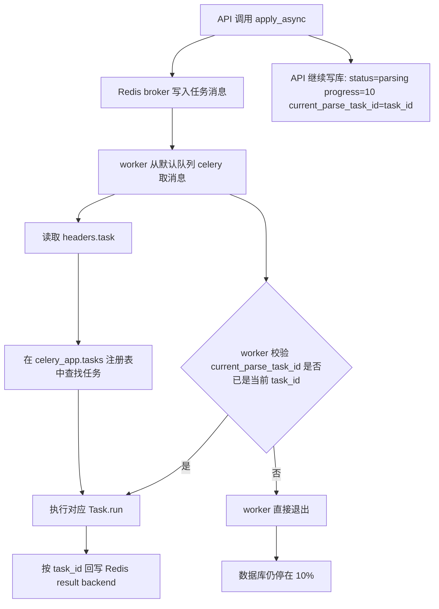

# Celery、Redis 任务机制与招标解析 10% 卡住排查

## 概述

这次对话围绕 `aixbidder` 项目里的 Celery 异步任务链路展开，重点澄清了以下问题：

- Celery worker 是否从 Redis 消费任务
- Redis 中如何区分不同业务任务
- `task.name`、消息头里的 `task` 字段、`task_id` 和 Celery 注册表之间的关系
- 当前系统里到底有哪些任务共用一个 worker
- 为什么招标解析任务会长期停留在 `progress = 10`

结论：

- 当前项目使用 **一个共享 Celery worker**，多个业务任务共用它
- worker 通过 **Redis broker** 取任务，通过 **Redis result backend** 保存状态
- 当前没有配置自定义 `task_routes` / `task_queues`，因此业务任务默认进入同一个队列 `celery`
- Redis 里区分“任务类型”主要靠消息头里的 `task` 字段，也就是 `task.name`
- 数据库里保存的 `current_parse_task_id` / `celery_task_id` 是某次执行实例的 `task_id`，不是任务类型名
- 招标解析卡在 10% 的主因是 **派发任务与数据库提交之间存在竞态**

## 核心概念

### 1. Celery 在本项目中的工作链路

1. API 或 service 调用 `.delay()` / `.apply_async()`
2. Celery 把任务消息写入 Redis broker
3. worker 从 Redis 队列中取出消息
4. worker 读取消息头里的 `task` 字段
5. worker 在 `celery_app.tasks` 注册表中查找对应任务对象
6. 执行该任务对象的 `.run(...)`
7. 按 `task_id` 将执行状态写回 Redis result backend

### 2. 几个容易混淆的名字

| 名称 | 含义 | 当前项目里的来源 |
|---|---|---|
| `task.name` | 任务逻辑名，决定消息里标识这个任务类型的字符串 | `@celery_app.task(name=\"...\")` |
| 消息头 `task` | 发到 Redis 时写入消息头的任务类型字段 | 等于 `task.name` |
| `task_id` | 某次执行实例的唯一 ID | `apply_async()` 返回的 UUID |
| `celery_app.tasks[...]` | worker 启动后维护的任务注册表 | key 是 `task.name` |
| `.run(...)` | 任务对象真正执行的 Python 函数入口 | 被装饰函数本身 |

### 3. Redis 中怎么区分任务

当前实现里，Redis 主要通过两层信息区分任务：

- **队列名**
  当前没有自定义路由，默认都是 `celery`
- **消息头 `task`**
  例如：
  - `app.tasks.tender_parsing.parse_tender_document`
  - `contracts.parse_single`
  - `finances.parse_batch_import_item`

因此：

- “这条消息属于什么业务任务”看 `headers.task`
- “这是哪一次具体执行”看 `task_id`

### 4. 本项目里实际使用 Celery 的任务

当前共享 worker 注册的业务任务如下：

| `task.name` / 消息头 `task` | 注册表里执行的函数 |
|---|---|
| `app.tasks.tender_parsing.parse_tender_document` | `app.tasks.tender_parsing.parse_tender_document` |
| `app.tasks.bid_checking.check_bid_document` | `app.tasks.bid_checking.check_bid_document` |
| `contracts.parse_single` | `app.tasks.contract_parse.run_single_contract_parse` |
| `contracts.parse_batch_import_item` | `app.tasks.contract_parse.run_batch_import_contract_parse` |
| `finances.parse_single` | `app.tasks.finance_parse.run_single_finance_parse` |
| `finances.parse_batch_import_item` | `app.tasks.finance_parse.run_batch_import_finance_parse` |
| `personnels.parse_single` | `app.tasks.personnel_parse.run_single_personnel_parse` |
| `materials.basic_info.parse` | `app.tasks.material_basic_info_parse.run_material_basic_info_parse` |
| `patents.parse_single` | `app.tasks.patent_parse.run_single_patent_parse` |
| `patents.parse_batch_import_item` | `app.tasks.patent_parse.run_batch_import_patent_parse` |
| `qualifications.parse_single` | `app.tasks.qualification_parse.run_single_qualification_parse` |
| `qualifications.parse_batch_import_item` | `app.tasks.qualification_parse.run_batch_import_qualification_parse` |

## 关键代码 / 命令

### 1. Celery 入口

当前 Celery 实例定义在：

```python
celery_app = Celery(
    "aixbidder_contract_parse",
    broker=settings.REDIS_URL,
    backend=settings.REDIS_URL,
)
```

要点：

- worker 确实是从 Redis 消费
- 当前代码实际使用的是 `REDIS_URL`
- 并没有真正使用 `AIXBIDDER_CELERY_BROKER_URL` / `AIXBIDDER_CELERY_RESULT_BACKEND`

### 2. 任务定义示例

```python
@celery_app.task(
    bind=True,
    name="contracts.parse_single",
    autoretry_for=(TransientContractParseError,),
    retry_backoff=True,
    retry_jitter=True,
    retry_kwargs={"max_retries": 3},
    soft_time_limit=900,
    time_limit=1200,
)
def run_single_contract_parse(self, task_id: str) -> dict[str, str]:
    process_contract_parse_task(task_id)
    return {"task_id": task_id}
```

这里的关键关系是：

- `task.name == "contracts.parse_single"`
- 发布到 Redis 后，消息头 `headers.task == "contracts.parse_single"`
- worker 收到消息后，会去查 `celery_app.tasks["contracts.parse_single"]`

### 3. 发布消息时的实际字段

通过 `before_task_publish` 抓到的招标解析消息关键信息如下：

```text
sender= app.tasks.tender_parsing.parse_tender_document
routing_key= celery
headers.task= app.tasks.tender_parsing.parse_tender_document
headers.id= <uuid>
body= ((123, 456), {}, {'callbacks': None, 'errbacks': None, 'chain': None, 'chord': None})
```

通过这个结果可以确认：

- `sender` 和 `headers.task` 都等于 `task.name`
- 当前默认路由键就是 `celery`
- 参数放在 `body` 中
- 唯一执行实例是 `headers.id`

### 4. 本次排查用到的命令

```bash
# 启动共享 worker
make backend-worker

# 查看 worker 注册了哪些任务
cd backend && .venv/bin/celery -A app.tasks.celery_app inspect registered

# 查看当前正在执行的任务
cd backend && .venv/bin/celery -A app.tasks.celery_app inspect active

# 查看已保留但未执行的任务
cd backend && .venv/bin/celery -A app.tasks.celery_app inspect reserved

# 查看默认队列长度
redis-cli LLEN celery
```

### 5. 运行时观测到的现象

本次排查过程中实际观察到：

- 当前 worker 在线，且已注册上面列出的 12 个业务任务
- `active` 为空
- `reserved` 为空
- Redis 默认队列 `celery` 长度为 `0`
- 多条卡住的招标解析记录在数据库中仍是 `status = 'parsing'`、`progress = 10`
- 这些记录对应的 `task_id` 在 Celery 结果里均为 `PENDING`
- Redis 中也没有对应的 `celery-task-meta-<task_id>` 结果记录

这说明卡住时并不是“worker 正在忙”，而是任务已经没有继续执行，但业务表仍停留在 10%

## 注意事项

### 1. 当前所有任务共用一个 worker

当前项目没有把不同业务拆到不同队列，也没有分别启动专用 worker。多个业务共用一个共享 worker 池。

### 2. 当前代码使用的是 `REDIS_URL`

虽然配置模型中存在：

- `AIXBIDDER_CELERY_BROKER_URL`
- `AIXBIDDER_CELERY_RESULT_BACKEND`

但 `celery_app` 实际绑定的是 `settings.REDIS_URL`。如果部署时只改了 `AIXBIDDER_CELERY_*`，却没改 `REDIS_URL`，就会导致实际连接的 Redis 与预期不一致。

### 3. 数据库里存的是 `task_id`，不是任务名

例如招标解析表中的 `current_parse_task_id` 只表示某次任务实例的 UUID，不能直接用来判断它是什么业务类型。要判断任务类型，需要看发布消息里的 `task` 字段，或者回到代码里看这条 `task_id` 是从哪个任务对象 `.apply_async()` 发出来的。

### 4. 当前没有自定义 task route

因为没有配置 `task_routes` / `task_queues`，当前无法仅靠队列名区分“招标解析”和“合同解析”。这些任务会一起进入默认队列。

## 示例代码

### 1. 查看任务注册表和实际执行函数

```python
from app.tasks.celery_app import celery_app

for name in sorted(celery_app.tasks):
    if name.startswith("celery."):
        continue
    task = celery_app.tasks[name]
    print(name, task.run.__module__, task.run.__qualname__)
```

### 2. 验证发布消息中的 `task` 字段

```python
from celery.signals import before_task_publish
from app.tasks.tender_parsing import parse_tender_document

@before_task_publish.connect(sender=parse_tender_document.name, weak=False)
def capture(sender=None, headers=None, body=None, routing_key=None, **kwargs):
    print("sender=", sender)
    print("routing_key=", routing_key)
    print("headers.task=", headers.get("task"))
    print("headers.id=", headers.get("id"))
    print("body=", body)
```

### 3. 当前 10% 卡住问题的关键竞态

招标解析的服务层逻辑大致是：

```python
task_id = dispatcher(tender.id, tender.file_id)
tender.status = "parsing"
tender.progress = 10
tender.current_parse_task_id = task_id
db.commit()
```

而 worker 一启动就会先校验：

```python
if tender.current_parse_task_id != task_id:
    return
```

这会带来一个竞态窗口：

1. API 先 `apply_async()` 成功
2. worker 很快从 Redis 取到消息
3. 但此时数据库里的 `current_parse_task_id` 还没来得及提交
4. worker 判断自己不是当前任务，直接退出
5. API 随后把数据库更新为 `progress = 10`
6. 最终任务不再继续执行，页面永久停在 10%

这是当前招标解析卡住 10% 的主因。

## 流程图



## 相关资料

本次总结基于项目源码和现场运行时观测，没有额外查阅外部资料。核心文件如下：

- `backend/app/tasks/celery_app.py`
- `backend/app/tasks/tender_parsing.py`
- `backend/app/tasks/bid_checking.py`
- `backend/app/tasks/contract_parse.py`
- `backend/app/tasks/finance_parse.py`
- `backend/app/tasks/personnel_parse.py`
- `backend/app/tasks/material_basic_info_parse.py`
- `backend/app/tasks/patent_parse.py`
- `backend/app/tasks/qualification_parse.py`
- `backend/app/services/tender_files.py`
- `backend/app/api/tenders.py`

## 关键结论

- worker 确实是去 Redis 消费
- 当前多个业务任务共用一个共享 worker
- 当前默认靠消息头里的 `task` 字段区分任务类型
- 当前数据库里保存的是 `task_id`，不是任务名
- 招标解析 10% 卡住不是因为队列太长，而是派发与写库之间的竞态导致 worker 提前退出
