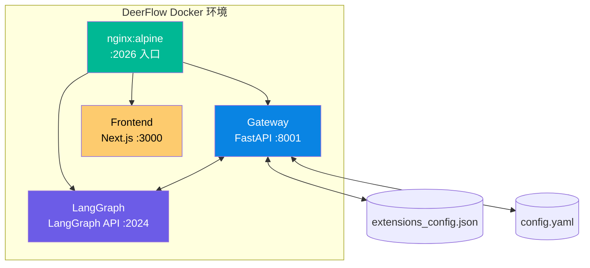

# DeerFlow 2.0 本地部署指南

> 📅 整理时间：2026-03-29
> 🎯 适用平台：macOS（Apple Silicon + Docker Desktop）

---

## 一、项目概述

**DeerFlow**（Deep Exploration and Efficient Research Flow）是字节跳动开源的超级 Agent 框架，支持 Sub-Agent、Memory、Sandbox 等高级特性，可处理从分钟级到小时级的复杂任务。

- **GitHub**：https://github.com/bytedance/deer-flow
- **Stars**：51.8k
- **官网**：https://deerflow.tech
- **版本**：2.0（从零重写，与 1.x 不兼容）

---

## 二、部署架构



**服务说明：**

| 服务 | 技术栈 | 端口 | 说明 |
|:-----|:-------|:-----|:-----|
| nginx | nginx:alpine | 2026 | 反向代理，统一入口 |
| gateway | FastAPI + Python | 8001 | 核心 API 网关 |
| langgraph | LangGraph | 2024 | Agent 状态管理 |
| frontend | Next.js | 3000 | Web UI |

---

## 三、前置条件

- **Docker Desktop**：已安装并运行（`docker info` 验证）
- **Git**：用于克隆仓库
- **API Key**：DeepSeek API Key（必须）、MiniMax API Key（可选）

```bash
# 验证 Docker
docker --version
# Docker version 28.1.1, build 4eba377

# Docker Desktop 已在运行
docker info > /dev/null 2>&1 && echo "Docker 运行正常" || echo "Docker 未运行"
```

---

## 四、部署步骤

### 4.1 克隆仓库

```bash
cd ~
git clone https://github.com/bytedance/deer-flow.git
cd deer-flow
```

### 4.2 生成配置文件

```bash
cd ~/deer-flow
python3 ./scripts/configure.py
# ✓ Configuration files generated
```

执行后生成以下文件：
- `config.yaml` — 主配置文件
- `.env` — 环境变量文件
- `extensions_config.json` — 扩展配置

### 4.3 配置 API Key

编辑 `.env` 文件，填入真实 API Key：

```bash
# 编辑环境变量文件
nano ~/deer-flow/.env
```

```bash
# .env 文件内容
DEEPSEEK_API_KEY=sk-xxxxxxxxxxxxxxxxxxxxxxxxxxxxxxxx
MINIMAX_API_KEY=xxxxxxxxxxxxxxxxxxxxxxxxxxxxxxxx

# 其他可选
TAVILY_API_KEY=your-tavily-api-key
JINA_API_KEY=your-jina-api-key
```

### 4.4 配置模型

编辑 `config.yaml`，添加模型配置：

```yaml
models:
  # DeepSeek V3（推荐）
  - name: deepseek-v3
    display_name: DeepSeek V3
    use: deerflow.models.patched_deepseek:PatchedChatDeepSeek
    model: deepseek-reasoner
    api_key: $DEEPSEEK_API_KEY
    max_tokens: 8192
    supports_thinking: true
    supports_vision: false
    when_thinking_enabled:
      extra_body:
        thinking:
          type: enabled

  # MiniMax M2.5
  - name: minimax-m2.5
    display_name: MiniMax M2.5
    use: langchain_openai:ChatOpenAI
    model: MiniMax-M2.5
    api_key: $MINIMAX_API_KEY
    base_url: https://api.minimax.io/v1
    max_tokens: 4096
    temperature: 1.0
    supports_vision: true
```

### 4.5 确保扩展配置文件是文件而非目录

```bash
# 检查 extensions_config.json 是否为目录（错误情况）
ls -la ~/deer-flow/extensions_config.json
# 如果是目录，执行以下命令修复：
rm -rf ~/deer-flow/extensions_config.json
cp ~/deer-flow/extensions_config.example.json ~/deer-flow/extensions_config.json
```

### 4.6 构建并启动

```bash
cd ~/deer-flow/docker

# 设置 DEER_FLOW_ROOT 环境变量
export DEER_FLOW_ROOT=/Users/xuchaoyue/deer-flow

# 构建并启动所有服务
docker compose -p deer-flow-dev -f docker-compose-dev.yaml up --build -d
```

首次构建会下载依赖（约 3-5 分钟），后续启动会快很多。

### 4.7 验证服务

```bash
# 检查容器状态
docker ps

# 验证健康检查
curl http://localhost:2026/health
# {"status":"healthy","service":"deer-flow-gateway"}

# 验证模型列表
curl http://localhost:2026/api/models
```

**正确响应示例：**

```json
{
  "models": [
    {
      "name": "deepseek-v3",
      "model": "deepseek-reasoner",
      "display_name": "DeepSeek V3",
      "supports_thinking": true
    },
    {
      "name": "minimax-m2.5",
      "model": "MiniMax-M2.5",
      "display_name": "MiniMax M2.5",
      "supports_thinking": false
    }
  ]
}
```

---

## 五、访问地址

| 服务 | 地址 |
|:-----|:-----|
| **Web UI** | http://localhost:2026 |
| **API Gateway** | http://localhost:2026/api/* |
| **LangGraph API** | http://localhost:2026/api/langgraph/* |
| **Swagger 文档** | http://localhost:2026/docs |

---

## 六、运维命令

```bash
# 进入 DeerFlow Docker 目录
cd ~/deer-flow/docker

# 完整启动命令（包含环境变量）
export DEER_FLOW_ROOT=/Users/xuchaoyue/deer-flow
docker compose -p deer-flow-dev -f docker-compose-dev.yaml up --build -d

# 停止服务
docker compose -p deer-flow-dev -f docker-compose-dev.yaml down

# 查看所有日志
docker compose -p deer-flow-dev -f docker-compose-dev.yaml logs -f

# 查看 Gateway 日志
docker logs deer-flow-gateway -f

# 查看 LangGraph 日志
docker logs deer-flow-langgraph -f

# 重启 Gateway（修改 config.yaml 后）
docker compose -p deer-flow-dev -f docker-compose-dev.yaml restart gateway

# 完全重建（清除所有容器）
docker compose -p deer-flow-dev -f docker-compose-dev.yaml down --remove-orphans
docker compose -p deer-flow-dev -f docker-compose-dev.yaml up --build -d
```

---

## 七、预置 Skills

DeerFlow 内置了 17 个公开 Skills，位于 `~/deer-flow/skills/public/`：

| Skill | 说明 |
|:------|:-----|
| `deep-research` | 深度研究助手 |
| `data-analysis` | 数据分析 |
| `chart-visualization` | 图表可视化 |
| `frontend-design` | 前端设计 |
| `web-design-guidelines` | Web 设计规范 |
| `github-deep-research` | GitHub 深度研究 |
| `claude-to-deerflow` | Claude Code 迁移指南 |
| `skill-creator` | Skill 创建工具 |
| `podcast-generation` | 播客生成 |
| `ppt-generation` | PPT 生成 |
| `image-generation` | 图片生成 |
| `video-generation` | 视频生成 |
| `consulting-analysis` | 咨询分析 |
| `bootstrap` | 引导初始化 |
| `surprise-me` | 惊喜模式 |
| `vercel-deploy-claimable` | Vercel 部署 |
| `find-skills` | 搜索 Skills |

---

## 八、常见问题

### Q1：Gateway 启动失败，报错 `Environment variable DEEPSEEK_API_KEY not found`

**原因**：`.env` 文件中的 API Key 未填写或格式错误。

**解决**：
```bash
# 确保 .env 文件中有真实 Key
cat ~/deer-flow/.env | grep DEEPSEEK_API_KEY

# 重启 Gateway
cd ~/deer-flow/docker
docker compose -p deer-flow-dev -f docker-compose-dev.yaml restart gateway
```

### Q2：Gateway 启动失败，报错 `Is a directory: '/app/extensions_config.json'`

**原因**：`extensions_config.json` 被创建成了目录。

**解决**：
```bash
rm -rf ~/deer-flow/extensions_config.json
cp ~/deer-flow/extensions_config.example.json ~/deer-flow/extensions_config.json

# 重启
cd ~/deer-flow/docker
docker compose -p deer-flow-dev -f docker-compose-dev.yaml down
docker compose -p deer-flow-dev -f docker-compose-dev.yaml up --build -d
```

### Q3：502 Bad Gateway

**原因**：Gateway 或 LangGraph 服务启动失败。

**解决**：
```bash
# 检查容器状态
docker ps

# 查看 Gateway 日志
docker logs deer-flow-gateway --tail=50

# 查看 LangGraph 日志
docker logs deer-flow-langgraph --tail=50
```

### Q4：修改 `config.yaml` 后不生效

**原因**：需要重启 Gateway 服务，且有时需要完全重建。

**解决**：
```bash
cd ~/deer-flow/docker
docker compose -p deer-flow-dev -f docker-compose-dev.yaml restart gateway
sleep 10
curl http://localhost:2026/health
```

---

## 九、界面预览


---

## 十、参考资料

- [DeerFlow GitHub](https://github.com/bytedance/deer-flow)
- [DeerFlow 官网](https://deerflow.tech)
- [DeerFlow 安装文档](https://raw.githubusercontent.com/bytedance/deer-flow/main/Install.md)
- [DeerFlow 2.0 官方部署指南](./Install.md)

---

## 📝 更新日志

| 日期 | 更新内容 |
|:-----|:---------|
| 2026-03-29 | 初始版本，完整部署指南 |
