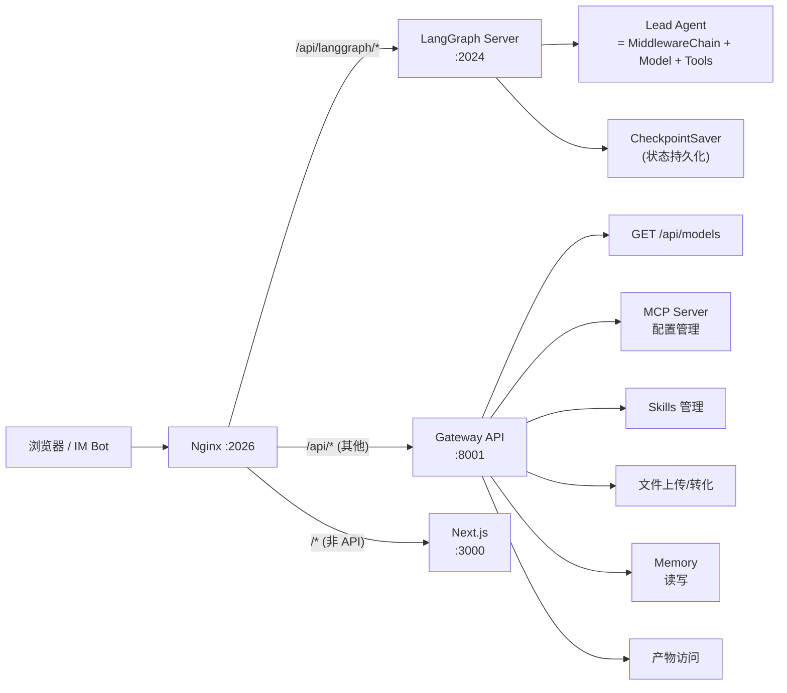
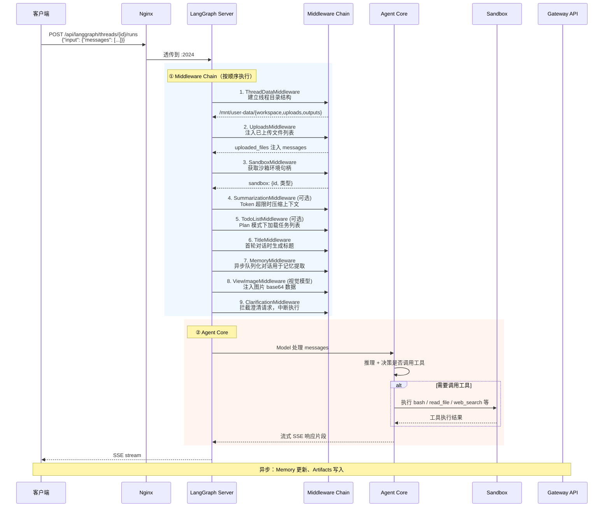
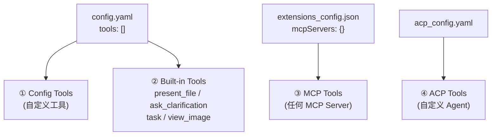
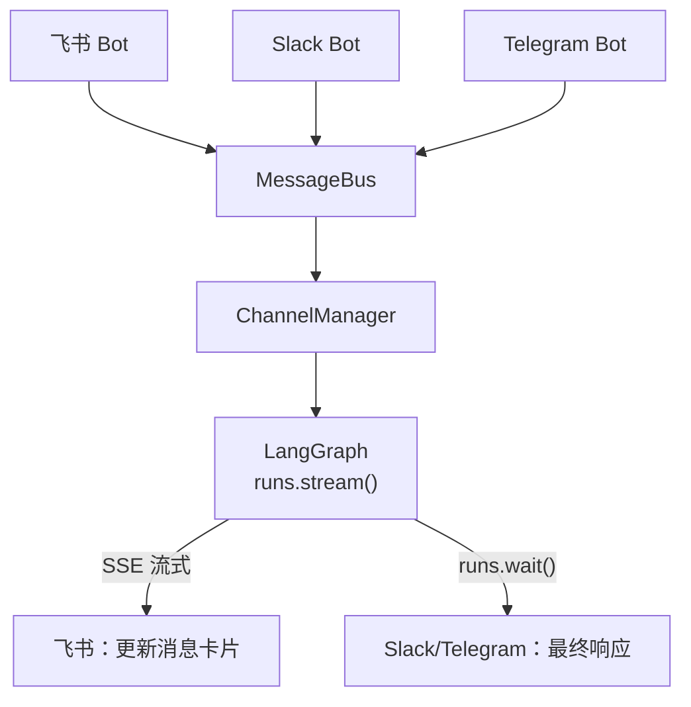

# DeerFlow 后端架构详解

> 分析版本：基于 DeerFlow 源码，侧重 2026-03 活跃开发分支
> 源码路径：`~/deer-flow/backend/`

---

## 一、系统全貌

DeerFlow 是一个**基于 LangGraph + FastAPI** 构建的 AI Super Agent 运行平台，核心能力是让大模型在**隔离沙箱**中执行代码、搜索网页、操作文件、并把复杂任务委托给子 Agent 处理，同时通过 Memory 系统跨会话记住用户偏好。

整体架构分三层，通过 Nginx 统一对外：



**三个端口各司其职：**
- **:2024** — LangGraph Server，Agent 运行时，唯一调用 LLM 的地方
- **:8001** — Gateway API，FastAPI，提供配置管理、文件上传等辅助 REST 接口
- **:3000** — Frontend，Next.js，聊天界面

这样做的好处是：Agent 运行时（LangGraph）和周边管理功能（FastAPI）解耦，独立演进。

---

## 二、请求全流程

一次对话从发起到收到回复，完整经过：



---

## 三、Middleware Chain（中间件链）

这是 DeerFlow 架构中最核心的设计，也是最值得借鉴的部分。

### 3.1 设计思想

每个 Middleware 继承 `AgentMiddleware`，实现 `before_*` / `after_*` 生命周期钩子，在 Agent 执行的特定时机注入逻辑。所有 Middleware 共享同一个 `ThreadState`，通过 dict 返回值来修改状态。

**对比 Django/Flask 中间件：** Django 中间件处理 HTTP 请求/响应；这里的 Middleware 处理的是**大模型的推理过程**——可以在模型调用前后、工具执行前后介入，修改 messages、注入数据、触发中断。

### 3.2 完整 Middleware 顺序及各自职责

| 顺序 | Middleware | 类型 | 职责 |
|:---:|-----------|------|------|
| 1 | `ThreadDataMiddleware` | 内置 | 初始化线程工作目录，写入 `state.thread_data` |
| 2 | `UploadsMiddleware` | 内置 | 把用户上传的文件列表注入 `messages` |
| 3 | `SandboxMiddleware` | 内置 | 获取沙箱环境句柄，写入 `state.sandbox` |
| 4 | `SummarizationMiddleware` | LangChain | Token 超限时压缩老消息（可选） |
| 5 | `TokenUsageMiddleware` | 内置 | 跟踪 Token 消耗（可选） |
| 6 | `TodoListMiddleware` | 内置 | Plan 模式任务跟踪（可选） |
| 7 | `TitleMiddleware` | 内置 | 首轮对话后生成标题，写入 `state.title` |
| 8 | `MemoryMiddleware` | 内置 | 过滤对话，队列化用于异步记忆提取 |
| 9 | `LoopDetectionMiddleware` | 内置 | 检测重复工具调用循环 |
| 10 | `SubagentLimitMiddleware` | 内置 | 限制并发子 Agent 数量（可选） |
| 11 | `DeferredToolFilterMiddleware` | 内置 | 工具搜索时隐藏 Deferred 工具 schema |
| 12 | `ViewImageMiddleware` | 内置 | 视觉模型注入图片 base64（可选） |
| 13 | `ClarificationMiddleware` | 内置 | **最后一道**：拦截澄清，中断执行 |

### 3.3 关键 Middleware 详解

#### ClarificationMiddleware — 对话暂停与澄清

当 Agent 调用 `ask_clarification` 工具时，这个 Middleware 会**拦截**，不走正常工具执行流程，而是：

```python
# 拦截 ask_clarification 工具调用
if request.tool_call.get("name") == "ask_clarification":
    # 构造一个 ToolMessage 填入用户问题
    tool_message = ToolMessage(
        content=格式化后的问题,
        tool_call_id=tool_call_id,
        name="ask_clarification",
    )
    # goto=END 表示执行流在这里中断
    # 前端收到 END 后等待用户输入
    return Command(update={"messages": [tool_message]}, goto=END)
```

**关键理解：** 普通的工具调用（如 `bash`）返回结果后 Agent 继续推理；但 `ask_clarification` 的特殊之处在于它需要用户主动参与，所以 Middleware 直接让它跳到 END，等用户回复后再继续下一轮推理。

#### MemoryMiddleware — 跨会话记忆

流程：

```
每次 Agent 执行完毕
    → 过滤 messages（去掉工具调用中间结果，只保留用户输入 + 最终 AI 回复）
    → 放入 `MemoryUpdateQueue`（带 debounce，避免频繁 LLM 调用）
    → 定时器触发后
        → 调用 LLM 总结"用户是做什么的、有什么偏好"
        → 写入 memory.json
    → 下次对话时
        → 从 memory.json 读取
        → 注入 System Prompt 顶部
```

#### TitleMiddleware — 自动起标题

在第一轮对话完成后触发。调用一次 LLM（轻量模型），从用户第一个问题和 AI 第一个回答中提取最多 N 个词作为标题，写入 `state.title`。

#### SandboxMiddleware — 沙箱生命周期

在 Agent 真正执行工具前获取沙箱句柄，把沙箱 ID 写入 `state.sandbox`。之后 Agent 调用工具时，工具通过这个 ID 从 Context 中取出沙箱，执行实际操作。

---

## 四、沙箱系统（Sandbox）

### 4.1 为什么需要沙箱

Agent 可以执行 `bash` 命令、写文件——这些操作如果直接跑在宿主机上，风险极高（`rm -rf /`、`格式化磁盘`等）。沙箱提供了**隔离的执行环境**，同时通过**虚拟路径映射**，让不同线程之间也互相隔离。

### 4.2 抽象接口

```python
class Sandbox(ABC):
    @abstractmethod
    def execute_command(self, command: str) -> str: ...

    @abstractmethod
    def read_file(self, path: str) -> str: ...

    @abstractmethod
    def write_file(self, path: str, content: str, append: bool = False) -> None: ...

    @abstractmethod
    def list_dir(self, path: str, max_depth=2) -> list[str]: ...

    @abstractmethod
    def update_file(self, path: str, content: bytes) -> None: ...
```

所有工具（`bash`、`read_file`、`write_file` 等）都调用这个抽象接口，不直接接触真实文件系统。

### 4.3 路径虚拟化

这是理解 DeerFlow 沙箱的关键。Agent 在沙箱内看到的路径和宿主机上的物理路径**完全不同**：

| 沙箱内虚拟路径 | 宿主机物理路径 |
|-------------|-------------|
| `/mnt/user-data/workspace` | `~/.deer-flow/threads/{thread_id}/user-data/workspace` |
| `/mnt/user-data/uploads` | `~/.deer-flow/threads/{thread_id}/user-data/uploads` |
| `/mnt/user-data/outputs` | `~/.deer-flow/threads/{thread_id}/user-data/outputs` |
| `/mnt/skills` | `~/deer-flow/skills/` |

虚拟路径前缀是 `/mnt/user-data`，在 `Paths.resolve_virtual_path()` 中校验路径遍历攻击（防止 `/mnt/user-data/../../etc/passwd`）。

### 4.4 两种沙箱实现

| | `LocalSandboxProvider` | `AioSandboxProvider` |
|--|--|--|
| 用途 | 本地开发 | Docker 容器，生产环境 |
| 隔离性 | 无隔离（进程级） | 容器级隔离 |
| 配置 | `use: deerflow.sandbox.local:LocalSandboxProvider` | `use: deerflow.sandbox.aio_sandbox:AioSandboxProvider` |
| 可配置项 | — | Docker 镜像、副本数、空闲超时 |

`AioSandboxProvider` 的配置示例（`config.yaml`）：

```yaml
sandbox:
  use: deerflow.sandbox.aio_sandbox:AioSandboxProvider
  image: enterprise-public-cn-beijing.cr.volces.com/vefaas-public/all-in-one-sandbox:latest
  replicas: 3           # 最多 3 个并发容器
  idle_timeout: 600     # 10 分钟空闲后释放
  environment:
    DEEPSEEK_API_KEY: $DEEPSEEK_API_KEY
```

---

## 五、工具系统（Tools）

### 5.1 工具注册与加载

```
config.yaml 中定义工具
    → get_available_tools() 统一加载
    → 合并 4 个来源
```



### 5.2 工具列表

| 类别 | 工具 | 说明 |
|------|------|------|
| **沙箱内置** | `bash` | 执行 shell 命令 |
| | `ls` | 列出目录 |
| | `read_file` | 读文件内容 |
| | `write_file` | 写文件 |
| | `str_replace` | 搜索替换文件内容 |
| **内置业务** | `present_files` | 将文件呈现给用户（生成可下载链接） |
| | `ask_clarification` | 向用户提问（ClarificationMiddleware 拦截） |
| | `view_image` | 视觉模型查看图片 |
| | `task` | 委托子 Agent 执行任务 |
| **社区工具** | `tavily_search` | Web 搜索 |
| | `jina_ai_fetch` | Web 页面抓取 |
| | `firecrawl` | 网站爬取 |
| | `ddg_image_search` | 图片搜索 |
| **MCP** | 任意 MCP Server 暴露的工具 | stdio / SSE / HTTP 传输 |

### 5.3 工具执行流程

以 `bash` 工具为例：

```
Agent 调用 bash
    → LangChain ToolNode 接收
    → 注入 SandboxMiddleware 获取的沙箱 ID
    → 调用沙箱的 execute_command()
    → 返回输出字符串
    → ToolMessage 追加到 messages
    → Agent 继续推理
```

---

## 六、Memory 系统

### 6.1 整体架构

```
messages 过滤
    ↓
MemoryUpdateQueue（带 debounce）
    ↓
MemoryUpdater（调用 LLM 提取记忆）
    ↓
memory.json（持久化存储）
    ↓
System Prompt 注入（下次对话）
```

### 6.2 记忆内容结构

```json
{
  "user_context": {
    "work": "软件开发",
    "personal": "使用 Obsidian 做知识管理"
  },
  "facts": [
    {"content": "主要用中文交流", "source": "conversation", "confidence": 0.9}
  ],
  "history": ["用户使用 DeerFlow 部署本地服务"]
}
```

### 6.3 Debounce 机制

`MemoryUpdateQueue` 使用 Python `threading.Timer` 实现延迟批量处理：

```python
# 每次新对话到来，重置定时器
def add(self, thread_id, messages, agent_name=None):
    self._queue = [c for c in self._queue if c.thread_id != thread_id]
    self._queue.append(ConversationContext(...))
    self._reset_timer()  # 取消旧定时器，启动新的

# 定时器到期后批量处理
def _process_queue(self):
    contexts = self._queue.copy()
    self._queue.clear()
    for ctx in contexts:
        updater.update_memory(...)  # 调用 LLM
```

---

## 七、FastAPI Gateway API

Gateway 负责所有**非 Agent 运行时**的 REST 操作，是 LangGraph Server 的好帮手。

### 7.1 核心路由

| 路由 | 方法 | 功能 |
|------|------|------|
| `/api/models` | GET | 列出可用模型 |
| `/api/mcp/config` | GET/PUT | 读取/更新 MCP 服务器配置（热更新） |
| `/api/skills` | GET/PUT | Skills 列表和启用状态 |
| `/api/memory` | GET | 读取全局记忆 |
| `/api/memory/reload` | POST | 强制重新加载记忆 |
| `/api/threads/{id}/uploads` | POST | 上传文件，自动转 Markdown |
| `/api/threads/{id}/uploads/list` | GET | 列出已上传文件 |
| `/api/threads/{id}/artifacts/{path}` | GET | 访问 Agent 生成的产物 |
| `/api/threads/{id}` | DELETE | 清理线程本地数据 |
| `/api/agents` | GET/POST | 自定义 Agent 管理 |

### 7.2 MCP 热更新原理

```
PUT /api/mcp/config
    → Gateway 写入 extensions_config.json
    → LangGraph Server 的 MCP Manager 检测到文件 mtime 变化
    → 重新初始化 MCP Client
    → 下一次 Agent 执行时加载新工具
```

不需要重启服务。

### 7.3 文件上传与格式转换

上传流程：

```
POST /api/threads/{id}/uploads
    → Gateway 接收文件
    → 若是 PDF/PPT/Excel/Word
        → markitdown 转换为 Markdown
        → 保存到 ~/.deer-flow/threads/{id}/user-data/uploads/
    → 若是普通文件
        → 直接保存
    → 返回 {filename, path, virtual_path, artifact_url}
    → UploadsMiddleware 下一轮自动注入文件列表
```

---

## 八、子 Agent 系统（Subagent）

当复杂任务可以被分解为可并行的子任务时，主 Agent 调用 `task` 工具：

```python
# Agent 调用 task 工具
{
  "name": "task",
  "args": {
    "prompt": "帮我搜索 2026 年 AI Agent 的最新进展",
    "agent": "general-purpose",  # 或 "bash"
    "tools": ["web_search", "bash"]
  }
}
```

执行流程：

```
task 工具被调用
    → SubagentExecutor 在后台线程池执行
    → 最多 3 个并发（可配置）
    → 每个子 Agent 是独立的 LangGraph run
    → 主 Agent 调用 runs.wait() 等待结果
    → 结果作为 ToolMessage 返回给主 Agent
```

两种内置子 Agent：
- **`general-purpose`**：完整工具集，可做任意任务
- **`bash`**：专精执行命令，适合纯脚本场景

---

## 九、ThreadState 数据结构

`ThreadState` 是整个系统的核心数据容器，所有 Middleware 和工具都围绕它工作：

```python
class ThreadState(AgentState):
    # === 来自 LangGraph AgentState ===
    messages: list[BaseMessage]       # 对话历史（核心）

    # === DeerFlow 自定义字段 ===
    sandbox: SandboxState             # {sandbox_id: str}
    thread_data: ThreadDataState      # {workspace_path, uploads_path, outputs_path}
    title: str | None                 # 自动生成的对话标题
    artifacts: list[str]              # 产物文件路径（merge reducer，自动去重）
    todos: list | None                # Plan 模式任务列表
    uploaded_files: list[dict] | None # 上传文件元信息
    viewed_images: dict               # {image_path: {base64, mime_type}}
```

**两个 Annotated Reducer 值得注意：**

```python
# artifacts 用 merge_artifacts：追加并去重
artifacts: Annotated[list[str], merge_artifacts]

# viewed_images 用 merge_viewed_images：合并 dict，{} 表示清空
viewed_images: Annotated[dict[str, ViewedImageData], merge_viewed_images]
```

---

## 十、Channel 系统（IM 集成）

DeerFlow 支持飞书、Slack、Telegram 三个 IM 平台接入。Channel 系统作为独立服务运行，通过消息总线与 LangGraph 交互：



**飞书的特殊性：** 飞书支持消息卡片原地更新，所以 DeerFlow 在运行期间会持续 patch 同一条消息卡片，而不是等运行结束后再发一条最终消息。

---

## 十一、配置系统

DeerFlow 的配置高度可定制，主要配置文件：

### config.yaml — 主配置

```yaml
models:
  - name: gpt-4o
    use: langchain_openai:ChatOpenAI
    model: gpt-4o
    api_key: $OPENAI_API_KEY
    supports_thinking: false
    supports_vision: true

sandbox:
  use: deerflow.sandbox.aio_sandbox:AioSandboxProvider
  replicas: 3
  idle_timeout: 600

summarization:
  enabled: true
  trigger:
    type: token
    value: 100000
  keep:
    type: last_messages
    value: 10

memory:
  enabled: true
  debounce_seconds: 30
  facts_limit: 50
```

### extensions_config.json — MCP 和 Skills

```json
{
  "mcpServers": {
    "github": {
      "enabled": true,
      "type": "stdio",
      "command": "npx",
      "args": ["-y", "@modelcontextprotocol/server-github"],
      "env": {"GITHUB_TOKEN": "$GITHUB_TOKEN"}
    }
  },
  "skills": {
    "pdf-processing": {"enabled": true}
  }
}
```

---

## 十二、设计亮点总结

| 设计 | 价值 | 借鉴点 |
|------|------|--------|
| **Middleware Chain** | 非侵入式扩展，每个 Middleware 职责单一 | 新增功能只需加 Middleware，不动核心 |
| **Sandbox 抽象** | 开发/生产环境切换，线程级隔离 | 工具只依赖抽象接口，不碰真实 FS |
| **虚拟路径映射** | Agent 无法感知物理路径，防路径遍历 | 隔离 + 安全 |
| **两层 API** | LangGraph 管 Agent，FastAPI 管周边 | 关注点分离 |
| **Config 热更新** | 改文件实时生效 | 文件 mtime 检测 |
| **Memory + Debounce** | 异步批量更新，降低 LLM 调用频率 | 后台队列 + 定时器 |
| **ClarificationMiddleware** | 澄清优先于推理 | 中断执行流，用户确认后再继续 |
| **ThreadState + Reducer** | 并发安全的状态共享 | Annotated + merge 函数 |

---

## 参考

- 架构文档：`backend/docs/ARCHITECTURE.md`
- 源码入口：`backend/packages/harness/deerflow/agents/lead_agent/agent.py`
- Middleware 源码：`backend/packages/harness/deerflow/agents/middlewares/`
- 沙箱路径管理：`backend/packages/harness/deerflow/config/paths.py`
