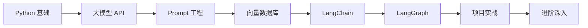
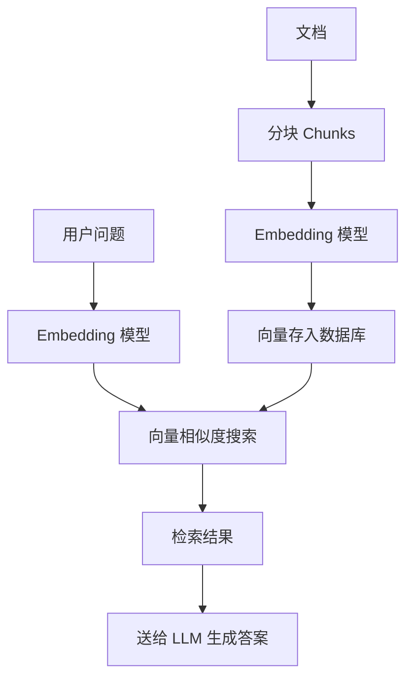

# Java 工程师转型大模型应用开发学习路径

> 适用人群：有 Java 基础，了解面向对象和常用设计模式，想转大模型应用开发
> 学习周期：约 8-12 周（每天 3-4 小时）

---

## 学习路径总览



---

## 第一阶段：Python 基础（1-2 周）

### 学习目标
能熟练读懂和编写 Python 代码，理解 Pythonic 的写法。

### 重点章节

| 主题 | 内容 | 优先级 |
|------|------|--------|
| 语法基础 | 数据类型、函数、类、模块 | 必须掌握 |
| 装饰器 | `@decorator`、functools | 必须掌握 |
| 异步编程 | `async`/`await`、asyncio | 必须掌握 |
| 类型提示 | `typing.Optional`、泛型 | 推荐掌握 |
| 列表推导式 | `[x for x in list]` | 必须掌握 |
| 生成器 | `yield`、迭代器协议 | 推荐掌握 |

### 推荐资料

- [Python 官方教程](https://docs.python.org/3/tutorial/)：重点看 4、5、6、7、9、10、12 章
- [Real Python](https://realpython.com/)：高质量 Python 教程网站

### 练习建议
用 Python 重写一个之前用 Java 实现的小功能（如生产者消费者、单例模式等），感受两种语言的差异。

---

## 第二阶段：大模型 API 调用意愿（1-2 周）

### 学习目标
熟练调用 OpenAI、Anthropic 等主流大模型 API，理解聊天补全的请求响应格式。

### 必学内容

#### OpenAI Chat Completions API

```python
from openai import OpenAI

client = OpenAI()

response = client.chat.completions.create(
    model="gpt-4o",
    messages=[
        {"role": "system", "content": "你是一个助手。"},
        {"role": "user", "content": "你好"}
    ],
    temperature=0.7,
    max_tokens=500,
    stream=True  # 流式返回
)

# 同步调用
print(response.choices[0].message.content)

# 流式调用
for chunk in response:
    if chunk.choices[0].delta.content:
        print(chunk.choices[0].delta.content, end="")
```

#### Anthropic Messages API

```python
from anthropic import Anthropic

client = Anthropic()

response = client.messages.create(
    model="claude-sonnet-4-20250514",
    max_tokens=1024,
    messages=[
        {"role": "user", "content": "你好"}
    ]
)

print(response.content[0].text)
```

#### 国内模型（可选）

| 服务商 | SDK | 模型 |
|--------|-----|------|
| 硅基流动 | `siliconflow` | Qwen、DeepSeek 等 |
| MiniMax | `minimax` | MiniMax 系列 |
| 阿里云百炼 | `dashscope` | Qwen 系列 |

### 练习
- 调用免费模型（硅基流动有免费额度）做一个对话小工具
- 实现流式输出，打印到终端

---

## 第三阶段：Prompt Engineering（1-2 周）

### 学习目标
掌握有效让模型输出期望结果的技术，不只是"会调 API"。

### 核心技术

| 技术 | 说明 | 场景 |
|------|------|------|
| Few-Shot | 给几个示例让模型学习 | 固定格式输出 |
| Chain-of-Thought | 让模型逐步思考 | 数学、推理类问题 |
| System Prompt | 设定角色和行为 | 定制化助手 |
| Output Parser | 结构化输出（JSON） | 程序化处理结果 |
| 温度 / Top-P | 控制随机性 | 创意 vs 精确 |

### Few-Shot 示例

```python
messages = [
    {"role": "system", "content": "你是一个 JSON 转换器，只输出 JSON。"},
    {"role": "user", "content": "把以下文本转成 JSON：名字是小明，年龄是20岁"},
    {"role": "assistant", "content": '{"name": "小明", "age": 20}'},
    {"role": "user", "content": "把以下文本转成 JSON：名字是小红，年龄是25岁"},
    # 模型会参考上面的格式输出
]
```

### 练习
用 few-shot 让模型按固定格式输出 JSON，然后用 Python 解析结果。

---

## 第四阶段：向量数据库（1 周）

### 学习目标
理解向量检索原理，能搭建 RAG（检索增强生成）系统。

### 核心概念



### 工具选择

| 数据库 | 特点 | 适用场景 |
|--------|------|---------|
| **ChromaDB** | 轻量、Python 原生、最易上手 | 学习、快速原型 |
| **Qdrant** | 功能强、支持过滤、生产可用 | 正式项目 |
| **Milvus** | 分布式、超大规模 | 大规模数据 |
| **FAISS** | Facebook 出品、纯本地 | 数据量不大 |

### 快速上手 ChromaDB

```python
import chromadb
from langchain_community.embeddings import OpenAIEmbeddings

# 1. 建库
client = chromadb.Client()
collection = client.create_collection("my_docs")

# 2. 存入文档
collection.add(
    documents=["大模型应用开发指南", "LangChain 快速入门"],
    ids=["doc1", "doc2"]
)

# 3. 查询
results = collection.query(
    query_texts=["LangChain 教程"],
    n_results=1
)
print(results["documents"][0])
```

### 练习
把几篇技术文章存入向量数据库，做一个基于检索的问答系统（RAG）。

---

## 第五阶段：LangChain（2-3 周）

### 学习目标
能用 LangChain 构建完整的 LLM 应用链，理解其核心概念。

### 核心概念对照（类比 Java 理解）

| LangChain 概念 | 类似 Java | 说明 |
|---------------|-----------|------|
| Model | Service 层 | LLM 调用 |
| PromptTemplate | 模板引擎 | 封装 Prompt |
| Chain | Filter / Interceptor | 链式调用 |
| Tool | DAO / Service | 模型调用的外部能力 |
| Memory | Session | 多轮对话上下文 |
| OutputParser | JSON 反序列化 | 解析结构化输出 |

### LCEL（LangChain Expression Language）

```python
from langchain_openai import ChatOpenAI
from langchain.prompts import PromptTemplate
from langchain.output_parsers import JsonOutputParser

llm = ChatOpenAI(model="gpt-4o")
parser = JsonOutputParser()

chain = (
    PromptTemplate.from_template(
        "把以下文本转成 JSON：{input}"
    )
    | llm
    | parser
)

result = chain.invoke({"input": "名字是小明，年龄是20岁"})
print(result)  # {'name': '小明', 'age': 20}
```

### LangChain 四大核心模块

| 模块 | 作用 | 常用类 |
|------|------|--------|
| **Model I/O** | 封装模型调用 | `ChatOpenAI`、`PromptTemplate` |
| **Retrieval** | 文档检索、RAG | `VectorStore`、`Embeddings` |
| **Agents** | 让模型使用工具 | `create_react_agent`、`Tool` |
| **Memory** | 对话历史管理 | `ConversationMemory` |

### 练习
用 LangChain 实现一个带 Memory 的多轮对话助手。

---

## 第六阶段：LangGraph（2-3 周）

### 学习目标
能用 LangGraph 构建多步骤、状态管理的复杂 Agent 系统。

### 为什么需要 LangGraph

- LangChain Chain 是线性的，LangGraph 支持**循环和条件分支**
- 适合做 **Tool Agent**（模型决定要不要调工具）
- DeerFlow 就是基于 LangGraph 的

### 核心概念

| 概念 | 说明 |
|------|------|
| **State** | 贯穿整个图的数据结构 |
| **Node** | 图中的节点，一个函数 |
| **Edge** | 节点之间的连线 |
| **Conditional Edge** | 根据状态决定下一步走哪个节点 |

### 最小示例

```python
from langgraph.graph import StateGraph, MessagesState, START, END
from langchain_openai import ChatOpenAI
from langgraph.prebuilt import ToolNode

llm = ChatOpenAI(model="gpt-4o")
tool_node = ToolNode(tools=[...])

def should_continue(state: MessagesState):
    last_msg = state["messages"][-1]
    return "tools" if last_msg.tool_calls else END

graph = (
    StateGraph(MessagesState)
    .add_node("llm", llm.bind_tools([...]))
    .add_node("tools", tool_node)
    .add_edge(START, "llm")
    .add_conditional_edges("llm", should_continue, {
        "tools": "tools",
        END: END
    })
    .add_edge("tools", "llm")
    .compile()
)
```

### 练习
结合 DeerFlow 的 `langgraph.json`，读懂 DeerFlow 的 agent 是怎么定义的，然后改一个小地方。

---

## 第七阶段：项目实战（持续）

### 入门项目（简历标配）

#### RAG 知识库问答系统
- 技术栈：LangChain + ChromaDB + Flask + Vue
- 核心功能：上传文档 → 分块 → 向量化 → 检索 → 生成答案
- 亮点：可以加重排序、混合检索、多文档问答

#### 简历助手
- 技术栈：LangGraph + Memory + 结构化输出
- 核心功能：根据职位描述，智能匹配简历内容

### 进阶项目

#### Multi-Agent 协作系统
- 多个 Agent 分工：搜索 Agent、分析 Agent、写作 Agent
- 典型场景：自动生成行业分析报告
- 参考：DeerFlow 的 lead_agent + sub_agent 架构

#### AI 代码助手
- 接 Code Agent（类似 Claude Code）
- 实现代码审查、代码生成、代码解释

---

## 推荐工具链

### 开发环境
| 工具 | 用途 |
|------|------|
| **Cursor / VS Code** | IDE |
| **uv** | Python 包管理（比 pip 快） |
| **Poetry** | 依赖管理 |

### 模型调用
| 工具 | 说明 |
|------|------|
| **硅基流动** | 免费额度，国内可用 |
| **DeepSeek API** | 性价比高 |
| **Ollama** | 本地跑模型 |

### 调试与追踪
| 工具 | 说明 |
|------|------|
| **LangSmith** | 看 trace、调试 agent |
| **LangGraph Studio** | 可视化 graph（仅 macOS） |

### 部署
| 工具 | 说明 |
|------|------|
| **Docker** | 容器化必备 |
| **LangServe** | 部署 LangChain Chain |
| **Railway / Zeabur** | 快速部署 |

---

## 学习时间规划

| 周次 | 内容 | 每天投入 |
|------|------|--------|
| 第 1-2 周 | Python 基础 | 3-4 小时 |
| 第 3-4 周 | 大模型 API + Prompt | 3-4 小时 |
| 第 5 周 | 向量数据库 + RAG | 3-4 小时 |
| 第 6-8 周 | LangChain | 3-4 小时 |
| 第 9-11 周 | LangGraph | 3-4 小时 |
| 第 12 周起 | 项目实战 | 4+ 小时 |

---

## 参考资料

- [LangChain 官方文档](https://python.langchain.com/)
- [LangGraph 官方文档](https://langchain-ai.github.io/langgraph/)
- [OpenAI API 文档](https://platform.openai.com/docs/)
- [Anthropic Claude 文档](https://docs.anthropic.com/)
- [GitHub Copilot API 转 Proxy](https://github.com/puxu-msft/copilot-api-js)（用 Copilot 的 Claude 模型）
- [DeerFlow 源码](https://github.com/byran623/deer-flow)
