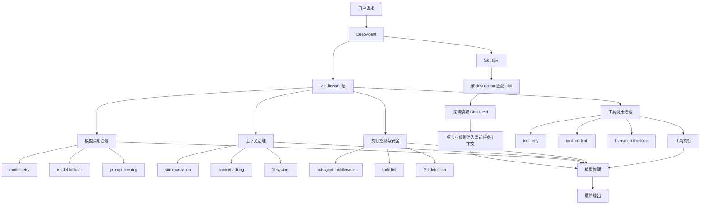
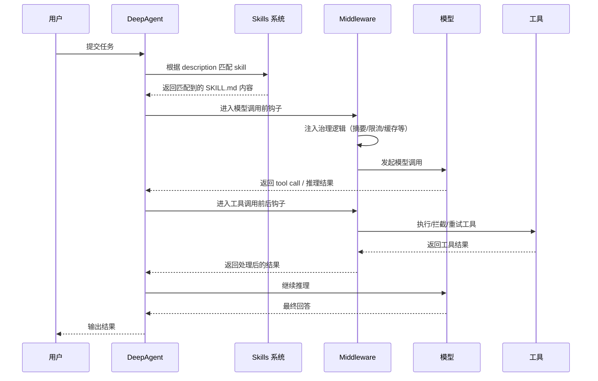

# DeepAgent Skills 与 Middleware 关系图解

## 概述

本文用于解释 **DeepAgent Skills** 与 **LangChain Middleware** 在 Agent 系统中的分工关系。

核心结论是：

- **Skills** 解决“按需加载什么知识、什么工作流说明”
- **Middleware** 解决“运行时如何治理模型、工具、上下文和执行过程”

二者不是替代关系，而是互补关系。

---

## 核心概念

### 1. Skills 是任务层的知识注入机制

Skill 更像一份“专家操作手册”，主要负责：

- 什么时候使用该 skill
- 该按什么步骤思考和执行
- 应该输出什么格式
- 某类任务有哪些领域约束

也就是说，Skill 解决的是：

> 遇到这类问题时，Agent 应该怎么想、怎么做、怎么输出。

### 2. Middleware 是运行层的治理机制

Middleware 更像 Agent 的运行时交通规则，主要负责：

- 模型调用前后的控制
- 工具调用前后的控制
- 上下文裁剪与压缩
- 成本、重试、审批、安全与限流

也就是说，Middleware 解决的是：

> Agent 在运行时应该如何安全、稳定、可控地执行。

---

## 分层关系图

---

## 对比表

| 维度 | Skills | Middleware |
|------|--------|------------|
| 解决的问题 | 加载什么知识 / 工作流 | 如何控制执行过程 |
| 本质 | 按需注入的任务说明包 | 运行时钩子 / 治理机制 |
| 作用阶段 | 任务理解、任务规划 | 模型调用前后、工具调用前后 |
| 关注点 | 领域知识、输出规范、操作手册 | 成本、稳定性、安全、上下文管理 |
| 是否影响工具执行 | 间接影响 | 直接影响 |
| 是否影响模型请求 | 会，通过注入说明 | 会，通过拦截和修改请求 |

---

## 运行时时序图

---

## 两者如何配合

### 场景 1：Research 子代理

如果给 `researcher` 子代理配置：

- `skills=["./skills/research"]`
- `toolRetryMiddleware(...)`
- `summarizationMiddleware(...)`

含义是：

- **Skill** 负责告诉它“怎么做研究、怎么写报告”
- **Middleware** 负责告诉它“搜索失败怎么重试、上下文过长怎么压缩”

### 场景 2：Coder 子代理

如果给 `coder` 子代理配置：

- `skills=["./skills/code"]`
- `humanInTheLoopMiddleware(...)`
- `toolCallLimitMiddleware(...)`

含义是：

- **Skill** 负责注入代码审查、编码规范、输出格式等专业工作流
- **Middleware** 负责控制高风险工具审批、Shell 调用次数等运行策略

---

## 一个常用公式

> Skills = 任务层知识注入  
> Middleware = 运行层行为治理

进一步看，一个完整的 DeepAgent 可以理解为：

> DeepAgent = Agent 壳 + Skills + Middleware + Tools + Subagents

---

## 什么时候优先用 Skill

以下问题优先考虑 Skill：

- 某类任务的固定分析套路
- 某个专业领域的操作规范
- 某种结构化输出格式
- 希望按需加载的大段领域知识

例如：
- SQL 分析 skill
- 代码审查 skill
- Markdown 总结 skill
- 调研报告 skill

---

## 什么时候优先用 Middleware

以下问题优先考虑 Middleware：

- 模型或工具失败后的重试
- 成本和调用次数控制
- 敏感信息过滤
- 上下文过长
- 工具执行审批
- 子代理生成与上下文隔离

例如：
- `toolRetryMiddleware`
- `modelFallbackMiddleware`
- `summarizationMiddleware`
- `humanInTheLoopMiddleware`
- `createSubAgentMiddleware`

---

## 执行路径图

```mermaid
flowchart LR
    A[用户任务] -->|task| B[主 DeepAgent]
    B -->|skill match| C[匹配 Skill]
    C -->|instructions| D[注入任务说明]
    D -->|request| E[Middleware 治理模型调用]
    E -->|prompt/tool schema| F[模型推理]
    F -->|tool calls| G[Middleware 治理工具调用]
    G -->|execution| H[工具/子代理执行]
    H -->|results| I[结果回流]
    I -->|final answer| J[最终输出]
```

---

## 关键结论

1. **Skills** 决定 Agent 会哪些专业做法。  
2. **Middleware** 决定 Agent 如何安全、稳定、节制地运行。  
3. **Subagent** 决定 Agent 如何做任务分工和上下文隔离。  
4. **Tools** 决定 Agent 能执行哪些外部动作。  
5. 更合理的理解不是二选一，而是：  
   - Skill 管认知策略  
   - Middleware 管运行策略

---

## 相关资料

- [[LangChain/DeepAgent加载Skill与Subagent示例]]
- [[LangChain/LangChain预置Middleware使用指南]]
- [[LangChain/LangChain学习总结]]
- [[LangChain/LangChain生态三件套使用指南]]
- [[AgentFramework/LangChain+LangGraph高质量多子代理智能体设计文档]]
- [[wiki/concepts/Agent Harness]]
- [[wiki/concepts/Harness Engineering]]
- [[wiki/concepts/Agent 可控性]]
