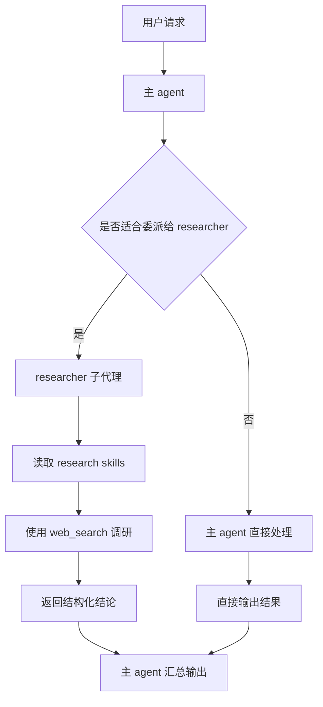

# DeepAgent 加载 Skill 与 Subagent 示例

## 概述

本文整理一个基于 **DeepAgent（Python）** 的最小示例，目标是演示：

1. 如何使用 `create_deep_agent(...)` 创建 agent
2. 如何通过 `skills=[...]` 加载本地 `SKILL.md`
3. 如何定义自定义 `subagent`
4. 为什么自定义 subagent 的 skills 需要单独配置

这个主题非常适合理解 DeepAgent 的两个关键设计：

- **渐进披露（progressive disclosure）**：不是一开始把所有 skill 全量塞进 prompt，而是先根据描述匹配，再按需读取完整 skill
- **上下文隔离（context isolation）**：通过 subagent 把复杂任务的中间推理和工具调用隔离开，避免主 agent 上下文膨胀

---

## 核心概念

### 1. 主 agent 加载 skills

最小用法：

```python
from deepagents import create_deep_agent

agent = create_deep_agent(
    model="openai:gpt-4.1",
    system_prompt="你是一个有帮助的助手",
    skills=["./skills"],
)
```

这里的 `skills` 传入的是**技能根目录**，不是单个 `SKILL.md` 文件。

### 2. Skill 的核心入口是 `description`

每个 skill 目录中都放一个 `SKILL.md`，其 frontmatter 里最关键的是：

```yaml
---
name: markdown-summarizer
description: 当用户要求总结 Markdown 文本、提炼结构化要点、输出标题摘要时使用这个 skill。
---
```

DeepAgent 会先读取这些元信息，再决定是否有必要继续读取 skill 的完整内容。

### 3. 主 agent 的 skill 不会自动传给自定义 subagent

这是一个非常重要的点：

- 主 agent 设置的 `skills=[...]`
- 会影响主 agent 自己
- 也会影响默认的 `general-purpose` subagent
- **但不会自动传给你手动定义的自定义 subagent**

所以如果你定义了 `researcher` 子代理，并希望它也能用专属 skill，必须在这个 subagent 上单独写：

```python
"skills": ["./skills/research"]
```

---

## 最小目录结构

```tree
deepagent-subagent-skill-demo/
├── app.py                                  # 主程序
└── skills/
    ├── main/
    │   └── task-router/
    │       └── SKILL.md                    # 主 agent 的 skill
    └── research/
        └── web-research-report/
            └── SKILL.md                    # researcher 子代理专属 skill
```

---

## Skill 示例

### 主 agent skill：任务路由

```markdown
---
name: task-router
description: 当用户提出复合任务时，先判断是否应该委派给专门子代理处理，而不是自己直接展开所有细节。
---

# task-router

## Instructions

当任务明显属于某个专门子代理的职责范围时：

1. 先识别最合适的子代理
2. 优先委派，而不是自己直接执行全部细节
3. 只在没有合适子代理时自己处理
```

### research 子代理 skill：调研报告输出

```markdown
---
name: web-research-report
description: 当任务要求调研、汇总网页资料、形成结构化研究报告时使用这个 skill。
---

# web-research-report

## Instructions

当你执行调研任务时，请按以下步骤：

1. 先列出要回答的核心问题
2. 再逐条搜集资料
3. 输出时使用如下结构：
   - 结论摘要
   - 关键发现
   - 不确定点
   - 后续建议
```

---

## Python 示例代码

```python
from deepagents import create_deep_agent


def web_search(query: str) -> str:
    """模拟网页搜索工具"""
    return f"搜索结果：与“{query}”相关的网页资料若干。"


def get_weather(city: str) -> str:
    """模拟天气工具"""
    return f"{city} 当前天气：晴天，26°C。"


def main() -> None:
    """创建主 agent，并配置一个带独立 skills 的 research 子代理"""

    researcher_subagent = {
        "name": "researcher",
        "description": "负责调研、网页资料检索、信息归纳和研究报告输出。",
        "system_prompt": "你是一个研究型子代理，擅长查资料、归纳事实、输出结构化结论。",
        "tools": [web_search],
        "skills": ["./skills/research"],
    }

    agent = create_deep_agent(
        model="openai:gpt-4.1",
        tools=[get_weather],
        system_prompt="你是一个有帮助的主代理，负责理解任务、协调子代理并输出最终结果。",
        skills=["./skills/main"],
        subagents=[researcher_subagent],
    )

    result = agent.invoke(
        {
            "messages": [
                {
                    "role": "user",
                    "content": "请帮我调研一下 LangGraph 适合解决哪些类型的多智能体编排问题，并整理成简短报告。",
                }
            ]
        }
    )

    print("===== 调研任务输出 =====")
    print(result["messages"][-1].content)

    result2 = agent.invoke(
        {
            "messages": [
                {
                    "role": "user",
                    "content": "帮我查一下北京天气。",
                }
            ]
        }
    )

    print("\n===== 普通任务输出 =====")
    print(result2["messages"][-1].content)


if __name__ == "__main__":
    main()
```

---

## 执行流程图



---

## 注意事项

### 1. `skills` 传目录，不传单文件

推荐：

```python
skills=["./skills/main"]
```

不推荐直接把某个 `SKILL.md` 文件路径塞进去。

### 2. description 写得越清晰，skill 触发越稳定

Skill 是否会被读取，核心取决于其 frontmatter 的 `description` 是否与当前任务匹配。

### 3. subagent 的主要价值是上下文隔离

不要把 subagent 理解成“只是多一个 agent”。

它真正的工程价值是：
- 隔离中间推理
- 隔离工具调用结果
- 让主 agent 保持更干净的上下文
- 让不同子代理各自携带不同 skills 和工具集

### 4. 适合扩展为多角色多 skill 架构

后续很容易扩展成：

- `researcher` 子代理 + `./skills/research`
- `coder` 子代理 + `./skills/code`
- `reviewer` 子代理 + `./skills/review`

从而形成一个按职责分域的多子代理系统。

---

## 关键结论

1. `create_deep_agent(..., skills=[...])` 用于给主 agent 配置 skills。  
2. Skill 的匹配主要依赖 `SKILL.md` frontmatter 中的 `description`。  
3. 自定义 subagent **不会自动继承**主 agent 的 skills。  
4. 如果某个 subagent 也要用 skill，必须单独配置 `skills=[...]`。  
5. subagent + skills 的组合，本质上是在做“上下文隔离 + 领域能力按需加载”。

---

## 相关资料

- [[LangChain/LangChain预置Middleware使用指南]]
- [[LangChain/LangChain学习总结]]
- [[LangChain/LangChain生态三件套使用指南]]
- [[AgentFramework/LangChain+LangGraph高质量多子代理智能体设计文档]]
