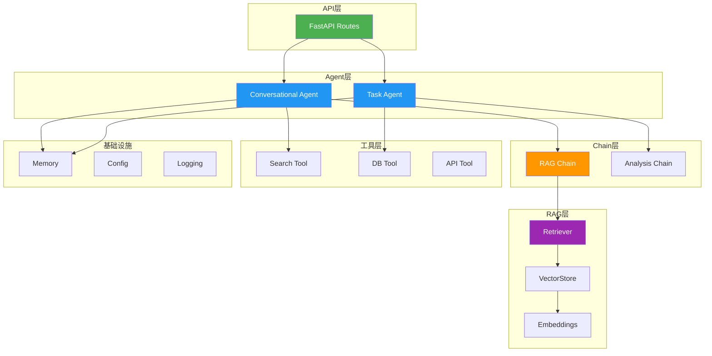
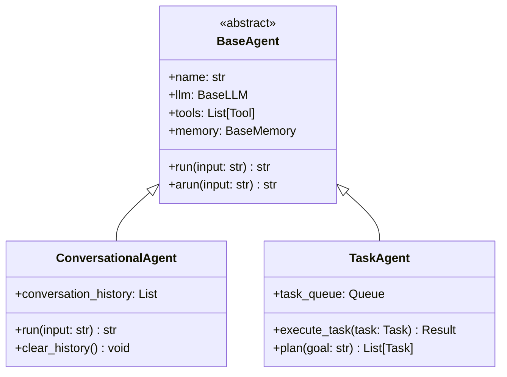
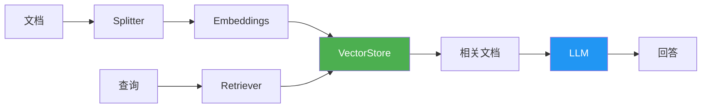

# LangChain Agent 应用项目结构指南

> 📅 整理时间：2026-03-27
> 🎯 适用场景：企业级 Agent 应用开发

---

## 📑 目录

- [一、项目结构总览](#一项目结构总览)
- [二、核心目录详解](#二核心目录详解)
- [三、配置管理](#三配置管理)
- [四、Agent 模块设计](#四agent-模块设计)
- [五、工具模块设计](#五工具模块设计)
- [六、RAG 模块设计](#六rag-模块设计)
- [七、API 层设计](#七api-层设计)
- [八、完整示例](#八完整示例)

---

## 一、项目结构总览

### 1.1 推荐目录结构

```
my-agent-app/
├── 📁 src/                          # 源代码目录
│   ├── 📁 agents/                   # Agent 定义
│   │   ├── __init__.py
│   │   ├── base.py                  # Agent 基类
│   │   ├── conversational.py        # 对话 Agent
│   │   └── task_agent.py            # 任务 Agent
│   │
│   ├── 📁 tools/                    # 自定义工具
│   │   ├── __init__.py
│   │   ├── base.py                  # 工具基类
│   │   ├── search.py                # 搜索工具
│   │   ├── database.py              # 数据库工具
│   │   └── api.py                   # API 调用工具
│   │
│   ├── 📁 chains/                   # Chain 定义（LangChain 链）
│   │   ├── __init__.py
│   │   ├── rag_chain.py             # RAG 链
│   │   ├── analysis_chain.py        # 分析链
│   │   └── summary_chain.py         # 摘要链
│   │
│   ├── 📁 rag/                      # RAG 相关
│   │   ├── __init__.py
│   │   ├── embeddings.py            # 向量化
│   │   ├── retrievers.py            # 检索器
│   │   ├── splitters.py             # 文档分割
│   │   └── vectorstore.py           # 向量存储
│   │
│   ├── 📁 memory/                   # 记忆管理
│   │   ├── __init__.py
│   │   ├── conversation.py          # 对话记忆
│   │   └── long_term.py             # 长期记忆
│   │
│   ├── 📁 prompts/                  # Prompt 模板
│   │   ├── __init__.py
│   │   ├── system_prompts.py        # 系统 Prompt
│   │   └── templates/               # 模板文件
│   │       ├── agent_prompt.yaml
│   │       └── rag_prompt.yaml
│   │
│   ├── 📁 models/                   # 模型配置
│   │   ├── __init__.py
│   │   ├── llm.py                   # LLM 配置
│   │   └── embeddings.py            # Embedding 模型
│   │
│   ├── 📁 api/                      # API 层
│   │   ├── __init__.py
│   │   ├── routes/                  # 路由
│   │   │   ├── chat.py
│   │   │   └── agents.py
│   │   └── schemas/                 # 数据模型
│   │       ├── request.py
│   │       └── response.py
│   │
│   ├── 📁 core/                     # 核心配置
│   │   ├── __init__.py
│   │   ├── config.py                # 配置管理
│   │   ├── logging.py               # 日志配置
│   │   └── exceptions.py            # 异常定义
│   │
│   └── 📁 utils/                    # 工具函数
│       ├── __init__.py
│       ├── helpers.py
│       └── validators.py
│
├── 📁 tests/                        # 测试目录
│   ├── test_agents/
│   ├── test_tools/
│   └── test_chains/
│
├── 📁 data/                         # 数据目录
│   ├── documents/                   # 文档数据
│   └── vectorstore/                 # 向量存储
│
├── 📁 scripts/                      # 脚本
│   ├── ingest.py                    # 数据导入
│   └── setup_vectorstore.py         # 初始化向量库
│
├── 📁 config/                       # 配置文件
│   ├── settings.yaml                # 主配置
│   ├── prompts.yaml                 # Prompt 配置
│   └── logging.yaml                 # 日志配置
│
├── .env.example                     # 环境变量示例
├── .env                             # 环境变量（不提交）
├── pyproject.toml                   # 项目配置
├── requirements.txt                 # 依赖
├── Dockerfile                       # Docker 配置
├── docker-compose.yaml              # Docker Compose
└── README.md                        # 项目说明
```

### 1.2 架构总览图



---

## 二、核心目录详解

### 2.1 agents/ - Agent 模块



**文件示例**：

```python
# src/agents/base.py
from abc import ABC, abstractmethod
from typing import List, Optional
from langchain_core.language_models import BaseLLM
from langchain_core.tools import Tool
from langchain_core.memory import BaseMemory


class BaseAgent(ABC):
    """Agent 基类"""
    
    def __init__(
        self,
        name: str,
        llm: BaseLLM,
        tools: Optional[List[Tool]] = None,
        memory: Optional[BaseMemory] = None
    ):
        self.name = name
        self.llm = llm
        self.tools = tools or []
        self.memory = memory
    
    @abstractmethod
    def run(self, input: str) -> str:
        """执行 Agent"""
        pass
    
    @abstractmethod
    async def arun(self, input: str) -> str:
        """异步执行 Agent"""
        pass
```

```python
# src/agents/conversational.py
from langchain.agents import create_tool_calling_agent, AgentExecutor
from langchain_core.prompts import ChatPromptTemplate, MessagesPlaceholder
from .base import BaseAgent


class ConversationalAgent(BaseAgent):
    """对话型 Agent"""
    
    def __init__(
        self,
        name: str = "conversational",
        llm=None,
        tools=None,
        memory=None,
        system_prompt: str = None
    ):
        super().__init__(name, llm, tools, memory)
        self.system_prompt = system_prompt or "你是一个有帮助的助手。"
        self._build_agent()
    
    def _build_agent(self):
        """构建 Agent"""
        prompt = ChatPromptTemplate.from_messages([
            ("system", self.system_prompt),
            MessagesPlaceholder(variable_name="chat_history", optional=True),
            ("human", "{input}"),
            MessagesPlaceholder(variable_name="agent_scratchpad"),
        ])
        
        agent = create_tool_calling_agent(self.llm, self.tools, prompt)
        self.executor = AgentExecutor(
            agent=agent,
            tools=self.tools,
            memory=self.memory,
            verbose=True
        )
    
    def run(self, input: str) -> str:
        return self.executor.invoke({"input": input})["output"]
    
    async def arun(self, input: str) -> str:
        result = await self.executor.ainvoke({"input": input})
        return result["output"]
```

### 2.2 tools/ - 工具模块

```python
# src/tools/base.py
from abc import ABC, abstractmethod
from langchain_core.tools import BaseTool
from pydantic import BaseModel, Field


class BaseCustomTool(BaseTool, ABC):
    """自定义工具基类"""
    
    @abstractmethod
    def _run(self, *args, **kwargs) -> str:
        """同步执行"""
        pass
    
    @abstractmethod
    async def _arun(self, *args, **kwargs) -> str:
        """异步执行"""
        pass
```

```python
# src/tools/search.py
from langchain_core.tools import tool
from typing import Optional


@tool
def web_search(query: str, limit: int = 5) -> str:
    """
    搜索互联网获取信息。
    
    Args:
        query: 搜索关键词
        limit: 返回结果数量
    
    Returns:
        搜索结果的字符串表示
    """
    # 实际实现调用搜索 API
    results = f"搜索 '{query}' 找到 {limit} 个结果..."
    return results


@tool
def database_query(sql: str) -> str:
    """
    执行数据库查询。
    
    Args:
        sql: SQL 查询语句（只支持 SELECT）
    
    Returns:
        查询结果
    """
    if not sql.strip().upper().startswith("SELECT"):
        return "错误：只允许执行 SELECT 查询"
    
    # 实际实现连接数据库
    return "查询结果..."
```

### 2.3 chains/ - Chain 模块

```python
# src/chains/rag_chain.py
from langchain_core.runnables import RunnableParallel, RunnablePassthrough
from langchain_core.output_parsers import StrOutputParser
from langchain_core.prompts import ChatPromptTemplate


class RAGChain:
    """RAG 链"""
    
    def __init__(self, llm, retriever, prompt_template: str = None):
        self.llm = llm
        self.retriever = retriever
        
        self.prompt = ChatPromptTemplate.from_template(
            prompt_template or """
根据以下上下文回答问题。如果上下文中没有相关信息，请说"我不知道"。

上下文：
{context}

问题：{question}

回答：
"""
        )
        
        self.chain = (
            {
                "context": retriever | self._format_docs,
                "question": RunnablePassthrough()
            }
            | self.prompt
            | self.llm
            | StrOutputParser()
        )
    
    @staticmethod
    def _format_docs(docs):
        return "\n\n---\n\n".join(doc.page_content for doc in docs)
    
    def invoke(self, question: str) -> str:
        return self.chain.invoke(question)
    
    async def ainvoke(self, question: str) -> str:
        return await self.chain.ainvoke(question)
    
    def stream(self, question: str):
        return self.chain.stream(question)
```

---

## 三、配置管理

### 3.1 配置文件结构

```yaml
# config/settings.yaml
app:
  name: "My Agent App"
  version: "1.0.0"
  debug: false

llm:
  provider: "openai"  # openai, azure, anthropic, deepseek
  model: "gpt-4o"
  temperature: 0.7
  max_tokens: 4096
  
  # 多 Provider 配置
  providers:
    openai:
      api_key_env: "OPENAI_API_KEY"
      base_url: "https://api.openai.com/v1"
    azure:
      api_key_env: "AZURE_OPENAI_API_KEY"
      base_url: "https://xxx.openai.azure.com"
    deepseek:
      api_key_env: "DEEPSEEK_API_KEY"
      base_url: "https://api.deepseek.com"

embedding:
  provider: "openai"
  model: "text-embedding-3-small"

vectorstore:
  type: "chroma"  # chroma, faiss, pinecone, milvus
  persist_directory: "./data/vectorstore"
  collection_name: "documents"

agent:
  default_agent: "conversational"
  max_iterations: 10
  timeout: 60

memory:
  type: "conversation_buffer_window"
  window_size: 10

rag:
  chunk_size: 1000
  chunk_overlap: 200
  retrieval_top_k: 4

logging:
  level: "INFO"
  format: "%(asctime)s - %(name)s - %(levelname)s - %(message)s"
```

### 3.2 配置加载

```python
# src/core/config.py
from pydantic_settings import BaseSettings
from pydantic import Field
from typing import Optional
import yaml
from pathlib import Path


class LLMConfig(BaseSettings):
    provider: str = "openai"
    model: str = "gpt-4o"
    temperature: float = 0.7
    max_tokens: int = 4096
    api_key: Optional[str] = None


class AppConfig(BaseSettings):
    """应用配置"""
    
    # 应用信息
    app_name: str = "Agent App"
    debug: bool = False
    
    # LLM 配置
    llm: LLMConfig = Field(default_factory=LLMConfig)
    
    # 向量存储
    vectorstore_type: str = "chroma"
    vectorstore_path: str = "./data/vectorstore"
    
    # Agent 配置
    max_iterations: int = 10
    timeout: int = 60
    
    class Config:
        env_prefix = "APP_"
        env_nested_delimiter = "__"


def load_config(config_path: str = "config/settings.yaml") -> AppConfig:
    """从 YAML 加载配置"""
    path = Path(config_path)
    if path.exists():
        with open(path, "r") as f:
            config_data = yaml.safe_load(f)
        return AppConfig(**config_data.get("app", {}))
    return AppConfig()


# 使用示例
config = load_config()
```

---

## 四、Agent 模块设计

### 4.1 Agent 工厂模式

```python
# src/agents/factory.py
from typing import Dict, Type
from .base import BaseAgent
from .conversational import ConversationalAgent
from .task_agent import TaskAgent
from ..core.config import AppConfig


class AgentFactory:
    """Agent 工厂"""
    
    _registry: Dict[str, Type[BaseAgent]] = {
        "conversational": ConversationalAgent,
        "task": TaskAgent,
    }
    
    @classmethod
    def register(cls, name: str, agent_class: Type[BaseAgent]):
        """注册 Agent 类型"""
        cls._registry[name] = agent_class
    
    @classmethod
    def create(cls, name: str, **kwargs) -> BaseAgent:
        """创建 Agent 实例"""
        if name not in cls._registry:
            raise ValueError(f"Unknown agent type: {name}")
        
        return cls._registry[name](**kwargs)
    
    @classmethod
    def list_agents(cls) -> list[str]:
        """列出所有 Agent 类型"""
        return list(cls._registry.keys())
```

### 4.2 Agent 管理器

```python
# src/agents/manager.py
from typing import Dict, Optional
from .base import BaseAgent
from .factory import AgentFactory


class AgentManager:
    """Agent 管理器 - 支持多会话"""
    
    def __init__(self):
        self._agents: Dict[str, BaseAgent] = {}
    
    def get_or_create(
        self,
        session_id: str,
        agent_type: str = "conversational",
        **kwargs
    ) -> BaseAgent:
        """获取或创建 Agent"""
        if session_id not in self._agents:
            agent = AgentFactory.create(agent_type, **kwargs)
            self._agents[session_id] = agent
        return self._agents[session_id]
    
    def get(self, session_id: str) -> Optional[BaseAgent]:
        """获取 Agent"""
        return self._agents.get(session_id)
    
    def remove(self, session_id: str) -> bool:
        """移除 Agent"""
        if session_id in self._agents:
            del self._agents[session_id]
            return True
        return False
    
    def clear_all(self):
        """清除所有 Agent"""
        self._agents.clear()
```

---

## 五、工具模块设计

### 5.1 工具注册表

```python
# src/tools/registry.py
from typing import Dict, List
from langchain_core.tools import BaseTool


class ToolRegistry:
    """工具注册表"""
    
    _tools: Dict[str, BaseTool] = {}
    
    @classmethod
    def register(cls, tool: BaseTool):
        """注册工具"""
        cls._tools[tool.name] = tool
    
    @classmethod
    def get(cls, name: str) -> BaseTool:
        """获取工具"""
        return cls._tools.get(name)
    
    @classmethod
    def get_all(cls) -> List[BaseTool]:
        """获取所有工具"""
        return list(cls._tools.values())
    
    @classmethod
    def get_by_category(cls, category: str) -> List[BaseTool]:
        """按类别获取工具"""
        return [
            tool for tool in cls._tools.values()
            if hasattr(tool, 'category') and tool.category == category
        ]


# 自动注册工具
from .search import web_search, database_query

ToolRegistry.register(web_search)
ToolRegistry.register(database_query)
```

### 5.2 动态工具加载

```python
# src/tools/loader.py
from typing import List
from langchain_core.tools import BaseTool
from .registry import ToolRegistry


def load_tools(tool_names: List[str] = None) -> List[BaseTool]:
    """加载指定工具，或加载全部"""
    if tool_names:
        return [
            ToolRegistry.get(name) 
            for name in tool_names 
            if ToolRegistry.get(name)
        ]
    return ToolRegistry.get_all()


def load_tools_for_agent(agent_type: str) -> List[BaseTool]:
    """根据 Agent 类型加载工具"""
    tool_mapping = {
        "conversational": ["web_search", "database_query"],
        "task": ["database_query"],
        "analysis": ["web_search"],
    }
    
    tool_names = tool_mapping.get(agent_type, [])
    return load_tools(tool_names)
```

---

## 六、RAG 模块设计

### 6.1 RAG 架构



### 6.2 向量存储管理

```python
# src/rag/vectorstore.py
from langchain_community.vectorstores import Chroma
from langchain_core.embeddings import Embeddings
from langchain_core.documents import Document
from typing import List, Optional


class VectorStoreManager:
    """向量存储管理器"""
    
    def __init__(
        self,
        embeddings: Embeddings,
        persist_directory: str = "./data/vectorstore",
        collection_name: str = "documents"
    ):
        self.embeddings = embeddings
        self.persist_directory = persist_directory
        self.collection_name = collection_name
        self._vectorstore: Optional[Chroma] = None
    
    @property
    def vectorstore(self) -> Chroma:
        """懒加载向量存储"""
        if self._vectorstore is None:
            self._vectorstore = Chroma(
                embedding_function=self.embeddings,
                persist_directory=self.persist_directory,
                collection_name=self.collection_name
            )
        return self._vectorstore
    
    def add_documents(self, documents: List[Document]):
        """添加文档"""
        self.vectorstore.add_documents(documents)
    
    def as_retriever(self, search_type: str = "similarity", k: int = 4):
        """作为检索器"""
        return self.vectorstore.as_retriever(
            search_type=search_type,
            search_kwargs={"k": k}
        )
    
    def similarity_search(self, query: str, k: int = 4) -> List[Document]:
        """相似度搜索"""
        return self.vectorstore.similarity_search(query, k=k)
```

### 6.3 文档处理管道

```python
# src/rag/pipeline.py
from langchain_core.documents import Document
from langchain_text_splitters import RecursiveCharacterTextSplitter
from typing import List


class DocumentPipeline:
    """文档处理管道"""
    
    def __init__(
        self,
        chunk_size: int = 1000,
        chunk_overlap: int = 200
    ):
        self.splitter = RecursiveCharacterTextSplitter(
            chunk_size=chunk_size,
            chunk_overlap=chunk_overlap,
            separators=["\n\n", "\n", "。", "！", "？", " ", ""]
        )
    
    def process(self, documents: List[Document]) -> List[Document]:
        """处理文档：分割、清洗、添加元数据"""
        # 分割
        chunks = self.splitter.split_documents(documents)
        
        # 添加元数据
        for i, chunk in enumerate(chunks):
            chunk.metadata["chunk_index"] = i
        
        return chunks
    
    def process_file(self, file_path: str) -> List[Document]:
        """处理单个文件"""
        from langchain_community.document_loaders import (
            PyPDFLoader,
            TextLoader,
            UnstructuredMarkdownLoader
        )
        
        path = Path(file_path)
        suffix = path.suffix.lower()
        
        loaders = {
            ".pdf": PyPDFLoader,
            ".txt": TextLoader,
            ".md": UnstructuredMarkdownLoader,
        }
        
        loader_class = loaders.get(suffix, TextLoader)
        loader = loader_class(file_path)
        documents = loader.load()
        
        return self.process(documents)
```

---

## 七、API 层设计

### 7.1 FastAPI 路由

```python
# src/api/routes/chat.py
from fastapi import APIRouter, HTTPException
from pydantic import BaseModel
from typing import Optional, List
from ...agents.manager import AgentManager
from ...tools.loader import load_tools_for_agent


router = APIRouter(prefix="/chat", tags=["chat"])

# 请求/响应模型
class ChatRequest(BaseModel):
    message: str
    session_id: Optional[str] = "default"
    agent_type: Optional[str] = "conversational"


class ChatResponse(BaseModel):
    response: str
    session_id: str


class ChatHistoryResponse(BaseModel):
    session_id: str
    messages: List[dict]


@router.post("/", response_model=ChatResponse)
async def chat(request: ChatRequest):
    """对话接口"""
    manager = AgentManager()
    
    # 获取或创建 Agent
    agent = manager.get_or_create(
        session_id=request.session_id,
        agent_type=request.agent_type,
        tools=load_tools_for_agent(request.agent_type)
    )
    
    try:
        response = await agent.arun(request.message)
        return ChatResponse(
            response=response,
            session_id=request.session_id
        )
    except Exception as e:
        raise HTTPException(status_code=500, detail=str(e))


@router.get("/history/{session_id}", response_model=ChatHistoryResponse)
async def get_history(session_id: str):
    """获取对话历史"""
    manager = AgentManager()
    agent = manager.get(session_id)
    
    if not agent:
        raise HTTPException(status_code=404, detail="Session not found")
    
    return ChatHistoryResponse(
        session_id=session_id,
        messages=agent.get_history()
    )


@router.delete("/{session_id}")
async def clear_session(session_id: str):
    """清除会话"""
    manager = AgentManager()
    success = manager.remove(session_id)
    
    if not success:
        raise HTTPException(status_code=404, detail="Session not found")
    
    return {"message": "Session cleared"}
```

### 7.2 流式响应

```python
# src/api/routes/stream.py
from fastapi import APIRouter
from fastapi.responses import StreamingResponse
from pydantic import BaseModel
from typing import Optional
from ...chains.rag_chain import RAGChain


router = APIRouter(prefix="/stream", tags=["stream"])


class StreamRequest(BaseModel):
    question: str


@router.post("/rag")
async def stream_rag(request: StreamRequest):
    """流式 RAG 响应"""
    rag_chain = RAGChain(...)  # 初始化
    
    async def generate():
        async for chunk in rag_chain.chain.astream(request.question):
            yield f"data: {chunk}\n\n"
        yield "data: [DONE]\n\n"
    
    return StreamingResponse(
        generate(),
        media_type="text/event-stream"
    )
```

### 7.3 主应用

```python
# src/api/main.py
from fastapi import FastAPI
from fastapi.middleware.cors import CORSMiddleware
from .routes import chat, stream, agents
from ..core.config import load_config
from ..core.logging import setup_logging


def create_app() -> FastAPI:
    """创建 FastAPI 应用"""
    config = load_config()
    setup_logging(config)
    
    app = FastAPI(
        title=config.app_name,
        debug=config.debug
    )
    
    # CORS
    app.add_middleware(
        CORSMiddleware,
        allow_origins=["*"],
        allow_credentials=True,
        allow_methods=["*"],
        allow_headers=["*"],
    )
    
    # 注册路由
    app.include_router(chat.router)
    app.include_router(stream.router)
    app.include_router(agents.router)
    
    @app.get("/health")
    async def health_check():
        return {"status": "healthy"}
    
    return app


app = create_app()
```

---

## 八、完整示例

### 8.1 项目入口

```python
# main.py
import uvicorn
from src.api.main import app


if __name__ == "__main__":
    uvicorn.run(
        "main:app",
        host="0.0.0.0",
        port=8000,
        reload=True
    )
```

### 8.2 启动脚本

```python
# scripts/ingest.py
"""数据导入脚本"""
import argparse
from pathlib import Path
from src.rag.pipeline import DocumentPipeline
from src.rag.vectorstore import VectorStoreManager
from src.models.embeddings import get_embeddings


def main():
    parser = argparse.ArgumentParser(description="导入文档到向量库")
    parser.add_argument("path", help="文档路径（文件或目录）")
    parser.add_argument("--recursive", "-r", action="store_true", help="递归处理目录")
    args = parser.parse_args()
    
    # 初始化
    embeddings = get_embeddings()
    vectorstore = VectorStoreManager(embeddings)
    pipeline = DocumentPipeline()
    
    path = Path(args.path)
    
    if path.is_file():
        documents = pipeline.process_file(str(path))
        vectorstore.add_documents(documents)
        print(f"已导入 {len(documents)} 个文档块")
    
    elif path.is_dir() and args.recursive:
        all_docs = []
        for file in path.rglob("*"):
            if file.suffix in [".pdf", ".txt", ".md"]:
                docs = pipeline.process_file(str(file))
                all_docs.extend(docs)
        
        vectorstore.add_documents(all_docs)
        print(f"已导入 {len(all_docs)} 个文档块")


if __name__ == "__main__":
    main()
```

### 8.3 Dockerfile

```dockerfile
FROM python:3.11-slim

WORKDIR /app

# 安装依赖
COPY requirements.txt .
RUN pip install --no-cache-dir -r requirements.txt

# 复制代码
COPY . .

# 暴露端口
EXPOSE 8000

# 启动命令
CMD ["python", "main.py"]
```

### 8.4 docker-compose.yaml

```yaml
version: '3.8'

services:
  api:
    build: .
    ports:
      - "8000:8000"
    environment:
      - OPENAI_API_KEY=${OPENAI_API_KEY}
      - APP_DEBUG=true
    volumes:
      - ./data:/app/data
    depends_on:
      - chroma
  
  chroma:
    image: chromadb/chroma:latest
    ports:
      - "8001:8000"
    volumes:
      - chroma_data:/chroma/data

volumes:
  chroma_data:
```

---

## 📋 快速启动清单

```bash
# 1. 创建项目
mkdir my-agent-app && cd my-agent-app

# 2. 初始化结构
mkdir -p src/{agents,tools,chains,rag,memory,prompts,models,api/routes,api/schemas,core,utils}
mkdir -p tests data config scripts

# 3. 创建文件
touch src/{agents,tools,chains,rag,memory,prompts,models,api,core,utils}/__init__.py

# 4. 安装依赖
pip install langchain langchain-openai langchain-community chromadb fastapi uvicorn pydantic-settings

# 5. 配置环境
cp .env.example .env
# 编辑 .env 填入 API Key

# 6. 启动服务
python main.py
```

---

## 📚 参考资源

| 资源 | 链接 |
|:-----|:-----|
| LangChain 文档 | https://python.langchain.com/docs/ |
| LangGraph 文档 | https://langchain-ai.github.io/langgraph/ |
| FastAPI 文档 | https://fastapi.tiangolo.com/ |

---

## 📝 更新日志

| 日期 | 更新内容 |
|:-----|:---------|
| 2026-03-27 | 初始版本 |