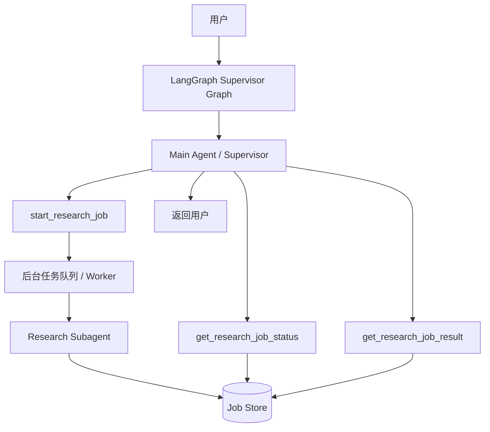
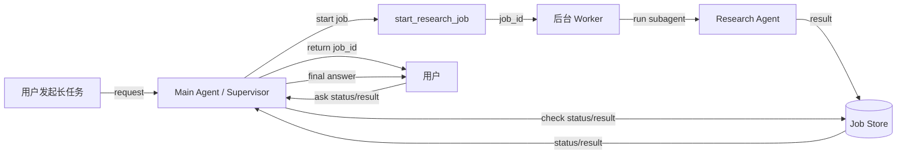

# LangChain create_agent 主从 Agent 异步化指南

## 概述

本文回答一个非常常见的问题：

> 在 LangChain 的 `create_agent` 主从 Agent（Subagents）模式下，如何把“从 Agent 调用”改成异步？

这里要先区分两种不同的“异步”：

1. **Python 协程异步**：把 `invoke()` 改成 `ainvoke()`，让代码层使用 `async/await`
2. **业务流程异步**：主 Agent 不等待从 Agent 当前轮完成，而是启动后台任务，立即返回 `job_id`，后续再查询状态和结果

官方 Subagents 文档里讲的“async”重点是第 2 种，而不是单纯的 Python 协程语法。

---

## 核心概念

### 1. 同步主从 Agent

最基础的写法是：

- 主 Agent 把从 Agent 包装成一个工具
- 工具内部直接调用 `subagent.invoke(...)`
- 主 Agent 当前轮会一直等待从 Agent 完成

这种方式简单，但对子任务耗时长的场景不友好。

### 2. `ainvoke()` 不是文档里说的“后台异步”

如果你只是把：

```python
result = subagent.invoke(...)
```

改成：

```python
result = await subagent.ainvoke(...)
```

那么得到的是 **Python 层面的异步 I/O**，而不是业务层面的后台异步。当前这轮主 Agent 依然会等待从 Agent 的结果返回。

### 3. 真正的异步 Subagent：Three-tool pattern

官方推荐的方式是把从 Agent 调用拆成 3 个工具：

1. `start job`：启动后台任务，立即返回 `job_id`
2. `check status`：查询任务当前状态
3. `get result`：在任务完成后取回结果

这种模式的核心价值是：

- 用户不用等待长任务完成
- 主 Agent 可以继续与用户交互
- 后台 worker 可以独立执行耗时从 Agent 任务

---

## 三种模式对比

| 模式 | 写法 | 是否阻塞当前轮 | 适用场景 |
|------|------|----------------|----------|
| 同步 Subagent | `subagent.invoke(...)` | 是 | 子任务短、主 Agent 立即依赖结果 |
| 协程异步 | `await subagent.ainvoke(...)` | 是 | 只想用 async/await 风格 |
| 后台异步 | `start/status/result` 三工具 | 否 | 子任务长、需要后台执行 |

---

## 最小同步示例

```python
from langchain.agents import create_agent
from langchain.tools import tool


def web_search(query: str) -> str:
    """模拟搜索工具"""
    return f"这是关于“{query}”的搜索结果"


research_agent = create_agent(
    model="openai:gpt-4.1",
    tools=[web_search],
    system_prompt="你是研究子代理，只负责检索和整理资料。"
)


@tool("research", description="研究某个主题并返回结论")
def call_research_agent(query: str) -> str:
    """同步调用从 Agent"""
    result = research_agent.invoke(
        {
            "messages": [
                {"role": "user", "content": query}
            ]
        }
    )
    return result["messages"][-1].content
```

---

## 最小协程异步示例

```python
from langchain.agents import create_agent
from langchain.tools import tool


def web_search(query: str) -> str:
    """模拟搜索工具"""
    return f"这是关于“{query}”的搜索结果"


research_agent = create_agent(
    model="openai:gpt-4.1",
    tools=[web_search],
    system_prompt="你是研究子代理，只负责检索和整理资料。"
)


@tool("research", description="研究某个主题并返回结论")
async def call_research_agent(query: str) -> str:
    """使用 Python async/await 调用从 Agent"""
    result = await research_agent.ainvoke(
        {
            "messages": [
                {"role": "user", "content": query}
            ]
        }
    )
    return result["messages"][-1].content
```

注意：这里仍然会阻塞当前主对话轮，只是代码形式改成了异步。

---

## LangGraph Supervisor + Async Worker 方案

如果你要的是“真正的后台异步”，推荐结构是：

- **LangGraph**：负责 Supervisor、多轮状态和线程持久化
- **Main Agent / Supervisor**：决定何时启动后台任务、何时查询任务状态和结果
- **Research Subagent**：真正做耗时任务
- **后台 Worker**：独立执行从 Agent 任务并把结果落到 Job Store

### 架构图



### 关键思想

不要让主 Agent 直接等待：

```python
result = await subagent.ainvoke(...)
```

而是改成：

- `start_research_job()` 启动后台任务
- 后台执行 `run_research_job(job_id, query)`
- 主 Agent 当前轮只返回 `job_id`
- 后续由 `get_research_job_status()` / `get_research_job_result()` 查询

---

## 后台异步最小示例

```python
import asyncio
import uuid
from typing import Any
from langchain.agents import create_agent
from langchain.tools import tool


def web_search(query: str) -> str:
    """模拟网页搜索工具"""
    return f"关于“{query}”的搜索结果：若干网页内容摘要。"


research_agent = create_agent(
    model="openai:gpt-4.1",
    tools=[web_search],
    system_prompt="你是研究型从代理，只负责检索资料、提炼事实、输出结构化总结。"
)


jobs: dict[str, dict[str, Any]] = {}


async def run_research_job(job_id: str, query: str) -> None:
    """后台执行研究任务"""
    try:
        jobs[job_id] = {
            "status": "running",
            "result": None,
            "error": None,
        }

        result = await research_agent.ainvoke(
            {
                "messages": [
                    {"role": "user", "content": query}
                ]
            }
        )

        jobs[job_id] = {
            "status": "completed",
            "result": result["messages"][-1].content,
            "error": None,
        }
    except Exception as e:
        jobs[job_id] = {
            "status": "failed",
            "result": None,
            "error": str(e),
        }


@tool("start_research_job", description="启动后台研究任务，立即返回 job_id")
async def start_research_job(query: str) -> str:
    """启动后台子任务"""
    job_id = str(uuid.uuid4())
    jobs[job_id] = {"status": "pending", "result": None, "error": None}

    # 关键：不等待，直接后台执行
    asyncio.create_task(run_research_job(job_id, query))

    return f"后台研究任务已启动，job_id={job_id}"


@tool("get_research_job_status", description="查询研究任务状态")
def get_research_job_status(job_id: str) -> str:
    """查询任务状态"""
    job = jobs.get(job_id)
    if not job:
        return f"未找到任务：{job_id}"
    return f"任务 {job_id} 当前状态：{job['status']}"


@tool("get_research_job_result", description="获取研究任务最终结果")
def get_research_job_result(job_id: str) -> str:
    """获取任务结果"""
    job = jobs.get(job_id)
    if not job:
        return f"未找到任务：{job_id}"
    if job["status"] in ("pending", "running"):
        return f"任务 {job_id} 尚未完成，请稍后再查询。"
    if job["status"] == "failed":
        return f"任务失败：{job['error']}"
    return job["result"] or "任务已完成，但没有结果。"
```

---

## LangGraph 中如何使用主 Agent

可以把主 Agent 作为 LangGraph 的一个节点：

```python
from typing import TypedDict
from langgraph.graph import StateGraph, START, END
from langgraph.checkpoint.memory import InMemorySaver


class GraphState(TypedDict):
    """LangGraph 最小状态定义"""
    messages: list


main_agent = create_agent(
    model="openai:gpt-4.1",
    tools=[
        start_research_job,
        get_research_job_status,
        get_research_job_result,
    ],
    system_prompt=(
        "你是主代理（supervisor）。"
        "如果用户请求耗时较长的研究任务，就调用 start_research_job；"
        "如果用户询问进度，就调用 get_research_job_status；"
        "如果用户要求查看结果，就调用 get_research_job_result。"
    ),
)


def supervisor_node(state: GraphState) -> dict:
    """LangGraph 节点：调用主 Agent"""
    result = main_agent.invoke({"messages": state["messages"]})
    return {"messages": result["messages"]}


builder = StateGraph(GraphState)
builder.add_node("supervisor", supervisor_node)
builder.add_edge(START, "supervisor")
builder.add_edge("supervisor", END)

graph = builder.compile(checkpointer=InMemorySaver())
```

这个模式的意义在于：

- `create_agent` 提供主从 Agent 的推理与工具选择能力
- LangGraph 提供线程持久化、状态保存、后续扩展中断/恢复能力

---

## 注意事项

### 1. `ainvoke()` 不等于后台异步

这是最容易混淆的点：

- `await subagent.ainvoke(...)` 只是 Python 协程异步
- 官方文档说的异步 subagent，重点是“不阻塞当前轮”

### 2. 演示版的 `asyncio.create_task` 不适合生产

上面的示例只是帮助理解模式。生产环境建议换成：

- Celery
- Dramatiq
- RQ
- Arq
- Temporal

### 3. `jobs` 不要只存在内存里

建议把任务状态存到：

- Redis
- PostgreSQL
- MongoDB

否则进程重启后任务状态会丢失。

### 4. 如果任务链更复杂，LangGraph 比纯 `create_agent` 更适合

当你需要：

- 明确状态机
- 重试策略
- 人工审批
- 多节点路由
- Durable execution

就应该把 Supervisor 层上移到 LangGraph，而不是只靠 `create_agent`。

---

## 流程图



---

## 关键结论

1. `create_agent` 的主从 Agent 默认是同步等待从 Agent 结果。  
2. 把 `invoke()` 改成 `ainvoke()`，只是把代码写成协程异步，并不会让当前轮变成后台执行。  
3. 真正的异步化，需要把从 Agent 改成“后台 job 模式”。  
4. 官方推荐的方式是 `start job / check status / get result` 三工具模式。  
5. 如果你要管理主 Agent 多轮线程状态，建议用 **LangGraph supervisor + async worker** 的组合。

---

## 相关资料

- 官方 Python Subagents 文档：<https://docs.langchain.com/oss/python/langchain/multi-agent/subagents>
- 官方 LangGraph Durable Execution 文档：<https://docs.langchain.com/oss/python/langgraph/durable-execution>
- 官方 LangGraph Persistence 文档：<https://docs.langchain.com/oss/python/langgraph/persistence>
- [[AgentFramework/构建支持Skill的多智能体系统.md]]
- [[LangChain/LangChain学习总结.md]]
- [[LangChain/LangGraph-Agent-Server-从零实现-Threads持久化.md]]
