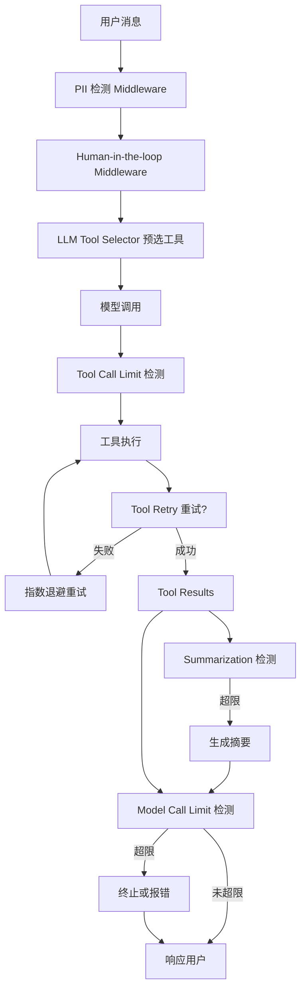

# LangChain 内置中间件（Built-in Middleware）

> 来源：[LangChain Prebuilt Middleware](https://docs.langchain.com/oss/python/langchain/middleware/built-in)
> API 参考：[reference.langchain.com](https://reference.langchain.com/python/langchain/agents/middleware/model_call_limit/ModelCallLimitMiddleware)

## 概述

LangChain Agent 中间件是可组合的生产级组件，通过 `create_agent(middleware=[...])` 注入到 Agent 执行链中。所有中间件均** Provider-agnostic**（兼容任意 LLM Provider）。

---

## 中间件总览（16 种）

| 中间件 | 用途 |
|--------|------|
| Summarization | 对接近 token 上限的对话历史自动摘要 |
| Human-in-the-loop | 暂停执行，等待人工审批工具调用 |
| Model call limit | 限制模型调用次数，防无限循环或超支 |
| Tool call limit | 限制工具调用次数 |
| Model fallback | 主模型失败时自动切换备用模型 |
| PII detection | 检测和处理个人身份信息（PII） |
| To-do list | 为 Agent 装备任务规划与跟踪能力 |
| LLM tool selector | 用 LLM 预选相关工具再调用主模型 |
| Tool retry | 工具调用失败时自动重试（指数退避） |
| Model retry | 模型调用失败时自动重试（指数退避） |
| LLM tool emulator | 用 LLM 模拟工具执行，用于测试 |
| Context editing | 管理对话上下文，裁剪或清除工具调用 |
| Shell tool | 向 Agent 暴露持久化 Shell 会话 |
| File search | 提供 Glob/Grep 文件系统搜索工具 |
| Filesystem | 为 Agent 提供文件系统存储长期记忆 |
| Subagent | 支持生成子 Agent |

---

## 1. Model Call Limit（模型调用限制）

> **API**: `ModelCallLimitMiddleware`
> **视频指南**: [YouTube](https://www.youtube.com/watch?v=nJEER0uaNkE)

### 核心概念

限制 Agent 对主模型的调用次数，适用于：
- 防止 Agent 陷入无限循环
- 生产环境成本控制
- 测试时验证调用预算

### 两种计数维度

| 维度 | 含义 | 是否需要 Checkpointer |
|------|------|----------------------|
| **Thread limit** | 整个对话线程中的累计调用次数 | ✅ 需要（InMemorySaver 等） |
| **Run limit** | 单次用户消息→响应过程中的调用次数 | ❌ 不需要 |

### 退出行为

| 行为 | 效果 |
|------|------|
| `'end'`（默认） | 优雅终止，向 Agent 注入一条提示消息 |
| `'error'` | 抛出 `ModelCallLimitExceededError` 异常 |

### 基本用法

```python
from langchain.agents import create_agent
from langchain.agents.middleware import ModelCallLimitMiddleware
from langgraph.checkpoint.memory import InMemorySaver

agent = create_agent(
    model="gpt-5.4",
    checkpointer=InMemorySaver(),  # 线程限制必需
    tools=[],
    middleware=[
        ModelCallLimitMiddleware(
            thread_limit=10,   # 整个线程最多 10 次模型调用
            run_limit=5,       # 单次调用最多 5 次
            exit_behavior="end",
        ),
    ],
)
```

---

## 2. Tool Call Limit（工具调用限制）

> **API**: `ToolCallLimitMiddleware`
> **视频指南**: [YouTube](https://www.youtube.com/watch?v=6gYlaJJ8t0w)

### 与 Model Call Limit 的区别

- **粒度**：Tool Call Limit 可针对**单个特定工具**设置限制，Model Call Limit 作用于全局
- **exit_behavior 默认值**：`'continue'`（超出限制的工具被阻塞，其他继续）

### exit_behavior 三种模式

| 行为 | 效果 | 限制 |
|------|------|------|
| `'continue'`（默认） | 超出的工具被错误消息阻塞，Agent 继续运行 | 模型决定何时结束 |
| `'error'` | 抛出 `ToolCallLimitExceededError`，立即停止 | — |
| `'end'` | 立即停止，附带 ToolMessage + AI message | **仅限单工具限制**，并行多工具有 pending calls 时抛 `NotImplementedError` |

### 全局限制 + 工具特定限制

```python
from langchain.agents import create_agent
from langchain.agents.middleware import ToolCallLimitMiddleware

agent = create_agent(
    model="gpt-5.4",
    tools=[search_tool, database_tool, scraper_tool],
    middleware=[
        # 全局限制
        ToolCallLimitMiddleware(thread_limit=20, run_limit=10),
        # 搜索工具更严格的限制
        ToolCallLimitMiddleware(
            tool_name="search",
            thread_limit=5,
            run_limit=3,
        ),
        # 数据库查询限制
        ToolCallLimitMiddleware(
            tool_name="query_database",
            thread_limit=10,
        ),
        # 严格模式：超出直接抛异常
        ToolCallLimitMiddleware(
            tool_name="scrape_webpage",
            run_limit=2,
            exit_behavior="error",
        ),
    ],
)
```

---

## 3. Summarization（对话摘要）

> **API**: `SummarizationMiddleware`

当对话历史接近 token 上限时，自动用另一个模型（通常是更小更便宜的）生成摘要，压缩旧消息同时保留最近上下文。

### 触发条件（trigger）

支持多条件 OR 逻辑，任一满足即触发：

| 条件类型 | 说明 |
|----------|------|
| `fraction` (float) | 模型上下文窗口的比例（0~1） |
| `tokens` (int) | 绝对 token 数量 |
| `messages` (int) | 消息条数 |

### 保留策略（keep）

摘要后保留多少上下文（**三选一**）：

| 条件类型 | 说明 |
|----------|------|
| `fraction` (float) | 保留上下文窗口的比例 |
| `tokens` (int) | 保留绝对 token 数 |
| `messages` (int) | 保留最近 N 条消息 |

### 用法示例

```python
from langchain.agents import create_agent
from langchain.agents.middleware import SummarizationMiddleware

# 单条件触发
agent = create_agent(
    model="gpt-5.4",
    tools=[weather_tool, calculator_tool],
    middleware=[
        SummarizationMiddleware(
            model="gpt-5.4-mini",          # 用便宜模型做摘要
            trigger=("tokens", 4000),       # token 数 >= 4000 时触发
            keep=("messages", 20),          # 保留最近 20 条消息
        ),
    ],
)

# 多条件 OR 逻辑
agent2 = create_agent(
    model="gpt-5.4",
    tools=[weather_tool, calculator_tool],
    middleware=[
        SummarizationMiddleware(
            model="gpt-5.4-mini",
            trigger=[
                ("tokens", 3000),   # token >= 3000
                ("messages", 6),     # 或消息数 >= 6
            ],
            keep=("messages", 20),
        ),
    ],
)

# 按比例触发
agent3 = create_agent(
    model="gpt-5.4",
    tools=[weather_tool, calculator_tool],
    middleware=[
        SummarizationMiddleware(
            model="gpt-5.4-mini",
            trigger=("fraction", 0.8),   # 上下文使用到 80% 时触发
            keep=("fraction", 0.3),       # 摘要后保留 30% 上下文
        ),
    ],
)
```

---

## 4. Human-in-the-loop（人工介入）

> **API**: `HumanInTheLoopMiddleware`
> **视频指南**: [YouTube](https://www.youtube.com/watch?v=SpfT6-YAVPk)

### 警告

**必须配合 Checkpointer 使用**，否则无法在中断点恢复状态。

### 用法

```python
from langchain.agents import create_agent
from langchain.agents.middleware import HumanInTheLoopMiddleware
from langgraph.checkpoint.memory import InMemorySaver

agent = create_agent(
    model="gpt-5.4",
    tools=[read_email_tool, send_email_tool],
    checkpointer=InMemorySaver(),
    middleware=[
        HumanInTheLoopMiddleware(
            interrupt_on={
                "send_email_tool": {
                    "allowed_decisions": ["approve", "edit", "reject"],
                },
                "read_email_tool": False,  # 不中断读邮件工具
            }
        ),
    ],
)
```

---

## 5. Model Fallback（模型降级）

> **API**: `ModelFallbackMiddleware`
> **视频指南**: [YouTube](https://www.youtube.com/watch?v=8rCRO0DUeIM)

主模型调用失败时，自动按顺序尝试备用模型列表：

```python
from langchain.agents import create_agent
from langchain.agents.middleware import ModelFallbackMiddleware

agent = create_agent(
    model="gpt-5.4",
    tools=[],
    middleware=[
        ModelFallbackMiddleware(
            "gpt-5.4-mini",                    # 第一备用
            "claude-3-5-sonnet-20241022",       # 第二备用
        ),
    ],
)
```

---

## 6. PII Detection（PII 检测与处理）

> **API**: `PIIMiddleware`

### 内置 PII 类型

| 类型 | 检测内容 |
|------|----------|
| `email` | 邮箱地址 |
| `credit_card` | 信用卡号（Luhn 算法校验） |
| `ip` | IP 地址 |
| `mac_address` | MAC 地址 |
| `url` | URL（http/https 及裸 URL） |

### 四种处理策略

| 策略 | 效果 | 适用场景 |
|------|------|----------|
| `block` | 检测到直接抛异常 | 完全禁止 PII |
| `redact` | 替换为 `[REDACTED_EMAIL]` 等 | 一般合规、日志脱敏 |
| `mask` | 部分遮罩 `****-****-****-1234` | 保留可读性，如客服 UI |
| `hash` | 替换为确定性哈希 `<email_hash:a1b2c3d4>` | 可用于分析/调试，保留同一性 |

### 作用范围

| 参数 | 默认值 | 说明 |
|------|--------|------|
| `apply_to_input` | `True` | 检查用户输入 |
| `apply_to_output` | `False` | 检查 AI 输出 |
| `apply_to_tool_results` | `False` | 检查工具执行结果 |

### 基本用法

```python
from langchain.agents import create_agent
from langchain.agents.middleware import PIIMiddleware

agent = create_agent(
    model="gpt-5.4",
    tools=[],
    middleware=[
        PIIMiddleware("email", strategy="redact", apply_to_input=True),
        PIIMiddleware("credit_card", strategy="mask", apply_to_input=True),
    ],
)
```

### 自定义 PII 检测器

```python
import re
from langchain.agents import create_agent
from langchain.agents.middleware import PIIMiddleware

# 方式 1：正则字符串
agent1 = create_agent(
    model="gpt-5.4",
    tools=[],
    middleware=[
        PIIMiddleware(
            "api_key",
            detector=r"sk-[a-zA-Z0-9]{32}",
            strategy="block",
        ),
    ],
)

# 方式 2：编译后的正则（支持 flags）
agent2 = create_agent(
    model="gpt-5.4",
    tools=[],
    middleware=[
        PIIMiddleware(
            "phone_number",
            detector=re.compile(r"\+?\d{1,3}[\s.-]?\d{3,4}[\s.-]?\d{4}"),
            strategy="mask",
        ),
    ],
)

# 方式 3：自定义检测函数（含校验逻辑）
def detect_ssn(content: str) -> list[dict[str, str | int]]:
    """检测 SSN，带格式校验"""
    matches = []
    pattern = r"\d{3}-\d{2}-\d{4}"
    for match in re.finditer(pattern, content):
        ssn = match.group(0)
        first_three = int(ssn[:3])
        # 排除无效 SSN：000, 666, 900-999
        if first_three not in [0, 666] and not (900 <= first_three <= 999):
            matches.append({
                "text": ssn,
                "start": match.start(),
                "end": match.end(),
            })
    return matches

agent3 = create_agent(
    model="gpt-5.4",
    tools=[],
    middleware=[
        PIIMiddleware(
            "ssn",
            detector=detect_ssn,
            strategy="hash",
        ),
    ],
)
```

---

## 7. To-do List（任务清单）

> **API**: `TodoListMiddleware`

自动为 Agent 装备 `write_todos` 工具和系统提示，适用于多步骤复杂任务的规划和进度跟踪：

```python
from langchain.agents import create_agent
from langchain.agents.middleware import TodoListMiddleware

agent = create_agent(
    model="gpt-5.4",
    tools=[read_file, write_file, run_tests],
    middleware=[TodoListMiddleware()],
)
```

---

## 8. LLM Tool Selector（LLM 工具预选）

在调用主模型之前，先用 LLM 预选最相关的工具，减少不必要的工具调用开销。

---

## 9. Tool Retry / Model Retry（重试机制）

自动重试失败的调用，支持**指数退避**（Exponential Backoff）：

```python
from langchain.agents.middleware import ToolRetryMiddleware, ModelRetryMiddleware
```

---

## 10. LLM Tool Emulator（工具模拟器）

用 LLM 模拟工具执行结果，用于离线测试，无需真实调用外部 API。

---

## 11. Context Editing（上下文编辑）

管理对话上下文，可选择性裁剪或清除工具调用记录，保持上下文精简。

---

## 12. Shell Tool（Shell 会话）

向 Agent 暴露一个持久化的 Shell 会话，Agent 可执行系统命令：

```python
from langchain.agents.middleware import ShellToolMiddleware
```

---

## 13. File Search（文件搜索）

提供 Glob 和 Grep 工具，让 Agent 可以在文件系统中按路径或内容搜索文件。

---

## 14. Filesystem（文件系统）

为 Agent 提供一个虚拟文件系统，用于存储上下文和长期记忆，适合多轮会话场景。

---

## 15. Subagent（子 Agent）

支持在主 Agent 内部生成子 Agent，实现并行任务执行或任务分解。

---

## 中间件叠加使用

多种中间件可以同时使用，按**数组顺序**依次生效：

```python
agent = create_agent(
    model="gpt-5.4",
    tools=[search_tool, send_email_tool, read_file],
    checkpointer=InMemorySaver(),
    middleware=[
        PIIMiddleware("email", strategy="redact"),         # 1. PII 检测
        ModelCallLimitMiddleware(thread_limit=20, run_limit=10),  # 2. 模型限流
        ToolCallLimitMiddleware(tool_name="search", run_limit=5), # 3. 搜索限流
        HumanInTheLoopMiddleware(
            interrupt_on={"send_email_tool": {"allowed_decisions": ["approve", "reject"]}}
        ),                                                # 4. 人工审批
        SummarizationMiddleware(model="gpt-5.4-mini", trigger=("tokens", 6000)),  # 5. 超长对话摘要
    ],
)
```

---

## 流程图：Middleware 执行顺序



---

## 参考资料

- 官方文档：https://docs.langchain.com/oss/python/langchain/middleware/built-in
- API 参考：https://reference.langchain.com/python/langchain/agents/middleware/
- GitHub 源码：https://github.com/langchain-ai/langchain
