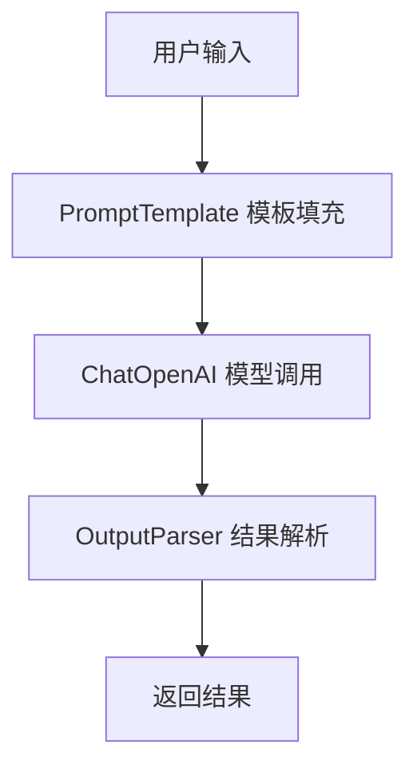
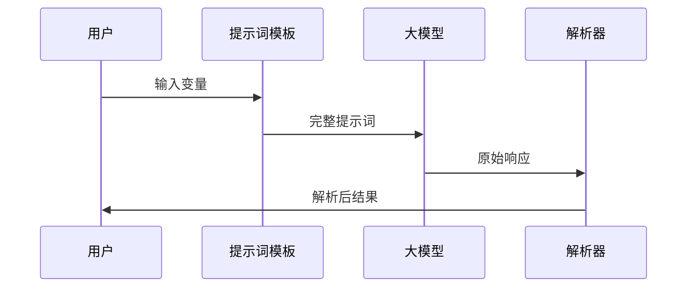
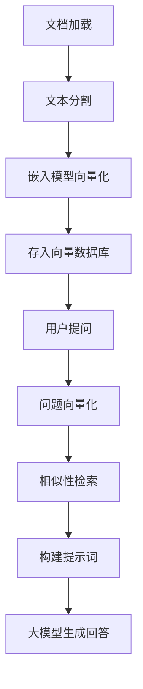
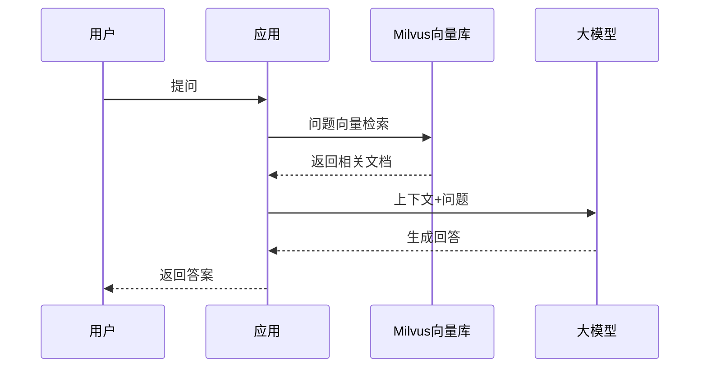
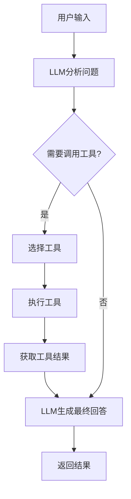
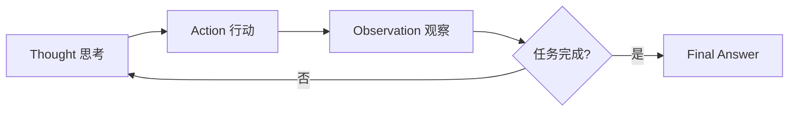
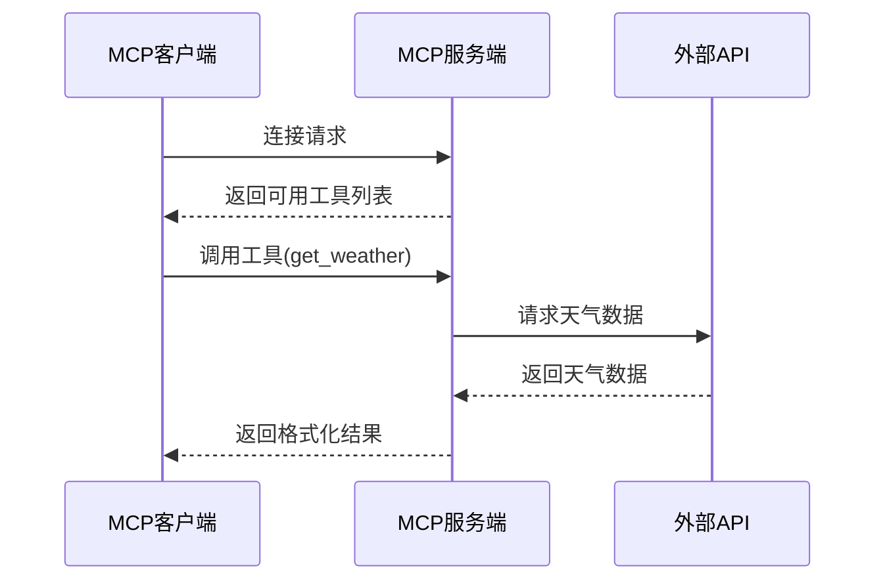

# LangChain + Prompt + RAG 全链路实战指南

> 来源: [CSDN 原文链接](https://blog.csdn.net/weixin_45032671/article/details/157393555)
> 
> 作者: 原创
> 
> 发布时间: 2026-01-26
> 
> 标签: #AI编程

## 概述

本文系统性地介绍 LangChain 的核心概念和实战应用，涵盖：
- PromptTemplate 提示词模板
- 大模型调用与流式输出
- LCEL 表达式
- 输出解析器（字符串、JSON、逗号分隔）
- PyDantic 数据校验
- Python 类型注解实战

---

## 一、PromptTemplate HelloWorld

提示词的组成 = 固定模板 + 动态变量

```python
# 核心思想：提示词的组成 = 固定模板 + 动态变量
# 该代码演示了LangChain中PromptTemplate的两种创建方式、变量填充、默认值设置及内部属性查看

# 从langchain的提示词模块中导入PromptTemplate类，用于构建标准化提示词模板
from langchain.prompts import PromptTemplate

# 定义提示词模板字符串，使用大括号{}标记动态变量，后续可通过参数填充
# {domain}：领域变量，{language}：回答语言变量，{question}：用户问题变量
template = """
你是一位专业的{domain}顾问，请用{language}回答：
问题：{question}
回答:
"""

# 通过构造方法（实例化）创建prompt对象，这是最常用的创建方式
prompt = PromptTemplate(
    # 指定要使用的提示词模板字符串
    template=template,
    # 声明模板中所有需要动态传入的输入变量，需与模板中的{变量名}一一对应
    input_variables=["domain","language","question"]
)

# 使用format方法填充模板中的所有占位符，传入对应变量的值，生成最终可直接使用的完整提示词
print(prompt.format(domain="机器学习",language="中文",question="如何使用langchain?"))

# 打印prompt对象的输入变量列表
print(prompt.input_variables)
```

### 默认值设置（partial_variables）

```python
# 演示PromptTemplate中默认值（固定值）的设置方式
template2 = """
分析用户情绪（默认分析类型：{analysis_type}）
用户输入:{user_input}
分析结果
"""

# 实例化第二个PromptTemplate对象，演示partial_variables的使用
prompt2 = PromptTemplate(
    template=template2,
    input_variables=["user_input"],  # 仅声明需要动态传入的变量
    partial_variables={"analysis_type":"sentiment"},  # 设置固定默认值
    template_format = "f-string"  # 指定模板的格式化类型
)

# 仅传入动态变量user_input的值，即可格式化生成完整提示词
print(prompt2.format(user_input="今天天气不错"))

# 打印prompt2对象的各类内部变量
print(prompt2.input_variables)      # 输入变量列表
print(prompt2.partial_variables)    # 预先设置的固定默认值
print(prompt2.template_format)      # 模板格式化类型
print(prompt2.template)             # 原始提示词模板字符串
print(prompt2.output_parser)        # 输出解析器（默认None）
```

---

## 二、最简单调用大模型

基于指定产品名称，调用大模型生成面向年轻人的3条吸引人广告语。

```python
# 从langchain_openai模块导入ChatOpenAI类（用于调用兼容OpenAI接口的大模型）
from langchain_openai import ChatOpenAI
from langchain_core.prompts import PromptTemplate
from pydantic import SecretStr
from langchain_core.output_parsers import StrOutputParser

# 实例化ChatOpenAI对象，配置大模型连接参数
model = ChatOpenAI(
    model="qwen-plus",  # 指定要使用的大模型名称
    base_url="https://dashscope.aliyuncs.com/compatible-mode/v1",  # 大模型服务接口地址
    api_key=SecretStr(""),  # 配置大模型调用密钥
    temperature=0.7  # 设置模型生成温度（0-2）
)

# 创建提示词模板对象
prompt_template = PromptTemplate(
    input_variables=["product"],
    template="为{product}写三个吸引人的广告语，需要面向年青人",
)

# 调用prompt_template的invoke方法，生成完整的提示词对象
prompt = prompt_template.invoke({"product":"HideOnBoss"})

# 调用大模型对象的invoke方法，发起模型调用
response = model.invoke(prompt)

# 实例化StrOutputParser字符串输出解析器
output_parser = StrOutputParser()

# 解析得到纯字符串格式的广告语结果
answer = output_parser.invoke(response)
print(answer)
```

---

## 三、多角色聊天提示词模板

### 方式1：直接通过 ChatPromptTemplate.from_messages

```python
from langchain_core.prompts import ChatPromptTemplate, SystemMessagePromptTemplate, HumanMessagePromptTemplate, PromptTemplate

# 直接通过ChatPromptTemplate.from_messages快速创建聊天提示词模板
chat_template = ChatPromptTemplate.from_messages([
    ("system","你是一个助手AI，名字是{name}"),  # 系统消息
    ("human","你好，最近怎么样?"),              # 人类消息
    ("ai","我很好谢谢"),                         # AI消息
    ("human","{user_input}"),                   # 动态用户输入
])

# 填充模板
message = chat_template.format_messages(name="HideOnBoss",user_input="你最喜欢的编程语言是什么?")
print(message)
```

### 方式2：先构建单条消息模板，再组合

```python
# 创建系统消息模板
system_template = SystemMessagePromptTemplate.from_template(
    "你是一个{role}，请用{language}回答"
)

# 创建人类用户消息模板
user_template = HumanMessagePromptTemplate.from_template(
    "{question}"
)

# 将单个消息模板组合成完整的多轮对话模板
chat_template = ChatPromptTemplate.from_messages([
    system_template,
    user_template,
])

# 调用format_messages方法填充所有动态变量
message = chat_template.format_messages(
    role="助手",
    language="中文",
    question="你最喜欢什么?"
)
print(message)
```

---

## 四、多角色聊天提示词调用大模型

### 基础消息列表调用大模型

```python
from langchain_core.messages import SystemMessage, HumanMessage
from langchain_openai import ChatOpenAI
from pydantic import SecretStr
from langchain_core.prompts import ChatPromptTemplate, SystemMessagePromptTemplate, HumanMessagePromptTemplate

# 构建固定的消息列表
messages = [
    SystemMessage("你是一个翻译小助手，你需要将文本翻译成英文"),
    HumanMessage("你好，如何成为一个高级程序员?"),
]

# 实例化ChatOpenAI对象
model = ChatOpenAI(
    model="qwen-plus",
    base_url="https://dashscope.aliyuncs.com/compatible-mode/v1",
    api_key=SecretStr(""),
    temperature=0.7
)

# 调用大模型
responses = model.invoke(messages)
print(responses.content)
```

### 灵活构建聊天提示词模板

```python
# 构建系统消息模板
system_template = SystemMessagePromptTemplate.from_template(
    """你是一个专业的{domain}专家，回答需满足:{style_guide}"""
)

# 构建人类消息模板
human_template = HumanMessagePromptTemplate.from_template(
    """请解释:{concept}"""
)

# 将系统消息模板和人类消息模板组合
chat_prompt = ChatPromptTemplate.from_messages([system_template, human_template])
```

### 快速构建客服场景聊天模板

```python
# 快速构建合规客服场景的聊天提示词模板
compliance_template = ChatPromptTemplate.from_messages([
    ("system","""您是{company}客服助手，遵守
1.不透露内部系统名称
2.不提供医疗/金融建议
3.遇到{transfer_cond} 转人工
"""),
    ("human","[{user_level}用户]:{query}")
])

# 填充所有动态变量
messages = compliance_template.format(
    company="百度",
    transfer_cond="用户反馈问题无法解决或者支付的问题",
    user_level="普通",
    query="你们内部系统叫什么?"
)

# 调用大模型
responses = model.invoke(messages)
print(responses.content)
```

---

## 五、LLMChain HelloWorld

LLMChain 用于串联「提示词模板」和「大模型」形成基础工作链。

```python
from langchain_core.prompts import PromptTemplate
from langchain_openai import ChatOpenAI
from langchain.chains import LLMChain
from pydantic import SecretStr

# 实例化 PromptTemplate 对象
PromptTemplate = PromptTemplate(
    input_variables=["name"],
    template="""你是一个文案高手，专门为{name}设计文案，列举三个卖点""",
)

# 实例化 ChatOpenAI 对象
model = ChatOpenAI(
    model="qwen-plus",
    base_url="https://dashscope.aliyuncs.com/compatible-mode/v1",
    api_key=SecretStr(""),
    temperature=0.7
)

# 实例化 LLMChain 对象，串联提示词模板与大模型
chain = LLMChain(llm=model, prompt=PromptTemplate)

# 调用链的 invoke 方法
response = chain.invoke({"name": "智能手机"})
print(response["text"])
```

---

## 六、LCEL 表达式

使用 LangChain LCEL 管道符（|）快速串联组件，实现「提示词→模型→解析」一站式流程。

```python
from langchain_core.prompts import PromptTemplate
from langchain_openai import ChatOpenAI
from pydantic import SecretStr
from langchain_core.output_parsers import StrOutputParser

# 使用 PromptTemplate.from_template 快速创建提示词模板
prompt = PromptTemplate.from_template("回答你是一个IT助手，回答下面这个问题{question}")

# 实例化 ChatOpenAI 对象
model = ChatOpenAI(
    model="qwen-plus",
    base_url="https://dashscope.aliyuncs.com/compatible-mode/v1",
    api_key=SecretStr(""),
    temperature=0.7
)

# 实例化 StrOutputParser 字符串解析器
parse = StrOutputParser()

# 使用 LCEL 管道符（|）创建链式流程
# 执行流程：prompt → model → parse
chain = prompt | model | parse

# 调用链的 invoke 方法
result = chain.invoke({"question": "如何学习java"})
print(result)
```

---

## 七、流式输出 HelloWorld

使用 LangChain LCEL 实现大模型流式输出，实时返回内容片段。

```python
from langchain_core.prompts import PromptTemplate, ChatPromptTemplate
from langchain_openai import ChatOpenAI
from pydantic import SecretStr
from langchain_core.output_parsers import StrOutputParser

# 使用 ChatPromptTemplate.from_template 快速创建聊天提示词模板
prompt = ChatPromptTemplate.from_template("用100个字解释下面的知识点或者介绍:{concept}")

# 实例化 ChatOpenAI 对象，配置大模型参数（重点开启流式输出）
model = ChatOpenAI(
    model="qwen-plus",
    base_url="https://dashscope.aliyuncs.com/compatible-mode/v1",
    api_key=SecretStr(""),
    streaming=True,  # 关键参数：开启流式输出
    temperature=0.7
)

# 使用 LCEL 管道符串联组件
chain = prompt | model | StrOutputParser()

# 调用链的 stream 方法，实现链式流式输出
for chunk in chain.stream({"concept":"多线程"}):
    print(chunk, end="", flush=True)  # 实时打印每个字符串片段
```

---

## 八、逗号分隔解析器并流式输出

### 基础演示

```python
from langchain_core.output_parsers import CommaSeparatedListOutputParser
from langchain_core.prompts import ChatPromptTemplate

# 实例化逗号分隔列表解析器
parser = CommaSeparatedListOutputParser()

# 获取解析器对应的格式指令
format_instructions = parser.get_format_instructions()

# 定义聊天提示词模板
prompt = ChatPromptTemplate.from_template("""
分析以下商品评论，按指定格式返回结果：
评论内容：{review}
格式要求:{format_instructions}
""")

# 注入格式指令
final_prompt = prompt.partial(format_instructions=format_instructions)

# 填充所有剩余变量
print(final_prompt.format_prompt(review="这个手机很棒"))
```

### 实战演示：逗号分隔列表解析器 + LCEL 链式流式输出

```python
from langchain_core.prompts import PromptTemplate
from langchain_openai import ChatOpenAI
from pydantic import SecretStr
from langchain_core.output_parsers import CommaSeparatedListOutputParser

# 实例化 ChatOpenAI 大模型对象
model = ChatOpenAI(
    model="qwen-plus",
    base_url="https://dashscope.aliyuncs.com/compatible-mode/v1",
    api_key=SecretStr(""),
    streaming=True,  # 开启流式输出
    temperature=0.7
)

# 实例化逗号分隔列表解析器
out_parser = CommaSeparatedListOutputParser()

# 获取解析器的格式指令
format_instructions = out_parser.get_format_instructions()

# 创建基础提示词模板
prompt = PromptTemplate(
    template="""列举多个常见的{topic}场景。{format_instructions}""",
    input_variables=["topic"],
    partial_variables={"format_instructions": format_instructions}
)

# 使用 LCEL 管道符串联组件
chain = prompt | model | out_parser

# 调用链的 stream 方法，实现流式输出
for token in chain.stream({"topic": "电影"}):
    print(token)
```

---

## 九、字符串解析器

使用 StrOutputParser 将大模型返回结果统一转为纯字符串格式。

```python
from langchain_core.prompts import PromptTemplate
from langchain_openai import ChatOpenAI
from pydantic import SecretStr
from langchain_core.output_parsers import StrOutputParser, CommaSeparatedListOutputParser, JsonOutputParser

# 使用 PromptTemplate.from_template 快速创建提示词模板
prompt = PromptTemplate.from_template("写一首关于{topic}的诗")

# 实例化 ChatOpenAI 大模型对象
model = ChatOpenAI(
    model="qwen-plus",
    base_url="https://dashscope.aliyuncs.com/compatible-mode/v1",
    api_key=SecretStr(""),
    temperature=0.7
)

# 实例化 StrOutputParser 字符串解析器
parse = StrOutputParser()

# 使用 LCEL 管道符串联组件
chain = prompt | model | parse

# 调用链的 invoke 方法
result = chain.invoke({"topic": "如何学习java"})
print(result)
```

---

## 十、JSON 解析器

使用 JsonOutputParser 将大模型返回结果转为标准 JSON 格式。

```python
from langchain_core.prompts import PromptTemplate
from langchain_openai import ChatOpenAI
from pydantic import SecretStr
from langchain_core.output_parsers import StrOutputParser, CommaSeparatedListOutputParser, JsonOutputParser

# 实例化 ChatOpenAI 大模型对象
model = ChatOpenAI(
    model="qwen-plus",
    base_url="https://dashscope.aliyuncs.com/compatible-mode/v1",
    api_key=SecretStr(""),
    temperature=0.7
)

# 实例化 JsonOutputParser JSON 解析器
parse = JsonOutputParser()

# 构建提示词模板（明确要求大模型返回指定结构的 JSON 格式）
prompt = PromptTemplate.from_template("""
回答以下问题，返回json格式: {{ "answer":"答案文本", "confidence": 置信度(0-1) }}
问题:{question}
""")

# 使用 LCEL 管道符串联组件
chain = prompt | model | parse

# 调用链的 invoke 方法
result = chain.invoke({"question": "地球的半径是多少?"})

# 打印解析后的完整字典结果
print(result)

# 按键取值
print(f"答案:{result['answer']},置信度:{result['confidence']}")
```

---

## 十一、PyDantic HelloWorld

Pydantic 核心用法演示：数据校验、类型转换、JSON 序列化/反序列化。

```python
from pydantic import BaseModel, ValidationError, HttpUrl

# 1. 基础模型定义：包含必填字段、可选字段
class UserProfile(BaseModel):
    username: str           # 必填字段
    age: int                # 必填字段
    email: str | None = None  # 可选字段

# 实例化验证
user = UserProfile(username='alice', age=18)
print(user)

# 自动类型转换
user2 = UserProfile(username='alice', age="18")  # 字符串"18"自动转为int
print(user2)

# 2. 实例化异常捕获
try:
    UserProfile(username=123)  # 错误：缺少必填字段age，username类型不对
except ValidationError as e:
    print(e.errors())

# 3. 特殊类型校验 + 默认值
class WebSite(BaseModel):
    url: HttpUrl        # 校验URL格式（必须包含http/https协议头）
    visit: int = 0      # 可选字段，默认值0
    tags: list[str] = []  # 可选字段，默认值空列表

valid_data = {
    "url": "https://www.baidu.com",
    "visit": 100,
    "tags": ["python", "pydantic"]
}

try:
    webSite = WebSite(**valid_data)
    print(webSite)
except ValidationError as e:
    print(e.errors())

# 错误实例化：URL缺少http/https协议头
try:
    webSite = WebSite(url="www.baidu.com")  # 违反HttpUrl格式要求
    print(webSite)
except ValidationError as e:
    print(e.errors())

# 4. JSON序列化与反序列化
class Item(BaseModel):
    name: str
    price: float

data = """{"name":"apple","price":1.23}"""

# 从JSON字符串解析并校验
item = Item.model_validate_json(data)
print(item)

# 模型实例转为Python字典
print(item.model_dump())

# 模型实例转为JSON格式字符串
print(item.model_dump_json())
```

---

## 十二、PyDantic 进阶

```python
from typing import Optional
from pydantic import BaseModel, Field

# 1. 必填字段演示
class User(BaseModel):
    name: str = Field(..., title="Name of the user")  # Field(...)标记必填

user = User(name="Alice")

# 2. 可选字段（带默认值）
class UserOptional(BaseModel):
    name: str = Field("laowang", title="Name of the user")

user_optional = UserOptional()
print(user_optional.name)  # 输出: laowang

# 3. 数值类型范围校验
class Product(BaseModel):
    price: float = Field(..., gt=0)   # gt=0：必须大于0
    stock: int = Field(..., ge=0)     # ge=0：必须大于等于0

product = Product(price=10.5, stock=10)

# 4. 嵌套模型校验
class Address(BaseModel):
    city: str = Field(..., min_length=1)
    country: str

class UserWithAddress(BaseModel):
    name: str = Field(...)
    address: Address = Field(...)  # 嵌套Address模型

user = UserWithAddress(name="Alice", address=Address(city="Shanghai", country="China"))

# 5. 明确可选字段
class UserWithEmail(BaseModel):
    name: str = Field(...)
    email: Optional[str] = Field(None)  # 可选字段，默认值None

user = UserWithEmail(name="Alice")

# 6. 混合使用必填与带约束的可选字段
class Config(BaseModel):
    api_key: str = Field(...)          # 必填
    timeout: int = Field(10, ge=1)     # 可选，默认10，且值≥1

config = Config(api_key="123456")
assert config.timeout == 10
```

---

## 十三、PyDantic 再进阶

自定义字段校验。

```python
from pydantic import BaseModel, Field, field_validator

# 密码复杂程度自定义校验（多条件组合校验）
class User(BaseModel):
    password: str

    @field_validator("password")
    def password_validator(cls, v):
        errors = []
        if len(v) < 8:
            errors.append("至少8个字符")
        if not any(c.isupper() for c in v):
            errors.append("至少1个大写字母")
        if errors:
            raise ValueError(";".join(errors))
        return v

# 正确：密码满足要求
user = User(password="Abc123456")
print(user.password)

# 错误：密码不符合要求
# user2 = User(password="abc123")  # 会抛出异常
```

### 多字段共享同一个校验逻辑

```python
class Product(BaseModel):
    price: float
    stock: int

    @field_validator("price", "stock")
    def price_stock_validator(cls, v):
        if v < 0:
            raise ValueError("必须>=0")
        return v

# 正确
product = Product(price=10.5, stock=10)
```

---

## 十四、Python 类型注解（Type Hints）实战

### 基本数据类型注解

```python
from typing import List, Union, Dict, Tuple, Set, Any, Literal, Optional, NewType, TypeVar, Sequence

# 整型注解
age: int = 18

# 字符串类型注解
name: str = "Jane"

# 浮点型注解
price: float = 10.5

# 布尔类型注解
is_valid: bool = True

# 字节类型注解
data: bytes = b"Hello World"

# 函数的类型注解
def add(a: int, b: int) -> int:
    return a + b
```

### 引用数据类型注解

```python
# 列表注解
scores: List[int] = [80, 90, 100]

# 二维列表注解
matrix: List[List[int]] = [[1, 2, 3], [4, 5, 6]]

# 字典注解
person: Dict[str, str] = {"name": "Jane", "age": "18"}

# 混合类型字典注解
config: Dict[str, Union[str, int]] = {"port": 8080, "host": "localhost"}

# 元组注解
point: Tuple[int, int] = (10, 20)  # 固定长度
flexible: Tuple[int, ...] = (1, 2, 3, 4, 5)  # 可变长度

# 集合注解
unique_ids: Set[str] = {"red", "green", "blue"}
```

### 特殊类型注解

```python
# Any 类型：表示「任意类型」
any_value: Any = "Any"
any_value = 123  # 可随意修改

# Literal 字面量类型：限定只能取指定的几个值
HttpMethod = Literal["GET", "POST", "PUT"]

def send_request(method: HttpMethod) -> None:
    print(f"Sending {method} request...")

send_request("POST")  # 合法

# Union 类型：多种可选类型中的一种
def process_input(input: Union[str, int]) -> None:
    if isinstance(input, str):
        print(f"Processing string: {input}")
    elif isinstance(input, int):
        print(f"Processing integer: {input}")

# Optional 类型：可选类型，等价于 Union[指定类型, None]
def greet(name: Optional[str] = None) -> None:
    if name:
        print(f"Hello, {name}!")
    else:
        print("Hello!")
```

### 类型别名与自定义类型

```python
# 基本类型别名
UserId = int
Point = Tuple[int, int]

# 使用类型别名
def get_user_name(id: UserId) -> str:
    return f"User {id}"

def plot(points: List[Point]) -> None:
    for x, y in points:
        print(f"({x}, {y})")
```

---

## 流程图

### LangChain 核心流程



### LCEL 链式调用



---

## 注意事项

1. **API Key 安全**：使用 `SecretStr` 封装 API 密钥，避免明文暴露
2. **Temperature 设置**：值越高创造性越强，越低越严谨
3. **流式输出**：设置 `streaming=True` 开启流式输出
4. **类型注解**：Python 类型注解仅为提示，不做强制类型检查
5. **Pydantic 校验**：`Field(...)` 表示必填，`Field(default)` 表示可选

---

## 十五、大模型结构化信息提取

使用 PydanticOutputParser 将大模型输出转为结构化数据。

```python
from langchain_core.prompts import PromptTemplate, ChatPromptTemplate
from langchain_openai import ChatOpenAI
from pydantic import SecretStr, BaseModel, Field
from langchain_core.output_parsers import PydanticOutputParser

# 初始化大模型实例
model = ChatOpenAI(
    model="qwen-plus",
    base_url="https://dashscope.aliyuncs.com/compatible-mode/v1",
    api_key=SecretStr(""),
    temperature=0.7
)

# 定义Pydantic数据模型（约束用户信息的结构化输出格式）
class UserInfo(BaseModel):
    name: str = Field(..., title="Name of the user")
    age: int = Field(..., title="Age of the user", ge=18)
    hobby: str = Field(..., title="Hobby of the user")

# 创建Pydantic输出解析器
parse = PydanticOutputParser(pydantic_object=UserInfo)

# 构建聊天提示词模板
prompt = ChatPromptTemplate.from_template(
    "你是一个文本助手，提取用户信息:{input}，必须遵守格式{format_instructions}"
)

# 预先注入格式指令
prompt = prompt.partial(format_instructions=parse.get_format_instructions())

# 构建LCEL链式调用
chain = prompt | model | parse

# 传入用户文本，执行信息提取
response = chain.invoke({"input": "我的名称是老王，今年18岁，喜欢看电影，打篮球和写代码。"})
print(response)
print(response.model_dump())
```

### 情感分析结构化输出

```python
# 定义情感分析结果的数据模型
class SentimentResult(BaseModel):
    sentiment: str      # 情感倾向（正面/负面/中性）
    confidence: float   # 情感判断置信度（0-1）
    keyword: list[str]  # 情感相关关键词

# 创建情感分析专用解析器
parse = PydanticOutputParser(pydantic_object=SentimentResult)

# 构建情感分析提示词模板
prompt = (ChatPromptTemplate.from_template(
    "请对下面这句话进行情感分析：{input}，并给出关键词，必须遵守格式{format_instructions}"
).partial(format_instructions=parse.get_format_instructions()))

# 构建链式调用
chain = prompt | model | parse

# 执行情感分析
response = chain.invoke({"input": "商品很好!"})
print(response)
print(response.model_dump_json())
```

---

## 十六、大模型输出修复机制

OutputFixingParser 可自动修复格式错误并重新解析。

```python
from langchain.output_parsers import OutputFixingParser
from langchain_core.output_parsers import PydanticOutputParser
from langchain_openai import ChatOpenAI
from pydantic import BaseModel, SecretStr

# 初始化大模型
model = ChatOpenAI(
    model="qwen-plus",
    base_url="https://dashscope.aliyuncs.com/compatible-mode/v1",
    api_key=SecretStr(""),
    temperature=0.7
)

# 定义结构化数据模型
class Actor(BaseModel):
    name: str
    film_names: list[str]

# 创建原始结构化解析器
parser = PydanticOutputParser(pydantic_object=Actor)

# 用OutputFixingParser包装原始解析器
fixing_parser = OutputFixingParser.from_llm(parser=parser, llm=model, max_retries=3)

# 模拟大模型错误格式输出
misformatted_output = """ {'name':'','film_names':['A计划','B计划']} """

# 使用OutputFixingParser自动修复并解析
fixed_data = fixing_parser.parse(misformatted_output)
print(fixed_data.model_dump())
```

---

## 十七、RAG 支持的文件加载器

```python
from langchain_community.document_loaders import (
    TextLoader,            # 文本加载
    UnstructuredURLLoader, # 网页加载
    UnstructuredFileLoader,# 文件加载
    PyPDFLoader,           # PDF加载
    Docx2txtLoader,        # docx加载
    CSVLoader,             # csv加载
    UnstructuredHTMLLoader,# html加载
    SeleniumURLLoader,     # 动态加载
    WebBaseLoader,         # 网页加载
    JSONLoader,            # json加载
)
```

### 各类文档加载器实战

```python
# 纯文本文件加载
loader = TextLoader("data/test.txt", encoding="utf-8")
document = loader.load()
print(document[0].page_content[:100])

# CSV文件加载
loader = CSVLoader("data/test.csv", csv_args={"fieldnames":["产品名称","销售数量","客户名称"]}, encoding="utf-8")
document = loader.load()

# JSON文件加载
loader = JSONLoader("data/test.json", jq_schema=".articles[]", content_key="content")
docs = loader.load()
```

---

## 十八、PDF 加载器实战

### 单个PDF文件加载

```python
from langchain.document_loaders import PyPDFLoader

# 初始化PyPDFLoader实例
loader = PyPDFLoader("data/test.pdf")
docs = loader.load()

print(len(docs))                    # 打印文档总页数
print(docs[0].page_content[:200])   # 打印第一页内容
print(docs[0].metadata)             # 打印元数据

# 拼接PDF全文
full_text = "".join([doc.page_content for doc in docs])
print(len(full_text))
```

### 批量处理PDF文件

```python
import os
from langchain.document_loaders import PyPDFLoader

pdf_folder = "docs/"
all_pages = []

for file in os.listdir(pdf_folder):
    if file.endswith(".pdf"):
        pdf_file_path = os.path.join(pdf_folder, file)
        loader = PyPDFLoader(pdf_file_path)
        all_pages.extend(loader.load())
```

### PDF图片提取

```python
# 开启PDF内部图片提取功能
loader = PyPDFLoader("data/test.pdf", extract_images=True)
pages = loader.load()
print(pages[0].page_content)
```

---

## 十九、静态网页加载器实战

```python
import os
from langchain.document_loaders import WebBaseLoader

# 设置User-Agent（避免网页访问被拦截）
os.environ['USER_AGENT'] = 'Mozilla/5.0 (Windows NT 10.0; Win64; x64) Chrome/138.0.0.0'

# 单个网页加载
urls = ["https://www.cnblogs.com"]
loader = WebBaseLoader(urls)
docs = loader.load()
print(docs[0].page_content[:100])

# 批量读取多个静态网页
urls = ["https://www.news.baidu.com", "https://tieba.baidu.com/index.html"]
loader = WebBaseLoader(urls)
docs = loader.load()

for doc in docs:
    print(doc.page_content[:100])
    print(doc.metadata['source'])
```

---

## 二十、Word 加载器实战

```python
import os
from langchain.document_loaders import Docx2txtLoader

# 单个Word文档加载
loader = Docx2txtLoader("./word.docx")
docs = loader.load()
print(docs[0].page_content[:100])

# 批量加载文件夹中的Word文档
folder_path = "data/test.word"
all_pages = []

for file_name in os.listdir(folder_path):
    if file_name.endswith(".docx"):
        file_path = os.path.join(folder_path, file_name)
        loader = Docx2txtLoader(file_path)
        all_pages.append(loader.load())
```

---

## 二十一、文本切割实战

### 普通文本切割

```python
from langchain.text_splitter import CharacterTextSplitter

text = """
    时间地点：冬日早晨、上学路上
    事件经过：发现小狗→送医→收养
    情感升华：从帮助他人到自我成长
"""

split = CharacterTextSplitter(
    separator=" ",        # 分隔符
    chunk_size=1000,      # 每个片段最大字符数
    chunk_overlap=10,     # 相邻片段重叠字符数
    length_function=len   # 长度计算函数
)

chunk = split.split_text(text)
for i in chunk:
    print(i)
```

### 递归字符文本分割器

```python
from langchain.text_splitter import RecursiveCharacterTextSplitter

splitter = RecursiveCharacterTextSplitter(
    chunk_size=20,        # 每个片段最大字符数
    chunk_overlap=4,      # 相邻片段重叠字符数
    separators=["\n\n", "\n", " ", ""],  # 分隔符优先级
    length_function=len,
    keep_separator=True
)

chunk = splitter.split_text(text)
for i in chunk:
    print(len(i))
    print(i)
```

### 最佳实践

```python
# chunk_size 建议500-1000个字符
# chunk_overlap 建议为chunk_size的10%-20%

from langchain.text_splitter import RecursiveCharacterTextSplitter, Language

# Python语言专属分割器
python_splitter = RecursiveCharacterTextSplitter.from_language(
    language=Language.PYTHON,
    chunk_size=200,
    chunk_overlap=50
)
```

---

## 二十二、NumPy 计算余弦相似度实战

```python
import numpy as np

def cosine_similarity(v1, v2):
    """计算两个向量的余弦相似度"""
    dot = np.dot(v1, v2)
    norm = np.linalg.norm(v1) * np.linalg.norm(v2)
    return dot / norm

# 测试向量
vec_a = np.array([0.2, 0.5, 0.8])
vec_b = np.array([0.1, 0.6, 0.9])

print(cosine_similarity(vec_a, vec_b))
```

### 商品推荐实战

```python
# 用户嵌入向量
vec_a = [0.2, 0.5, 0.8]

# 商品嵌入库
vec_b = [
    [0.1, 0.6, 0.9],
    [0.3, 0.7, 0.5],
]

recommendations = []
for item, vec in enumerate(vec_b):
    similarity = cosine_similarity(vec_a, vec)
    recommendations.append((item, round(similarity, 3)))

# 按相似度降序排序
recommendations.sort(key=lambda x: x[1], reverse=True)
print(recommendations)
```

---

## 二十三、Milvus 向量数据库实战

### 创建 Collection（表）

```python
from pymilvus import FieldSchema, CollectionSchema, DataType, Collection

# 定义字段结构
field1 = [
    FieldSchema(name="id", dtype=DataType.INT64, is_primary=True),     # 主键
    FieldSchema(name="vector", dtype=DataType.FLOAT_VECTOR, dim=768),  # 向量字段
    FieldSchema(name="category", dtype=DataType.VARCHAR, max_length=50) # 标量字段
]

# 创建Schema
schema = CollectionSchema(field1, description="商品向量库")

# 创建Collection
collection = Collection(name="product", schema=schema)
```

### 连接 Milvus 并创建带动态字段的表

```python
from pymilvus import connections, db, MilvusClient, FieldSchema, DataType, CollectionSchema, Collection

# 连接Milvus服务
conn = connections.connect(host="192.168.64.137", port="19530")

# 定义字段
field1 = [
    FieldSchema(name="id", dtype=DataType.INT64, is_primary=True),
    FieldSchema(name="vector", dtype=DataType.FLOAT_VECTOR, dim=768),
    FieldSchema(name="category", dtype=DataType.VARCHAR, max_length=50)
]

# 创建Schema（开启动态字段）
schema = CollectionSchema(field1, description="商品向量库", enable_dynamic_field=True)

# 创建Collection并配置分片
collection = Collection(
    name="product",
    schema=schema,
    using="default",
    num_shards=2
)
```

### 索引创建与检索

```python
from pymilvus import MilvusClient

client = MilvusClient(uri="http://192.168.64.137:19530")

# 创建索引
index_params = MilvusClient.prepare_index_params()
index_params.add_index(
    field_name="vector",
    metric_type="COSINE",      # 距离度量方式
    index_type="IVF_FLAT",     # 索引类型
    index_name="vector_index",
    params={"nlist": 1024}
)

client.create_index(
    collection_name="customized_setup",
    index_params=index_params,
    sync=False
)

# 查看索引详情
res = client.describe_index(collection_name="customized_setup", index_name="vector_index")
print(res)
```

### DML 操作（插入/删除/更新）

```python
# 插入数据
data = [
    {"id": 1, "vector": [0.1, 0.2, 0.3, 0.4, 0.5], "text": "hello world"},
    {"id": 2, "vector": [0.2, 0.3, 0.4, 0.5, 0.6], "text": "hello milvus"},
]

result = client.insert(collection_name="my_collection", data=data)

# 删除数据
client.delete(collection_name="my_collection", ids=[1, 2])

# 更新数据（Milvus无原生UPDATE，需先删后插）
```

---

## 二十四、LangChain + Milvus 向量库实战

```python
from langchain_community.embeddings import DashScopeEmbeddings
from langchain_core.documents import Document
from langchain_milvus import Milvus

# 初始化嵌入模型
embeddings = DashScopeEmbeddings(
    model="text-embedding-v2",
    max_retries=3,
    dashscope_api_key="",
)

# 初始化Milvus向量库
vector_store = Milvus(
    embedding_function=embeddings,
    connection_args={"uri": "http://192.168.64.137:19530"},
    collection_name="langchain_example",
)

# 构造文档
documents = [
    Document(page_content="I had chocolate chip pancakes.", metadata={"source": "tweet"}),
    Document(page_content="The weather forecast for tomorrow is cloudy.", metadata={"source": "news"}),
]

# 插入文档
ids = [str(i+1) for i in range(len(documents))]
result = vector_store.add_documents(documents=documents, ids=ids)

# 相似性检索
query = "What did I eat for breakfast?"
results = vector_store.similarity_search(query, k=2)
for doc in results:
    print(doc.page_content)
```

---

## 二十五、检索器 Retriever 实战

### MultiQueryRetriever（多查询检索器）

```python
import logging
from langchain.retrievers import MultiQueryRetriever
from langchain_community.document_loaders import TextLoader
from langchain_community.embeddings import DashScopeEmbeddings
from langchain_milvus import Milvus
from langchain_openai import ChatOpenAI
from langchain_text_splitters import RecursiveCharacterTextSplitter
from pydantic import SecretStr

# 设置日志
logging.basicConfig()
logging.getLogger("langchain.retrievers.multi_query").setLevel(logging.INFO)

# 加载文档
loader = TextLoader("data/qa.txt", encoding="utf-8")
data = loader.load()

# 文本分割
text_splitter = RecursiveCharacterTextSplitter(chunk_size=100, chunk_overlap=10)
splits = text_splitter.split_documents(data)

# 初始化嵌入模型
embeddings = DashScopeEmbeddings(
    model="text-embedding-v2",
    max_retries=3,
    dashscope_api_key="",
)

# 向量入库
vector_storage = Milvus.from_documents(
    documents=splits,
    embedding=embeddings,
    collection_name="multi_query_test",
    connection_args={"uri": "http://192.168.64.137:19530"}
)

# 初始化大模型
model = ChatOpenAI(
    model="qwen-plus",
    base_url="https://dashscope.aliyuncs.com/compatible-mode/v1",
    api_key=SecretStr(""),
    temperature=0.7
)

# 初始化多查询检索器
retriever_from_llm = MultiQueryRetriever.from_llm(
    retriever=vector_storage.as_retriever(),
    llm=model
)

# 执行检索
question = "老王不知道为什么抽筋了？"
results = retriever_from_llm.invoke(question)
print(f"检索到的文档数量：{len(results)}")
```

---

## 二十六、AI 文档助手综合实战

完整的 RAG（检索增强生成）系统。

```python
from langchain_community.document_loaders import WebBaseLoader
from langchain_community.embeddings import DashScopeEmbeddings
from langchain_core.prompts import PromptTemplate
from langchain_core.runnables import RunnablePassthrough
from langchain_milvus import Milvus
from langchain_openai import ChatOpenAI
from langchain_text_splitters import CharacterTextSplitter
from pydantic import SecretStr

# 加载在线文档
loader = WebBaseLoader(
    ["https://milvus.io/docs/zh/overview.md"],
    requests_kwargs={"headers": {"Accept-Language": "zh-CN"}}
)
data = loader.load()

# 文本分割
text_splitter = CharacterTextSplitter(chunk_size=1024, chunk_overlap=20)
all_split = text_splitter.split_documents(data)

# 初始化嵌入模型
embeddings = DashScopeEmbeddings(
    model="text-embedding-v2",
    max_retries=3,
    dashscope_api_key="",
)

# 向量入库
vector_storage = Milvus(
    embedding_function=embeddings,
    collection_name="doc_qa_db",
    connection_args={"uri": "http://192.168.64.137:19530"},
    drop_old=True
).from_documents(
    documents=all_split,
    embedding=embeddings,
    collection_name="doc_qa_db",
    connection_args={"uri": "http://192.168.64.137:19530"}
)

# 初始化大模型
model = ChatOpenAI(
    model="qwen-plus",
    base_url="https://dashscope.aliyuncs.com/compatible-mode/v1",
    api_key=SecretStr(""),
    temperature=0.7
)

# 创建RAG提示词模板
template = """[INST]<<SYS>>
你是一个有用的AI助手，请根据以下上下文回答问题：
{context}
<</SYS>>
问题：{question} [/INST]"""
rag_prompt = PromptTemplate.from_template(template)

# 构建RAG链
rag_chain = (
    {"context": vector_storage.as_retriever(), "question": RunnablePassthrough()}
    | rag_prompt
    | model
)

# 执行问答
query = "docker怎么安装milvus？"
response = rag_chain.invoke(query)
print(response.content)
```

---

## 流程图（补充）

### RAG 完整流程



### Milvus 向量检索流程



---

## 二十七、Agent Tool 自定义工具实战

### 方式1：使用 @tool 装饰器

```python
from langchain_core.tools import tool
from pydantic import Field, BaseModel

# 定义工具参数校验模型
class CalculatorInput(BaseModel):
    a: int = Field(..., description="第一个参数（整数），用于乘法运算")
    b: int = Field(..., description="第二个参数（整数），用于乘法运算")

# 使用@tool装饰器定义自定义工具
@tool("multiply-tool",
      args_schema=CalculatorInput,
      return_direct=False,
      description="该工具用于执行两个整数的乘法运算")
def multiply(a: int, b: int) -> int:
    """实现两个整数的乘法运算"""
    return a * b

# 查看工具元信息
print("工具名称:", multiply.name)
print("工具描述:", multiply.description)
print("工具参数:", multiply.args)

# 调用工具
print("工具调用结果:", multiply.invoke({"a": 2, "b": 3}))
```

### 方式2：继承 BaseTool 类

```python
from typing import Type
from langchain_core.tools import BaseTool
from pydantic import BaseModel, Field

# 定义参数校验模型
class CalculatorInput(BaseModel):
    a: int = Field(description="第一个乘法参数（整数）")
    b: int = Field(description="第二个乘法参数（整数）")

# 自定义工具类
class CustomCalculatorTool(BaseTool):
    name: str = "custom_multiply_tool"
    description: str = "当你需要计算两个整数的乘法问题时使用该工具"
    args_schema: Type[BaseModel] = CalculatorInput
    return_direct: bool = True

    def _run(self, a: int, b: int) -> int:
        return a * b

# 实例化并使用
multiply = CustomCalculatorTool()
print(multiply.invoke({"a": 2, "b": 3}))
```

---

## 二十八、大模型绑定工具核心实战

```python
from langchain_core.messages import HumanMessage
from langchain_core.tools import tool
from langchain_openai import ChatOpenAI
from pydantic import SecretStr

# 定义工具
@tool
def add(a: int, b: int) -> int:
    """计算两个整数的加法（a + b）"""
    return a + b

@tool
def multiply(a: int, b: int) -> int:
    """计算两个整数的乘法（a * b）"""
    return a * b

tools = [add, multiply]

# 初始化大模型
model = ChatOpenAI(
    model="qwen-plus",
    base_url="https://dashscope.aliyuncs.com/compatible-mode/v1",
    api_key=SecretStr(""),
    temperature=0.7
)

# 将工具绑定到大模型
llm_with_tool = model.bind_tools(tools)

# 构造用户问题
query = "请计算2*3是多少？"
message = [HumanMessage(content=query)]

# 调用模型
ai_message = llm_with_tool.invoke(message)
message.append(ai_message)

# 执行工具调用
for tool_call in ai_message.tool_calls:
    selected_tool = {"add": add, "multiply": multiply}[tool_call['name'].lower()]
    tool_msg = selected_tool.invoke(tool_call)
    print(f"工具执行结果:{tool_msg}")
    message.append(tool_msg)

# 模型基于工具结果生成最终回答
result = llm_with_tool.invoke(message)
print(f"AI最终回复:{result.content}")
```

---

## 二十九、调用工具异常处理实战

```python
from langchain_core.tools import StructuredTool, ToolException

def search(query: str) -> str:
    """执行搜索查询的核心函数（模拟实现）"""
    raise ToolException(f"搜索失败: {query}")

def _handel_tool_error(e: Exception) -> str:
    """工具异常的自定义处理函数"""
    return f"搜索结果失败，请重试。具体错误信息：{str(e)}"

# 构建结构化工具
search_tool = StructuredTool.from_function(
    name="search",
    func=search,
    description="用于执行搜索查询",
    handle_tool_error=_handel_tool_error
)

# 调用工具（异常会被友好处理）
resp = search_tool.invoke({"query": "如何使用langchain"})
print("工具调用结果：", resp)
```

---

## 三十、联网搜索实战

```python
import os
from langchain_community.utilities import SearchApiAPIWrapper
from langchain_core.tools import tool
from langchain_openai import ChatOpenAI
from pydantic import SecretStr

# 配置LangSmith追踪
os.environ["LANGCHAIN_TRACING_V2"] = "true"
os.environ["LANGCHAIN_ENDPOINT"] = "https://api.smith.langchain.com"
os.environ["LANGCHAIN_API_KEY"] = "your_langsmith_key"
os.environ["LANGCHAIN_PROJECT"] = "agent_v1"

# 配置SearchApi
os.environ["SEARCHAPI_API_KEY"] = "your_searchapi_key"
search = SearchApiAPIWrapper()

# 定义联网搜索工具
@tool("web_search", return_direct=True)
def web_search(search_query: str) -> str:
    """联网搜索工具：适用于获取实时信息、最新事件或未知领域知识"""
    try:
        result = search.results(search_query)
        return "\n\n".join([f"来源:{res['title']}\n内容:{res['snippet']}" 
                           for res in result['organic_results']])
    except Exception as e:
        return f"搜索失败：{str(e)}"

# 初始化大模型
model = ChatOpenAI(
    model="qwen-plus",
    base_url="https://dashscope.aliyuncs.com/compatible-mode/v1",
    api_key=SecretStr(""),
    temperature=0.7
)

# 绑定工具并执行查询
tools = [web_search]
llm_with_tool = model.bind_tools(tools)
```

---

## 三十一、大模型接入 LangSmith 实战

```python
import os
from langchain_openai import ChatOpenAI
from pydantic import SecretStr

# LangSmith核心配置
os.environ["LANGCHAIN_TRACING_V2"] = "true"  # 启用追踪
os.environ["LANGCHAIN_ENDPOINT"] = "https://api.smith.langchain.com"
os.environ["LANGCHAIN_API_KEY"] = "your_langsmith_key"
os.environ["LANGCHAIN_PROJECT"] = "agent_v1"

# 初始化大模型
model = ChatOpenAI(
    model="qwen-plus",
    base_url="https://dashscope.aliyuncs.com/compatible-mode/v1",
    api_key=SecretStr(""),
    temperature=0.7
)

# 执行模型调用（会被LangSmith追踪）
resp = model.invoke("什么是智能体?")
print("模型回答：", resp.content)

# 访问 https://smith.langchain.com/ 查看：
# 1. 调用链路：模型的输入/输出、耗时、Token用量
# 2. 监控数据：调用成功率、响应时间分布
# 3. 告警配置：超时、失败率等告警规则
```

---

## 三十二、Agent 智能体实战

```python
import os
from langchain.agents import AgentType, initialize_agent
from langchain_community.utilities import SearchApiAPIWrapper
from langchain_core.tools import tool
from langchain_openai import ChatOpenAI
from pydantic import SecretStr

# 配置环境变量
os.environ["LANGCHAIN_TRACING_V2"] = "true"
os.environ["LANGCHAIN_API_KEY"] = "your_langsmith_key"
os.environ["SEARCHAPI_API_KEY"] = "your_searchapi_key"

search = SearchApiAPIWrapper()

# 定义网页搜索工具
@tool("web_search", return_direct=True)
def web_search(search_query: str) -> str:
    """当需要获取实时信息、最新事件时使用"""
    try:
        result = search.results(search_query)
        return "\n\n".join([f"来源:{res['title']}\n内容:{res['snippet']}" 
                           for res in result['organic_results']])
    except Exception as e:
        return f"搜索失败：{e}"

# 定义数学计算工具
@tool("math_calculator", return_direct=True)
def math_calculator(expression: str) -> str:
    """用于计算数学公式"""
    try:
        result = eval(expression)
        return f"计算结果为：{result}"
    except Exception as e:
        return f"计算失败：{e}"

# 初始化大模型
model = ChatOpenAI(
    model="qwen-plus",
    base_url="https://dashscope.aliyuncs.com/compatible-mode/v1",
    api_key=SecretStr(""),
    temperature=0.7
)

# 初始化智能体
tool_dict = [math_calculator, web_search]
agent_chain = initialize_agent(
    tools=tool_dict,
    llm=model,
    agent_type=AgentType.ZERO_SHOT_REACT_DESCRIPTION,
    verbose=True,
    handle_parsing_errors=True
)

# 执行智能体
response = agent_chain.invoke("寒武纪今天最新的股价是多少?")
print(response)
```

---

## 三十三、个人 AI 助手智能体实战

```python
from langchain.agents import create_tool_calling_agent, AgentExecutor
from langchain_core.prompts import ChatPromptTemplate
from langchain_core.tools import tool, Tool
from langchain_openai import ChatOpenAI
from pydantic import SecretStr
import datetime

# 定义获取日期工具
@tool
def get_current_date() -> str:
    """获取当前日期（格式：年-月-日）"""
    formatted_date = datetime.datetime.now().strftime("%Y-%m-%d")
    return f"当前日期为：{formatted_date}"

# 定义搜索航班工具
@tool
def search_flight(from_city: str, to_city: str, date: str) -> str:
    """搜索指定出发地、目的地和日期的可用航班"""
    return f"搜索结果：从{from_city}到{to_city}的航班在{date}有可用航班,价格：￥1200"

# 定义预定航班工具
@tool
def book_flight(flight_id: str, user: str) -> str:
    """预定指定航班号的机票"""
    return f"用户:{user}预定成功，航班号：{flight_id}"

# 创建工具列表
tools = [get_current_date, search_flight, book_flight]

# 初始化大模型
model = ChatOpenAI(
    model="qwen-plus",
    base_url="https://dashscope.aliyuncs.com/compatible-mode/v1",
    api_key=SecretStr(""),
    temperature=0.7
)

# 创建提示词模板
prompt = ChatPromptTemplate.from_messages([
    ("system", "你是一个专业的个人AI助手，擅长处理出行预订等任务"),
    ("human", "我叫老王，经常出差"),
    ("human", "{input}"),
    ("placeholder", "{agent_scratchpad}"),
])

# 创建智能体
agent = create_tool_calling_agent(llm=model, tools=tools, prompt=prompt)
agent_executor = AgentExecutor(agent=agent, tools=tools, verbose=True)

# 执行智能体
response = agent_executor.invoke({"input": "帮我查一下明天从广州到北京的航班"})
print(response)
```

---

## 三十四、REACT 智能体实战

```python
import os
from langchain_openai import ChatOpenAI
from langchain.tools import tool
from langchain_community.utilities import SearchApiAPIWrapper
from langchain_core.prompts import PromptTemplate
from langchain.agents import create_react_agent, AgentExecutor
from pydantic import SecretStr

# 配置环境变量
os.environ["LANGCHAIN_TRACING_V2"] = "true"
os.environ["LANGCHAIN_API_KEY"] = "your_langsmith_key"
os.environ["SEARCHAPI_API_KEY"] = "your_searchapi_key"

search = SearchApiAPIWrapper()

# 定义天气查询工具
@tool
def get_weather(city: str) -> str:
    """获取指定城市的当前天气信息"""
    weather_data = {
        "北京": "晴, 25℃",
        "上海": "雨, 20℃",
        "广州": "多云, 28℃",
    }
    return weather_data.get(city, "暂不支持该城市的天气查询")

# 定义活动推荐工具
@tool
def recommend_activity(weather: str) -> str:
    """根据天气信息推荐合适的出行活动"""
    if "雨" in weather:
        return "推荐室内活动: 博物馆参观、咖啡厅阅读"
    elif "晴" in weather:
        return "推荐户外活动: 公园骑行、登山徒步"
    else:
        return "推荐一般活动: 城市观光、美食探索"

# 定义网页搜索工具
@tool("web_search", return_direct=True)
def web_search(query: str) -> str:
    """获取实时信息、最新事件"""
    try:
        results = search.results(query, num=3)
        return "\n\n".join([f"来源: {res['title']}\n内容: {res['snippet']}" 
                           for res in results['organic_results'][:3]])
    except Exception as e:
        return f"搜索失败: {str(e)}"

tools = [get_weather, recommend_activity, web_search]

# 初始化大模型
model = ChatOpenAI(
    model="qwen-plus",
    base_url="https://dashscope.aliyuncs.com/compatible-mode/v1",
    api_key=SecretStr(""),
    temperature=0.7
)

# 定义REACT提示词模板
template = """
Answer the following questions as best you can. You have access to the following tools:

{tools}

Use the following format:

Question: the input question you must answer
Thought: you should always think about what to do
Action: the action to take, should be one of [{tool_names}]
Action Input: the input to the action
Observation: the result of the action
... (this Thought/Action/Action Input/Observation can repeat N times)
Thought: I now know the final answer
Final Answer: the final answer to the original input question

Begin!

Question: {input}
Thought: {agent_scratchpad}
"""

prompt = PromptTemplate.from_template(template)

# 创建REACT智能体
agent = create_react_agent(llm=model, tools=tools, prompt=prompt)
agent_executor = AgentExecutor(agent=agent, tools=tools, verbose=True)

# 执行智能体
response = agent_executor.invoke({"input": "北京今天天气怎么样？适合什么活动？"})
print(response)
```

---

## 三十五、对话记忆管理实战

### 多轮对话摘要记忆

```python
from langchain.memory import ConversationSummaryMemory
from langchain_openai import ChatOpenAI
from pydantic import SecretStr

# 初始化大模型
model = ChatOpenAI(
    model="qwen-plus",
    base_url="https://dashscope.aliyuncs.com/compatible-mode/v1",
    api_key=SecretStr(""),
    temperature=0.7
)

# 初始化对话摘要记忆
memory = ConversationSummaryMemory(llm=model)

# 保存对话
memory.save_context({"input": "Hi"}, {"output": "What's up?"})
memory.save_context({"input": "Not much you?"}, {"output": "Not much."})

# 加载对话摘要
summary = memory.load_memory_variables({})
print(summary)
```

### 短期记忆实战

```python
from langchain.memory import ConversationSummaryMemory
from langchain_core.output_parsers import StrOutputParser
from langchain_core.prompts import ChatPromptTemplate
from langchain_core.runnables import RunnablePassthrough
from langchain_openai import ChatOpenAI
from pydantic import SecretStr

# 初始化模型和记忆
model = ChatOpenAI(
    model="qwen-plus",
    base_url="https://dashscope.aliyuncs.com/compatible-mode/v1",
    api_key=SecretStr(""),
    temperature=0.7
)

memory = ConversationSummaryMemory(
    llm=model,
    return_messages=True,
    memory_key="chat_history",
)

# 构建提示词模板
prompt = ChatPromptTemplate.from_messages([
    ("system", "你是一个AI智能助手，当前摘要信息:{chat_history}"),
    ("user", "{input}")
])

# 构建运行链
chain = (
    RunnablePassthrough.assign(
        chat_history=lambda _: memory.load_memory_variables({})["chat_history"]
    )
    | prompt
    | model
    | StrOutputParser()
)

# 多轮对话
user_input = ["我叫老王", "人工智能的定义", "我是谁?"]
for query in user_input:
    resp = chain.invoke({"input": query})
    print(f"User提问:{query}")
    print(f"AI回复:{resp}\n")
    memory.save_context({"input": query}, {"output": resp})
```

---

## 三十六、多会话隔离记忆实战

```python
from langchain_core.messages import SystemMessage, HumanMessage
from langchain_core.prompts import ChatPromptTemplate, MessagesPlaceholder
from langchain_core.runnables import RunnableWithMessageHistory
from langchain_openai import ChatOpenAI
from langchain.memory import ChatMessageHistory
from pydantic import SecretStr

# 全局会话存储
store = {}

def get_session_history(session_id: str):
    """根据会话ID获取对应的会话历史"""
    history = store.get(session_id)
    if history is None:
        history = ChatMessageHistory()
        store[session_id] = history
    return history

# 构建提示词模板
prompt = ChatPromptTemplate.from_messages([
    SystemMessage(content="你是一个AI助手，擅长能力{ability}。用30个字以内回答"),
    MessagesPlaceholder(variable_name="history"),
    HumanMessage(content="{input}")
])

# 初始化大模型
llm = ChatOpenAI(
    model="qwen-plus",
    base_url="https://dashscope.aliyuncs.com/compatible-mode/v1",
    api_key=SecretStr(""),
    temperature=0.7
)

# 构建链
chain = prompt | llm

# 添加会话历史管理
with_message_history = RunnableWithMessageHistory(
    chain,
    get_session_history=get_session_history,
    input_messages_key="input",
    history_messages_key="history"
)

# 执行多会话对话
resp1 = with_message_history.invoke(
    {"ability": "Java开发", "input": "什么是JVM"},
    config={"configurable": {"session_id": "user_123"}}
)

resp2 = with_message_history.invoke(
    {"ability": "Python开发", "input": "什么是GIL"},
    config={"configurable": {"session_id": "user_456"}}
)

print(f"会话1: {resp1.content}")
print(f"会话2: {resp2.content}")
```

---

## 三十七、长期记忆缓存到 Redis 实战

```python
from langchain_core.messages import SystemMessage, HumanMessage
from langchain_core.prompts import ChatPromptTemplate, MessagesPlaceholder
from langchain_core.runnables import RunnableWithMessageHistory, ConfigurableFieldSpec
from langchain_openai import ChatOpenAI
from langchain_redis import RedisChatMessageHistory
from pydantic import SecretStr

# Redis配置
REDIS_URL = "redis://127.0.0.1:6379"

def get_session_history(user_id: str, session_id: str):
    """获取Redis持久化的会话历史"""
    uni_key = user_id + "_" + session_id
    return RedisChatMessageHistory(uni_key, redis_url=REDIS_URL)

# 初始化大模型
llm = ChatOpenAI(
    model="qwen-plus",
    base_url="https://dashscope.aliyuncs.com/compatible-mode/v1",
    api_key=SecretStr(""),
    temperature=0.7
)

# 构建提示词模板
prompt = ChatPromptTemplate.from_messages([
    SystemMessage(content="你是一个AI助手。用30个字以内回答"),
    MessagesPlaceholder(variable_name="history"),
    HumanMessage(content="{input}")
])

# 构建链并添加Redis持久化记忆
chain = prompt | llm

with_message_history = RunnableWithMessageHistory(
    chain,
    get_session_history=get_session_history,
    input_messages_key="input",
    history_messages_key="history",
    history_factory_config=[
        ConfigurableFieldSpec(
            id="user_id",
            annotation=str,
            name="用户id",
            description="用户唯一标识符",
            default="",
            is_shared=True,
        ),
        ConfigurableFieldSpec(
            id="session_id",
            annotation=str,
            name="会话id",
            description="会话唯一标识符",
            default="",
            is_shared=True,
        ),
    ]
)

# 执行对话（历史会持久化到Redis）
response = with_message_history.invoke(
    {"input": "你好，我叫老王"},
    config={"configurable": {"user_id": "user_001", "session_id": "session_001"}}
)
print(response.content)
```

---

## 三十八、MCP 服务端实战

```python
import httpx
from mcp.server.fastmcp import FastMCP
from typing import Any, Dict, Optional

# 初始化MCP服务器
mcp = FastMCP("amap-weather")

# 高德地图API配置
AMAP_API_BASE = "https://restapi.amap.com/v3"
AMAP_API_KEY = "your_amap_api_key"

async def make_amap_request(endpoint: str, params: dict) -> Optional[Dict[str, Any]]:
    """封装高德地图API的异步请求"""
    base_params = {'key': AMAP_API_KEY, 'output': 'JSON'}
    full_params = {**base_params, **params}
    
    async with httpx.AsyncClient() as client:
        try:
            response = await client.get(
                url=f'{AMAP_API_BASE}{endpoint}',
                params=full_params,
                timeout=30.0
            )
            response.raise_for_status()
            data = response.json()
            if data.get("status") != '1':
                return None
            return data
        except Exception as e:
            print(f"请求异常: {str(e)}")
            return None

@mcp.tool()
async def get_weather(city: str) -> str:
    """获取指定城市的天气信息
    
    Args:
        city: 城市名称或adcode
    """
    data = await make_amap_request("/weather/weatherInfo", {"city": city})
    if data and 'lives' in data and data['lives']:
        weather_info = data['lives'][0]
        return f"{weather_info.get('city')}天气：{weather_info.get('weather')}，温度：{weather_info.get('temperature')}℃"
    return "未找到天气信息"

if __name__ == "__main__":
    mcp.run()
```

---

## 三十九、MCP 客户端实战

```python
import json
import asyncio
import os
import httpx
from mcp import ClientSession
from mcp.client.stdio import stdio_client

# 配置
DASHSCOPE_API_KEY = os.getenv("DASHSCOPE_API_KEY")
TONGYI_MODEL = "qwen-plus"
AMAP_TOOL_NAME = "get_weather"

async def connect_mcp_server(server_script_path):
    """连接MCP服务端"""
    if not server_script_path.endswith(".py"):
        raise ValueError("仅支持Python格式的MCP服务端脚本")
    
    stdio_transport = await stdio_client(command="python", args=[server_script_path])
    stdio, write = stdio_transport
    session = ClientSession(stdio, write)
    await session.initialize()
    
    # 验证工具可用
    tool_list_response = await session.list_tools()
    tool_names = [tool.name for tool in tool_list_response.tools]
    if AMAP_TOOL_NAME not in tool_names:
        raise ValueError(f"服务端未提供{AMAP_TOOL_NAME}工具")
    
    print(f"✅ 已成功连接到MCP服务端")
    return session

async def call_tool(session, city: str):
    """调用MCP工具"""
    result = await session.call_tool(AMAP_TOOL_NAME, arguments={"city": city})
    return result

async def main():
    # 连接MCP服务端
    session = await connect_mcp_server("weather_server.py")
    
    # 调用天气查询工具
    result = await call_tool(session, "北京")
    print(f"天气查询结果: {result}")

if __name__ == "__main__":
    asyncio.run(main())
```

---

## 流程图（补充）

### Agent 智能体工作流程



### REACT 智能体循环



### MCP 服务架构



---

## 参考资料

- [LangChain 官方文档](https://python.langchain.com/)
- [Pydantic 官方文档](https://docs.pydantic.dev/)
- [Python Type Hints](https://docs.python.org/3/library/typing.html)
- [Milvus 官方文档](https://milvus.io/docs)
- [LangSmith 官方文档](https://docs.smith.langchain.com/)
- [MCP 协议文档](https://modelcontextprotocol.io/)
- [原文链接](https://blog.csdn.net/weixin_45032671/article/details/157393555)