# LangChain 学习总结

> 来源：[LangChain Python 官方文档 - Learn](https://docs.langchain.com/oss/python/learn)
> 整理日期：2026-04-10
> 目标读者：从小白出发，每个技术点都精细讲解

---

## 目录

1. [先搞清楚：LangChain 生态是什么](#1-langchain-生态是什么)
2. [核心概念](#2-核心概念)
3. [三层架构详解](#3-三层架构详解)
4. [Tutorial 实战：每个模块能做什么](#4-tutorial-实战每个模块能做什么)
5. [多 Agent 协作模式](#5-多-agent-协作模式)
6. [通用工作流程图](#6-通用工作流程图)
7. [如何选择合适的工具](#7-如何选择合适的工具)

---

## 1. LangChain 生态是什么

LangChain 是一个**帮你快速构建 AI Agent（AI 代理）**的工具集。它不是单个产品，而是一套层层叠加的生态系统：

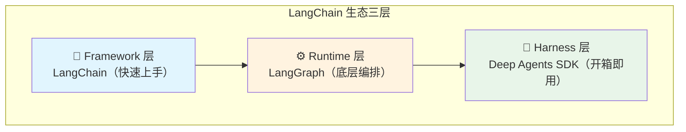

| 层级 | 产品 | 定位 | 一句话理解 |
|------|------|------|-----------|
| **Framework** | LangChain | 高级抽象，快速起步 | "搭 Agent 的脚手架" |
| **Runtime** | LangGraph | 底层编排，精细控制 | "运行 Agent 的引擎" |
| **Harness** | Deep Agents SDK | 复杂任务，开箱即用 | "全能 Agent 工具箱" |

### 三者关系

- **Deep Agents SDK** 建立在 **LangGraph** 之上
- **LangChain 1.0** 也建立在 **LangGraph** 之上
- **LangGraph** 提供持久化、人机交互、Streaming 等底层能力
- **LangChain** 在 LangGraph 之上封装了更高级的抽象

### Feature 对比表

| 功能 | LangChain | LangGraph | Deep Agents |
|------|-----------|-----------|-------------|
| 短时记忆 | Short-term memory | Short-term memory | StateBackend |
| 长时记忆 | ✅ 有 | ✅ 有 | ✅ 有 |
| 子 Agent | Multi-agent subagents | Subgraphs | Subagents |
| 人机交互 | middleware | Interrupts | `interrupt_on` 参数 |
| Streaming | ✅ 有 | ✅ 有 | ✅ 有 |

---

## 2. 核心概念

### 2.1 Provider 和 Model（模型）

**Provider（提供商）**是托管 AI 模型的服务商，比如 OpenAI、Anthropic、Google、AWS Bedrock 等。每个 Provider 有独立的集成包（如 `langchain-openai`）。

LangChain 的核心理念：**一个接口，走遍所有模型**。

```python
# ✅ 方式一：provider:model 格式（推荐）
from langchain_openai import ChatOpenAI
llm = ChatOpenAI(model="openai:gpt-4o")

# ✅ 方式二：直接指定模型名
llm = ChatOpenAI(model="gpt-4o")

# ✅ 换模型？只改一行代码
llm = ChatOpenAI(model="anthropic:claude-3-5-sonnet")
```

**为什么重要？** 你不需要因为换了一个 AI 提供商就重写整个应用，LangChain 给你统一的抽象。

**路由器和代理**：
- **OpenRouter** / **LiteLLM**：统一 API，同时访问多个 Provider，支持自动 failover（一个模型挂了自动切另一个）

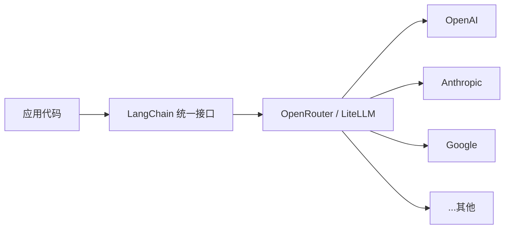

### 2.2 Memory（记忆）

LangChain 的记忆系统类比人类大脑，分为**短时记忆**和**长时记忆**：

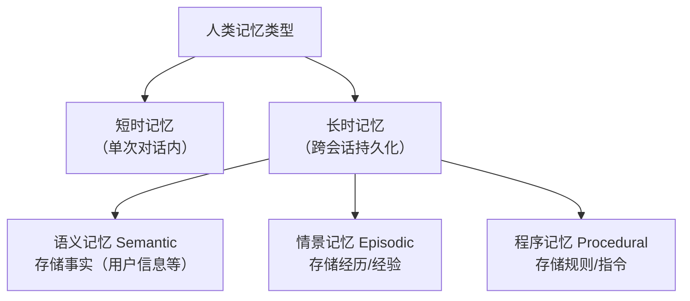

**短时记忆（Short-term memory）**：
- 作用域：单次对话 / 一个线程（Thread）
- 实现：通过 **LangGraph State** 的一部分，通过 **checkpointer** 持久化
- 类比：聊天的上下文窗口

```python
# LangGraph 中，短时记忆就是 state 里的 messages 字段
from langgraph.graph import MessagesState

state = MessagesState()
# 每次对话，消息追加到 state["messages"]，checkpointer 自动保存
```

**长时记忆（Long-term memory）**：
- 作用域：跨会话、跨线程
- 实现：通过 **LangGraph Store**，存储为 JSON 文档
- 组织方式：`namespace` + `key` → 值

```python
from langgraph.store.memory import MemoryStore

store = MemoryStore()
# 存记忆
await store.aput(("user", user_id), "preferences", {"theme": "dark"})
# 取记忆
prefs = await store.aget(("user", user_id), "preferences")
```

**三种记忆类型（类比人类大脑）**：

| 类型 | 存储内容 | 实现方式 |
|------|---------|---------|
| **语义记忆 Semantic** | 事实（用户信息、资料） | Profile 或 Collection 文档 |
| **情景记忆 Episodic** | 经历/经验 | Few-shot example prompting |
| **程序记忆 Procedural** | 执行任务的规则 | Agent 反思修改自身提示词 |

### 2.3 Context（上下文）

**Context engineering** 是"以正确格式提供正确信息和工具给 AI 应用"的实践。

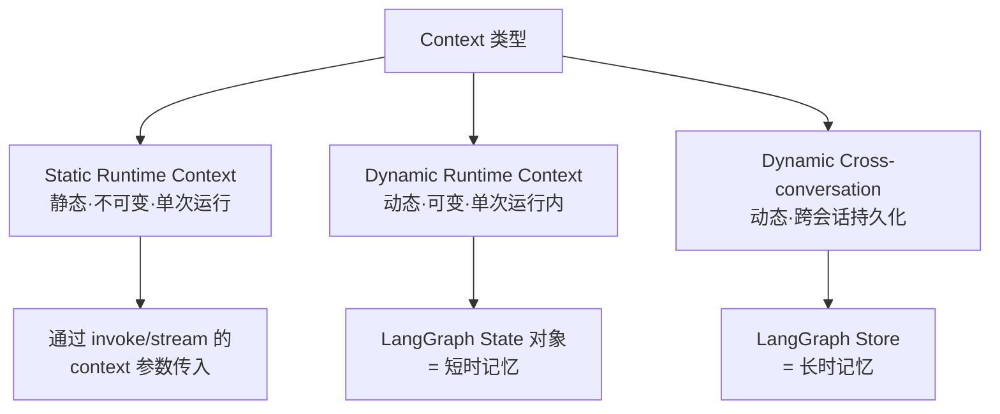

**注意**：Runtime context ≠ LLM 的 context window（上下文窗口）。前者是代码层面的依赖注入，后者是 LLM 能吃的 token 上限。

### 2.4 Component Architecture（组件架构）

LangChain 的组件生态分为 7 大类，形成一个处理 pipeline：

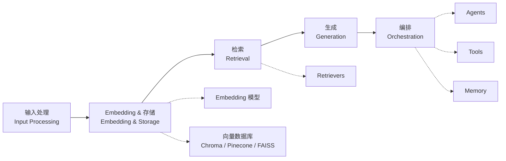

**7 类核心组件**：

| 组件类别 | 作用 | 常见例子 |
|---------|------|--------|
| **Models** | 调用 LLM | ChatOpenAI, ChatAnthropic |
| **Tools** | 赋予 Agent 外部能力 | 搜索、数据库、API 调用 |
| **Agents** | 决定"思考-行动"循环 | ReAct Agent, Tool Calling Agent |
| **Memory** | 管理对话历史 | 消息历史、自定义状态 |
| **Retrievers** | 从向量库检索相关内容 | VectorStoreRetriever |
| **Document Processing** | 文档加载和切分 | Loaders, Splitters |
| **Vector Stores** | 存储 Embedding 向量 | Chroma, Pinecone, FAISS |

---

## 3. 三层架构详解

### 3.1 LangChain（Framework 层）

**定位**：高级抽象，快速上手

**核心功能**：
- 提供 `create_agent` 等简单易用的接口
- 封装了 Model、Tool、Agent loop、Memory 的抽象
- 不需要懂 LangGraph 也能用

```python
from langchain import hub
from langchain.agents import create_tool_calling_agent, AgentExecutor
from langchain_openai import ChatOpenAI

# 加载预置提示词
prompt = hub.pull("hwchase17/openai-functions-agent")

# 创建 Agent
llm = ChatOpenAI(model="gpt-4o")
agent = create_tool_calling_agent(llm, tools, prompt)

# 运行
agent_executor = AgentExecutor(agent=agent, tools=tools)
result = agent_executor.invoke({"input": "帮我查一下北京的天气"})
```

**适用场景**：
- ✅ 快速构建简单 Agent
- ✅ 团队标准化开发
- ✅ 不需要复杂编排的场景

### 3.2 LangGraph（Runtime 层）

**定位**：底层编排引擎，适合复杂生产环境

**核心概念**：

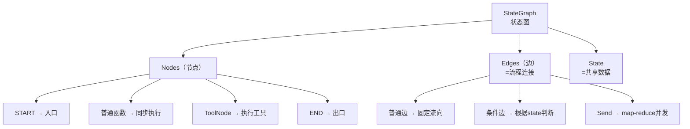

**StateGraph 核心写法**：

```python
from langgraph.graph import StateGraph, MessagesState, START, END
from langgraph.store.memory import MemorySaver

# 1. 定义状态（TypedDict）
class MyState(MessagesState):
    step: str

# 2. 建图
graph = StateGraph(MyState)

# 3. 加节点
graph.add_node("process", process_function)
graph.add_node("tools", tool_node)

# 4. 连边
graph.add_edge(START, "process")
graph.add_edge("process", END)

# 5. 编译（加持久化）
checkpointer = MemorySaver()
app = graph.compile(checkpointer=checkpointer)

# 6. 运行
result = app.invoke(
    {"messages": [{"role": "user", "content": "hello"}]},
    config={"configurable": {"thread_id": "1"}}
)
```

**LangGraph vs LangChain**：LangChain 的 Agent（如 `create_agent`）底层实际上也是在 LangGraph 上跑的，LangGraph 是更底层的 Runtime。

**适用场景**：
- ✅ 需要精细控制 Agent 编排
- ✅ 长时间运行的 Stateful Agent
- ✅ 需要人机交互（Human-in-the-loop）
- ✅ 复杂工作流（结合确定性和 Agent 步骤）

### 3.3 Deep Agents SDK（Harness 层）

**定位**：复杂任务的"全能工具箱"，开箱即用

**一句话理解**：在 LangGraph 基础上，给你预置了文件系统、子 Agent、任务规划、Shell 执行等能力，不需要从零搭。

```python
# 安装：pip install deepagents
from deepagents import create_deep_agent

def get_weather(city: str) -> str:
    """获取天气"""
    return f"{city}今天晴天，25度！"

agent = create_deep_agent(
    tools=[get_weather],
    system_prompt="你是一个有帮助的助手",
)

# 直接运行
result = agent.invoke({
    "messages": [{"role": "user", "content": "北京天气怎么样？"}]
})
```

**Deep Agents 核心能力**：

| 能力 | 说明 | 代码 |
|------|------|------|
| **任务规划** | 内置 `write_todos` 工具，拆解复杂任务 | Agent 自动分解步骤 |
| **文件系统** | `ls`, `read_file`, `write_file`, `edit_file` | 防止 context window 溢出 |
| **Shell 执行** | `execute` 工具（在 sandbox 下） | 运行测试、构建、git |
| **子 Agent** | `task` 工具，spawn 专用子 Agent | 上下文隔离 |
| **长时记忆** | LangGraph Store 跨线程持久化 | 保存/读取历史信息 |
| **人机交互** | `interrupt_on` 配置 | 敏感操作需人工确认 |
| **可插拔后端** | 内存/本地磁盘/sandbox/自定义 | 灵活切换存储 |

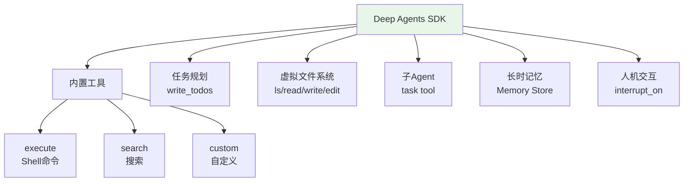

---

## 4. Tutorial 实战：每个模块能做什么

### 4.1 Semantic Search（语义搜索）

**场景**：基于 PDF 的语义搜索引擎

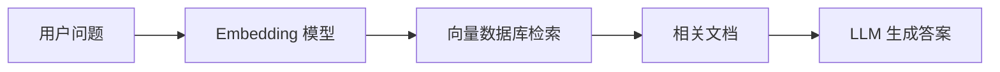

**流程**：
1. 文档加载 → PDF/TXT
2. 文本切分（chunk）→ 小段文本
3. Embedding → 向量存储到向量库
4. 用户提问 → 同样 Embedding
5. 相似度检索 → Top-K 相关文档
6. 将文档喂给 LLM → 生成答案

### 4.2 RAG Agent（检索增强生成 Agent）

**场景**：让 Agent 能够从知识库中检索信息再回答

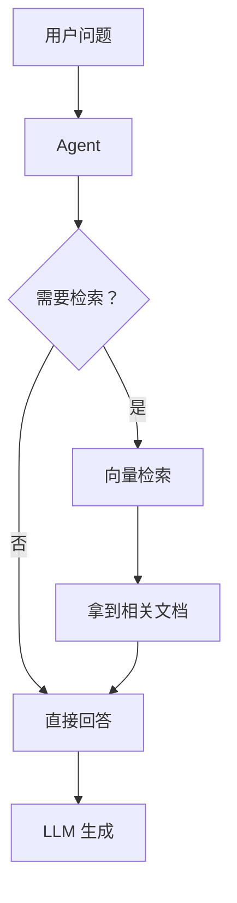

**LangChain 做法**（简单场景）：
```python
# 使用 create_agent 快速创建 RAG Agent
agent = create_agent(llm, tools=[retriever_tool], prompt=...)
```

**LangGraph 做法**（精细控制）：
```python
# 自定义 RAG 流程中的每一步
graph.add_node("generate_query", generate_query_or_respond)
graph.add_node("grade_documents", grade_documents)  # 过滤相关文档
graph.add_node("rewrite_question", rewrite_question)  # 改写查询
graph.add_node("generate_answer", generate_answer)

# 条件边：根据分数决定下一步
graph.add_conditional_edges(
    "grade_documents",
    decide_to_generate,
    {"rewrite": "rewrite_question", "generate": "generate_answer"}
)
```

### 4.3 SQL Agent

**场景**：用自然语言查询数据库

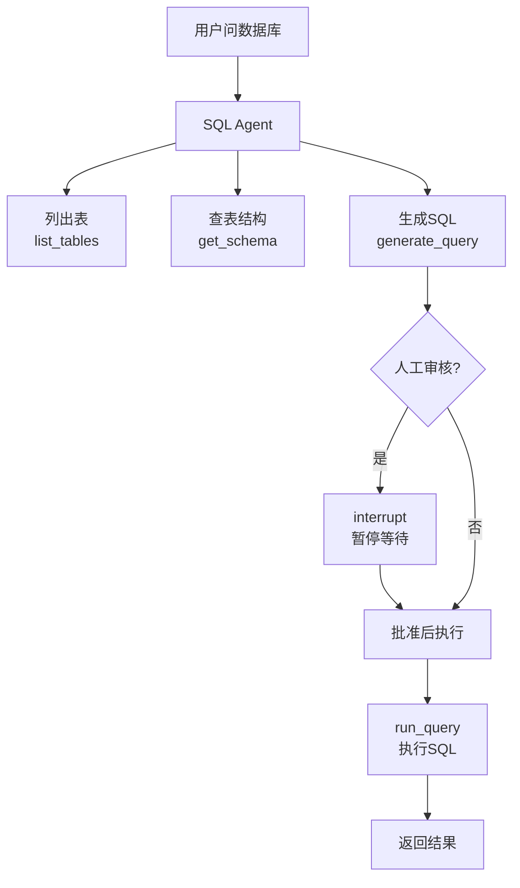

**LangChain SQL Agent 工具集**：
- `sql_db_query` — 执行 SQL 查询
- `sql_db_schema` — 查看表结构
- `sql_db_list_tables` — 列出所有表
- `sql_db_query_checker` — 检查 SQL 语法

**LangGraph SQL Agent**（更精细）：
- 独立节点：`list_tables` → `get_schema` → `generate_query` → `check_query` → `run_query`
- 支持 `interrupt` 实现人工审核（敏感 SQL 执行前暂停）

### 4.4 Voice Agent（语音 Agent）

**场景**：能听、能说、能查数据的对话助手

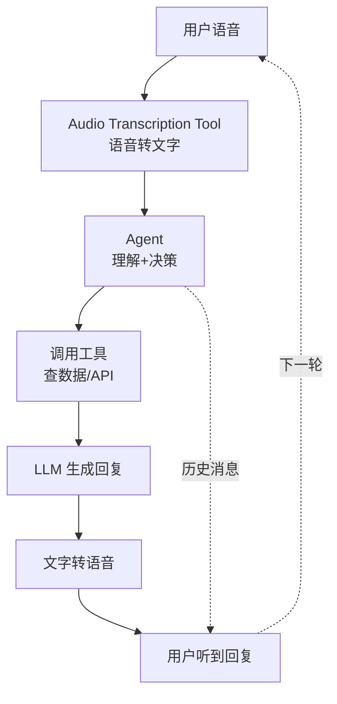

**特点**：
- 支持多轮对话（消息历史维护）
- 工具调用获取结构化数据
- 适合做电话机器人、语音助手

### 4.5 Data Analysis Agent（数据分析 Agent）

**场景**：自动分析数据并发送报告（如 Slack）

- 内置数据分析工具
- 可对接 Slack 发送报告
- 适合运营/财务自动化场景

### 4.6 Deep Research Agent（深度研究 Agent）

**场景**：多步骤网络研究，自动委托子 Agent

- **子 Agent 委托**：主 Agent 拆解任务 → 分发给专门的研究子 Agent
- **战略反思**：定期反思当前进展，决定下一步
- 多轮搜索 → 整理 → 汇总报告

---

## 5. 多 Agent 协作模式

当单 Agent 能力不够时，需要多个 Agent 协作。

### 5.1 Supervisor Pattern（主管模式）

**思想**：一个主管 Agent 把子 Agent 当工具调用

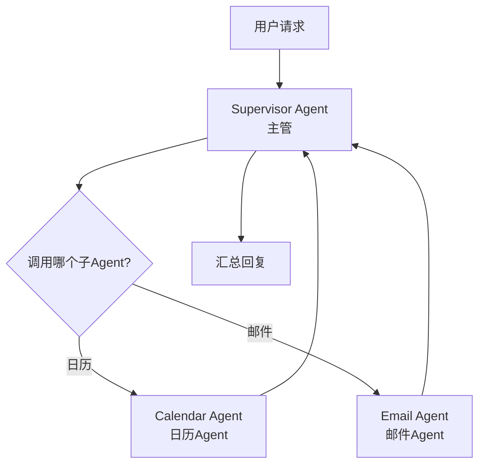

**实现**：
- 子 Agent 用 `@tool` 包装
- Supervisor 通过 `ToolRuntime` 获取子 Agent 上下文
- 支持 Human-in-the-loop（`HumanInTheLoopMiddleware`）

```python
# 子Agent包装成工具
@tool
def calendar_agent(query: str) -> str:
    """查日历"""
    return calendar_agent_instance.run(query)

@tool
def email_agent(query: str) -> str:
    """发邮件"""
    return email_agent_instance.run(query)

# Supervisor 调用
supervisor_agent = create_agent(llm, tools=[calendar_agent, email_agent], ...)
```

### 5.2 Handoffs Pattern（交接模式）

**思想**：单 Agent 内部有状态机，不同状态走不同处理流程

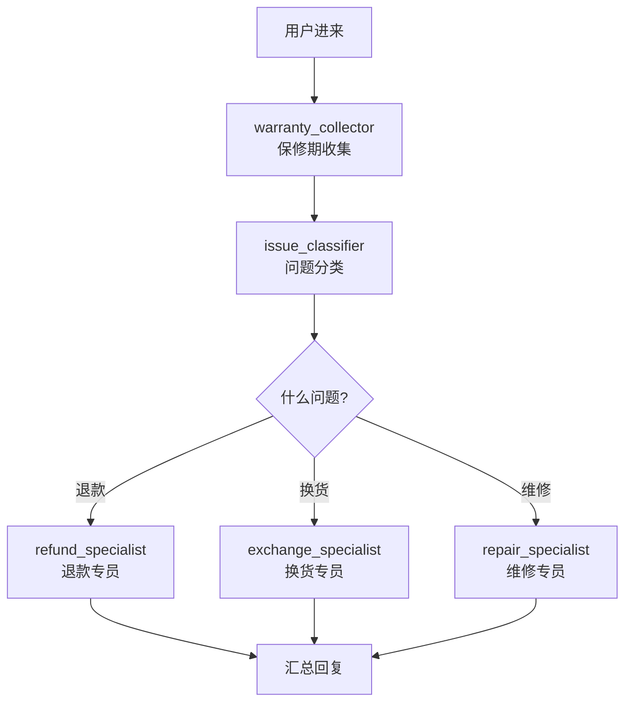

**实现**：
- 用 `SupportState` 携带 `current_step` 字段
- `@wrap_model_call` 装饰器实现中间件
- `Command` 对象触发状态转换

```python
class SupportState(TypedDict):
    messages: Annotated[list, add_messages]
    current_step: str  # warranty_collector | issue_classifier | ...

# 状态转换
Command(
    resume={"current_step": "resolution_specialist", ...}
)
```

### 5.3 Router Pattern（路由模式）

**思想**：根据用户查询类型，路由到不同的知识库/专业 Agent

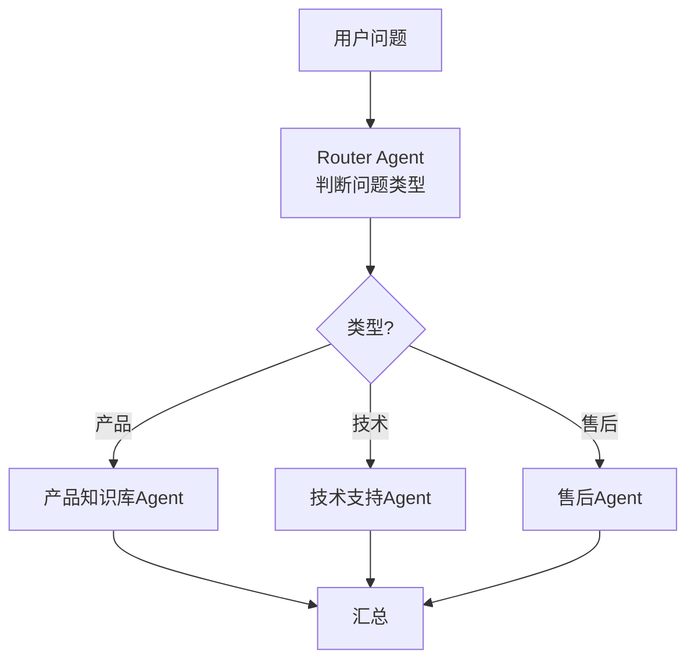

### 5.4 Skills Pattern（技能模式）

**思想**：Agent 渐进式加载专门技能，按需加载上下文

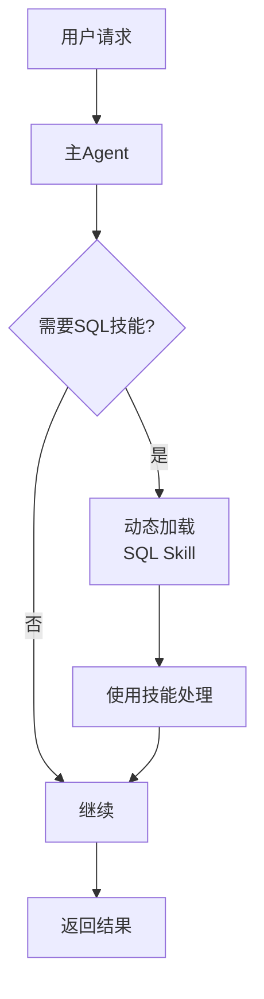

---

## 6. 通用工作流程图

### 6.1 Agent + Tools 工作流

```mermaid
graph TD
    A["用户请求"] --> B["Agent 思考"]
    B --> C{"需要调用工具?"}
    C -->|是| D["调用工具<br>ToolNode"]
    D --> E{"结果?"}
    E -->|"成功"| B
    E -->|"失败| F["重试或放弃"]
    C -->|否| G["返回最终答案"]
```

### 6.2 RAG 全链路

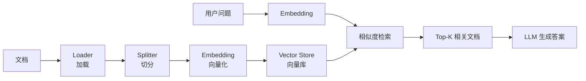

### 6.3 LangGraph 状态机

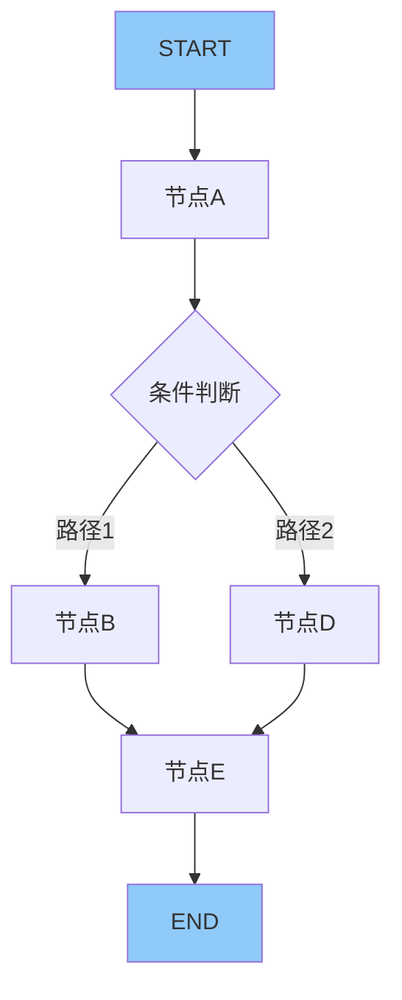

---

## 7. 如何选择合适的工具

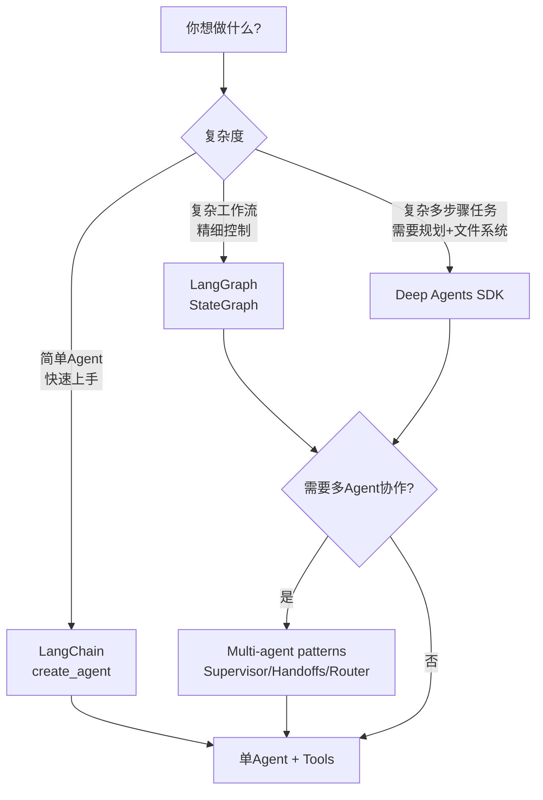

### 选择决策表

| 需求 | 推荐 | 原因 |
|------|------|------|
| 快速做个聊天机器人 | LangChain | 一行代码搞定 |
| 需要查数据库 | LangChain SQL Agent | 内置工具 |
| 复杂多步骤任务 | LangGraph | 状态机+条件边 |
| 长期运行的 Agent | LangGraph + checkpointer | 持久化+断点恢复 |
| 人工审核环节 | LangGraph interrupt | 暂停等批准 |
| 多个专业 Agent 协作 | Multi-agent patterns | Supervisor/Handoffs |
| 复杂+规划+子 Agent | Deep Agents SDK | 开箱即用 |
| 语音对话 | LangChain Voice Agent | 内置语音处理 |

---

## 更多资源

- [LangChain 官方文档](https://docs.langchain.com/oss/python/langchain/overview)
- [LangGraph 官方文档](https://docs.langchain.com/oss/python/langgraph/overview)
- [Deep Agents SDK](https://docs.langchain.com/oss/python/deepagents/overview)
- [LangChain Academy（课程）](https://academy.langchain.com/)
- [LangSmith（调试追踪）](https://smith.langchain.com/)
