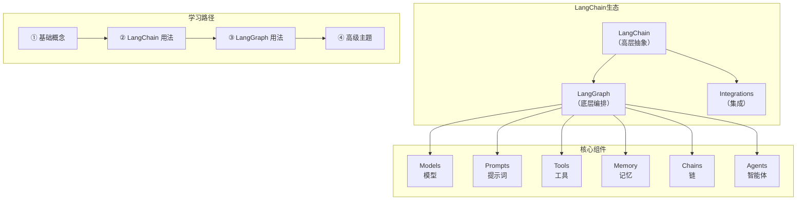
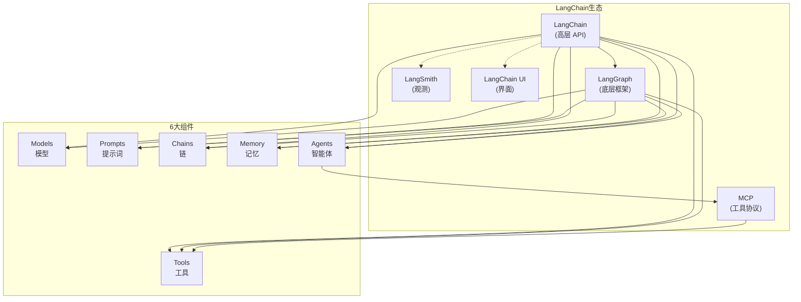

# LangChain 学习路径指南

> 来源：[LangChain Learn 官方文档](https://docs.langchain.com/oss/python/learn)  
> 整理时间：2026-04-25

---

## 📐 整体架构图



---

## 一、基础概念（Conceptual Overviews）

> 官方文档：https://docs.langchain.com/oss/python/concepts

### 1.1 核心组件总览

LangChain 有 **6 大核心组件**，掌握它们就掌握了 LangChain 的精髓：

| 组件 | 作用 | 关键类 |
|------|------|--------|
| **Models** | 统一接口调用各种 LLM | `ChatOpenAI`, `ChatAnthropic` |
| **Prompts** | 管理提示词模板 | `PromptTemplate`, `ChatPromptTemplate` |
| **Chains** | 将多个组件串联成流水线 | `LLMChain`, `RetrievalChain` |
| **Memory** | 对话历史与记忆管理 | `ChatMessageHistory`, `BaseMemory` |
| **Indexes** | 文档加载、分割、检索 | `DocumentLoader`, `VectorStore` |
| **Agents** | 让 LLM 决定使用哪些工具 | `Agent`, `Tool` |

### 1.2 Models（模型）

LangChain 提供统一的模型接口，支持 OpenAI、Anthropic、Google、Ollama 等多种提供商。

```python
from langchain_openai import ChatOpenAI

llm = ChatOpenAI(model="gpt-4o", temperature=0)
response = llm.invoke("用一句话解释量子计算")
```

**关键概念：**
- `ChatModel` vs `LLM`：聊天模型处理消息，基础 LLM 处理纯文本
- `Messages`：HumanMessage、AIMessage、SystemMessage、ToolMessage
- `Output Parsers`：将 LLM 输出结构化（JSON、Pydantic）

### 1.3 Prompts（提示词）

提示词是控制 LLM 行为的核心，LangChain 提供了模板化管理：

```python
from langchain_core.prompts import PromptTemplate

# 简单模板
prompt = PromptTemplate.from_template(
    "请将以下中文翻译成英文：{text}"
)

# 带 few-shot 示例的聊天模板
from langchain_core.prompts import ChatPromptTemplate

chat_prompt = ChatPromptTemplate.from_messages([
    ("system", "你是一个翻译助手。"),
    ("human", "苹果"),
    ("ai", "Apple"),
    ("human", "{input}"),
])
```

**模板类型：**
- `PromptTemplate`：纯文本模板
- `ChatPromptTemplate`：消息列表模板
- `PipelinePrompt`：流水线式组合模板

### 1.4 Memory（记忆）

LangChain 两套记忆系统：

| 类型 | 存储位置 | 说明 |
|------|----------|------|
| **LangChain Memory** | 链外（Chains） | `ChatMessageHistory` + 记忆 Buffer |
| **LangGraph Store** | 状态内（Graph） | 线程级检查点持久化 |

```python
# LangChain Memory 用法
from langchain.memory import ChatMessageHistory
from langchain_core.messages import HumanMessage, AIMessage

history = ChatMessageHistory()
history.add_user_message("我叫阿岳")
history.add_ai_message("好的，阿岳，我记住了！")
history.messages  # ✅ 可直接查看
```

### 1.5 Context（上下文）

上下文管理是 Agent 的核心能力，包括：

- **消息压缩**：自动总结过长的对话历史
- **上下文窗口**：管理 LLM 的 token 上限
- **Context Engineering**：高级上下文组织技术

### 1.6 Tools（工具）

Tools 让 Agent 能够调用外部系统：

```python
from langchain_core.tools import tool

@tool
def get_weather(city: str) -> str:
    """获取城市天气"""
    return f"{city}今天晴天，25°C"

# 或通过 MCP（Model Context Protocol）接入
# @tool 装饰器让 LLM 自动识别工具用途
```

---

## 二、LangChain 高层 API

> 官方文档：https://docs.langchain.com/oss/python/langchain/overview

### 2.1 快速开始

```python
# 方式一：直接使用（最简方式）
from langchain_openai import ChatOpenAI
llm = ChatOpenAI(model="gpt-4o")
llm.invoke("你好")

# 方式二：使用预建 Agent（推荐入门）
from langchain.agents import create_agent
agent = create_agent(llm, tools, prompt="你是一个助手")

# 方式三：通过 LangGraph 自定义（高级）
```

### 2.2 Agents（智能体）

LangChain Agents 有两种级别：

| 级别 | 说明 | 适用场景 |
|------|------|----------|
| **LangChain Agents** | 预建架构，简单场景开箱即用 | 快速原型、简单用例 |
| **LangGraph Agents** | 低级编排，完全自定义 | 生产级、复杂逻辑 |

**推荐路径：**
```
入门 → LangChain Agents（简单用例）
进阶 → LangGraph（复杂编排）
```

### 2.3 Chains（链）

Chains 将多个组件串联成流水线：

```python
from langchain.chains import LLMChain
from langchain.prompts import PromptTemplate

chain = LLMChain(
    llm=ChatOpenAI(model="gpt-4o"),
    prompt=PromptTemplate.from_template("翻译：{text}")
)
result = chain.invoke({"text": "Hello world"})
```

**常见 Chain 类型：**
- `LLMChain`：最基础的 LLM 调用链
- `RetrievalChain`：RAG（检索增强生成）
- `ConversationChain`：带记忆的对话链
- `ConversationalRetrievalChain`：对话式 RAG

### 2.4 关键模块速查

| 模块 | 路径 | 用途 |
|------|------|------|
| 安装 | `langchain install` | 包管理 |
| 快速开始 | `langchain quickstart` | 5 分钟上手 |
| Agents | `langchain agents` | 预建智能体 |
| Models | `langchain models` | 模型配置 |
| Messages | `langchain messages` | 消息管理 |
| Tools | `langchain tools` | 外部工具 |
| Streaming | `langchain streaming` | 流式输出 |
| Structured Output | `langchain structured-output` | 结构化输出 |
| Guardrails | `langchain guardrails` | 输出校验 |
| Observability | `langchain observability` | 可观测性（LangSmith） |

---

## 三、LangGraph（底层编排框架）

> 官方文档：https://docs.langchain.com/oss/python/langgraph/overview

LangGraph 是 LangChain 的底层编排框架，适合构建**复杂 Agent 工作流**。

### 3.1 核心特性

| 特性 | 说明 |
|------|------|
| **Durable Execution** | 持久化执行，失败可恢复，可长时间运行 |
| **Streaming** | 支持流式输出 |
| **Human-in-the-Loop** | 支持人工干预、审批、中断 |
| **Memory** | 线程级检查点持久化 |
| **Subgraphs** | 支持子图嵌套 |

### 3.2 最小示例

```python
from langgraph.graph import StateGraph, START, END
from langgraph.graph.message import add_messages
from typing import Annotated
from langchain_openai import ChatOpenAI
from langchain_core.messages import BaseMessage

# 定义状态
class State(TypedDict):
    messages: Annotated[list[BaseMessage], add_messages]

# 构建图
graph = StateGraph(State)
graph.add_node("chat", lambda state: {"messages": [("ai", "Hello!")]})
graph.add_edge(START, "chat")
graph.add_edge("chat", END)

# 运行
app = graph.compile()
result = app.invoke({"messages": [("human", "Hi")]})
```

### 3.3 适用场景 vs LangChain Agents

| 场景 | 推荐方案 |
|------|----------|
| 简单问答 | LangChain Agent ✅ |
| 单工具调用 | LangChain Agent ✅ |
| 多 Agent 协作 | LangGraph ✅ |
| 复杂状态机 | LangGraph ✅ |
| 需要人工审批 | LangGraph ✅ |
| 长时间运行任务 | LangGraph ✅ |

### 3.4 LangGraph 学习路径

```
① Thinking in LangGraph      → 核心概念
② Workflows + Agents         → 工作流设计
③ Persistence                → 持久化
④ Durable Execution          → 容错执行
⑤ Streaming                  → 流式处理
⑥ Interrupts                 → 中断与人工干预
⑦ Time Travel                → 时间回溯调试
⑧ Add Memory                 → 记忆管理
⑨ Subgraphs                  → 子图嵌套
⑩ Application Structure      → 项目结构
⑪ Test                       → 测试
```

---

## 四、学习路径（Use Cases & Tutorials）

### 4.1 Deep Agents（深度智能体）

> 适合：想要开箱即用的高功能 Agent

Deep Agents 是 LangChain 官方封装的高阶 Agent，内置：
- 自动上下文压缩
- 虚拟文件系统
- 子 Agent 派生

**教程列表：**
- [Data Analysis Agent](https://docs.langchain.com/oss/python/deepagents/data-analysis) — 数据分析
- 更多 Deep Agents 持续更新中

### 4.2 Multi-Agent（多智能体）

多 Agent 模式教你如何构建**多角色协作系统**：

```python
# 多 Agent 示例结构
graph = StateGraph(State)
graph.add_node("researcher", researcher_agent)
graph.add_node("writer", writer_agent)
graph.add_node("reviewer", reviewer_agent)

graph.add_edge(START, "researcher")
graph.add_edge("researcher", "writer")
graph.add_edge("writer", "reviewer")
graph.add_edge("reviewer", END)
```

### 4.3 Case Studies（案例研究）

官方提供了多种行业案例：

| 案例 | 说明 |
|------|------|
| 客服机器人 | 多轮对话 + RAG |
| 数据分析助手 | 工具调用 + Python 执行 |
| 代码审查 | Agent 工具链 |
| 文档问答 | RAG 全链路 |

---

## 五、学习优先级建议

### 🚀 零基础入门路线（1-2周）

```
Day 1-2：安装 + 快速开始
  ↓
Day 3-4：Models + Messages（理解 LLM 调用方式）
  ↓
Day 5-6：Prompts + Chains（掌握提示词工程）
  ↓
Day 7-8：Memory（对话记忆）
  ↓
Day 9-10：Tools + Agents（让 LLM 调用外部能力）
  ↓
Day 11-14：LangChain Quickstart 完整示例
```

### 📈 进阶路线（2-4周）

```
Week 3：LangGraph 核心概念
  - Thinking in LangGraph
  - Workflows + Agents
  ↓
Week 4：持久化 + 容错
  - Persistence
  - Durable Execution
  - Memory
  ↓
```

### 🏭 生产路线（4周+）

```
深入方向：
├── Multi-Agent 协作系统
├── Human-in-the-Loop 人工干预
├── LangSmith 观测与调优
├── Deep Agents 深度定制
└── 特定领域（RAG/数据分析/代码生成）
```

---

## 六、工具链与环境

### 6.1 安装

```bash
# 基础安装
pip install langchain langchain-openai

# LangGraph（独立包）
pip install langgraph

# 开发依赖
pip install langchain-cli langsmith

# LangChain UI（可选）
pip install langchain-ui
```

### 6.2 环境变量

```bash
export OPENAI_API_KEY="sk-..."
export ANTHROPIC_API_KEY="sk-ant-..."
export LANGCHAIN_TRACING_V2="true"
export LANGCHAIN_API_KEY="ls-..."
```

### 6.3 相关工具

| 工具 | 用途 |
|------|------|
| **LangSmith** | 追踪、调优、评估 LLM 应用 |
| **LangChain UI** | 可视化对话界面 |
| **LangChain CLI** | 命令行工具 |
| **LangServe** | 部署 LangChain 应用为 API |

---

## 七、参考资源

### 官方文档
- [LangChain Docs](https://docs.langchain.com/oss/python/langchain/overview)
- [LangGraph Docs](https://docs.langchain.com/oss/python/langgraph/overview)
- [Integrations](https://docs.langchain.com/oss/python/integrations/providers/overview)
- [Learn 主页](https://docs.langchain.com/oss/python/learn)

### 社区资源
- [LangChain Cookbook](https://github.com/gkamradt/langchain-tutorials) — Greg Kamradt 的经典教程
- [LangChain YouTube](https://www.youtube.com/@LangChain) — 官方视频教程

### 推荐学习顺序
```
1. 官方 Quickstart  → 5 分钟体验完整流程
2. Concepts Overview → 理解 6 大组件
3. LangChain Agents  → 学会使用预建 Agent
4. LangGraph        → 进阶到自定义编排
5. Case Studies     → 实战项目
```

---

## 八、Mermaid 总图：LangChain 生态



---

*文档整理自 [LangChain 官方 Learn 页面](https://docs.langchain.com/oss/python/learn)，如有不一致请以官方最新文档为准。*
