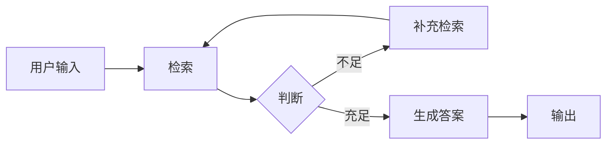
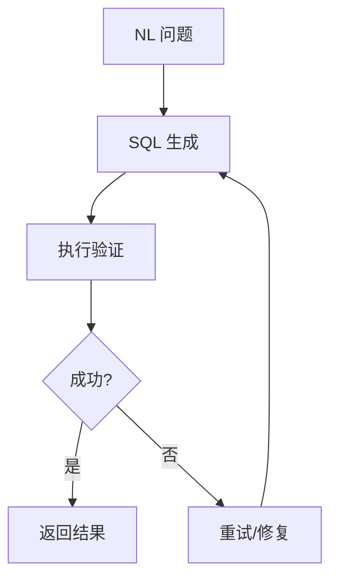
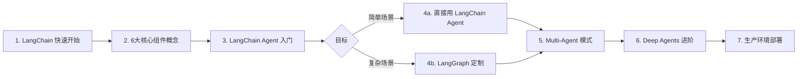

# LangChain Learn 导航栏详解

> 来源：[docs.langchain.com/oss/python/learn](https://docs.langchain.com/oss/python/learn)  
> 整理时间：2026-04-25

---

## 📂 一级导航总览

| 导航模块 | 说明 | 适合阶段 |
|---------|------|---------|
| **Tutorials** | 实战教程（Use Cases） | 入门 → 进阶 |
| **Conceptual overviews** | 核心概念理解 | 入门前必读 |
| **Additional resources** | 补充资源 | 进阶 |

---

## 二、Tutorials（教程）

> 分类：Use Cases → Deep Agents / LangChain / LangGraph / Multi-agent

### 2.1 Deep Agents（深度智能体）

**官方定位：** 内置上下文管理、虚拟文件系统的长时运行 Agent

**包含教程：**
| 教程 | 内容 | 难度 |
|------|------|------|
| **Data Analysis Agent** | 构建数据分析 Agent，自动压缩上下文 | 🐇 入门 |

**核心特性：**
- **上下文自动压缩**：85% 窗口阈值时触发压缩，保留最近 10% 消息
- **虚拟文件系统**：大工具响应（>20,000 tokens）自动 offload 到磁盘
- **子 Agent 派生**：可 spawn 独立子 Agent（类似 Claude Code）

**适用场景：**
- 长时间研究任务
- 代码生成/审查
- 复杂多步骤任务（不受 token 限制约束）

---

### 2.2 LangChain（高层 API）

LangChain 提供**预建 Agent 架构**，简单场景直接使用，复杂场景用 LangGraph 扩展。

**包含教程：**

#### ① Semantic Search（语义搜索）

**目标：** 基于向量数据库的语义搜索系统

**核心流程：**
```
文档加载 → 文本分割 → Embedding → 向量存储
                              ↓
                    查询 → 向量检索 → 返回结果
```

**关键组件：**
- `DocumentLoader`：PDF、Markdown、网页等
- `RecursiveCharacterTextSplitter`：递归字符分割
- `Embedding Model`：OpenAI Embeddings / Ollama Embeddings
- `VectorStore`：Chroma / FAISS / PGVector

```python
# 核心代码示例
from langchain_community.vectorstores import Chroma
from langchain_openai import OpenAIEmbeddings

vectorstore = Chroma.from_documents(documents=texts, embedding=OpenAIEmbeddings())
results = vectorstore.similarity_search("查询内容", k=3)
```

#### ② RAG Agent（RAG 智能体）

**目标：** 让 Agent 能够检索知识库回答问题

**两种模式：**
| 模式 | 说明 | Agent 参与度 |
|------|------|-------------|
| **Basic RAG** | 检索 → 生成，直接 pipeline | 无 |
| **Agentic RAG** | Agent 自己决定是否调用检索工具 | 强 |

**核心 Chain：**
```python
# Agentic RAG 示例
rag_chain = create_retriever_chain(llm, retriever)
rag_chain.invoke({"input": "用户问题"})
```

**关键概念：**
- `SystemMessage` + retrieved context → LLM 生成答案
- 原始文档可存入 state（保留 metadata）

#### ③ SQL Agent（SQL 智能体）

**目标：** 自然语言转 SQL 查询数据库

**核心能力：**
- 将自然语言问题转为 SQL 语句
- 自动执行查询并返回结果
- 支持多表关联、复杂查询

**典型场景：**
```python
# 数据库问答
agent.invoke({"input": "2024年Q3销售额最高的产品是什么？"})
```

#### ④ Voice Agent（语音智能体）

**目标：** 构建语音交互的 AI Agent

**流程：**
```
用户语音 → STT（语音转文本）→ LLM 处理 → TTS（文本转语音）→ 用户
```

**关键组件：**
- 麦克风输入 / 语音输出
- 流式响应（边说边生成）

---

### 2.3 LangGraph（底层框架）

> 当 LangChain Agent 不够用时 → 用 LangGraph 定制工作流

**包含教程：**

#### ① Custom RAG Agent（自定义 RAG Agent）

在 LangGraph 中实现完整的 RAG 工作流：



**LangGraph 中的 RAG 特点：**
- 可以嵌入循环（自动判断是否需要再次检索）
- 支持 human-in-the-loop（人工审核检索结果）
- 可中断、可回退

#### ② Custom SQL Agent（自定义 SQL Agent）

用 LangGraph 精细控制 SQL 执行流程：



**能力：**
- 检查 SQL 安全性
- 错误重试机制
- 多步骤推理

---

### 2.4 Multi-agent（多智能体）

> 官方重点：4 种核心多 Agent 架构模式

#### 四种模式对比

| 模式 | 核心思想 | 典型场景 | 模型调用次数（一轮） |
|------|---------|---------|---------------------|
| **Subagents** | 主 Agent 把子 Agent 当工具调用 | 多领域并行处理 | 4 次 |
| **Handoffs** | Agent 之间通过 tool call 转移控制权 | 客服转接 | 3 次 |
| **Skills** | 单 Agent 按需加载专业 context | 多专业单 Agent | 3 次 |
| **Router** | 路由节点分类输入，分发到专业 Agent | 分流 + 并行 | 3 次 |

```python
# Subagents 示例（主 Agent 调用子 Agent 作为 Tool）
subagent = Subagent(name="code_reviewer", ...)  # 子 Agent
main_agent = create_agent(llm, tools=[subagent])  # 主 Agent 把子 Agent 当工具

# Handoffs 示例（Agent 间转移控制权）
# agent_a 调用 hand_off_tool → agent_b 接管对话

# Skills 示例（按需加载专业能力）
skill = load_skill("sql_assistant")  # 动态加载专业 context

# Router 示例（路由分发）
def route(input): return classify(input)  # 分类 → 分发
```

#### 具体教程列表

| 教程 | 说明 |
|------|------|
| **Subagents: Personal assistant** | 主 Agent 通过工具调用协调多个子 Agent |
| **Handoffs: Customer support** | Agent 间转移控制权（客服升级场景）|
| **Router: Knowledge base** | 分类输入路由到对应知识库 Agent |
| **Skills: SQL assistant** | 单 Agent 按需激活 SQL 专业能力 |

**多领域场景对比：**

| 模式 | 一轮请求 | 重复请求 | 多领域 |
|------|---------|---------|-------|
| Subagents | 4 次 | ✓ | 5次（并行） |
| Handoffs | 3 次 | ✓ | 7+ 次（顺序） |
| Skills | 3 次 | ✓（累积） | 3 次（累积） |
| Router | 3 次 | ✓ | 5 次（并行） |

---

## 三、Conceptual Overviews（概念总览）

> **入门必读**：先理解概念再动手写代码

### 3.1 Memory（记忆）

LangChain / LangGraph 的两套记忆系统：

| 系统 | 存储位置 | 持久化方式 |
|------|---------|-----------|
| **LangChain Memory** | Chain 外部 | 自行管理 |
| **LangGraph Store** | Graph State 内 | 线程级检查点 |

**记忆类型：**
```python
# 聊天历史（短时记忆）
history = ChatMessageHistory()
history.add_user_message("我叫阿岳")
history.add_ai_message("好的，阿岳！")

# LangGraph 长期记忆（跨对话）
from langgraph.store.memory import InMemoryStore
store = InMemoryStore()
```

**使用场景：**
- 单用户多轮对话 → 短时记忆（State 内）
- 跨用户偏好学习 → 长期记忆（BaseStore）

### 3.2 Context Engineering（上下文工程）

**目标：** 最大化利用 LLM 上下文窗口

**核心策略：**
1. **消息压缩**：自动总结旧对话
2. **上下文窗口管理**：分块、优先级排序
3. **少样本示例**：Few-shot prompting

### 3.3 Graph API（图形 API）

LangGraph 的核心编程接口：

```python
from langgraph.graph import StateGraph, END, START

graph = StateGraph(State)
graph.add_node("node_name", handler_function)
graph.add_edge(START, "node_name")
graph.add_edge("node_name", END)
app = graph.compile()
```

**关键概念：**
- `State`：Graph 运行时的状态容器
- `Node`：处理单元（Python 函数）
- `Edge`：状态转换（普通边 / 条件边）
- `Checkpoint`：快照恢复

### 3.4 Functional API（函数式 API）

**设计目标：** 不用显式定义 Graph，也能用 LangGraph 特性

```python
from langgraph.func import entrypoint

@entrypoint(checkpointer=checkpointer)
def my_workflow(input: dict) -> dict:
    # 普通 Python 函数，自动获得 LangGraph 特性
    result = do_something(input)
    return {"output": result}
```

**自动获得的特性：**
- ✅ Streaming（流式输出）
- ✅ Persistence（持久化）
- ✅ Human-in-the-Loop（人工中断）
- ✅ Short-term Memory（对话历史）
- ✅ Long-term Memory（跨用户学习）

---

## 四、Additional Resources（补充资源）

### 4.1 LangChain Academy（官方学院）

**课程：** [LangChain Essentials - Python](https://academy.langchain.com/courses/langchain-essentials-python)

**课程内容（约 1 小时视频）：**
| 章节 | 内容 |
|------|------|
| Lesson 1 | Getting Set Up - Local Models |
| Lesson 2 | Models and Messages |
| Lesson 3 | 创建 Agent |
| Lesson 4 | Tool Calling |
| Lesson 5 | Tools with MCP |
| Lesson 6 | 流式输出（Streaming）|
| Lesson 7 | Structured Output |
| Lesson 8 | Dynamic Prompt |
| Lesson 9 | Human in the Loop |

### 4.2 Case Studies（案例研究）

官方行业案例，参考：
- [LangGraph Case Studies](https://docs.langchain.com/oss/python/langgraph/case-studies)

---

## 🎯 学习优先级地图



### 各阶段学习路径

| 阶段 | 内容 | 目标 |
|------|------|------|
| **Day 1-2** | 安装 + Quickstart | 能跑通官方示例 |
| **Day 3-5** | 6 大组件概念 | 理解 Models/Prompts/Memory |
| **Day 6-7** | LangChain Agent 教程 | 掌握 Semantic Search / RAG |
| **Week 2** | LangGraph + Multi-Agent | 自定义工作流 |
| **Week 3-4** | Deep Agents + 生产 | 复杂长时任务 |

---

## 📌 各导航模块速查表

| 导航 | 对应文档 | 核心技能 |
|------|---------|---------|
| Deep Agents → Data Analysis | `deepagents/data-analysis` | 长任务上下文管理 |
| LangChain → Semantic Search | `langchain/knowledge-base` | 向量检索 + Embedding |
| LangChain → RAG Agent | `langchain/rag` | 检索增强生成 |
| LangChain → SQL Agent | `langchain/sql` | NL→SQL |
| LangChain → Voice Agent | `langchain/voice` | 语音交互 |
| LangGraph → Custom RAG | `langgraph/...` | 自定义 RAG 工作流 |
| LangGraph → Custom SQL | `langgraph/...` | 自定义 SQL Agent |
| Multi-agent → Subagents | `langchain/multi-agent` | 主从 Agent 协作 |
| Multi-agent → Handoffs | `langchain/multi-agent` | 控制权转移 |
| Multi-agent → Router | `langchain/multi-agent` | 路由分类分发 |
| Multi-agent → Skills | `langchain/multi-agent` | 动态专业能力 |
| Memory | `concepts/memory` | 短时/长期记忆 |
| Context Engineering | `concepts/context` | 上下文管理 |
| Graph API | `langgraph/graph-api` | 状态图编程 |
| Functional API | `langgraph/functional-api` | 函数式工作流 |

---

*文档整理自 [LangChain Learn](https://docs.langchain.com/oss/python/learn)，内容基于官方文档搜索结果，如有不一致请以官方最新版本为准。*