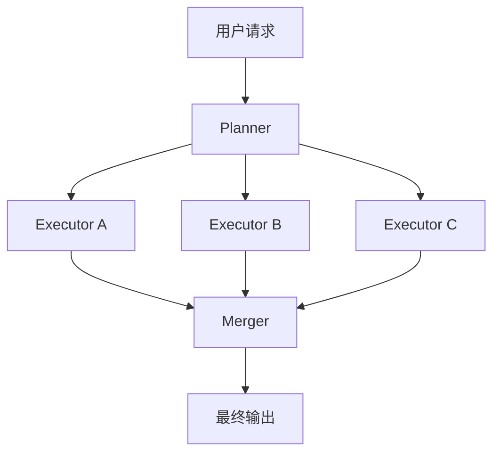

# LangGraph fan-out 与 fan-in 并发子智能体指南

## 概述

本文解释如何用 **LangGraph** 实现一种比 single dispatch tool 更稳定、更显式的多子智能体并发模式：

- **fan-out**：把多个独立子任务并发派发给多个子智能体
- **fan-in**：把多个子任务结果统一收集并汇总

这类模式特别适合：

- 主 Agent 先规划，再批量执行
- 子任务彼此独立，可并发处理
- 需要对并发和汇总过程有更强控制力

---

## 核心概念

### 1. fan-out

fan-out 指的是：

- 主流程先得到执行计划
- 再把计划中的多个独立步骤同时发给不同子代理执行

在实现上，通常通过 `asyncio.gather(...)` 或 LangGraph 子图并发来完成。

### 2. fan-in

fan-in 指的是：

- 当多个子任务都完成后
- 统一把它们的结果收集起来
- 再交给汇总节点（Merger / Summarizer）生成最终输出

### 3. 它和 single dispatch tool 的区别

single dispatch tool 更像：

- 主 Agent 一边思考，一边动态调用子 Agent
- 调度是隐式的
- 是否并发取决于模型和运行时行为

LangGraph fan-out / fan-in 更像：

- 主 Agent 先显式规划
- 再显式批量派发
- 再显式统一回收结果

所以它更适合生产化多子任务执行。

---

## 架构图



---

## 典型适用场景

- 多领域调研：research / writer / reviewer 分头处理
- 多数据源采集：分别检索多个来源，再汇总
- 多模块分析：每个模块交给一个专门子智能体处理
- 多步骤但互不依赖的任务拆解

---

## 最小实现思路

### 1. Planner 输出结构化 Plan

首先由主 Agent 生成结构化计划，明确每一步：

- `step_id`
- `agent_name`
- `task`

```python
from typing import Literal, List
from pydantic import BaseModel, Field


class PlanStep(BaseModel):
    """单个子任务定义"""
    step_id: str = Field(description="步骤 ID")
    agent_name: Literal["researcher", "writer", "reviewer"] = Field(description="负责执行的子代理")
    task: str = Field(description="具体子任务描述")


class ExecutionPlan(BaseModel):
    """规划结果"""
    goal: str = Field(description="用户原始目标")
    steps: List[PlanStep] = Field(description="执行步骤列表")
```

---

### 2. 子代理各自独立执行

为每个角色创建一个 `create_agent(...)`：

```python
from langchain.agents import create_agent

research_agent = create_agent(
    model="openai:gpt-4.1",
    tools=[],
    system_prompt="你是 researcher，负责资料调研和事实整理。"
)

writer_agent = create_agent(
    model="openai:gpt-4.1",
    tools=[],
    system_prompt="你是 writer，负责把信息组织成可读内容。"
)

reviewer_agent = create_agent(
    model="openai:gpt-4.1",
    tools=[],
    system_prompt="你是 reviewer，负责检查质量、风险和遗漏。"
)
```

---

### 3. 并发执行（fan-out）

最关键的步骤是：

```python
import asyncio

results = await asyncio.gather(
    *(run_one_subtask(step) for step in steps)
)
```

这表示：

- 每个步骤由对应子代理处理
- 多个步骤同时执行
- 结果统一收集

一个最小执行函数如下：

```python
async def run_one_subtask(step: dict) -> tuple[str, str]:
    """执行单个子任务"""
    agent = AGENTS[step["agent_name"]]

    result = await agent.ainvoke(
        {
            "messages": [
                {"role": "user", "content": step["task"]}
            ]
        }
    )

    return step["step_id"], result["messages"][-1].content
```

---

### 4. 汇总（fan-in）

把并发结果收集成字典，再交给汇总代理：

```python
step_results = {step_id: content for step_id, content in results}
```

然后由一个 `merge_agent` 或合并节点输出最终答案。

---

## 最小 LangGraph 骨架

```python
from typing import TypedDict
from langgraph.graph import StateGraph, START, END


class WorkflowState(TypedDict):
    """LangGraph 状态"""
    messages: list
    plan: dict | None
    step_results: dict[str, str]
    final_output: str | None


builder = StateGraph(WorkflowState)

builder.add_node("planner", planner_node)
builder.add_node("executor_parallel", execute_parallel_node)
builder.add_node("merge", merge_node)

builder.add_edge(START, "planner")
builder.add_edge("planner", "executor_parallel")
builder.add_edge("executor_parallel", "merge")
builder.add_edge("merge", END)

graph = builder.compile()
```

这就是一个最小的：

> planner → parallel executors → merge

骨架。

---

## 并发控制建议

生产中不要无限制 `gather`，建议加并发限制：

```python
import asyncio

semaphore = asyncio.Semaphore(3)  # 最多同时执行 3 个子任务


async def run_one_subtask(step: dict) -> tuple[str, str]:
    """带并发限制的子任务执行"""
    async with semaphore:
        agent = AGENTS[step["agent_name"]]
        result = await agent.ainvoke(
            {
                "messages": [
                    {"role": "user", "content": step["task"]}
                ]
            }
        )
        return step["step_id"], result["messages"][-1].content
```

这样可以避免：

- 同时打爆模型配额
- 同时打爆外部 API
- 子任务过多时吞吐失控

---

## 与 single dispatch tool 的对比

| 维度 | single dispatch tool | fan-out / fan-in |
|------|----------------------|------------------|
| 调度方式 | 主 Agent 动态逐步调度 | 先规划，再批量派发 |
| 并发能力 | 可有，但较隐式 | 显式并发 |
| 汇总方式 | 主 Agent 边调边汇总 | 专门 fan-in 节点汇总 |
| 适合场景 | 动态、多变、小规模子任务 | 结构化、独立、可并发的大任务 |
| 生产可控性 | 中等 | 高 |

---

## 注意事项

### 1. 只有独立步骤适合并发

如果子任务之间有前后依赖，就不应该直接 `gather(...)`，而应：

- 顺序执行
- 或做分阶段 fan-out / fan-in

### 2. fan-out 不等于更智能

它只是让执行方式更显式、更可控，并不自动提升子代理质量。

### 3. 更生产化的骨架应该增加 Reviewer

一个常见升级版是：

```text
planner -> executor_parallel -> reviewer -> merge
```

这样可以在汇总前先检查：

- 是否有失败任务
- 是否有遗漏结果
- 是否需要重试或返工

### 4. 需要线程恢复时应加 Checkpointer

如果任务链较长，建议给 LangGraph 增加 checkpointer，以支持：

- 断点恢复
- 会话线程持久化
- 长流程稳定运行

---

## 关键结论

1. LangGraph fan-out / fan-in 是一种显式的多子智能体并发模式。  
2. fan-out 负责并发派发独立子任务，fan-in 负责统一回收和汇总结果。  
3. 它比 single dispatch tool 更适合需要结构化计划和稳定并发的大任务。  
4. 典型骨架是：`planner -> parallel executors -> merge`。  
5. 生产环境建议加入：并发限制、review 节点、retry 机制、checkpointer。

---

## 相关资料

- [[Clippings/Subagents.md]]
- [[LangChain/LangChain create_agent主从Agent异步化指南.md]]
- [[LangChain/LangChain学习总结.md]]
- [[AgentFramework/构建支持Skill的多智能体系统.md]]
- [[AgentFramework/LangChain+LangGraph高质量多子代理智能体设计文档.md]]
