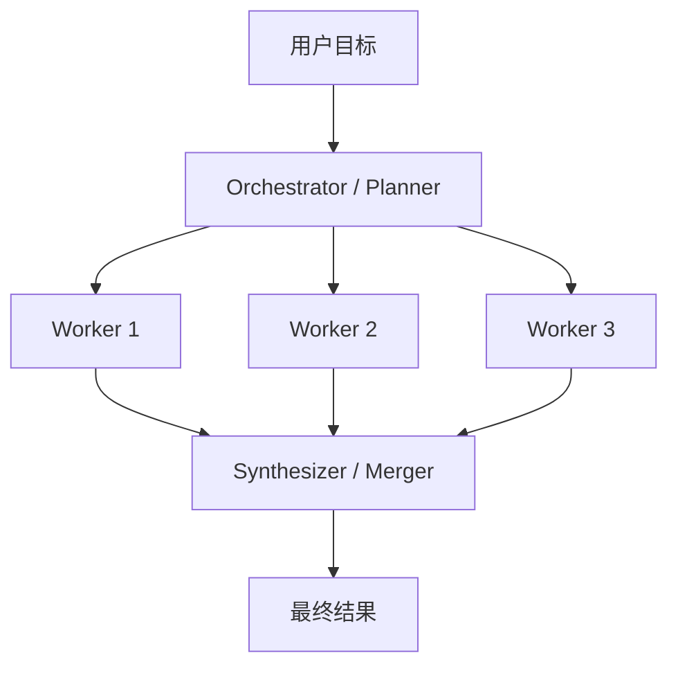

# LangGraph 动态并行与 Send 详解

## 概述

本文系统解释 LangGraph 中的 **动态并行（dynamic parallelism）** 以及核心控制原语 **`Send`**。

如果说 [[LangChain/LangGraph工作流并行化详解.md]] 主要回答的是：

- 什么是并行化
- 固定并行和 fan-out / fan-in 是什么

那么本文重点回答的是：

- 为什么固定并行还不够
- `Send` 到底解决了什么问题
- `Send` 和普通 `add_edge(...)` / `Command` 的区别是什么
- 如何用 `Send` 实现 planner → workers → merger 的动态分发模式

截至 **2026-05-11**，LangGraph 官方文档把 `Send` 明确定位为：

- **map-reduce 工作流** 的控制能力
- **orchestrator-worker** 模式的内建支持
- 适合“下游分支数量在运行时才能确定”的场景

---

## 一句话理解 Send

你可以把 `Send` 理解成：

> **在运行时，动态地创建一批指向某个节点的任务派发指令，并且给每个任务携带各自的局部状态。**

它和固定边最大的区别是：

- 固定边：图编译前就知道要去哪些节点
- `Send`：运行到某个节点时，才知道要派发多少个 worker、每个 worker 拿什么输入

---

## 为什么需要动态并行

固定并行适合这种情况：

- 你提前就知道有 3 个分支
- 分支结构固定不变
- 每个分支逻辑都写死

例如：

- 一个分支生成 joke
- 一个分支生成 story
- 一个分支生成 poem

但现实任务里，经常会遇到下面这些场景：

- planner 先拆出 5 个步骤，下一次可能拆出 12 个步骤
- 要对一批文档逐个处理，但文档数量运行时才知道
- 要对多个 section 分别写内容，但 section 列表由模型先规划出来
- 要根据检索结果数量决定启动多少个分析 worker

这时你不可能预先写死：

```python
builder.add_edge("planner", "worker_1")
builder.add_edge("planner", "worker_2")
builder.add_edge("planner", "worker_3")
```

因为你根本不知道会有多少个 worker。

这就是 `Send` 出场的原因。

---

## Send 解决的核心问题

官方 Graph API 文档里对 `Send` 的核心描述可以概括为两点：

### 1. 下游边的数量运行时才知道

例如：

- 上游节点先生成一个列表
- 列表里有多少个元素，就需要多少个 worker

### 2. 每个下游 worker 需要不同的输入状态

例如：

- worker A 处理 `section_1`
- worker B 处理 `section_2`
- worker C 处理 `section_3`

虽然它们都指向同一个 `write_section` 节点，但每个 worker 接收到的局部 state 不同。

所以 `Send` 的本质就是：

> **同一个节点模板，在运行时被多次实例化，每次带不同输入。**

---

## Send 的基本形式

`Send` 一般长这样：

```python
from langgraph.types import Send


def assign_workers(state):
    """根据上游生成的任务列表，动态派发 worker。"""
    return [
        Send("run_task", {"task": task})
        for task in state["tasks"]
    ]
```

这里每个 `Send(...)` 有两个核心参数：

1. **目标节点名**：例如 `"run_task"`
2. **传给该节点的局部状态**：例如 `{"task": task}`

这意味着：

- 同一个 `run_task` 节点会被运行多次
- 每次运行拿到不同的 `task`
- 最后这些结果再回流到共享状态中

---

## Send 和固定并行的区别

## 1. 固定并行

固定并行是这样的：

```python
builder.add_edge(START, "worker_a")
builder.add_edge(START, "worker_b")
builder.add_edge(START, "worker_c")
```

特点：

- 分支数量固定
- 节点名字固定
- 图结构在编译前就完全确定

适合：

- 三个固定角色
- 固定审查流程
- 固定多路生成

---

## 2. 动态并行

动态并行通常是这样的：

```python
def assign_workers(state):
    return [Send("worker", {"item": item}) for item in state["items"]]
```

特点：

- 分支数量运行时决定
- worker 输入运行时决定
- 很适合 map-reduce / orchestrator-worker

适合：

- planner 先拆任务，再分派
- 批量处理未知数量对象
- 多 section / 多文件 / 多步骤工作流

---

## Send 和 Command 的区别

这两个概念也很容易混。

### `Send`

重点是：

- **一对多派发**
- 动态创建多个并行 worker
- 每个 worker 拿不同局部 state

### `Command`

重点是：

- **一个节点里同时完成状态更新 + 跳转控制**
- 更适合单条控制流路由
- 常用于 if/else、循环跳转、人工审批后 goto 某节点

你可以简单记成：

- `Send` = 动态 fan-out
- `Command` = 单节点里的 goto 控制

---

## Send 和普通 add_edge 的区别

### `add_edge(...)`

适合：

- 静态流程
- 编译前已知的节点关系

### `Send(...)`

适合：

- 动态分发
- 编译前不知道要派发多少个任务
- 同一节点要被运行很多次，每次输入不同

所以两者不是替代关系，而是：

- 静态部分用 `add_edge`
- 动态 fan-out 部分用 `Send`

---

## 最小动态并行骨架

下面给一个最小、最标准的 `Send` 模式骨架。

```python
from typing import Annotated
from typing_extensions import TypedDict
import operator

from langgraph.graph import StateGraph, START, END
from langgraph.types import Send


class MainState(TypedDict):
    """主图状态。

    tasks：上游规划出来的任务列表。
    results：所有 worker 并行写回的共享结果列表。
    """
    topic: str
    tasks: list[str]
    results: Annotated[list[str], operator.add]
    final_output: str


class WorkerState(TypedDict):
    """单个 worker 的局部状态。

    每个 worker 只拿到自己要处理的一条 task。
    """
    task: str
    results: Annotated[list[str], operator.add]


def planner(state: MainState) -> dict:
    """规划阶段：先动态生成任务列表。"""
    return {
        "tasks": [
            f"分析主题 {state['topic']} 的背景",
            f"分析主题 {state['topic']} 的关键问题",
            f"分析主题 {state['topic']} 的最佳实践",
        ]
    }


def assign_workers(state: MainState):
    """根据任务列表动态派发 worker。

    这里返回的是多个 Send 对象，表示同一个 worker 节点会被并发执行多次。
    """
    return [Send("worker", {"task": task}) for task in state["tasks"]]


def worker(state: WorkerState) -> dict:
    """执行单个任务。

    注意：每个 worker 只处理自己的局部 state，
    然后把结果追加写回共享 results。
    """
    return {"results": [f"已完成：{state['task']}"]}


def merge(state: MainState) -> dict:
    """把多个 worker 结果汇总成最终输出。"""
    return {"final_output": "
".join(state["results"])}


builder = StateGraph(MainState)
builder.add_node("planner", planner)
builder.add_node("worker", worker)
builder.add_node("merge", merge)

# 静态部分：先进入 planner
builder.add_edge(START, "planner")

# 动态部分：planner 结束后通过 Send 派发多个 worker
builder.add_conditional_edges("planner", assign_workers, ["worker"])

# fan-in：worker 完成后统一流向 merge
builder.add_edge("worker", "merge")
builder.add_edge("merge", END)

graph = builder.compile()
```

这个骨架里最关键的点有两个：

### 1. `assign_workers()` 返回的是 `list[Send]`

这就不是普通路由了，而是“创建多个 worker 实例”。

### 2. `results` 必须用 reducer

因为多个 worker 会并行写同一个字段：

```python
results: Annotated[list[str], operator.add]
```

如果没有 reducer，后写入的结果可能覆盖前面的结果。

---

## Send 为什么经常和 reducer 一起出现

这是理解 `Send` 时最重要的一点之一。

在动态并行里：

- 多个 worker 同时跑
- 它们往往都要把结果写回同一个共享字段

例如：

- 都写回 `completed_sections`
- 都写回 `results`
- 都写回 `scores`

这时必须告诉 LangGraph：

> 多个并发更新该如何合并？

最常见的就是：

```python
from typing import Annotated
import operator

completed_sections: Annotated[list[str], operator.add]
```

它的意思是：

- 每个 worker 返回一个 list
- LangGraph 在合并状态时用 `operator.add` 进行拼接

这也是官方 `Send` 例子里最常见的写法。

---

## 官方 orchestrator-worker 模式应该怎么理解

官方 Workflows and agents 文档把 `Send` 放在 **orchestrator-worker** 章节里，这非常关键。

这个模式的典型结构是：



Orchestrator 的职责是：

- 把大任务拆成子任务
- 为每个子任务创建 worker
- 最后汇总 worker 输出

Worker 的职责是：

- 只处理单个局部任务
- 不负责全局规划
- 不负责全局汇总

这和普通“固定并行”最大的区别在于：

> worker 的数量不是预先写死的，而是 orchestrator 在运行时决定的。

---

## 一个更贴近多子智能体的例子

如果你在做 planner → subagents → merger，多半会写成这样：

```python
from typing import Annotated, Literal
from typing_extensions import TypedDict
import operator

from langgraph.types import Send


class PlanStep(TypedDict):
    """规划出来的单个步骤。"""
    step_id: str
    agent_name: Literal["researcher", "writer", "reviewer"]
    task: str


class MainState(TypedDict):
    """主图状态。"""
    plan: list[PlanStep]
    step_results: Annotated[list[dict], operator.add]
    final_output: str


class WorkerState(TypedDict):
    """每个 worker 的局部状态。"""
    step: PlanStep
    step_results: Annotated[list[dict], operator.add]


def dispatch_steps(state: MainState):
    """把 planner 产出的步骤动态派发给 worker。"""
    return [Send("run_step", {"step": step}) for step in state["plan"]]
```

然后 `run_step` 里再根据 `agent_name` 选择：

- `research_agent`
- `writer_agent`
- `reviewer_agent`

这就是 LangGraph 中 planner-executor 模式最自然的动态并行写法。

---

## Send 适合什么场景

### 1. 任务数量未知

例如：

- 文档数量未知
- section 数量未知
- planner 生成的步骤数量未知

### 2. 每个任务都能独立处理

例如：

- 每个 section 可单独写
- 每个文件可单独改
- 每个子问题可单独分析

### 3. 需要最后汇总

例如：

- 多个 section 拼成报告
- 多个分析结果合成总结
- 多个 reviewer 打分合成总评

---

## 不适合用 Send 的场景

### 1. 强依赖链路

如果步骤 B 必须依赖步骤 A 的输出，就不适合一次性全派发。

例如：

- 先检索
- 再写作
- 再审查

这类任务更适合：

- 串行链
- 分批 fan-out
- planner + 多轮调度

### 2. 需要细粒度条件回跳

如果每个步骤完成后都可能跳到不同节点，可能更适合：

- `Command`
- 条件边
- 子图封装

### 3. 结果不方便合并

如果 worker 输出之间有很强耦合，聚合逻辑复杂，直接并发派发可能会让 merger 变得很难写。

---

## 常见坑

## 1. 忘了给共享列表字段加 reducer

这是最常见的错误。

错误示意：

```python
class State(TypedDict):
    results: list[str]
```

多个 worker 并发更新 `results` 时，后面的结果可能覆盖前面的结果。

正确示意：

```python
from typing import Annotated
import operator


class State(TypedDict):
    results: Annotated[list[str], operator.add]
```

---

## 2. 把主状态和 worker 局部状态混在一起

`Send` 的强大之处就在于：

- 主图有主图状态
- worker 有自己的局部状态

如果你什么都塞进主状态，代码会越来越乱。

更推荐：

- 主状态只存全局信息
- worker 状态只存单个任务所需的最小上下文

---

## 3. 把 Send 当成 async job 系统

`Send` 是 **图内动态派发**，不是后台任务队列系统。

它解决的是：

- 图中的动态 fan-out
- worker 的局部 state 分发

它不等于：

- 持久化后台任务中心
- 长时间异步作业调度器

如果你想做“主代理先返回，子任务后台跑，稍后查结果”，那更接近：

- async subagents
- job queue
- durable execution + external worker

---

## 4. 明明适合 Send，却在一个节点里手工循环调用子图

官方文档在相关排障页里明确建议：

- 如果你在一个节点里反复命令式地调用图/子图
- 尤其又开启了 checkpointing

那么应优先考虑改成 `Send` 模式。

原因是：

- `Send` 更符合 LangGraph 的图式执行模型
- 更容易获得正确的状态合并与执行语义
- 更不容易踩子图命名空间和 checkpoint 的坑

---

## Send、固定并行、fan-out / fan-in 三者关系

可以这样理解：

### 固定并行

- 是并行化的一种
- 分支数量固定
- 用静态边表达

### `Send` 动态并行

- 也是并行化的一种
- 分支数量动态
- 用 `Send` 表达

### fan-out / fan-in

- 是更抽象的结构模式
- 固定并行和 `Send` 动态并行都可以实现 fan-out / fan-in

所以关系可以总结成：

> `Send` 是实现“动态 fan-out”的官方关键机制。

---

## 实战建议

### 什么时候优先用 Send

如果你满足下面 3 条中的 2 条以上，通常就应该认真考虑 `Send`：

- 下游任务数量在运行时才知道
- 同一个 worker 模板要处理很多个对象
- 结果最终可以合并回一个共享状态字段

### 什么时候先别急着上 Send

如果你只是：

- 固定 2~3 个角色
- 分支结构完全已知
- 不需要动态数量 worker

那普通静态并行就够了，没必要为了“高级”而复杂化。

---

## 与其他知识笔记的关系

如果你想把这个主题串起来看，建议顺序如下：

1. [[LangChain/LangGraph工作流并行化详解.md]]
2. [[LangChain/LangGraph动态并行与Send详解.md]]
3. [[LangChain/LangGraph fan-out与fan-in并发子智能体指南.md]]
4. [[LangChain/LangChain create_agent主从Agent异步化指南.md]]

这个顺序大致对应：

- 先理解并行化本身
- 再理解 `Send` 如何做动态 fan-out
- 再理解它如何用于多子智能体 planner-executor
- 最后再区分 async 和 parallel

---

## 总结

`Send` 可以概括为一句话：

> 当下游 worker 的数量和输入在运行时才能确定时，用 `Send` 把同一个节点模板动态派发成多个并行任务，并通过 reducer 把结果合并回共享状态。

它是 LangGraph 里实现：

- map-reduce
- orchestrator-worker
- planner → parallel workers → merger

这类模式的关键机制。

---

## 参考资料

- [[Clippings/Workflows and agents.md]]
- [[LangChain/LangGraph工作流并行化详解.md]]
- [[LangChain/LangGraph fan-out与fan-in并发子智能体指南.md]]
- LangGraph Graph API overview: <https://docs.langchain.com/oss/python/langgraph/graph-api>
- LangGraph Use the graph API: <https://docs.langchain.com/oss/python/langgraph/use-graph-api>
- LangGraph Workflows and agents: <https://docs.langchain.com/oss/python/langgraph/workflows-agents>
