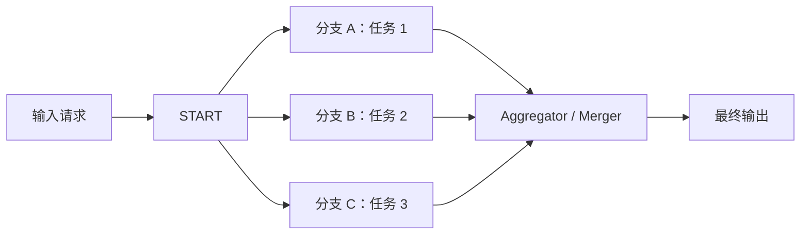
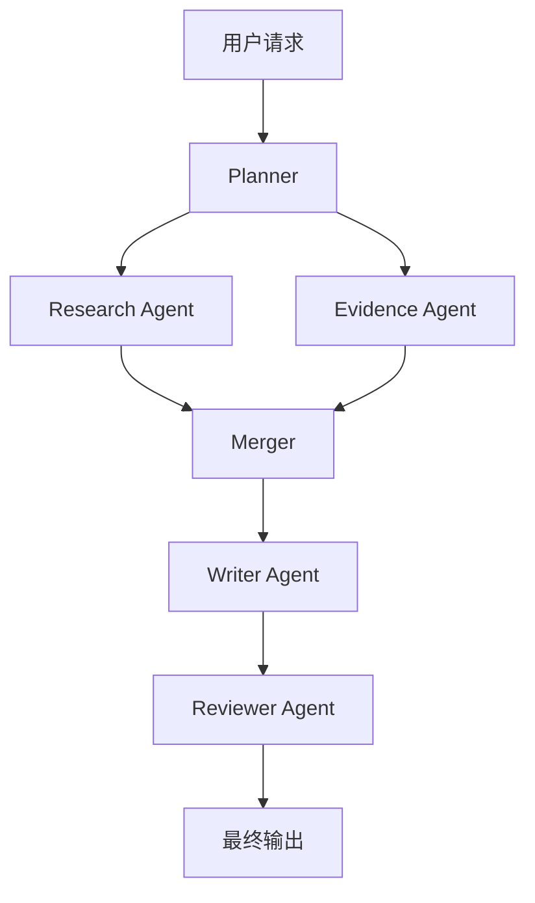

# LangGraph 工作流并行化详解

## 概述

本文基于 [[Clippings/Workflows and agents.md]] 中的 **并行化（Parallelization）** 小节，系统说明 LangGraph 里“并行工作流”到底是什么、适合什么场景、和多子智能体并发有什么关系。

这里的并行化不是“模型自己会并发思考”，而是：

> 在工作流层显式把多个 **彼此独立** 的步骤拆成多个分支，同时执行，最后再统一汇总。

它通常有两个目标：

- **提速**：多个独立子任务同时跑，减少总耗时
- **提质**：同一任务从多个角度并行评估，提高结果置信度

---

## 核心定义

### 1. fan-out

fan-out 指把一个请求拆成多个并行分支，例如：

- 一个分支提取关键词
- 一个分支提取结论
- 一个分支检查格式错误
- 一个分支检查事实引用

### 2. fan-in

fan-in 指多个并行分支执行结束后，把结果统一收回到一个聚合节点（aggregator / merger）进行汇总。

### 3. 并行化的本质

在 LangGraph 中，并行化本质上是 **图结构级别的并发编排**：

- 多条边从同一个起点发出
- 多个节点可以在没有依赖关系时同时运行
- 汇总节点负责读取多个分支结果并合成最终输出

---

## 两类常见并行化

## 1. 异构并行：不同任务同时执行

这是文档中的直接示例：

- `call_llm_1` 写 joke
- `call_llm_2` 写 story
- `call_llm_3` 写 poem
- `aggregator` 汇总结果

这种模式适合：

- 多维分析
- 多角色协作
- 多来源采集
- 多模块拆分处理

### 典型例子

- `research_agent` 调研资料
- `evidence_agent` 抽取证据
- `writer_agent` 组织表达
- `review_agent` 审核质量

其中 research / evidence 往往可以并行，writer / review 则可能放在后面串行衔接。

---

## 2. 同构并行：同一任务执行多次

同构并行不是让不同分支做不同事，而是让它们对 **同一个目标** 从不同标准出发分别评估。

例如：

- 分支 A：按引用次数打分
- 分支 B：按来源数量打分
- 分支 C：按来源质量打分

最后再由汇总节点输出综合判断。

这种模式适合：

- 多评审打分
- 结果交叉验证
- 降低单次模型输出偶然性
- 提升结果鲁棒性

---

## 在 LangGraph 中是怎么实现的

在 [[Clippings/Workflows and agents.md]] 的示例里，关键代码是：

```python
parallel_builder.add_edge(START, "call_llm_1")
parallel_builder.add_edge(START, "call_llm_2")
parallel_builder.add_edge(START, "call_llm_3")
```

它表示：

- 从 `START` 同时派发到 3 个节点
- 这 3 个节点之间没有依赖关系
- 所以它们可以并行执行

随后：

```python
parallel_builder.add_edge("call_llm_1", "aggregator")
parallel_builder.add_edge("call_llm_2", "aggregator")
parallel_builder.add_edge("call_llm_3", "aggregator")
```

表示：

- 三个分支完成后
- 再进入统一汇总节点 `aggregator`

这就是一个典型的：

> **fan-out → parallel workers → fan-in**

---

## 架构图



---

## 为什么文档示例不需要 reducer

文档里的状态大致是这样：

```python
class State(TypedDict):
    topic: str
    joke: str
    story: str
    poem: str
    combined_output: str
```

这里每个并行分支写的是 **不同字段**：

- `call_llm_1` 只写 `joke`
- `call_llm_2` 只写 `story`
- `call_llm_3` 只写 `poem`

因此不会出现并发覆盖问题，所以不需要 reducer。

但如果多个并行节点都要写同一个字段，例如都写 `results: list`，那就应该给状态加 reducer，例如：

```python
from typing import Annotated
from typing_extensions import TypedDict
import operator


class State(TypedDict):
    # 使用 operator.add 把多个并行分支的列表结果拼接起来
    results: Annotated[list[str], operator.add]
```

否则后一个分支可能会覆盖前一个分支的结果。

---

## 一个最小固定并行示例

下面是一个适合入门理解的固定并行骨架：

```python
from typing_extensions import TypedDict
from langgraph.graph import StateGraph, START, END


class State(TypedDict):
    """工作流状态。

    这里每个分支写不同字段，因此不需要 reducer。
    """
    topic: str
    joke: str
    story: str
    poem: str
    combined_output: str


def write_joke(state: State) -> dict:
    """生成笑话分支。"""
    return {"joke": f"这是一个关于 {state['topic']} 的笑话"}


def write_story(state: State) -> dict:
    """生成故事分支。"""
    return {"story": f"这是一个关于 {state['topic']} 的故事"}


def write_poem(state: State) -> dict:
    """生成诗歌分支。"""
    return {"poem": f"这是一个关于 {state['topic']} 的诗"}


def aggregate(state: State) -> dict:
    """汇总多个并行分支输出。"""
    combined = (
        f"主题：{state['topic']}

"
        f"故事：{state['story']}

"
        f"笑话：{state['joke']}

"
        f"诗歌：{state['poem']}"
    )
    return {"combined_output": combined}


builder = StateGraph(State)
builder.add_node("write_joke", write_joke)
builder.add_node("write_story", write_story)
builder.add_node("write_poem", write_poem)
builder.add_node("aggregate", aggregate)

# 从 START 同时发出三个并行分支
builder.add_edge(START, "write_joke")
builder.add_edge(START, "write_story")
builder.add_edge(START, "write_poem")

# 三个分支最终统一流向聚合节点
builder.add_edge("write_joke", "aggregate")
builder.add_edge("write_story", "aggregate")
builder.add_edge("write_poem", "aggregate")
builder.add_edge("aggregate", END)

graph = builder.compile()
```

这个例子展示的是 **固定并行**：

- 分支数量固定
- 节点提前写死
- 结构简单直观

---

## 固定并行 vs 动态并行

### 1. 固定并行

固定并行适合：

- 分支数量固定
- 角色固定
- 流程结构事先就知道

例如：

- 固定三个评审分支
- 固定两个检索器 + 一个总结器

### 2. 动态并行

动态并行适合：

- 先规划再执行
- 分支数量不固定
- 具体执行步骤由 planner 临时生成

这时通常会用 LangGraph 的 `Send(...)` 模式：

- planner 先输出步骤列表
- 再把步骤 fan-out 给多个 worker
- worker 完成后由 merger fan-in 汇总

如果你要的是 **多子智能体先规划、后并发执行**，可继续看：

- [[LangChain/LangGraph fan-out与fan-in并发子智能体指南.md]]

---

## 并行化和 create_agent 的区别

### LangGraph 并行化

LangGraph 的并行化是：

- 由你显式定义图结构
- 哪些分支并行、哪些节点汇总，都是工作流设计的一部分
- 更适合生产级、可控、可调试的流程

### create_agent 的并行工具调用

`create_agent` 也可能在同一轮里发起多个工具调用，但那更偏：

- 模型回合内的运行时能力
- 是否并行往往由模型决策和运行时支持决定
- 并不是你显式写好的图式工作流

所以：

> **LangGraph 并行化 = 工作流级并发编排**  
> **create_agent 并行工具调用 = agent 回合内可能发生的并发能力**

---

## 并行化和 async subagents 的区别

这两个概念经常混淆，但关注点不同：

### 并行化关注的是

- 多个任务是否同时执行

### async subagents 关注的是

- 主代理是否阻塞等待
- 子任务是否作为后台 job 运行

所以：

- `parallel` = 同时跑多个任务
- `async` = 主流程是否等待这些任务完成

二者不是同一维度。

---

## 适用场景

并行化特别适合以下任务：

- **多维分析**：从不同视角同时分析一个对象
- **多来源检索**：同时查询多个来源，再汇总
- **多角色协作**：research / writer / reviewer 分工并行
- **多评审打分**：不同 judge 并行评估同一结果
- **批量子任务处理**：多个相互独立的步骤同时跑

---

## 常见风险与坑

### 1. 把有依赖关系的任务错误并行

如果 B 必须依赖 A 的输出，例如：

- 先检索资料
- 再根据资料写结论

那它们就不该并行，而应串行。

### 2. 多个并行节点写同一个字段

如果没有 reducer，很容易出现覆盖问题。

### 3. 汇总节点太弱

并行只是把结果跑出来，最终质量通常取决于 aggregator / merger 是否能：

- 去重
- 消解冲突
- 统一结构
- 给出最终判断

### 4. 成本和速率限制

并行化会提高：

- token 消耗
- 并发请求数
- 命中限流的概率

因此要结合模型配额和预算设计并发规模。

---

## 如何判断要不要并行

你可以用下面这个判断标准：

### 适合并行

如果多个任务满足：

- 输入相同或容易独立获得
- 彼此没有顺序依赖
- 结果可以后置汇总

那么很适合并行。

### 不适合并行

如果多个任务满足：

- 后一步依赖前一步结果
- 需要逐轮修正
- 需要循环反馈

那么更适合：

- 串行链
- 路由
- 反思/循环图
- planner + 分批执行

---

## 与多子智能体系统的关系

在多子智能体架构里，并行化通常表现为：



可以看到，真正高质量的系统往往不是“全图并行”，而是：

> **局部并行 + 整体串并结合**

这比单纯让一个主 agent 在一个大上下文里一次性完成所有事情，更容易控制质量和成本。

---

## 总结

[[Clippings/Workflows and agents.md]] 里的并行化可以概括为一句话：

> 在 LangGraph 中，把彼此独立的子任务拆成多个并发分支执行，再由聚合节点统一汇总，以换取更高速度或更高置信度。

如果你后续继续深入，建议把它和下面两篇一起看：

- [[LangChain/LangGraph fan-out与fan-in并发子智能体指南.md]]
- [[LangChain/LangChain create_agent主从Agent异步化指南.md]]

---

## 参考资料

- [[Clippings/Workflows and agents.md]]
- LangGraph Workflows and agents: <https://docs.langchain.com/oss/python/langgraph/workflows-agents>
- LangGraph Graph API: <https://docs.langchain.com/oss/python/langgraph/graph-api>
- LangGraph Use the Graph API: <https://docs.langchain.com/oss/python/langgraph/use-graph-api>
