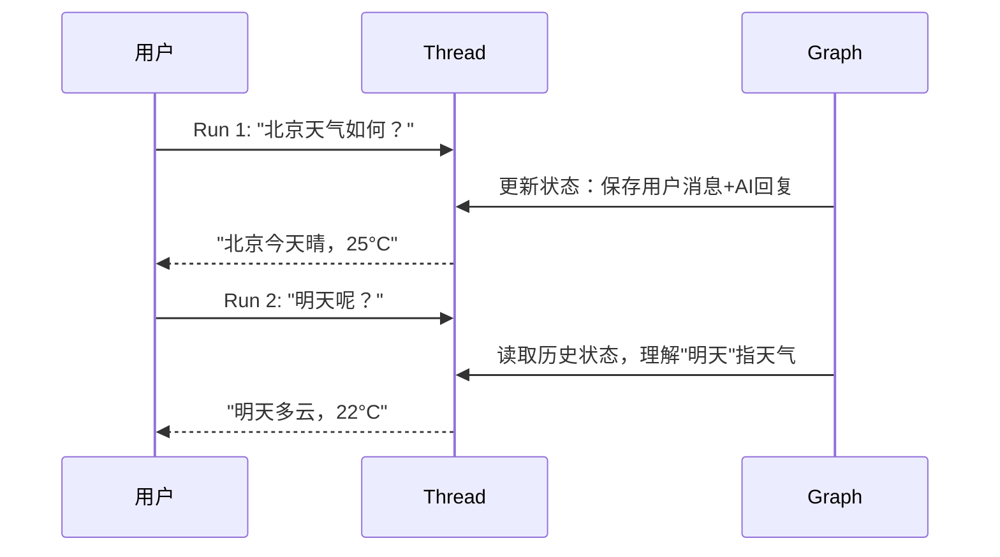

# LangSmith Threads 使用指南

## 概述

LangSmith Threads 是 LangChain Agent Server 中的核心概念，用于在已部署的 LangGraph 应用中实现**有状态的持久化对话**。线程（Thread）与助手（Assistant）配合，让你的 Graph 能够跨多次 Run 记住对话历史和上下文。

> **文档源：** [Use threads - LangChain Docs](https://docs.langchain.com/langsmith/use-threads)  
> **补充：** [Configure threads](https://docs.langchain.com/langsmith/threads) | [Multi-turn Simulation](https://docs.langchain.com/langsmith/multi-turn-simulation)

---

## 核心概念

```
Assistant（助手）  ──定义配置──>  模型、Prompt、工具
Thread（线程）     ──维护状态──>  对话历史、上下文
Run（运行）        ──执行图──>    Assistant + Thread → 有状态输出
```

**三者关系：**
- **Assistant**：定义如何执行（用哪个模型、Prompt、工具）
- **Thread**：持久化存储状态（多轮对话历史）
- **Run**：在某个 Thread 上执行 Assistant，产生一次状态更新

> ⚠️ **最佳实践：** 在线程中追踪 Runs 时，务必在所有 Run（父级和子级）上都设置 `thread_id`，否则线程过滤、Token 计数和线程级评估无法正常工作。

---

## 创建线程

### 空线程

```python
from langgraph_sdk import get_client

client = get_client(url="<DEPLOYMENT_URL>")

# 创建空线程（无初始状态）
thread = await client.threads.create()
print(thread)
```

输出：

```json
{
  "thread_id": "123e4567-e89b-12d3-a456-426614174000",
  "created_at": "2025-05-12T14:04:08.268Z",
  "updated_at": "2025-05-12T14:04:08.268Z",
  "metadata": {},
  "status": "idle",
  "values": {}
}
```

### 复制已有线程

```python
# 复制一个已有线程，复制时刻状态完全一致
copied_thread = await client.threads.copy(thread["thread_id"])
```

### 带预填充状态的线程

用 `supersteps` 可以创建一个带有预设对话历史的线程，适用于：
- 从其他系统迁移对话
- 设置测试场景的初始状态
- 恢复历史会话

```python
thread = await client.threads.create(
    graph_id="agent",
    supersteps=[
        {
            "updates": [
                {"values": {}, "as_node": "__input__"}
            ]
        },
        {
            "updates": [
                {
                    "values": {
                        "messages": [{"type": "human", "content": "hello"}]
                    },
                    "as_node": "__start__"
                }
            ]
        },
        {
            "updates": [
                {
                    "values": {
                        "messages": [{"type": "ai", "content": "Hello! How can I assist you today?"}]
                    },
                    "as_node": "call_model"
                }
            ]
        }
    ]
)
```

---

## 查看线程列表

```python
# 按状态过滤：idle | busy | interrupted | error
idle_threads = await client.threads.search(status="idle", limit=10)

# 按 metadata 过滤（如按 graph_id、user_id 筛选）
filtered = await client.threads.search(
    metadata={"graph_id": "agent"},
    limit=20
)

# 排序：支持 thread_id / status / created_at / updated_at
sorted_threads = await client.threads.search(
    sort_by="updated_at",
    sort_order="desc",
    limit=50
)
```

---

## 查看线程详情

### 获取单个线程

```python
t = await client.threads.get(thread["thread_id"])
```

### 查看当前状态

```python
state = await client.threads.get_state(thread["thread_id"])
# 返回 values（当前消息历史）、next（下一步节点）、checkpoint 信息
```

### 查看历史任意时刻的状态

```python
# 先从历史中获取 checkpoint_id
history = await client.threads.get_history(thread["thread_id"])
checkpoint_id = history[0]["checkpoint_id"]  # 最新 checkpoint

# 用 checkpoint_id 查看历史状态
historical_state = await client.threads.get_state(
    thread["thread_id"],
    checkpoint_id=checkpoint_id
)
```

### 查看完整执行历史

```python
history = await client.threads.get_history(
    thread["thread_id"],
    limit=10
)
for state in history:
    print(f"Checkpoint: {state['checkpoint_id']}, Step: {state['metadata']['step']}")
```

适用场景：
- 调试执行流程，观察状态如何演变
- 理解决策点
- 审计对话历史

---

## 应用场景

### 1. 多轮对话（Chatbot）

典型场景：用户问"北京天气如何？" → 再问"明天呢？"



### 2. 客服系统（多 Agent 交接）

通过 Threads 维护用户会话，LangGraph 的 Agent Handoffs 机制让多个专业 Agent（退款、订单、技术支持）在同一 Thread 中无缝交接，对用户呈现连贯上下文。

### 3. 长时间任务（多步骤执行）

用户发起一个数据报告生成任务，Agent 需要执行搜索→分析→写报告多个步骤。用户可以随时返回 Thread 继续，状态不会丢失。

### 4. 对话评估与微调

利用 LangSmith 的 [Multi-turn Evaluation](https://docs.langchain.com/langsmith/online-evaluations-multi-turn)，用 `thread_id` 将整个对话链路关联起来做端到端质量评估。

```python
from openevals.simulators import run_multiturn_simulation

inputs = {"role": "user", "content": "I want a refund for my car!"}
system = "You are a nice customer who wants a refund for their car."

def app(next_message, *, thread_id: str):
    # 调用你的 LangGraph，thread_id 确保状态连贯
    return assistant.invoke({"messages": [HumanMessage(content=next_message)]},
                             config={"configurable": {"thread_id": thread_id}})

result = run_multiturn_simulation(
    inputs=inputs,
    system=system,
    app=app,
)
```

### 5. 用户个性化状态管理

每个用户有独立的 Thread，存储该用户的历史偏好、任务进度和上下文。系统可以根据 `metadata`（如 `user_id`）快速筛选属于某用户的所有线程。

---

## 线程状态说明

| 状态 | 含义 |
|------|------|
| `idle` | 线程空闲，等待新输入 |
| `busy` | 正在执行 Run |
| `interrupted` | 被 Human-in-the-loop 中断 |
| `error` | 执行出错 |

---

## 关键注意事项

1. **`thread_id` 必须传递到所有子 Run**：否则线程过滤和评估会失效
2. **复制线程是独立副本**：原线程后续的更新不会影响已复制的线程
3. **预填充状态用 supersteps**：适合迁移场景，但需要了解 LangGraph 的 Checkpoint 机制
4. **历史状态只读**：通过 `get_history` 获取的是快照，不可直接修改

---

## 参考资料

- [Use threads - LangChain Docs](https://docs.langchain.com/langsmith/use-threads)
- [Configure threads - LangChain Docs](https://docs.langchain.com/langsmith/threads)
- [Multi-turn Simulation](https://docs.langchain.com/langsmith/multi-turn-simulation)
- [Multi-turn Online Evaluators](https://docs.langchain.com/langsmith/online-evaluations-multi-turn)
- [Customer Support with Handoffs](https://docs.langchain.com/oss/python/langchain/multi-agent/handoffs-customer-support)
- [Build a Stateful Chatbot with LangGraph & LangSmith (Medium)](https://medium.com/codex/building-a-stateful-chatbot-with-langgraph-and-langsmith-75aacccdc03f)
