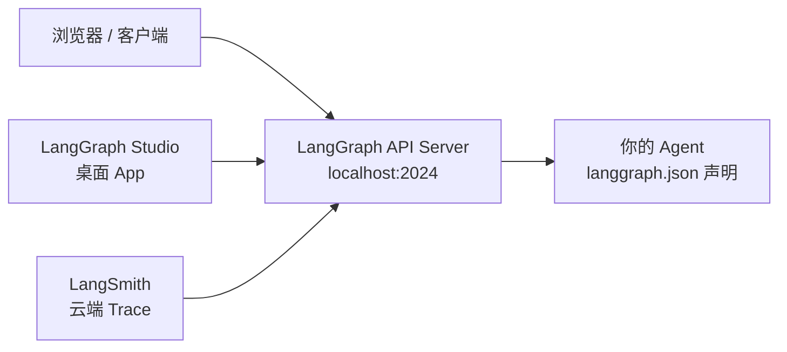

# LangGraph Dev 开发与调试指南

## 概述

LangGraph 是 LangChain 出品的"可靠 agent 开发框架"，核心思想是用**图（Graph）**来描述 agent 的工作流程，每个节点（Node）是步骤，边（Edge）是流转逻辑。

本文档重点解决两个问题：

1. 如何用 `langgraph dev` 启动一个自定义 agent 的 API 服务
2. 如何调试 agent 的执行过程

---

## 架构总览



三层关系：

| 层级 | 地址 | 作用 |
|------|------|------|
| **LangGraph Studio** | 桌面 App（仅 macOS） | 可视化 graph、单步调试、看 trace |
| **LangGraph API Server** | `http://localhost:2024` | REST API，管理 threads/runs，Swagger 文档 |
| **你的 Agent** | `langgraph.json` 声明 | 实际业务逻辑，被 API Server 调用 |

---

## 快速开始

### 1. 写一个最简单的 Agent

创建 `my_agent.py`：

```python
from langchain_openai import ChatOpenAI
from langgraph.prebuilt import create_react_agent

def make_agent():
    model = ChatOpenAI(model="gpt-4o")
    return create_react_agent(model, tools=[])
```

> 这里用的是 `create_react_agent`——LangGraph 内置的 ReAct 风格 agent，省去自己写图结构的麻烦。后续可以换成本地模型（Ollama 等）。

### 2. 写 `langgraph.json`

```json
{
  "python_version": "3.12",
  "dependencies": [],
  "graphs": {
    "my_agent": "my_agent:make_agent"
  }
}
```

**关键字段说明：**

| 字段 | 含义 |
|------|------|
| `graphs` | 图名称 → 可调用对象的映射 |
| `my_agent` | 之后 API 调用时的 `assistant_id` |
| `python_version` | 运行时 Python 版本 |

### 3. 启动服务

```bash
langgraph dev --config langgraph.json --port 2024
```

服务启动后：

```
  LangGraph API Server running at: http://localhost:2024
  API Documentation at: http://localhost:2024/docs
```

---

## API 调试（不需要 LangGraph Studio）

启动后直接访问 Swagger 文档：**http://localhost:2024/docs**

可以手动调 API 来调试 agent：

### 常用 API

**查看已注册的 agent：**

```bash
curl http://localhost:2024/assistants | python3 -m json.tool
```

**创建 Thread（agent 的会话上下文）：**

```bash
curl -X POST http://localhost:2024/threads \
  -H "Content-Type: application/json" \
  -d '{}'
# 返回 {"thread_id": "xxx"}
```

**触发一次 Agent 执行：**

```bash
curl -X POST http://localhost:2024/threads/<thread_id>/runs \
  -H "Content-Type: application/json" \
  -d '{
    "assistant_id": "my_agent",
    "input": {
      "messages": [{"role": "user", "content": "你好"}]
    }
  }'
```

**查看执行后的状态：**

```bash
curl http://localhost:2024/threads/<thread_id>/state | python3 -m json.tool
```

---

## 配合 LangGraph Studio 调试（图可视化）

### 安装（仅 macOS）

```bash
brew install --cask langgraph-studio
```

装完后：

1. 打开 LangGraph Studio，登录 LangSmith 账号
2. 选择项目目录（包含 `langgraph.json` 的目录）
3. Studio 自动连接 `localhost:2024`
4. 可以：
   - 可视化查看 agent 的 graph 结构
   - 单步执行（step-through）
   - 查看每次 node 执行的输入输出
   - 查看完整 trace

### 如果没有 macOS

用 **LangSmith** 看 trace（云端，需要注册）：

1. 去 [smith.langchain.com](https://smith.langchain.com) 注册
2. 获取 API Key
3. 启动服务时加上环境变量：

```bash
LANGSMITH_API_KEY=your_key \
LANGSMITH_TRACING=true \
langgraph dev --config langgraph.json
```

然后去 LangSmith 的 Runs 页面查看每次执行的完整 trace。

---

## `langgraph.json` 完整配置

```json
{
  "$schema": "https://langgra.ph/schema.json",
  "python_version": "3.12",
  "dependencies": [
    "langchain-openai",
    "langchain-community"
  ],
  "env": ".env",
  "graphs": {
    "my_agent": "my_agent:make_agent"
  },
  "checkpointer": {
    "path": "checkpointer_module:make_checkpointer"
  }
}
```

| 字段 | 必填 | 说明 |
|------|------|------|
| `python_version` | 是 | 运行时 Python 版本 |
| `dependencies` | 否 | 额外 pip 依赖 |
| `graphs` | 是 | 图声明，`名称 → 函数` 映射 |
| `env` | 否 | `.env` 文件路径 |
| `checkpointer` | 否 | 状态持久化，支持内存或磁盘 |

---

## 进阶：从 ReAct Agent 到自定义 Graph

`create_react_agent` 是现成的，如果需要更细粒度地控制每一步，可以自己写 graph：

```python
from langgraph.graph import StateGraph, MessagesState
from langchain_openai import ChatOpenAI
from langgraph.prebuilt import ToolNode

model = ChatOpenAI(model="gpt-4o")
tool_node = ToolNode(tools=[...])

def should_continue(state: MessagesState):
    last_msg = state["messages"][-1]
    if last_msg.tool_calls:
        return "tools"
    return END

graph = (
    StateGraph(MessagesState)
    .add_node("llm", model.bind_tools([...]))
    .add_node("tools", tool_node)
    .add_edge("__start__", "llm")
    .add_conditional_edges("llm", should_continue, {
        "tools": "tools",
        END: END
    })
    .add_edge("tools", "llm")
    .compile()
)

# 导出为 langgraph.json 中的 make_agent
def make_agent():
    return graph
```

---

## 常用命令

| 操作 | 命令 |
|------|------|
| 启动 dev server | `langgraph dev --config langgraph.json` |
| 指定端口 | `langgraph dev --config langgraph.json --port 8000` |
| 禁用热更新 | `langgraph dev --config langgraph.json --no-reload` |
| 查看 CLI 帮助 | `langgraph dev --help` |
| 检查服务健康 | `curl http://localhost:2024/ok` |
| 查看 API 信息 | `curl http://localhost:2024/info` |

---

## 注意事项

- `langgraph dev` 默认绑定 `127.0.0.1`，生产暴露需加 `--host 0.0.0.0`（谨慎）
- `langgraph.json` 中的 `graphs` 名称即 `assistant_id`，在整个 API 中唯一
- Thread 是 agent 的会话上下文，跨请求保持状态； Runs 是单次执行
- LangGraph Studio 目前**仅支持 macOS**，Windows/Linux 只能用 LangSmith

---

## 参考资料

- [LangGraph 官方文档](https://langchain-ai.github.io/langgraph/)
- [LangGraph Studio 下载](https://github.com/langchain-ai/langgraph-studio/releases)
- [LangSmith 注册](https://smith.langchain.com)
- [LangGraph CLI 参考](https://langchain-ai.github.io/langgraph/how-to/cli/)
