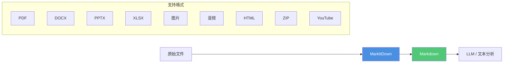

# MarkItDown 使用指南

## 概述

MarkItDown 是微软开源的 Python 工具，用于将各种文件格式转换为 Markdown，可用于 LLM 文本分析流程。

**发布于：** 2025年9月15日
**GitHub：** https://github.com/microsoft/markitdown
**PyPI：** https://pypi.org/project/markitdown/

## 支持的文件格式

| 格式 | 说明 |
|------|------|
| PDF | 支持文本提取、表格提取、OCR 扫描件 |
| PowerPoint (.pptx) | 保留幻灯片结构、标题、列表 |
| Word (.docx) | 保留标题、列表、表格、链接 |
| Excel (.xlsx / .xls) | 转换表格数据 |
| 图片 | EXIF 元数据 + OCR 文字识别 + LLM 图像描述 |
| 音频 | EXIF 元数据 + 语音转录 |
| HTML | 网页转 Markdown |
| CSV / JSON / XML | 结构化文本 |
| ZIP 文件 | 遍历内部所有文件 |
| YouTube URL | 视频字幕转录 |
| EPUB | 电子书 |
| Outlook 邮件 (.msg) | |

## 为什么用 Markdown？

- Markdown 接近纯文本，标记少，token 效率高
- GPT-4o 等主流 LLM 原生"理解"Markdown
- 保留文档结构（标题、列表、表格、链接）

---

## 安装

### 环境要求

- Python 3.10+
- 推荐使用虚拟环境

### 安装所有依赖

```bash
pip install 'markitdown[all]'
```

### 从源码安装

```bash
git clone git@github.com:microsoft/markitdown.git
cd markitdown
pip install -e 'packages/markitdown[all]'
```

### 按需安装可选依赖

| 依赖组 | 安装命令 | 用途 |
|--------|----------|------|
| `pptx` | `pip install 'markitdown[pptx]'` | PowerPoint 文件 |
| `docx` | `pip install 'markitdown[docx]'` | Word 文件 |
| `xlsx` | `pip install 'markitdown[xlsx]'` | Excel (.xlsx) |
| `xls` | `pip-install 'markitdown[xls]'` | 旧版 Excel (.xls) |
| `pdf` | `pip install 'markitdown[pdf]'` | PDF 文件 |
| `outlook` | `pip install 'markitdown[outlook]'` | Outlook 邮件 |
| `az-doc-intel` | `pip install 'markitdown[az-doc-intel]'` | Azure Document Intelligence |
| `audio-transcription` | `pip install 'markitdown[audio-transcription]'` | 音频转录（wav/mp3） |
| `youtube-transcription` | `pip install 'markitdown[youtube-transcription]'` | YouTube 字幕 |

---

## 使用方法

### 命令行

#### 基本用法

```bash
markitdown path-to-file.pdf > document.md
```

#### 指定输出文件

```bash
markitdown path-to-file.pdf -o document.md
```

#### 管道输入

```bash
cat path-to-file.pdf | markitdown
```

#### 使用 Azure Document Intelligence

```bash
markitdown path-to-file.pdf -o document.md -d -e "<document_intelligence_endpoint>"
```

#### 查看已安装插件

```bash
markitdown --list-plugins
```

#### 启用插件

```bash
markitdown --use-plugins path-to-file.pdf
```

### Python API

#### 基本用法

```python
from markitdown import MarkItDown

md = MarkItDown(enable_plugins=False)
result = md.convert("test.xlsx")
print(result.text_content)
```

#### 使用 LLM 生成图片描述（仅支持 pptx 和图片）

```python
from markitdown import MarkItDown
from openai import OpenAI

client = OpenAI()
md = MarkItDown(
    llm_client=client,
    llm_model="gpt-4o",
    llm_prompt="optional custom prompt"  # 可选
)
result = md.convert("example.jpg")
print(result.text_content)
```

#### 使用 Azure Document Intelligence

```python
from markitdown import MarkItDown

md = MarkItDown(docintel_endpoint="<document_intelligence_endpoint>")
result = md.convert("test.pdf")
print(result.text_content)
```

#### 启用插件

```python
from markitdown import MarkItDown
from openai import OpenAI

md = MarkItDown(enable_plugins=True, llm_client=OpenAI(), llm_model="gpt-4o")
result = md.convert("document_with_images.pdf")
print(result.text_content)
```

### Docker

```bash
docker build -t markitdown:latest .
docker run --rm -i markitdown:latest < ~/your-file.pdf > output.md
```

---

## OCR 插件（markitdown-ocr）

> [!TIP]
> 需要安装：`pip install markitdown-ocr`

OCR 插件可以从 PDF、DOCX、PPTX、XLSX 的嵌入式图片中提取文字，使用 LLM Vision，无需额外的 ML 库或二进制依赖。

```python
from markitdown import MarkItDown
from openai import OpenAI

md = MarkItDown(
    enable_plugins=True,
    llm_client=OpenAI(),
    llm_model="gpt-4o",
)
result = md.convert("document_with_images.pdf")
print(result.text_content)
```

---

## MCP 服务器（markitdown-mcp）

> [!IMPORTANT]
> MCP 服务器仅供本地使用。HTTP/SSE 模式默认绑定 `localhost`，不会暴露到网络。

MarkItDown 提供 MCP（Model Context Protocol）服务器，可与 Claude Desktop 等 LLM 应用集成。

### 安装

```bash
pip install markitdown-mcp
```

### 启动 MCP 服务器

**STDIO 模式（默认）：**

```bash
markitdown-mcp
```

**Streamable HTTP 模式：**

```bash
markitdown-mcp --http --host 127.0.0.1 --port 3001
```

### Docker 运行

```bash
# 构建镜像
docker build -t markitdown-mcp:latest .

# 基础运行
docker run --rm -i markitdown-mcp:latest

# 挂载本地目录（访问本地文件）
docker run --rm -i -v /home/user/data:/workdir markitdown-mcp:latest
```

### Claude Desktop 配置

```json
{
  "mcpServers": {
    "markitdown": {
      "command": "docker",
      "args": ["run", "--rm", "-i", "markitdown-mcp:latest"]
    }
  }
}
```

### 挂载目录的写法

```json
{
  "mcpServers": {
    "markitdown": {
      "command": "docker",
      "args": [
        "run", "--rm", "-i",
        "-v", "/home/user/data:/workdir",
        "markitdown-mcp:latest"
      ]
    }
  }
}
```

### 调试

使用 MCP Inspector：

```bash
npx @modelcontextprotocol/inspector
```

- STDIO 传输：输入命令 `markitdown-mcp`
- HTTP 传输：输入 URL `http://127.0.0.1:3001/mcp`

---

## 架构流程图



---

## 重要更新（Breaking Changes 0.0.1 → 0.1.0）

1. **依赖分组**：使用 `pip install 'markitdown[all]'` 保持向后兼容
2. **convert_stream() 签名变化**：现在接受二进制文件对象（如 `file opened in 'rb'` 或 `io.BytesIO`），不再接受 `io.StringIO`
3. **DocumentConverter 接口变化**：改用文件流而非文件路径，**不再创建临时文件**

---

## 参考资料

- GitHub 仓库：https://github.com/microsoft/markitdown
- PyPI：https://pypi.org/project/markitdown/
- markitdown-mcp：https://github.com/microsoft/markitdown/tree/main/packages/markitdown-mcp
- markitdown-ocr：https://github.com/microsoft/markitdown/tree/main/packages/markitdown-ocr
