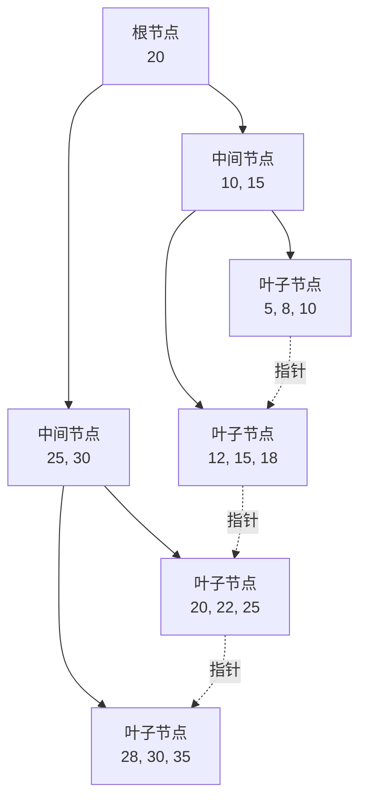
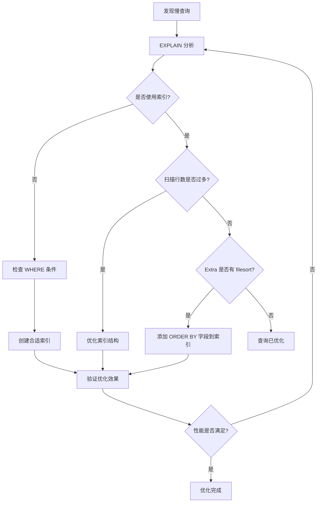

# MySQL 索引优化

## 概述

索引是 MySQL 中提高查询效率的核心机制。合理的索引设计可以将查询性能提升数倍甚至数百倍，而不当的索引则可能导致性能下降和存储浪费。本文档系统介绍 MySQL 索引的原理、类型、优化策略和最佳实践。

## 索引类型

### 1. 主键索引（PRIMARY KEY）

```sql
CREATE TABLE users (
    id INT AUTO_INCREMENT PRIMARY KEY,
    name VARCHAR(50)
);
```

**特点：**
- 唯一且非空
- 每个表只能有一个主键
- 自动创建聚簇索引

### 2. 唯一索引（UNIQUE）

```sql
CREATE UNIQUE INDEX idx_email ON users(email);
```

**特点：**
- 索引列值必须唯一
- 允许 NULL 值

### 3. 普通索引（INDEX）

```sql
CREATE INDEX idx_name ON users(name);
```

**特点：**
- 最基本的索引类型
- 无唯一性约束

### 4. 组合索引

```sql
CREATE INDEX idx_name_age ON users(name, age);
```

**特点：**
- 多列组合
- 遵循最左前缀原则

### 5. 全文索引（FULLTEXT）

```sql
CREATE FULLTEXT INDEX idx_content ON articles(content);
```

**特点：**
- 用于文本搜索
- 支持中文分词（MySQL 5.7.6+）

## 索引数据结构

### B+树结构

MySQL 默认使用 B+树作为索引结构：



**B+树特点：**

| 特点 | 说明 |
|------|------|
| 高度低 | 通常 3-4 层即可存储千万级数据 |
| 范围查询 | 叶子节点链表连接，支持范围扫描 |
| 稳定性 | 所有查询都要走到叶子节点 |

### 聚簇索引 vs 非聚簇索引


**聚簇索引：**
- 数据存储在叶子节点
- 主键自动成为聚簇索引
- 查询效率最高

**非聚簇索引：**
- 叶子节点存储主键值
- 需要回表查询获取完整数据
- 覆盖索引可避免回表

## 索引优化策略

### 1. 最左前缀原则

组合索引按最左前缀匹配：

```sql
-- 索引: (name, age, city)

-- ✅ 命中索引
SELECT * FROM users WHERE name = '张三';
SELECT * FROM users WHERE name = '张三' AND age = 25;
SELECT * FROM users WHERE name = '张三' AND age = 25 AND city = '北京';

-- ❌ 无法命中索引
SELECT * FROM users WHERE age = 25;
SELECT * FROM users WHERE city = '北京';
SELECT * FROM users WHERE age = 25 AND city = '北京';
```

**原则：**
- 从索引最左列开始
- 不能跳过中间列
- 范围查询后的列无法使用索引

### 2. 覆盖索引

查询字段都在索引中，避免回表：

```sql
-- 创建组合索引
CREATE INDEX idx_name_age ON users(name, age);

-- ✅ 覆盖索引，不需要回表
SELECT name, age FROM users WHERE name = '张三';

-- ❌ 需要回表
SELECT name, age, email FROM users WHERE name = '张三';
```

### 3. 索引下推（ICP）

MySQL 5.6+ 支持，减少回表次数：

```sql
-- 索引: (name, age)
SELECT * FROM users WHERE name LIKE '张%' AND age = 25;

-- 无 ICP: 存储引擎只过滤 name，Server 层过滤 age
-- 有 ICP: 存储引擎同时过滤 name 和 age，减少回表
```

### 4. 索引选择性

选择性 = 不同值数量 / 总行数，越高越好：

```sql
-- 计算选择性
SELECT 
    COUNT(DISTINCT name) / COUNT(*) as name_selectivity,
    COUNT(DISTINCT gender) / COUNT(*) as gender_selectivity
FROM users;

-- 选择性高的列更适合建索引
-- name_selectivity: 0.95（高选择性）
-- gender_selectivity: 0.01（低选择性，不适合建索引）
```

### 5. 前缀索引

长字符串列使用前缀索引节省空间：

```sql
-- 计算合适的前缀长度
SELECT 
    COUNT(DISTINCT LEFT(email, 5)) / COUNT(*) as prefix_5,
    COUNT(DISTINCT LEFT(email, 10)) / COUNT(*) as prefix_10,
    COUNT(DISTINCT LEFT(email, 20)) / COUNT(*) as prefix_20
FROM users;

-- 创建前缀索引
CREATE INDEX idx_email ON users(email(10));
```

**注意：** 前缀索引无法用于 ORDER BY 和覆盖索引

## 索引失效场景

### 1. 类型转换

```sql
-- phone 是 VARCHAR 类型

-- ❌ 索引失效（隐式类型转换）
SELECT * FROM users WHERE phone = 13800138000;

-- ✅ 使用索引
SELECT * FROM users WHERE phone = '13800138000';
```

### 2. 函数操作

```sql
-- ❌ 索引失效
SELECT * FROM users WHERE YEAR(create_time) = 2024;

-- ✅ 使用索引
SELECT * FROM users WHERE create_time >= '2024-01-01' AND create_time < '2025-01-01';
```

### 3. 计算操作

```sql
-- ❌ 索引失效
SELECT * FROM users WHERE id + 1 = 100;

-- ✅ 使用索引
SELECT * FROM users WHERE id = 99;
```

### 4. LIKE 以 % 开头

```sql
-- ❌ 索引失效
SELECT * FROM users WHERE name LIKE '%张';

-- ✅ 使用索引
SELECT * FROM users WHERE name LIKE '张%';
```

### 5. OR 条件

```sql
-- ❌ 索引失效（age 无索引）
SELECT * FROM users WHERE name = '张三' OR age = 25;

-- ✅ 使用索引（两列都有索引）
CREATE INDEX idx_age ON users(age);
SELECT * FROM users WHERE name = '张三' OR age = 25;
```

### 6. NOT IN、NOT EXISTS、<>

```sql
-- ❌ 可能索引失效
SELECT * FROM users WHERE status NOT IN (0, 1);

-- ✅ 使用 LEFT JOIN 优化
SELECT u.* FROM users u 
LEFT JOIN (SELECT id FROM users WHERE status IN (0, 1)) t ON u.id = t.id 
WHERE t.id IS NULL;
```

## 索引优化实战

### 慢查询分析

```sql
-- 开启慢查询日志
SET GLOBAL slow_query_log = ON;
SET GLOBAL long_query_time = 1;

-- 查看慢查询日志
SHOW VARIABLES LIKE 'slow_query_log_file';

-- 使用 EXPLAIN 分析
EXPLAIN SELECT * FROM users WHERE name = '张三';
```

### EXPLAIN 关键字段

| 字段 | 说明 | 关注值 |
|------|------|--------|
| type | 访问类型 | system > const > eq_ref > ref > range > index > ALL |
| key | 实际使用的索引 | NULL 表示未使用索引 |
| rows | 预估扫描行数 | 越小越好 |
| Extra | 额外信息 | Using index（覆盖索引）、Using filesort（需优化） |

### 索引维护

```sql
-- 查看索引使用情况
SELECT * FROM sys.schema_index_statistics 
WHERE table_schema = 'your_database';

-- 查看未使用的索引
SELECT * FROM sys.schema_unused_indexes 
WHERE object_schema = 'your_database';

-- 分析表（更新统计信息）
ANALYZE TABLE users;

-- 优化表（重建表）
OPTIMIZE TABLE users;
```

## 最佳实践

### ✅ 推荐做法

1. **选择性高的列建索引**
   - 选择性 > 0.1 的列适合建索引
   - 组合索引按选择性从高到低排列

2. **控制索引数量**
   - 单表索引数量不超过 5-6 个
   - 单个索引字段数不超过 5 个

3. **使用覆盖索引**
   - 将常用查询字段加入索引
   - 避免回表操作

4. **定期维护索引**
   - 删除冗余索引
   - 更新统计信息

### ❌ 避免做法

1. **小表不建索引**
   - 数据量 < 1000 行，全表扫描更快

2. **频繁更新的列不建索引**
   - 索引维护成本高
   - 影响写入性能

3. **低选择性列不建索引**
   - 性别、状态等只有几个值的列

4. **避免冗余索引**
   ```sql
   -- 冗余：(a, b) 已包含 (a)
   CREATE INDEX idx_a ON t(a);
   CREATE INDEX idx_ab ON t(a, b);  -- idx_a 冗余
   ```

## 索引优化流程图



## 常见问题

### Q1: 为什么建立了索引还是很慢？

**可能原因：**
- 索引未被使用（检查 EXPLAIN）
- 索引选择性太低
- 扫描行数过多
- 存在索引失效的条件

### Q2: 组合索引的列顺序怎么确定？

**原则：**
- 等值查询的列放前面
- 范围查询的列放后面
- 按选择性从高到低排列

### Q3: 索引越多越好吗？

**不是！索引有代价：**
- 占用存储空间
- 降低写入性能（INSERT/UPDATE/DELETE）
- 增加维护成本
- 优化器可能选错索引

## 参考资料

- [MySQL 8.0 Reference Manual - Indexes](https://dev.mysql.com/doc/refman/8.0/en/mysql-indexes.html)
- [高性能MySQL（第4版）](https://book.douban.com/subject/35231266/)
- [MySQL技术内幕：InnoDB存储引擎](https://book.douban.com/subject/24708143/)
- [阿里巴巴Java开发手册 - MySQL规约](https://github.com/alibaba/p3c)