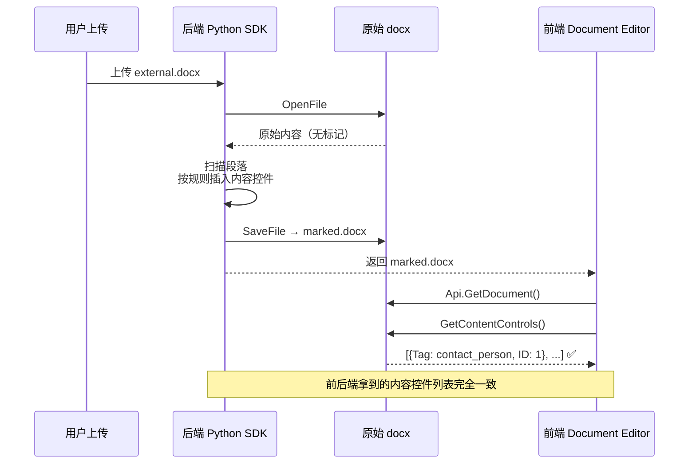

# OnlyOffice 对接 — 外部文档标记识别方案

## 需求背景

- **输入：** 外部上传的 Word 文档（.docx）
- **目标：** 前端和后端能识别文档中的同一个"标记"（标签），实现前后端数据同步
- **约束：** 文档由外部生成，非 OnlyOffice 创建，原始文档中可能没有书签或内容控件

---

## 核心结论

> **外部文档本身没有 OnlyOffice 结构化标记时，需要后端先打开文档、插入内容控件，再让前后端共同读取。**

```
外部上传 docx
    ↓
后端 Python SDK 打开 → 扫描段落 → 插入内容控件 → 保存新文档
    ↓
前端打开新文档 → GetContentControls() → 拿到 Tag 列表 ✅
后端打开新文档 → GetContentControls() → 拿到 Tag 列表 ✅
```

---

## 方案一（推荐）：后端插入内容控件

### 流程图



### 后端：打开外部文档 → 插入内容控件 → 保存

```python
import os
import docbuilder

builder = docbuilder.CDocBuilder()
builder.Initialize()

# 打开外部上传的文件
builder.OpenFile("docx", "/path/to/uploaded.docx")

context = builder.GetContext()
globalObj = context.GetGlobal()
api = globalObj["Api"]
document = api.GetDocument()

# 扫描段落，按规则插入内容控件
count = document.GetElementsCount()
for i in range(count):
    element = document.GetElement(i)
    if element.GetClassType() != "Paragraph":
        continue

    text = element.GetText().strip()
    if not text:
        continue

    # 规则示例：标题中包含关键词则插入内容控件
    if "联系人" in text or "contact" in text.lower():
        cc = document.AddContentControl({
            "Type": "text",
            "Tag": "contact_person"
        })
        print(f"段落 {i} → 插入控件 Tag: contact_person")

    if "签署日期" in text or "sign_date" in text.lower():
        cc = document.AddContentControl({
            "Type": "text",
            "Tag": "sign_date"
        })
        print(f"段落 {i} → 插入控件 Tag: sign_date")

    if "金额" in text or "amount" in text.lower():
        cc = document.AddContentControl({
            "Type": "text",
            "Tag": "amount"
        })
        print(f"段落 {i} → 插入控件 Tag: amount")

# 保存
builder.SaveFile("docx", "/path/to/marked.docx")
builder.CloseFile()
builder.Dispose()
```

### 后端：读取已标记文档中的所有内容控件

```python
def get_all_content_controls(document):
    """提取文档中所有内容控件"""
    controls = []
    ccs = document.GetContentControls()

    for i in range(ccs.GetCount()):
        cc = ccs.GetItem(i)
        controls.append({
            "id": cc.GetId(),
            "tag": cc.GetTag(),
            "text": cc.GetText()
        })

    return controls

# 使用
controls = get_all_content_controls(document)
for c in controls:
    print(f"ID: {c['id']}, Tag: {c['tag']}, 内容: {c['text']}")
```

### 前端：JavaScript 读取内容控件

```javascript
const oDocument = Api.GetDocument();
const aControls = oDocument.GetContentControls();

aControls.forEach(cc => {
    console.log(`Tag: ${cc.GetTag()}, ID: ${cc.GetId()}`);
});
```

### 前端：按 Tag 写入内容

```javascript
const oControl = oDocument.GetContentControlByTag("contact_person");
if (oControl) {
    oControl.SetText("张三");
}
```

### 后端：按 Tag 写入内容

```python
def update_by_tag(document, tag, new_value):
    """按 Tag 查找并更新内容控件"""
    cc = document.GetContentControlByTag(tag)
    if cc:
        cc.SetText(new_value)
        return True
    return False

# 使用
update_by_tag(document, "contact_person", "张三")
```

---

## 方案二：书签（Bookmark）

书签与内容控件类似，也是文档内部结构，前后端读取结果一致。

### 后端：插入书签

```python
document = api.GetDocument()
paragraph = document.GetElement(0)

bookmark = document.AddBookmark({
    "Text": "联系人",
    "Name": "contact_person"
})

bookmark_id = bookmark.GetId()
print(f"书签ID: {bookmark_id}")
```

### 前后端读取书签

```python
# 后端
bookmarks = document.GetBookmarks()
for i in range(bookmarks.GetCount()):
    b = bookmarks.GetItem(i)
    print(f"ID: {b.GetId()}, Name: {b.GetName()}")
```

```javascript
// 前端
const aBookmarks = oDocument.GetBookmarks();
aBookmarks.forEach(b => {
    console.log(`ID: ${b.GetId()}, Name: ${b.GetName()}`);
});
```

---

## 方案三：文本标记（最简验证方案）

适合阶段性验证，不依赖 OnlyOffice 特殊 API，纯字符串匹配。

### 标记格式

```
${contact_person}联系人${/contact_person}
${sign_date}签署日期${/sign_date}
```

### 后端：提取标记（Python）

```python
import re

def extract_markers(document):
    pattern = r'\$\{([^}]+)\}'
    markers = []

    count = document.GetElementsCount()
    for i in range(count):
        element = document.GetElement(i)
        if element.GetClassType() != "Paragraph":
            continue

        text = element.GetText()
        found = re.findall(pattern, text)
        # 去掉结束标记（以 / 开头）
        start_markers = [m for m in found if not m.startswith("/")]

        for marker in start_markers:
            markers.append({"index": i, "marker": marker})

    return markers
```

### 前端：提取标记（JavaScript）

```javascript
function extractMarkers(document) {
    const pattern = /\$\{([^}]+)\}/g;
    const markers = [];
    const count = document.GetElementsCount();

    for (let i = 0; i < count; i++) {
        const element = document.GetElement(i);
        if (element.GetClassType() !== "Paragraph") continue;

        const text = element.GetText();
        let match;
        while ((match = pattern.exec(text)) !== null) {
            if (!match[1].startsWith("/")) {
                markers.push({ index: i, marker: match[1] });
            }
        }
    }

    return markers;
}
```

---

## 方案对比

| 方案 | 需要修改原始文档 | 前后端一致性 | 实现复杂度 | 适用场景 |
|------|:---:|:---:|:---:|---------|
| 内容控件 | ✅ 后端插入 | ✅ ID/Tag 一致 | 中 | 表单、模板填充 |
| 书签 | ✅ 后端插入 | ✅ ID/Name 一致 | 中 | 位置标记、跳转 |
| 文本标记 `${}` | ✅ 后端插入 | ✅ 字符串完全一致 | 低 | 阶段性验证、最简方案 |

---

## 关键前提

| 情况 | 能读到吗？ |
|------|----------|
| 原始文档已有内容控件/书签 | ✅ 能 |
| 原始文档是纯文本段落，无任何标记 | ❌ 不能 |

**结论：** 外部文档需要后端先打开并插入标记（内容控件或书签），之后前后端才能读到相同的结果。

---

## 参考资料

- [OnlyOffice Document Builder 官方文档](https://api.onlyoffice.com/docs/document-builder/get-started/overview/)
- [Python Samples Guide](https://api.onlyoffice.com/docs/document-builder/samples/python-samples-guide/)
- [CDocBuilder 类参考](https://api.onlyoffice.com/docs/document-builder/builder-framework/CDocBuilder/)
