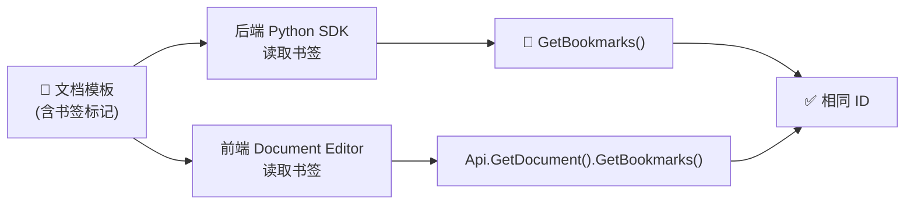
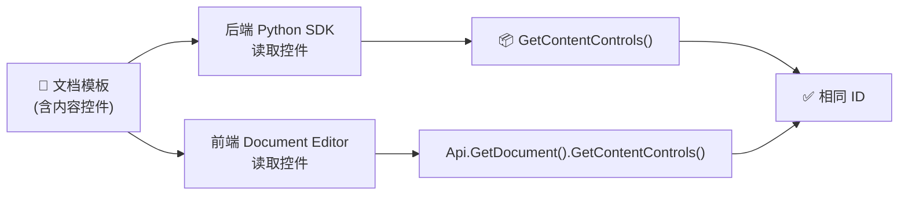
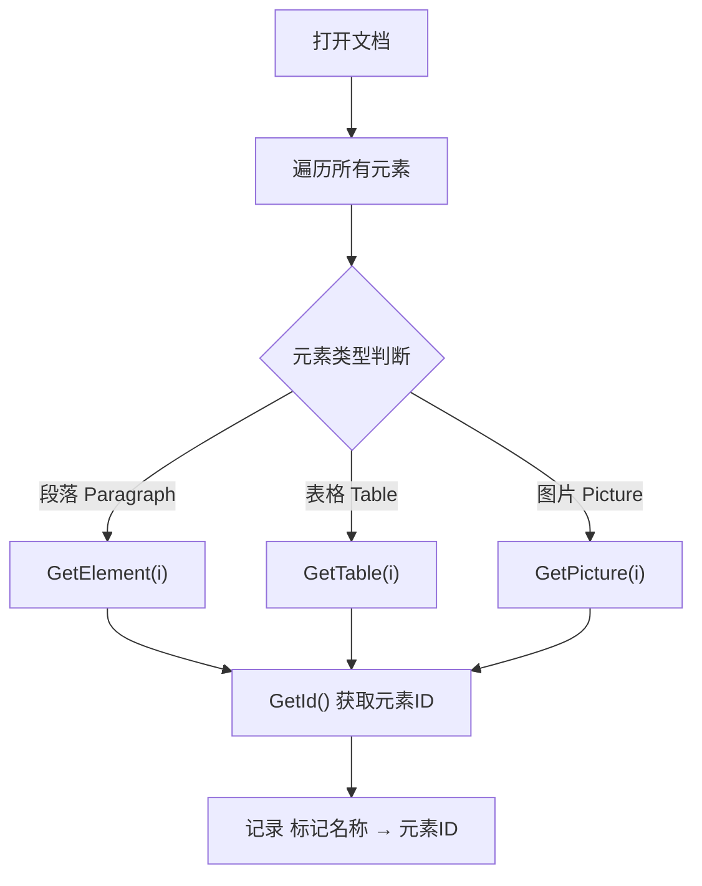
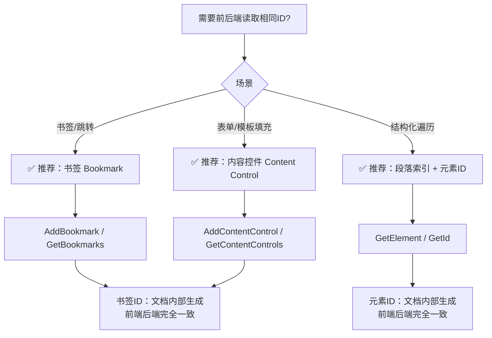
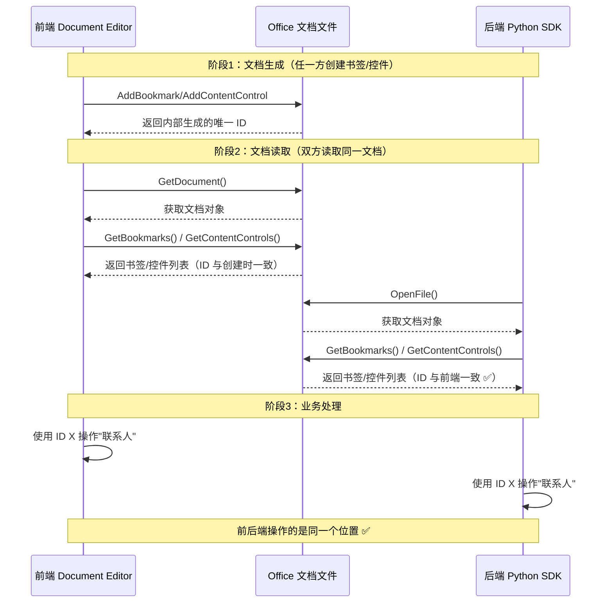

# OnlyOffice Document Builder Python SDK 获取文档位置 ID

## 概述

ONLYOFFICE Document Builder 支持通过 **Python SDK**（`document-builder` 库）在服务端生成和操作 Office 文档。本文档重点说明：**前端（在线编辑器）和后端（Python SDK）如何读取同一个标记，并得到相同的 ID**。

> **核心需求：** 前端识别"联系人"标记为 ID 1，后端通过 Python SDK 识别同一个标记，也必须返回 ID 1。两者必须完全一致。

---

## 环境准备

### 安装

```bash
pip3 install document-builder
```

### 基础初始化

```python
import os
import docbuilder

builder = docbuilder.CDocBuilder()
builder.Initialize()
builder.CreateFile("docx")
```

---

## 前后端一致的关键：书签（Bookmark）和内容控件（Content Control）

OnlyOffice 中，**书签（Bookmark）** 和 **内容控件（Content Control）** 是前后端能获取到相同 ID 的唯二机制。

- 书签 ID：由文档内部生成，前端 `Api.Bookmark` 和后端 `document.AddBookmark` 读取同一个书签，ID 完全一致
- 内容控件 ID：同样由文档内部管理，前后端读取结果一致

---

## 方案一：书签（Bookmark）— 前后端一致性最佳

### 原理



### 后端 Python SDK 读取书签

```python
context = builder.GetContext()
globalObj = context.GetGlobal()
api = globalObj["Api"]
document = api.GetDocument()

bookmarks = document.GetBookmarks()
count = bookmarks.GetCount()

for i in range(count):
    bookmark = bookmarks.GetItem(i)
    print(f"书签ID: {bookmark.GetId()}, 名称: {bookmark.GetName()}")
```

### 前端 JavaScript 读取书签

```javascript
const oDocument = Api.GetDocument();
const aBookmarks = oDocument.GetBookmarks();
const count = aBookmarks.length;

for (let i = 0; i < count; i++) {
    const bookmark = aBookmarks[i];
    console.log(`书签ID: ${bookmark.GetId()}, 名称: ${bookmark.GetName()}`);
}
```

### 创建带书签的文档模板（后端生成）

```python
document = api.GetDocument()

# 创建段落并插入"联系人"标记
paragraph = document.GetElement(0)
paragraph.AddText("联系人: ")

# 在标记处添加书签
bookmark = document.AddBookmark({
    "Text": "联系人",
    "Name": "contact_person"
})

# 获取书签 ID
bookmarkId = bookmark.GetId()
print(f"书签ID: {bookmarkId}")  # 前端读取同一个书签，ID 相同
```

### 创建带书签的文档模板（前端创建）

```javascript
const oDocument = Api.GetDocument();
const oParagraph = oDocument.GetElement(0);
oParagraph.AddText("联系人: ");

// 添加书签
const bookmark = oDocument.AddBookmark({
    "Text": "联系人",
    "Name": "contact_person"
});

const bookmarkId = bookmark.GetId();  // 后端读取同一个书签，ID 相同
```

> **结论：** 书签 ID 由文档内部生成，无论前端还是后端读取，ID 完全一致。

---

## 方案二：内容控件（Content Control）— 适合表单和模板填充

### 原理



### 后端 Python SDK 读取内容控件

```python
document = api.GetDocument()

contentControls = document.GetContentControls()
count = contentControls.GetCount()

for i in range(count):
    cc = contentControls.GetItem(i)
    print(f"控件ID: {cc.GetId()}, Tag: {cc.GetTag()}")
```

### 前端 JavaScript 读取内容控件

```javascript
const oDocument = Api.GetDocument();
const aControls = oDocument.GetContentControls();

aControls.forEach(cc => {
    console.log(`控件ID: ${cc.GetId()}, Tag: ${cc.GetTag()}`);
});
```

### 通过 Tag 定位（推荐）

Tag 是自定义标识符，前后端可以用它来定位同一个控件：

```python
# 后端按 Tag 查找
target = document.GetContentControlByTag("contact_person")
if target:
    print(target.GetId())
```

```javascript
// 前端按 Tag 查找
const target = oDocument.GetContentControlByTag("contact_person");
if (target) {
    console.log(target.GetId());
}
```

---

## 方案三：段落索引 + 元素 ID — 适合结构化文档

### 原理



### 后端按索引遍历

```python
document = api.GetDocument()
elementsCount = document.GetElementsCount()

for i in range(elementsCount):
    element = document.GetElement(i)
    classType = element.GetClassType()
    elementId = element.GetId()

    # 查找特定文本对应的元素
    if classType == "Paragraph":
        text = element.GetText()
        if "联系人" in text:
            print(f"找到 '联系人' → 元素ID: {elementId}, 索引: {i}")
```

### 前端按索引遍历

```javascript
const oDocument = Api.GetDocument();
const nCount = oDocument.GetElementsCount();

for (let i = 0; i < nCount; i++) {
    const oElement = oDocument.GetElement(i);
    const sClassType = oElement.GetClassType();

    if (sClassType === "Paragraph") {
        const sText = oElement.GetText();
        if (sText.includes("联系人")) {
            console.log(`找到 '联系人' → 元素ID: ${oElement.GetId()}, 索引: ${i}`);
        }
    }
}
```

---

## 方案对比与选型



| 方案 | 前后端 ID 一致性 | 可自定义 Tag | 适用场景 |
|------|:---:|:---:|---------|
| 书签 Bookmark | ✅ 完全一致 | ✅ Name 属性 | 位置标记、跳转 |
| 内容控件 Content Control | ✅ 完全一致 | ✅ Tag 属性 | 表单、模板、数据绑定 |
| 段落索引 + 元素 ID | ✅ 完全一致 | ❌ | 结构化文档遍历 |

---

## 完整流程图：前后端协同读取同一标记



---

## 实战代码：后端生成模板 → 前端读取 → 后端回填

### 步骤 1：后端生成带标记的文档

```python
import os
import docbuilder

builder = docbuilder.CDocBuilder()
builder.Initialize()

builder.OpenFile("docx", "/path/to/template.docx")

context = builder.GetContext()
globalObj = context.GetGlobal()
api = globalObj["Api"]
document = api.GetDocument()

# 在"联系人"处添加书签
paragraph = document.GetElement(0)
bookmark = document.AddBookmark({
    "Text": "联系人",
    "Name": "contact_person"
})

print(f"书签ID: {bookmark.GetId()}")  # 假设输出: 1

dstPath = os.getcwd() + "/output.docx"
builder.SaveFile("docx", dstPath)
builder.CloseFile()
```

### 步骤 2：前后端分别读取验证

**后端读取：**

```python
builder.OpenFile("docx", "/path/to/output.docx")
# ... 获取 document 对象后
bookmarks = document.GetBookmarks()
for i in range(bookmarks.GetCount()):
    b = bookmarks.GetItem(i)
    print(f"书签ID: {b.GetId()}, Name: {b.GetName()}")
# 输出: 书签ID: 1, Name: contact_person ✅
```

**前端读取：**

```javascript
const oDocument = Api.GetDocument();
const aBookmarks = oDocument.GetBookmarks();
aBookmarks.forEach(b => {
    console.log(`书签ID: ${b.GetId()}, Name: ${b.GetName()}`);
});
// 输出: 书签ID: 1, Name: contact_person ✅
```

---

## 附录：Python SDK 完整初始化模板

```python
import os
import docbuilder

class OnlyOfficeHelper:
    def __init__(self):
        self.builder = docbuilder.CDocBuilder()
        self.builder.Initialize()

    def open_document(self, file_path):
        self.builder.OpenFile("docx", file_path)
        context = self.builder.GetContext()
        globalObj = context.GetGlobal()
        self.api = globalObj["Api"]
        self.document = self.api.GetDocument()

    def create_document(self):
        self.builder.CreateFile("docx")
        context = self.builder.GetContext()
        globalObj = context.GetGlobal()
        self.api = globalObj["Api"]
        self.document = self.api.GetDocument()

    def get_all_bookmarks(self):
        """获取所有书签，返回 [(id, name), ...]"""
        bookmarks = self.document.GetBookmarks()
        result = []
        for i in range(bookmarks.GetCount()):
            b = bookmarks.GetItem(i)
            result.append((b.GetId(), b.GetName()))
        return result

    def get_bookmark_by_name(self, name):
        """按名称查找书签"""
        bookmarks = self.document.GetBookmarks()
        for i in range(bookmarks.GetCount()):
            b = bookmarks.GetItem(i)
            if b.GetName() == name:
                return b.GetId()
        return None

    def get_all_content_controls(self):
        """获取所有内容控件，返回 [(id, tag), ...]"""
        ccs = self.document.GetContentControls()
        result = []
        for i in range(ccs.GetCount()):
            cc = ccs.GetItem(i)
            result.append((cc.GetId(), cc.GetTag()))
        return result

    def get_content_control_by_tag(self, tag):
        """按 Tag 查找内容控件"""
        cc = self.document.GetContentControlByTag(tag)
        return cc.GetId() if cc else None

    def close(self):
        self.builder.CloseFile()
        self.builder.Dispose()
```

---

## 参考资料

- [ONLYOFFICE Document Builder 官方文档](https://api.onlyoffice.com/docs/document-builder/get-started/overview/)
- [Python Samples Guide](https://api.onlyoffice.com/docs/document-builder/samples/python-samples-guide/)
- [CDocBuilder 类参考](https://api.onlyoffice.com/docs/document-builder/builder-framework/CDocBuilder/)
- [GitHub: document-builder-samples](https://github.com/ONLYOFFICE/document-builder-samples)
