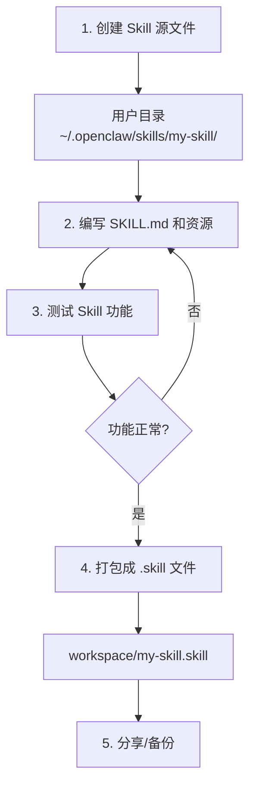

# OpenClaw Skills 目录结构技术文档

## 概述

OpenClaw Skills 是一种模块化的功能扩展机制，允许用户创建和分享自定义技能。本文档详细说明 Skills 的目录结构、加载机制和工作流程。

## 核心概念

### 什么是 Skill？

Skill 是 OpenClaw 的功能扩展单元，包含：
- **SKILL.md** - 技能描述和使用指南（必需）
- **scripts/** - 可执行脚本（可选）
- **references/** - 参考文档（可选）
- **assets/** - 资源文件（可选）

### 三种目录类型

| 目录类型 | 路径 | 用途 |
|---------|------|------|
| 系统目录 | `/opt/homebrew/lib/node_modules/openclaw/skills/` | OpenClaw 内置 skills |
| 用户目录 | `~/.openclaw/skills/` | 用户自定义 skills |
| Workspace | `~/.openclaw/workspace/` | 打包文件存放 |

## 目录结构详解

### 1. 系统目录

**路径：** `/opt/homebrew/lib/node_modules/openclaw/skills/`

```
/opt/homebrew/lib/node_modules/openclaw/skills/
├── weather/              # 天气查询
├── coding-agent/         # 编码代理
├── skill-creator/        # 创建 skills
├── healthcheck/          # 系统健康检查
├── node-connect/         # 节点连接诊断
├── ...                   # 共 50+ 内置 skills
└── canvas/               # 画布操作
```

**特点：**
- ✅ 随 OpenClaw 安装自动创建
- ✅ 包含 50+ 内置 skills
- ⚠️ 升级 OpenClaw 时会被覆盖
- ❌ **不建议在此目录创建自定义 skills**

### 2. 用户目录

**路径：** `/Users/xuchaoyue/.openclaw/skills/`

```
/Users/xuchaoyue/.openclaw/skills/
├── excalidraw/           # Excalidraw 图表生成
│   ├── SKILL.md
│   ├── scripts/
│   │   ├── excalidraw.py
│   │   └── create_diagram.py
│   └── references/
│       ├── elements.md
│       └── styles.md
└── tech-doc-writer/      # 技术文档编写
    └── SKILL.md
```

**特点：**
- ✅ 用户自己创建和管理
- ✅ 升级 OpenClaw 不受影响
- ✅ **推荐在此目录创建自定义 skills**
- ✅ 加载优先级高于系统目录

### 3. Workspace 目录

**路径：** `/Users/xuchaoyue/.openclaw/workspace/`

```
/Users/xuchaoyue/.openclaw/workspace/
├── excalidraw.skill      # 打包文件（zip 格式）
├── tech-doc-writer.skill # 打包文件
├── memory/               # 学习笔记
└── AGENTS.md            # 工作空间配置
```

**特点：**
- ✅ 存放 `.skill` 打包文件
- ✅ 用于分享、备份、版本控制
- ❌ **OpenClaw 不会从此目录加载 skills**

## 加载机制

### 加载流程

OpenClaw 从两个位置加载 skills：


### 加载顺序

1. **首先** 加载系统目录：`/opt/homebrew/lib/node_modules/openclaw/skills/`
2. **然后** 加载用户目录：`~/.openclaw/skills/`（通过 `extraDirs` 配置）
3. **冲突处理**：同名 skill 使用用户目录版本（优先级更高）

### 配置示例

**openclaw.json 配置：**

```json
{
  "skills": {
    "load": {
      "extraDirs": [
        "/Users/xuchaoyue/.openclaw/skills"
      ]
    }
  }
}
```

## 打包流程

### 从用户目录到 .skill 文件


### 打包命令

```bash
# 打包 skill
python3 /opt/homebrew/lib/node_modules/openclaw/skills/skill-creator/scripts/package_skill.py \
  /Users/xuchaoyue/.openclaw/skills/excalidraw

# 输出位置
# ~/.openclaw/workspace/excalidraw.skill
```

### .skill 文件结构

`.skill` 文件本质是 zip 压缩包：

```
excalidraw.skill (zip)
├── excalidraw/
│   ├── SKILL.md
│   ├── scripts/
│   │   ├── excalidraw.py
│   │   └── create_diagram.py
│   └── references/
│       ├── elements.md
│       └── styles.md
```

**查看内容：**

```bash
unzip -l excalidraw.skill
```

## 完整工作流程

### 创建 Skill 的正确流程



### 分步操作

**Step 1: 创建目录**

```bash
mkdir -p ~/.openclaw/skills/my-skill/{scripts,references}
```

**Step 2: 创建 SKILL.md**

```markdown
---
name: my-skill
description: Skill 描述，说明何时使用
---

# My Skill

使用说明...
```

**Step 3: 测试功能**

在 OpenClaw 对话中测试 skill 是否正常工作。

**Step 4: 打包**

```bash
python3 /opt/homebrew/lib/node_modules/openclaw/skills/skill-creator/scripts/package_skill.py \
  ~/.openclaw/skills/my-skill
```

**Step 5: 分享**

`.skill` 文件可以：
- 发送给其他用户
- 上传到 ClawHub
- 备份到云存储

## 常见问题

### Q1: 为什么 .skill 文件不被加载？

**答：** `.skill` 文件是压缩包，用于分享和备份。OpenClaw 只加载展开后的源文件目录。

### Q2: 用户目录和系统目录有同名 skill 怎么办？

**答：** 用户目录的 skill 优先级更高，会覆盖系统目录的同名 skill。

### Q3: 如何查看当前加载了哪些 skills？

**答：** 查看 OpenClaw 启动日志，或检查以下目录：
- 系统：`ls /opt/homebrew/lib/node_modules/openclaw/skills/`
- 用户：`ls ~/.openclaw/skills/`

### Q4: 升级 OpenClaw 后自定义 skills 会丢失吗？

**答：** 不会。自定义 skills 在用户目录 `~/.openclaw/skills/`，升级 OpenClaw 只影响系统目录。

## 目录对比表

| 特性 | 系统目录 | 用户目录 | Workspace |
|------|---------|---------|-----------|
| 路径 | `openclaw/skills/` | `~/.openclaw/skills/` | `~/.openclaw/workspace/` |
| 内容 | 内置 skills | 自定义 skills | 打包文件 |
| 创建方式 | 自动安装 | 手动创建 | 打包生成 |
| 升级影响 | 会被覆盖 | 不受影响 | 不受影响 |
| 加载顺序 | 先加载 | 后加载（优先） | 不加载 |
| 推荐用途 | 只读参考 | **创建 skills** | 分发/备份 |

## 相关命令速查

```bash
# 查看系统 skills
ls /opt/homebrew/lib/node_modules/openclaw/skills/

# 查看用户 skills
ls ~/.openclaw/skills/

# 创建新 skill
python3 /opt/homebrew/lib/node_modules/openclaw/skills/skill-creator/scripts/init_skill.py \
  my-skill --path ~/.openclaw/skills

# 打包 skill
python3 /opt/homebrew/lib/node_modules/openclaw/skills/skill-creator/scripts/package_skill.py \
  ~/.openclaw/skills/my-skill

# 查看 .skill 文件内容
unzip -l ~/.openclaw/workspace/my-skill.skill

# 解压 .skill 文件
unzip my-skill.skill -d my-skill/
```

## 参考资料

- [Excalidraw Skill 架构图](./images/skills-directory.excalidraw.md)
- [OpenClaw 官方文档](https://docs.openclaw.ai)
- [ClawHub - 发现更多 Skills](https://clawhub.com)

---

> 文档创建时间: 2026-03-23
> 作者: OpenClaw Assistant