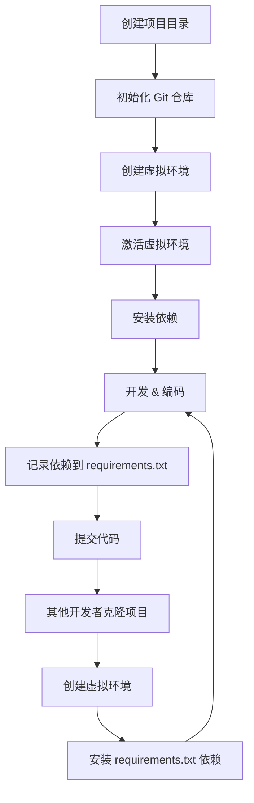

# Python 项目开发虚拟环境配置

## 概述

虚拟环境（Virtual Environment）是 Python 项目开发中的核心工具，它可以为每个项目创建独立的依赖隔离环境，避免包版本冲突，保持全局 Python 环境的清洁。

## 核心概念

| 概念 | 说明 |
|------|------|
| **虚拟环境** | 一个独立的 Python 运行环境，包含独立的 site-packages 和可执行文件 |
| **site-packages** | 第三方包的安装目录 |
| **pip** | Python 包管理工具 |
| **requirements.txt** | 项目依赖清单文件 |
| **pyproject.toml** | 现代 Python 项目配置文件（PEP 517/518） |
| **venv** | Python 3.3+ 内置的虚拟环境模块 |
| **virtualenv** | 第三方虚拟环境工具（功能更丰富） |
| **conda** | Anaconda/Miniconda 的环境管理工具 |

## 使用方法

### 1. 内置 venv（推荐）

#### 创建虚拟环境

```bash
# 在项目目录下创建虚拟环境（命名为 venv）
python -m venv venv

# 指定 Python 版本（如果系统有多个版本）
python3.11 -m venv venv
```

#### 激活虚拟环境

```bash
# Linux / macOS
source venv/bin/activate

# Windows (CMD)
venv\Scripts\activate.bat

# Windows (PowerShell)
venv\Scripts\Activate.ps1
```

激活后，终端提示符会显示 `(venv)` 前缀。

#### 安装依赖

```bash
# 安装单个包
pip install requests

# 从 requirements.txt 安装
pip install -r requirements.txt

# 导出当前环境依赖
pip freeze > requirements.txt
```

#### 退出虚拟环境

```bash
deactivate
```

#### 删除虚拟环境

```bash
# 直接删除虚拟环境目录即可
rm -rf venv
```

---

### 2. virtualenv（功能增强版）

```bash
# 安装
pip install virtualenv

# 创建虚拟环境
virtualenv venv

# 指定 Python 版本
virtualenv -p python3.11 venv

# 创建不含全局包的干净环境
virtualenv --no-site-packages venv
```

---

### 3. conda（Anaconda / Miniconda）

```bash
# 创建虚拟环境
conda create --name myproject python=3.11

# 激活环境
conda activate myproject

# 退出环境
conda deactivate

# 查看所有环境
conda env list

# 删除环境
conda env remove --name myproject
```

---

### 4. poetry（现代项目管理）

Poetry 是现代 Python 项目推荐的工具，集成了依赖管理和打包。

```bash
# 安装 Poetry
pip install poetry

# 初始化项目（会创建 pyproject.toml）
poetry init

# 创建虚拟环境
poetry install

# 激活虚拟环境
poetry shell

# 添加依赖
poetry add requests

# 添加开发依赖
poetry add --dev pytest

# 导出 requirements.txt
poetry export -f requirements.txt --output requirements.txt
```

---

### 5. pipenv（项目级依赖管理）

```bash
# 安装
pip install pipenv

# 创建环境并安装依赖
pipenv install requests

# 安装开发依赖
pipenv install --dev pytest

# 激活环境
pipenv shell

# 运行脚本
pipenv run python main.py
```

---

## 项目结构推荐

```
my-project/
├── venv/                    # 虚拟环境目录（不要提交到 Git）
├── src/                     # 项目源代码
├── tests/                   # 测试代码
├── pyproject.toml           # 项目配置（Poetry）
├── setup.py                 # 传统打包配置（二选一）
├── requirements.txt         # 依赖清单（可选）
├── .gitignore               # Git 忽略配置
└── README.md
```

### 推荐的 .gitignore 内容

```
# 虚拟环境
venv/
env/
.env

# Python
__pycache__/
*.py[cod]
*.so
.Python

# IDE
.idea/
.vscode/

# 测试
.pytest_cache/
.coverage
htmlcov/

# 构建产物
dist/
build/
*.egg-info/
```

---

## 工作流程图



---

## 多环境管理

### 使用 pyenv 管理 Python 版本

```bash
# 安装 pyenv
brew install pyenv  # macOS

# 列出可用版本
pyenv versions

# 安装指定版本
pyenv install 3.11.5

# 设置项目本地版本
pyenv local 3.11.5
```

### 结合 pyenv + venv

```bash
# 指定版本创建虚拟环境
python3.11 -m venv venv

# 或使用 pyenv-virtualenv 插件
pyenv virtualenv 3.11.5 my-project
pyenv local my-project
```

---

## Docker 中的虚拟环境

在 Docker 容器中，通常不需要 venv，因为每个容器本身就是隔离环境。但可以配合多阶段构建：

```dockerfile
# Dockerfile
FROM python:3.11-slim

WORKDIR /app

# 先复制依赖文件
COPY requirements.txt .

# 安装依赖（用 root 运行，干净环境）
RUN pip install --no-cache-dir -r requirements.txt

# 再复制代码
COPY . .

CMD ["python", "main.py"]
```

---

## 注意事项

1. **不要提交虚拟环境目录到 Git** — 使用 `.gitignore` 排除 `venv/`、`env/` 等目录
2. **始终在虚拟环境中开发** — 避免污染全局 Python 环境
3. **锁定依赖版本** — 使用 `pip freeze > requirements.txt` 或 poetry/pipenv 的锁文件
4. **团队统一工具** — 建议团队使用相同的虚拟环境工具（如统一用 Poetry）
5. **Python 版本一致性** — 使用 `python --version` 确认版本，推荐使用 `.python-version` 文件配合 pyenv

---

## 工具对比

| 工具 | 优点 | 缺点 | 推荐场景 |
|------|------|------|----------|
| **venv** | Python 内置，轻量，无需安装 | 功能较少 | 小型项目，快速原型 |
| **virtualenv** | 功能丰富，兼容性好 | 需要单独安装 | 需要更多配置选项 |
| **conda** | 支持非 Python 依赖，跨语言 | 体积大，配置复杂 | 数据科学/ML 项目 |
| **poetry** | 现代、优雅，依赖解析强 | 学习曲线 | 新项目，现代化项目 |
| **pipenv** | 简单，类似 Node.js 体验 | 社区相对较小 | 快速启动项目 |

---

## 参考资料

- [Python venv 官方文档](https://docs.python.org/3/library/venv.html)
- [Poetry 官方文档](https://python-poetry.org/docs/)
- [Pipenv 官方文档](https://pipenv.pypa.io/en/latest/)
- [Python Packaging User Guide](https://packaging.python.org/)
