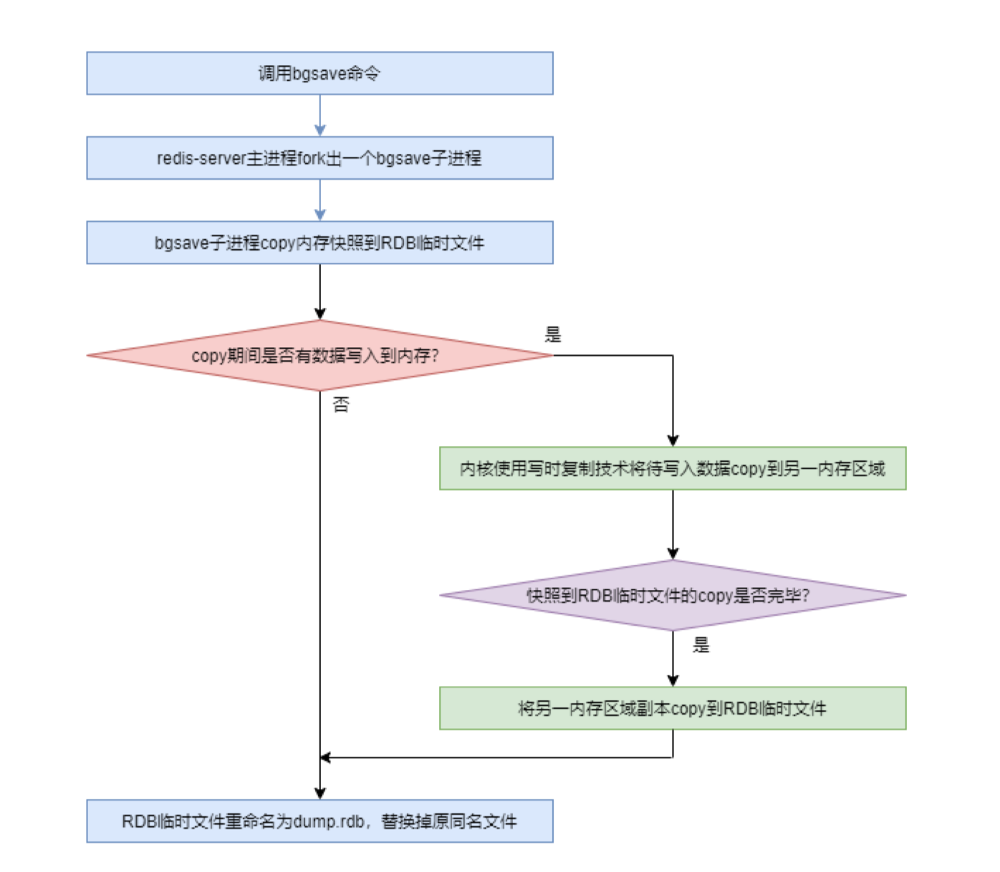

# rdb和 aof 持久化

(1)RDB 持久化过程 

对于 Redis 默认的 RDB 持久化，在进行 bgsave 持久化时，redis-server 进程会 fork 出一个 bgsave 子进程，由该子进程以异步方式负责完成持久化。而在持久化过程中，redis-server 进程不会阻塞，其会继续接收并处理用户的读写请求。 
bgsave 子进程的详细工作原理如下： 
由于子进程可以继承父进程的所有资源，且父进程不能拒绝子进程的继承权。所以，
bgsave 子进程有权读取到 redis-server 进程写入到内存中的用户数据，使得将内存数据持久化到 dump.rdb 成为可能。 
bgsave 子进程在持久化时首先会将内存中的全量数据 copy 到磁盘中的一个 RDB 临时文件，copy 结束后，再将该文件 rename 为 dump.rdb，替换掉原来的同名文件。 

不过，在进行持久化过程中，如果 redis-server 进程接收到了用户写请求，则系统会将内存中发生数据修改的物理块 copy 出一个副本。等内存中的全量数据 copy 结束后，会再将副本中的数据 copy 到 RDB 临时文件。这个副本的生成是由于 Linux 系统的写时复制技术（Copy-On-Write）实现的。

写时复制技术是 Linux 系统的一种进程管理技术。原本在 Unix 系统中，当一个主进程通过 fork()系统调用创建子进程后，内核进程会复制主进程的整个内存空间中的数据，然后分配给子进程。这种方式存在的问题有以下几点： 

- 这个过程非常耗时 
- 这个过程降低了系统性能 
- 如果主进程修改了其内存数据，子进程副本中的数据是没有修改的。即出现了数据冗余，而冗余数据最大的问题是数据一致性无法保证。 
- 现代的 Linux 则采用了更为有效的方式：写时复制。子进程会继承父进程的所有资源，其中
- 就包括主进程的内存空间。即子进程与父进程共享内存。只要内存被共享，那么该内存就是只读的（写保护的）。而写时复制则是在任何一方需要写入数据到共享内存时都会出现异常，
- 此时内核进程就会将需要写入的数据 copy 出一个副本写入到另外一块非共享内存区域。

(2)aof持久化过程

AOF 详细的持久化过程如下： 

- Redis 接收到的写操作命令并不是直接追加到磁盘的 AOF 文件的，而是将每一条写命令按照 redis 通讯协议格式暂时添加到 AOF 缓冲区 aof_buf。 
- 根据设置的数据同步策略，当同步条件满足时，再将缓冲区中的数据一次性写入磁盘的AOF 文件，以减少磁盘 IO 次数，提高性能。 
- 当磁盘的 AOF 文件大小达到了 rewrite 条件时，redis-server 主进程会 fork 出一个子进程bgrewriteaof，由该子进程完成 rewrite 过程。 
- 子进程 bgrewriteaof 首先对该磁盘 AOF 文件进行 rewrite 计算，将计算结果写入到一个临时文件，全部写入完毕后，再 rename 该临时文件为磁盘文件的原名称，覆盖原文件。 5) 如果在 rewrite 过程中又有写操作命令追加，那么这些数据会暂时写入 aof_rewrite_buf 缓冲区。等将全部 rewrite 计算结果写入临时文件后，会先将 aof_rewrite_buf 缓冲区中的数据写入临时文件，然后再 rename 为磁盘文件的原名称，覆盖原文件。 