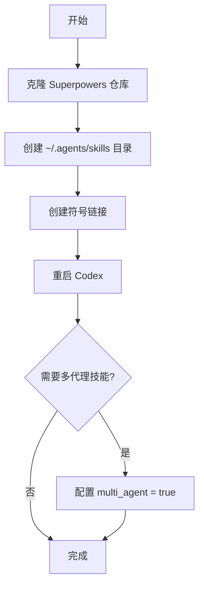
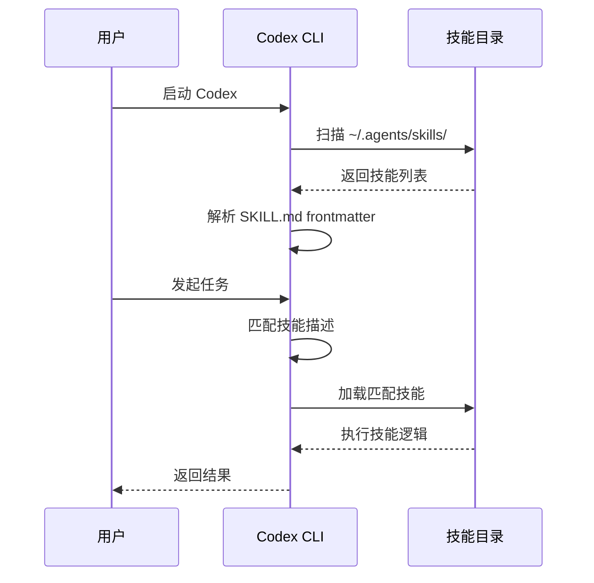
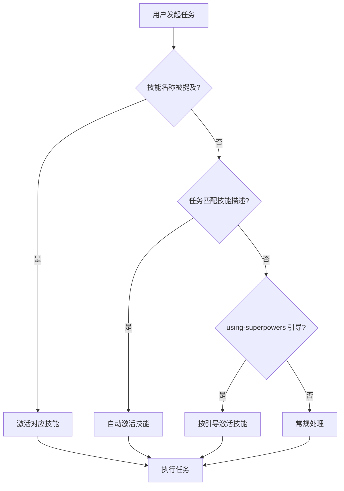

# Codex 集成 Superpowers 指南

## 概述

Superpowers 是一套为 AI 编程助手提供增强能力的技能集合。OpenAI Codex 通过**原生技能发现机制**自动加载和激活这些技能，实现零配置集成。

## 核心概念

### 技能发现机制

Codex 内置了技能发现功能：

| 步骤 | 说明 |
|------|------|
| 扫描 | 启动时自动扫描 `~/.agents/skills/` 目录 |
| 解析 | 读取每个技能的 `SKILL.md` frontmatter 元数据 |
| 加载 | 根据任务需求按需激活技能 |

### 目录结构

```
~/.codex/superpowers/          # Superpowers 仓库克隆
├── skills/                    # 技能目录
│   ├── brainstorming/
│   ├── dispatching-parallel-agents/
│   ├── subagent-driven-development/
│   └── using-superpowers/
└── ...

~/.agents/skills/              # Codex 扫描的技能目录
└── superpowers/ → ~/.codex/superpowers/skills/  # 符号链接
```

### 激活方式

技能会在以下情况自动激活：

1. **显式调用** - 直接提及技能名称（如 "use brainstorming"）
2. **描述匹配** - 任务匹配技能的 `description` 字段
3. **技能引导** - `using-superpowers` 技能指示使用特定技能

## 使用方法

### 快速安装

在 Codex 中执行：

```
Fetch and follow instructions from https://raw.githubusercontent.com/obra/superpowers/refs/heads/main/.codex/INSTALL.md
```

### 手动安装

#### 前置条件

- OpenAI Codex CLI
- Git

#### 安装步骤

**1. 克隆仓库**

```bash
git clone https://github.com/obra/superpowers.git ~/.codex/superpowers
```

**2. 创建符号链接**

```bash
mkdir -p ~/.agents/skills
ln -s ~/.codex/superpowers/skills ~/.agents/skills/superpowers
```

**3. 重启 Codex**

**4. 启用多代理功能（可选）**

部分技能需要多代理特性，在 Codex 配置中添加：

```toml
[features]
multi_agent = true
```

#### Windows 安装

```powershell
New-Item -ItemType Directory -Force -Path "$env:USERPROFILE\.agents\skills"
cmd /c mklink /J "$env:USERPROFILE\.agents\skills\superpowers" "$env:USERPROFILE\.codex\superpowers\skills"
```

### 创建个人技能

**1. 创建技能目录**

```bash
mkdir -p ~/.agents/skills/my-skill
```

**2. 创建 SKILL.md**

```markdown
---
name: my-skill
description: Use when [condition] - [what it does]
---

# My Skill

[Your skill content here]
```

> **重要**：`description` 字段决定了 Codex 何时自动激活该技能。

### 更新与卸载

**更新：**

```bash
cd ~/.codex/superpowers && git pull
```

**卸载：**

```bash
rm ~/.agents/skills/superpowers
rm -rf ~/.codex/superpowers  # 可选，删除仓库
```

## 流程图

### 安装流程



### 技能发现流程



### 技能激活决策



## 注意事项

### 符号链接验证

如果技能未显示，请检查：

```bash
# 验证符号链接
ls -la ~/.agents/skills/superpowers

# 检查技能目录
ls ~/.codex/superpowers/skills

# 重启 Codex
```

### Windows Junction

Windows 使用 junction 代替符号链接，通常无需开发者模式。如创建失败，请以管理员身份运行 PowerShell。

### 技能描述编写

`description` 字段是技能自动激活的关键：

- ✅ 好的描述：`Use when refactoring code - applies systematic refactoring patterns`
- ❌ 差的描述：`A refactoring tool`

## 参考资料

- [Superpowers GitHub](https://github.com/obra/superpowers)
- [问题反馈](https://github.com/obra/superpowers/issues)
- [Codex 官方文档](https://github.com/openai/codex)