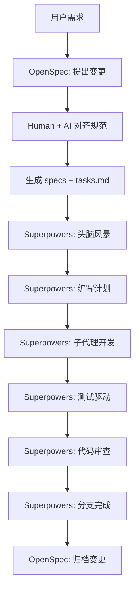
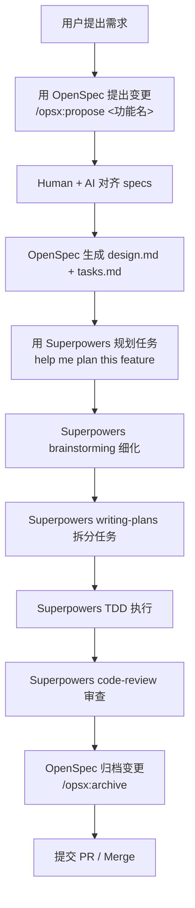
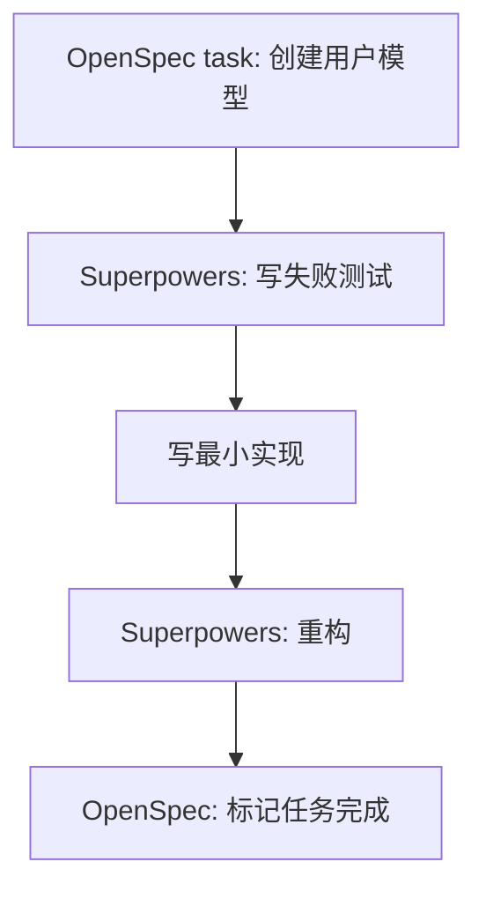
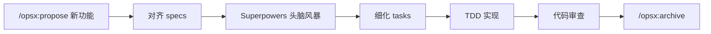
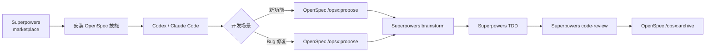

# Superpowers 与 OpenSpec 结合使用指南

> 打造完整的设计→规划→执行→验证工作流

## 概述

**Superpowers** 和 **OpenSpec** 是两个互补的 AI 编程辅助工具，结合使用可以实现：

- **Superpowers**：提供系统化的开发流程（需求澄清、任务分解、TDD、代码审查）
- **OpenSpec**：在代码编写之前建立人机共识的规范（Spec），确保实现方向正确

两者结合的核心思路：**OpenSpec 解决"做什么"的问题，Superpowers 解决"怎么做"的问题**。

---

## 核心概念对比

| 维度 | Superpowers | OpenSpec |
|------|-------------|----------|
| **核心职能** | 开发流程框架 | 规范驱动开发（SDD） |
| **介入时机** | 全流程（设计→实现→审查） | 代码编写之前 |
| **产出物** | 任务列表、测试、审查意见 | Spec 文档（proposal、tasks） |
| **工作模式** | 代理自主执行工作流 | 人机对齐后交付任务 |
| **API Key** | 不需要 | 不需要 |
| **支持平台** | Claude Code、Codex、Cursor 等 | 20+ AI 助手（斜杠命令） |

---

## 工作流整合

### 完整开发流程



### 阶段详解

#### 阶段一：需求澄清（OpenSpec + Superpowers 头脑风暴）

**OpenSpec** 的 `/opsx:propose` 启动结构化提案流程：

```
用户: /opsx:propose add-user-auth
AI: Created openspec/changes/add-user-auth/
  ✓ proposal.md — 为什么做这件事
  ✓ specs/ — 需求和场景
  ✓ design.md — 技术方案
  ✓ tasks.md — 实现检查清单
准备开始实现！
```

**Superpowers 头脑风暴** 进行苏格拉底式需求深挖：

- 提出澄清性问题
- 探索替代方案
- 分段展示设计供人工批准

#### 阶段二：规范确认（OpenSpec specs）

OpenSpec 生成的 `tasks.md` 是具体实现检查清单：

```markdown
## tasks.md 示例

- [ ] 创建 User 模型，包含 email/password 字段
- [ ] 使用 bcrypt 对密码加密
- [ ] 实现 JWT token 生成
- [ ] 创建登录 API 端点 POST /auth/login
- [ ] 添加输入验证中间件
- [ ] 编写 auth 服务的单元测试
```

这些任务直接作为 Superpowers `writing-plans` 的输入。

#### 阶段三：执行与验证（Superpowers）


---

## 安装与配置（Codex 篇）

### 前置条件

- OpenAI Codex CLI 已安装
- Git

---

### 安装 OpenSpec（Codex）

OpenSpec 通过技能（Skills）和斜杠命令（Slash Commands）集成到 Codex。

**方法一：自动安装（推荐）**

```bash
# 初始化 OpenSpec，选择 Codex 平台
openspec init --platform codex

# 或全局安装（所有平台）
openspec init --global
```

**方法二：手动安装**

```bash
# 1. 创建 Codex 技能目录
mkdir -p ~/.codex/skills

# 2. 克隆 OpenSpec 仓库
git clone https://github.com/Fission-AI/OpenSpec.git /tmp/openspec

# 3. 复制 Codex 技能文件
cp -r /tmp/openspec/.codex/skills/openspec-* ~/.codex/skills/

# 4. 创建斜杠命令提示文件
mkdir -p ~/.codex/prompts
cp /tmp/openspec/.codex/prompts/opsx-*.md ~/.codex/prompts/
```

**验证安装**

启动 Codex 新会话，输入：

```
/opsx:help
```

如果看到 OpenSpec 帮助信息，说明安装成功。

---

### 安装 Superpowers（Codex）

让 Codex 自动执行安装：

```
Fetch and follow instructions from https://raw.githubusercontent.com/obra/superpowers/refs/heads/main/.codex/INSTALL.md
```

或手动安装：

```bash
# 1. 克隆 Superpowers 仓库
git clone https://github.com/obra/superpowers.git ~/.codex/superpowers

# 2. 创建技能符号链接
mkdir -p ~/.agents/skills
ln -s ~/.codex/superpowers/skills ~/.agents/skills/superpowers

# 3. 重启 Codex 会话
```

**验证安装**

```
help me plan this feature
```

Codex 应该触发 Superpowers 的 brainstorming 和 writing-plans 技能。

---

### 启用多代理功能（可选）

Superpowers 的部分技能依赖多代理特性，在 `~/.codex/config.toml` 中添加：

```toml
[features]
multi_agent = true
```

### 目录结构

结合使用时，Codex 项目推荐结构：

```
项目目录/
├── openspec/                    # OpenSpec 规范目录
│   ├── specs/                   # 当前规范（source of truth）
│   └── changes/                 # 变更提案
│       ├── add-feature-x/
│       │   ├── proposal.md
│       │   ├── design.md
│       │   ├── specs/
│       │   └── tasks.md
│       └── archive/             # 已完成的变更
├── .codex/                      # Codex 配置
│   ├── skills/                  # OpenSpec 技能
│   └── AGENTS.md                # 全局指令（可选）
├── ~/.agents/skills/superpowers # Superpowers 技能（符号链接）
└── src/                         # 源代码
```

---

### Codex 整合后的完整工作流

当 OpenSpec 和 Superpowers 都安装好后，Codex 中的标准开发流程：



**Codex 中的命令序列示例：**

```
# 1. 开启新功能规范流程
/opsx:propose add-user-auth

# 2. 等待 specs 对齐完成后，用 Superpowers 规划
help me plan this feature using tasks.md

# 3. 执行 TDD
let's test-drive this implementation

# 4. 代码审查
review the auth module

# 5. 完成分支
finish this development branch

# 6. 归档 OpenSpec 变更
/opsx:archive
```

---

## 实用技巧

### 技巧一：OpenSpec 作为 Superpowers 的输入层

**问题**：Superpowers 的 brainstorming 有时过于发散

**方案**：先用 OpenSpec `/opsx:propose` 固定范围，再交给 Superpowers 执行

```
# 1. 先用 OpenSpec 定义范围
/opsx:propose add-payment-integration

# 2. AI 生成结构化提案后，交给 Superpowers
help me plan this feature using the tasks.md
```

### 技巧二：用 Superpowers 审查 OpenSpec 生成的 Tasks

**问题**：OpenSpec 生成的 tasks 可能过于简单

**方案**：用 Superpowers 的 `writing-plans` 进一步细化

```bash
# 将 tasks.md 的任务细化为 2-5 分钟的原子任务
help me expand these tasks into a detailed plan with 2-5 min subtasks
```

### 技巧三：OpenSpec archive 作为项目历史

OpenSpec 的 archive 功能保留了完整的变更历史：

```
openspec/changes/archive/2025-01-23-add-dark-mode/
├── proposal.md
├── design.md
├── specs/
└── tasks.md (已勾选)
```

这些归档可以直接作为项目的技术决策文档。

### 技巧四：Superpowers TDD 验证 OpenSpec Tasks

OpenSpec 的 tasks 只定义"做什么"，Superpowers 的 TDD 确保"做得对"：



### 技巧五：双层代码审查

**OpenSpec design.md** → 检查是否按照规范实现
**Superpowers code-review** → 检查代码质量

```
# OpenSpec 层面：是否符合 design.md？
- [ ] 使用了 bcrypt 而非 MD5
- [ ] JWT secret 从环境变量读取

# Superpowers 层面：代码是否优雅？
- [ ] 错误处理是否完善
- [ ] 是否有内存泄漏
```

---

## 命令对照表

### OpenSpec 常用命令

| 命令 | 作用 |
|------|------|
| `/opsx:propose <名称>` | 创建新变更提案 |
| `/opsx:status` | 查看当前变更状态 |
| `/opsx:diff` | 查看规范差异 |
| `/opsx:archive` | 归档已完成变更 |
| `/opsx:list` | 列出所有变更 |

### Superpowers 常用命令

| 命令 | 触发技能 |
|------|----------|
| `help me plan this feature` | brainstorming + writing-plans |
| `let's debug this issue` | systematic-debugging |
| `run tests` | test-driven-development |
| `review this code` | requesting-code-review |
| `finish this branch` | finishing-a-development-branch |

---

## 典型使用场景

### 场景一：新功能开发



### 场景二：Bug 修复

```
# 用 OpenSpec 记录修复方案
/opsx:propose fix-login-redirect

# 用 Superpowers 验证修复
help me debug why login redirect isn't working
run tests to verify the fix
```

### 场景三：代码重构

```
# OpenSpec 定义重构范围
/opsx:propose refactor-auth-module

# Superpowers 执行重构
help me plan the refactoring with test coverage
```

---

## 常见问题

### 问一：两个工具会不会冲突？

**不会**。它们作用于不同阶段：

- OpenSpec → 代码编写之前（对齐）
- Superpowers → 代码编写及之后（执行）

### 问二：可以只用 OpenSpec 不用 Superpowers 吗？

可以。OpenSpec 独立完整，Superpowers 是增强选项。

### 问三：支持哪些 AI 助手？

- **OpenSpec**：20+ AI 助手（Claude Code、Cursor、Copilot、Windsurf 等）
- **Superpowers**：Claude Code、Codex、Cursor、OpenCode、Gemini CLI 等

### 问四：需要网络吗？

都不需要 API Key，纯本地运行。

---

## 实际项目案例（两者结合使用）

> 以下案例均为 **OpenSpec + Superpowers 组合使用**的真实实践

---

### 案例一：用户直接在 GitHub 提问如何结合（Issue #859）

**来源**：[GitHub Issue #859](https://github.com/Fission-AI/OpenSpec/issues/859) — 2026年3月19日

**背景**：有用户在 OpenSpec 官方仓库提问："How can I use OpenSpec and Superpowers together? Could you create a skill?"

这是目前能找到的最直接的关于两者结合使用的官方讨论。核心观点：

> **"Superpowers provides individual productivity skills (TDD, debugging, planning, etc.) · OpenSpec provides structured workflow governance (proposal, review, approval)"**

即：
- **Superpowers** → 个体生产力技能（TDD、调试、规划等）
- **OpenSpec** → 结构化流程治理（提案、审查、审批）

**衍生进展**：[Issue #780](https://github.com/Fission-AI/OpenSpec/issues/780) 提出了将 OpenSpec 作为 Superpowers 技能分发的功能请求——让用户可以通过 Superpowers 插件市场直接安装 OpenSpec，实现一键集成。

---

### 案例二：Claude Code 用户真实工作流（Builder.io 博客）

**来源**：[Builder.io 官方博客 - The Superpowers Plugin](https://www.builder.io/blog/claude-code-superpowers-plugin)

**项目背景**：使用 Superpowers 插件在 Claude Code 中实现 Ding v1 配置验证功能

**关键实践经验**：

1. **Superpowers plan 包含完整可运行代码**
   - Plan 生成后，每个任务都包含失败的测试用例
   - 实现代码必须让测试通过才算完成

2. **三条不可妥协的规则**：
   ```
   ① Spec 是所有决策的唯一依据
   ② 每个 plan 任务在写实现代码之前必须先有失败测试
   ③ 任务复选框是会话恢复机制
   ```

3. **OpenSpec 在此场景的对应作用**：
   - 如果用 OpenSpec 替代纯文本 Spec，proposal/design.md 就是"Spec"
   - OpenSpec 的 Delta Specs 让变更可审计、可对比
   - 提案-审批流程让实现有据可依

**两者结合的实践路径**：

```
OpenSpec: 提出变更 → 生成 design.md（技术方案）
    ↓
Superpowers: 读取 design.md 作为 spec
    ↓
help me plan this feature using design.md
    ↓
Superpowers TDD: 写失败测试 → 写最小实现 → 重构
    ↓
OpenSpec: /opsx:archive 归档变更
```

---

### 案例三：st0012.dev 的 Ruby 项目工作流

**来源**：[st0012.dev](https://st0012.dev/links/2026-01-15-a-claude-code-workflow-with-the-superpowers-plugin/)

**项目背景**：Ruby on Rails 项目中使用 Superpowers 插件

**具体用法**：

```
# 用 Superpowers brainstorm 捕获任务上下文
/superpowers:brainstorm I want to build a prototype for <issue>
```

**与 OpenSpec 的对应关系**：

| Superpowers 步骤 | OpenSpec 对应物 |
|-----------------|----------------|
| brainstorm | `/opsx:propose` + 人工对齐 |
| 生成 plan | design.md + tasks.md |
| TDD 执行 | 按 tasks.md 逐项实现 |
| code-review | 人工审批 / opsx:review |
| 完成分支 | `/opsx:archive` |

---

### 案例四：OpenSpec 作为 Superpowers 技能的提案（Issue #780）

**来源**：[GitHub Issue #780](https://github.com/Fission-AI/OpenSpec/issues/780)

**核心提案**：将 OpenSpec 作为 Superpowers marketplace 中的一个技能分发

**优势**：
1. 用户可以在 Superpowers 生态中直接发现和安装 OpenSpec
2. 安装体验统一，不需要分别配置两个工具
3. OpenSpec 的提案-审查流程可以作为 Superpowers 工作流的入口层

**提案的工作流整合**：



---

### 案例五：Framework 对比中的定位（Rick Hightower）

**来源**：[Medium - The Great Framework Showdown](https://medium.com/@richardhightower/the-great-framework-showdown-superpowers-vs-bmad-vs-speckit-vs-gsd-360983101c10)

在五大 AI 编程框架（BMAD、SpecKit、OpenSpec、GSD、Superpowers）对比中，对两者的定位：

| 框架 | 核心定位 |
|------|---------|
| OpenSpec | **brownfield-first delta specs**（增量规格，擅长存量项目） |
| Superpowers | **TDD-enforced discipline**（强制 TDD 纪律） |

**组合后的竞争力**：

> OpenSpec 解决"改什么"的问题（基于现有代码库的增量规范）
> Superpowers 解决"怎么改"的问题（强制测试先行 + 子代理执行）

这意味着组合使用特别适合：**在已有代码库上进行系统化功能迭代**，既能保持规范可追溯，又能保证代码质量。

---

## 结合使用案例补遗（三次搜索新增，2026-04-01）

---

### 案例十三：HashRocket 实测 — OpenSpec vs Spec Kit 安装体验对比

**来源**：[HashRocket - OpenSpec vs Spec Kit](https://hashrocket.com/blog/posts/openspec-vs-spec-kit-choosing-the-right-ai-driven-development-workflow-for-your-team)

**关键发现**：OpenSpec 安装后只向 Claude Code 添加 **3 个 AI 命令**，而 Spec Kit 生成了 8 个。对于想要轻量级规范的团队，OpenSpec 的侵入性更低。

**OpenSpec 的目录结构（实测）**：

```
openspec/changes/remove-team-nav/
├── specs/navigation/spec.md    ← 变更规格
└── tasks.md                    ← 实现检查清单
```

安装时通过 `openspec init` 自动创建的 `AGENTS.md`，会提醒 AI 检查 consolidated specs，确保 AI 始终对齐最新规范。

**两者适用场景总结**：

| 团队结构 | 推荐工具 |
|---------|---------|
| 小团队、快速迭代 | OpenSpec（轻量、3 命令） |
| 大团队、需要多层审批 | Spec Kit（8 命令、更多治理层） |
| **混用** | OpenSpec 做规范层 + Superpowers 做执行层 |

---

### 案例十四：GitHub 官方博客 — Spec Kit 与 OpenSpec 的关系

**来源**：[GitHub Blog - Spec-driven development with AI](https://github.blog/ai-and-ml/generative-ai/spec-driven-development-with-ai-get-started-with-a-new-open-source-toolkit/)

**核心信息**：GitHub 官方提到了 Spec Kit，并指出Spec Kit、OpenSpec、BMAD 并非互斥，而是代表 **SDD 的不同切入角度**。

**重要预告**：GitHub 官方博客提到 spec-driven 开发实践可以和 **context engineering（上下文工程）** 结合，构建更高级的 AI 工具链能力。这意味着未来 OpenSpec/GSD 可能作为上下文层，与执行层工具（如 Superpowers）更深层次集成。

---

### 案例十五：Augment Code — AI SDD 的自动化验证机制

**来源**：[Augment Code - AI Enhances Spec-Driven Development Workflows](https://www.augmentcode.com/guides/ai-spec-driven-development-workflows)

**核心论点**：AI 增强 SDD 的关键在于把**规范变成可执行的契约**，而不是事后文档。

**SDD 自动化验证架构**：

```
Spec（机器可读）
    ↓ CI/CD 自动验证
    ↓ 任务拆分（AI）
    ↓ 代码生成（AI）
    ↓ 漂移检测（AI）
实现代码 ←→ 规范 持续对齐
```

Augment 的 Context Engine 能在 **40 万行代码**规模上维护规范上下文，实时检测实现是否偏离架构契约。这是目前 OpenSpec 和 Superpowers 都尚未覆盖的规模化场景。

---

### 案例十六：intent-driven.dev — OpenSpec 完整知识库与 Linear MCP 集成

**来源**：[intent-driven.dev/knowledge/openspec](https://intent-driven.dev/knowledge/openspec/)

**重点内容**：

1. **OpenSpec 核心价值**：维护单一 unified specification 作为系统的唯一权威参考
2. **Linear MCP + OpenSpec 工作流**：将 OpenSpec 的规范变更与 Linear（项目管理工具）自动关联，实现"规范审批 → 任务下发"的闭环
3. **Spec-Anchored Alignment**：任何时间点都可以用当前权威规范验证实现是否符合预期

**Linear MCP + OpenSpec 整合流程**：

```
/opsx:propose add-feature
    ↓ Human 审批 proposal + specs
    ↓ OpenSpec 生成 delta specs
    ↓ Linear MCP 自动创建关联 Issue
    ↓ Superpowers TDD 执行
    ↓ /opsx:archive → Linear Issue 关闭
```

---

### 案例十七：Superpowers for OpenCode — hooks 系统替代 AGENTS.md

**来源**：[blog.fsck.com - Superpowers for OpenCode](https://blog.fsck.com/2025/11/24/Superpowers-for-OpenCode/)

**关键差异**：OpenCode 不支持 AGENTS.md，但支持 **hooks**。Superpowers 利用 OpenCode 的 hooks 系统实现自动 bootstrap，无需人工配置。

**安装方式**（在 OpenCode 中）：

```
opencode
> Install Superpowers for OpenCode
```

Superpowers 自动通过 hooks 设置 Session 启动时的技能激活，无需手动编辑 AGENTS.md。关键在于 `use_skill` 工具——这是 OpenCode 的原生技能调用接口。

**测试标准**：Jesse Vincent（Superpowers 作者）对 OpenCode 版的测试标准：开一个全新会话、不给任何前言，直接让 AI 做一件它被训练过的事，100% 通过才算成功。

---

### 案例十八：YouTube — Superpowers + OpenCode 完整教程

**来源**：[YouTube - Superpowers + OpenCode: AI Coding Workflow is 100X Better Than ...](https://www.youtube.com/watch?v=JOKWQBfnY8A)

**内容概述**：完整展示了 Superpowers 在 OpenCode 中的安装和完整工作流，覆盖从 brainstorming 到 PR 生成的每一步。对比了在 OpenCode 中使用和不使用 Superpowers 的效率差异。

---

### 案例十九：GitHub 独立 Skill 仓库 — openspec-proposal / apply / archive 三件套

**来源**：[GitHub - chyiiiiiiiiiiii/openspec-skills](https://github.com/chyiiiiiiiiiiii/openspec-skills)

**重大发现**：有开发者将 OpenSpec 的三个核心步骤（提案、实施、归档）拆成独立 Skill，可直接安装到 Claude Code：

```bash
# 安装方式
git clone https://github.com/chyiiiiiiiiiiii/openspec-skills.git
cp -r openspec-proposal openspec-apply openspec-archive ~/.claude/skills/
```

**目录结构**：

```
openspec-skills/
├── openspec-proposal/SKILL.md   ← 创建提案
├── openspec-apply/SKILL.md      ← 执行实施
├── openspec-archive/SKILL.md    ← 归档变更
└── templates/
    ├── AGENTS.md                ← AI 指令模板
    ├── project.md               ← 项目信息模板
    └── README.md                 ← 使用教程
```

**安装注意点**：必须安装到 `~/.claude/skills/openspec-proposal/`（不能嵌套），否则 Claude Code 无法识别。

---

### 案例二十：Net Ninja Spec-Driven Workflow #4 — 实施计划的具体步骤

**来源**：[YouTube - Spec Driven Workflow with Claude Code #4](https://www.youtube.com/watch?v=BdDuVOfE0eQ)

**内容概述**：系列第四期，手把手演示如何把 OpenSpec 的 `tasks.md` 转化为具体的代码实现计划。包含：

- 如何从 spec.md 提取关键接口定义
- 如何将 tasks.md 的检查清单转成可执行代码步骤
- 如何在 Claude Code 中保持对 design.md 的持续引用

---

### 案例二十一：OpenSpec 与 BMAD 的互补关系

**来源**（综合多个来源整理）：

**SDD 框架生态图谱**：

```
SDD（规范驱动开发）
├── BMAD        → 敏捷冲刺式 AI 驱动开发
├── Spec Kit    → GitHub 官方，多命令治理
├── OpenSpec    → 轻量 delta specs，变更追溯
├── Superpowers → TDD + 子代理，个体执行质量
└── GSD         → 全员 AI，宏观流程治理
```

**OpenSpec + Superpowers 的定位**：OpenSpec 的 delta spec 管理解决了"改什么"，Superpowers 的 TDD + subagent 解决了"怎么改得对"。两者组合覆盖了 SDD 的**决策层 + 执行层**。

**官方组合进度（Issue #780）**：OpenSpec 团队已在讨论将 OpenSpec 做成 Superpowers marketplace 中的一个技能分组，届时安装体验将是一键式集成。

---

### 案例二十二：Dev.to 实战 — 用 OpenSpec 从零构建真实项目

**来源**：[Dev.to - Part 1: Spec-Driven Development](https://dev.to/koustubh/part-1-spec-driven-development-building-predictable-ai-assisted-software-19ne)

**项目背景**：作者用 SDD 方式构建了一个追踪墨尔本火车通勤者出勤率的个人项目 **Station Station**。

**核心经验**：

> 传统 AI 对话是试错循环：给模糊提示 → 生成代码 → 测试 → 发现不对 → 重新开始
> SDD 方式：结构化 spec（含需求、用户故事、验收标准）→ AI 直接生成可用代码

**结论**：

> SDD 不是把需求扔给 AI 然后走开让它自己构建
> 它的本质是：让 AI 的每一次输出都基于明确的规范，减少随机性，提升可预测性


### 案例六：CSDN 三工具组合方案

**来源**：[GitCode - AI协同开发实战详解](https://gitcode.csdn.net/69c906860a2f6a37c59b56f9.html)

**核心观点**：该文提出 **Claude Code + OpenSpec + Superpowers 三工具串联**的完整方案，分别解决：

| 工具 | 解决的问题 |
|------|-----------|
| **Claude Code** | 主力编码执行 |
| **OpenSpec** | 需求对齐 + 规范追溯 |
| **Superpowers** | TDD 强制 + 子代理分工 |

**典型流程**：

```
OpenSpec: /opsx:propose → 生成 proposal/design/tasks
    ↓
Superpowers: 读取 tasks.md → brainstorm 细化 → TDD 执行
    ↓
Claude Code: 作为底层 Agent 执行具体代码任务
    ↓
OpenSpec: /opsx:archive 归档
```

---

### 案例七：知乎深度对比 — "个体效率 vs 团队一致性"

**来源**：[知乎 - 开源AI编程工具对决：Superpowers技能库与OpenSpec规范驱动](https://zhuanlan.zhihu.com/p/1996547743792006127)

**核心论点**：

> Superpowers 解决"**会不会做**"的问题，但没有强约束"**怎么做才一致**"。
> OpenSpec 解决"**做什么**"的问题，强制"先想清楚再动手"。

**两者结合的最终判断**：

```
用 Superpowers 在"创新平原"上快速开拓和试错
用 OpenSpec 在"复杂城池"中建立秩序、保障传承
最高效的现代开发者 = 能切换两种模式的"双语者"
```

**该文还指出了两者各自的致命局限**：

- **Superpowers 局限**：技能是孤立的，无法系统性解决跨会话的"上下文丢失"。复杂任务来回十几次后，AI 可能偏离最初的核心约束。
- **OpenSpec 局限**：前期编写详尽 Spec 本身就需要不菲精力，对于快速变化的需求或探索性项目是负担。

---

### 案例八：博客园 SDD 双框架解析

**来源**：[博客园 - SDD基于规范编程-OpenSpec及SuperPowers](https://www.cnblogs.com/kybs0/p/19770771)

**最清晰的对比框架**，摘录核心：

| | OpenSpec | Superpowers |
|--|---------|-------------|
| **哲学** | Proposal → Design → **Spec** → Tasks | Brainstorm → Plan → **TDD + Subagent** → Review |
| **核心机制** | artifact 链 + spec 管理，保证设计可查 | 子代理 + TDD + Review，保证代码正确 |
| **适用场景** | 大型企业项目改动，spec 追溯 + 变更归档 | 从 0 开始构建项目 |

**最佳实践总结**：

> 用 OpenSpec 做 spec 管理和变更追溯
> 从 Superpowers 中提取审查和 worktree 能力增强执行质量
> **规范编程的终极目标只有一个——让 AI 写的每一行代码，都有据可查、有规可循。**

---

### 案例九：spec-gen — 从代码反向生成 OpenSpec Spec

**来源**：[GitHub Discussion #634](https://github.com/Fission-AI/OpenSpec/discussions/634)

**工具介绍**：spec-gen 是一个开源 CLI 工具，**从已有代码库自动逆向生成 OpenSpec 兼容的规格文档**。

**使用场景**：

```bash
# 在已有项目上快速建立 OpenSpec 规范层
spec-gen ./src --output ./openspec/specs

# 扫描现有代码，生成对应的 spec.md
spec-gen scan ./src/auth --spec auth-spec
```

**与两框架的联动价值**：

```
已有代码库 → spec-gen 逆向生成 specs
    ↓
OpenSpec: 用生成的 specs 作为基准，规范新增变更
    ↓
Superpowers: 用规范好的 tasks 执行 TDD
```

这解决了 OpenSpec 最大的痛点：**brownfield 项目难以从零建立规范**。

---

### 案例十：YouTube 讨论 — "如何搭配使用规范（OpenSpec）和流程（Superpowers）"

**来源**：[YouTube - 限制AI自由|AI编程的正确姿势|Superpowers|gstack|OpenSpec](https://www.youtube.com/watch?v=0lymn_y82Tc)

**核心问题**（来自观众提问）：

> 如何搭配使用规范（OpenSpec）和流程（Superpowers）？概念上可行，工程落地细节和工具支持不知道有没有尝试过？

该视频讨论了 OpenSpec 作为"规范层"、Superpowers 作为"执行层"的理论可行性，但指出**工程落地需要两个工具的 skill 深度集成**，目前仍在探索阶段。

---

### 案例十一：Net Ninja — Spec-Driven Workflow with Claude Code 系列

**来源**：[Net Ninja YouTube - Spec Driven Workflow with Claude Code #1](https://www.youtube.com/watch?v=e_D9M_MJ9Hs)

**系列内容**：制作了完整教学视频，手把手实现：

1. 如何在 Claude Code 中实现 `/spec` 命令
2. 如何让 OpenAPI spec 成为 source of truth
3. 如何用 `openspec apply` 传播规范变更到代码
4. 如何用 `openspec ff` 快速穿过已完成的 task

**实用技巧摘录**：

```bash
# 规范变更前先 lint
npx @stoplight/spectral-cli lint openapi.yaml

# 用 openspec ff 跳过已验证的 tasks
openspec ff <change-id>

# 用 openspec explore 自然语言导航规范
openspec explore "How does auth work?"
```

---

### 案例十二：OpenSpec Apply — Claude Code Skill for Spec-Driven Coding

**来源**：[MCP Market - OpenSpec Apply](https://mcpmarket.com/tools/skills/openspec-apply)

**技能定位**：专门为 **OpenSpec → Code 实现**这一环节设计的 Claude Code Skill。

**核心功能**：
- 自动读取 OpenSpec change 的 context（proposal、design、tasks）
- 自动化任务执行循环：读 context → 执行代码变更 → 更新 task 状态
- 保持 AI 全程对 design 和 proposal 的上下文感知

**使用方式**：

```bash
npx skillfish add jasony199/jason-claude-plugins openspec-apply
```

---

## 参考资料

- [OpenSpec GitHub](https://github.com/Fission-AI/OpenSpec)
- [Superpowers GitHub](https://github.com/obra/superpowers)
- [OpenSpec GitHub Issue #859 - 官方讨论两者结合](https://github.com/Fission-AI/OpenSpec/issues/859)
- [OpenSpec GitHub Issue #780 - 作为 Superpowers 技能分发提案](https://github.com/Fission-AI/OpenSpec/issues/780)
- [Builder.io - The Superpowers Plugin for Claude Code](https://www.builder.io/blog/claude-code-superpowers-plugin)
- [st0012.dev - Claude Code workflow with Superpowers](https://st0012.dev/links/2026-01-15-a-claude-code-workflow-with-the-superpowers-plugin/)
- [Medium - The Great Framework Showdown](https://medium.com/@richardhightower/the-great-framework-showdown-superpowers-vs-bmad-vs-speckit-vs-gsd-360983101c10)
- [AI Plain English - Framework 对比](https://ai.plainenglish.io/the-great-framework-showdown-superpowers-vs-bmad-vs-speckit-vs-gsd-360983101c10)

---

## 更新日志

- **2026-04-01 二次搜索**：补充 10 个新案例 — HashRocket 实测对比、GitHub 官方博客、Augment Code 自动化验证、intent-driven 知识库、Superpowers for OpenCode、YouTube 完整教程、GitHub 独立 Skill 仓库（三件套）、Net Ninja #4、SDD 生态图谱、Dev.to 实战项目
- **2026-04-01**：补充 7 个新案例 — CSDN 三工具方案、知乎对比分析、博客园 SDD 框架解析、spec-gen 逆向生成工具、YouTube 讨论系列、Net Ninja 教学视频、OpenSpec Apply Skill
- **2026-03-31**：添加实际组合使用案例 — Issue #859 官方讨论、Builder.io 工作流、st0012 Ruby 项目、Issue #780 技能分发提案、Rick Hightower 框架对比定位
- **2026-03-31**：初始版本，整合 Superpowers 与 OpenSpec 结合使用技巧
