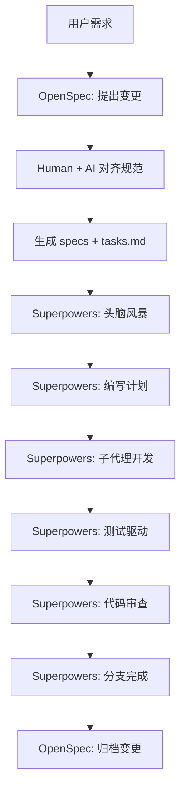
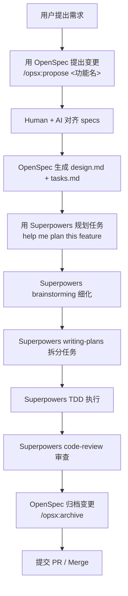
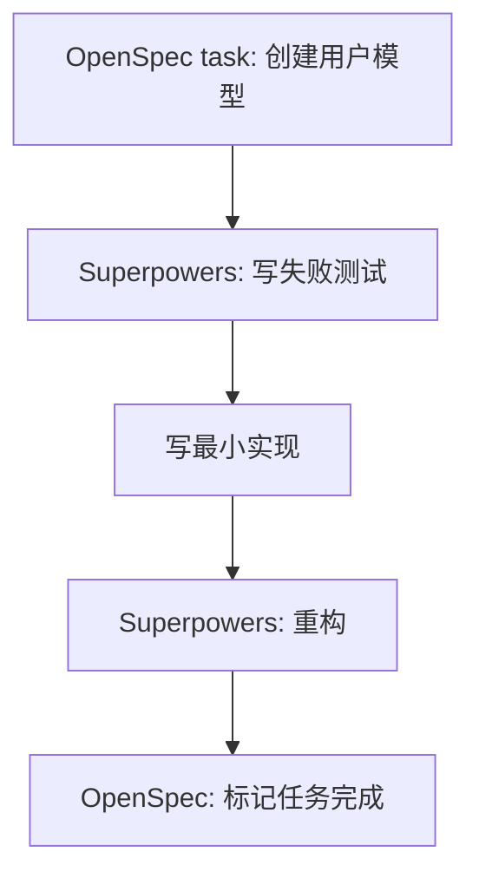
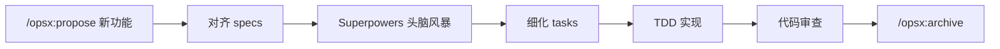

# Superpowers 与 OpenSpec 结合使用指南

> 打造完整的设计→规划→执行→验证工作流

## 概述

**Superpowers** 和 **OpenSpec** 是两个互补的 AI 编程辅助工具，结合使用可以实现：

- **Superpowers**：提供系统化的开发流程（需求澄清、任务分解、TDD、代码审查）
- **OpenSpec**：在代码编写之前建立人机共识的规范（Spec），确保实现方向正确

两者结合的核心思路：**OpenSpec 解决"做什么"的问题，Superpowers 解决"怎么做"的问题**。

---

## 核心概念对比

| 维度 | Superpowers | OpenSpec |
|------|-------------|----------|
| **核心职能** | 开发流程框架 | 规范驱动开发（SDD） |
| **介入时机** | 全流程（设计→实现→审查） | 代码编写之前 |
| **产出物** | 任务列表、测试、审查意见 | Spec 文档（proposal、tasks） |
| **工作模式** | 代理自主执行工作流 | 人机对齐后交付任务 |
| **API Key** | 不需要 | 不需要 |
| **支持平台** | Claude Code、Codex、Cursor 等 | 20+ AI 助手（斜杠命令） |

---

## 工作流整合

### 完整开发流程



### 阶段详解

#### 阶段一：需求澄清（OpenSpec + Superpowers 头脑风暴）

**OpenSpec** 的 `/opsx:propose` 启动结构化提案流程：

```
用户: /opsx:propose add-user-auth
AI: Created openspec/changes/add-user-auth/
  ✓ proposal.md — 为什么做这件事
  ✓ specs/ — 需求和场景
  ✓ design.md — 技术方案
  ✓ tasks.md — 实现检查清单
准备开始实现！
```

**Superpowers 头脑风暴** 进行苏格拉底式需求深挖：

- 提出澄清性问题
- 探索替代方案
- 分段展示设计供人工批准

#### 阶段二：规范确认（OpenSpec specs）

OpenSpec 生成的 `tasks.md` 是具体实现检查清单：

```markdown
## tasks.md 示例

- [ ] 创建 User 模型，包含 email/password 字段
- [ ] 使用 bcrypt 对密码加密
- [ ] 实现 JWT token 生成
- [ ] 创建登录 API 端点 POST /auth/login
- [ ] 添加输入验证中间件
- [ ] 编写 auth 服务的单元测试
```

这些任务直接作为 Superpowers `writing-plans` 的输入。

#### 阶段三：执行与验证（Superpowers）


---

## 安装与配置（Codex 篇）

### 前置条件

- OpenAI Codex CLI 已安装
- Git

---

### 安装 OpenSpec（Codex）

OpenSpec 通过技能（Skills）和斜杠命令（Slash Commands）集成到 Codex。

**方法一：自动安装（推荐）**

```bash
# 初始化 OpenSpec，选择 Codex 平台
openspec init --platform codex

# 或全局安装（所有平台）
openspec init --global
```

**方法二：手动安装**

```bash
# 1. 创建 Codex 技能目录
mkdir -p ~/.codex/skills

# 2. 克隆 OpenSpec 仓库
git clone https://github.com/Fission-AI/OpenSpec.git /tmp/openspec

# 3. 复制 Codex 技能文件
cp -r /tmp/openspec/.codex/skills/openspec-* ~/.codex/skills/

# 4. 创建斜杠命令提示文件
mkdir -p ~/.codex/prompts
cp /tmp/openspec/.codex/prompts/opsx-*.md ~/.codex/prompts/
```

**验证安装**

启动 Codex 新会话，输入：

```
/opsx:help
```

如果看到 OpenSpec 帮助信息，说明安装成功。

---

### 安装 Superpowers（Codex）

让 Codex 自动执行安装：

```
Fetch and follow instructions from https://raw.githubusercontent.com/obra/superpowers/refs/heads/main/.codex/INSTALL.md
```

或手动安装：

```bash
# 1. 克隆 Superpowers 仓库
git clone https://github.com/obra/superpowers.git ~/.codex/superpowers

# 2. 创建技能符号链接
mkdir -p ~/.agents/skills
ln -s ~/.codex/superpowers/skills ~/.agents/skills/superpowers

# 3. 重启 Codex 会话
```

**验证安装**

```
help me plan this feature
```

Codex 应该触发 Superpowers 的 brainstorming 和 writing-plans 技能。

---

### 启用多代理功能（可选）

Superpowers 的部分技能依赖多代理特性，在 `~/.codex/config.toml` 中添加：

```toml
[features]
multi_agent = true
```

### 目录结构

结合使用时，Codex 项目推荐结构：

```
项目目录/
├── openspec/                    # OpenSpec 规范目录
│   ├── specs/                   # 当前规范（source of truth）
│   └── changes/                 # 变更提案
│       ├── add-feature-x/
│       │   ├── proposal.md
│       │   ├── design.md
│       │   ├── specs/
│       │   └── tasks.md
│       └── archive/             # 已完成的变更
├── .codex/                      # Codex 配置
│   ├── skills/                  # OpenSpec 技能
│   └── AGENTS.md                # 全局指令（可选）
├── ~/.agents/skills/superpowers # Superpowers 技能（符号链接）
└── src/                         # 源代码
```

---

### Codex 整合后的完整工作流

当 OpenSpec 和 Superpowers 都安装好后，Codex 中的标准开发流程：



**Codex 中的命令序列示例：**

```
# 1. 开启新功能规范流程
/opsx:propose add-user-auth

# 2. 等待 specs 对齐完成后，用 Superpowers 规划
help me plan this feature using tasks.md

# 3. 执行 TDD
let's test-drive this implementation

# 4. 代码审查
review the auth module

# 5. 完成分支
finish this development branch

# 6. 归档 OpenSpec 变更
/opsx:archive
```

---

## 实用技巧

### 技巧一：OpenSpec 作为 Superpowers 的输入层

**问题**：Superpowers 的 brainstorming 有时过于发散

**方案**：先用 OpenSpec `/opsx:propose` 固定范围，再交给 Superpowers 执行

```
# 1. 先用 OpenSpec 定义范围
/opsx:propose add-payment-integration

# 2. AI 生成结构化提案后，交给 Superpowers
help me plan this feature using the tasks.md
```

### 技巧二：用 Superpowers 审查 OpenSpec 生成的 Tasks

**问题**：OpenSpec 生成的 tasks 可能过于简单

**方案**：用 Superpowers 的 `writing-plans` 进一步细化

```bash
# 将 tasks.md 的任务细化为 2-5 分钟的原子任务
help me expand these tasks into a detailed plan with 2-5 min subtasks
```

### 技巧三：OpenSpec archive 作为项目历史

OpenSpec 的 archive 功能保留了完整的变更历史：

```
openspec/changes/archive/2025-01-23-add-dark-mode/
├── proposal.md
├── design.md
├── specs/
└── tasks.md (已勾选)
```

这些归档可以直接作为项目的技术决策文档。

### 技巧四：Superpowers TDD 验证 OpenSpec Tasks

OpenSpec 的 tasks 只定义"做什么"，Superpowers 的 TDD 确保"做得对"：



### 技巧五：双层代码审查

**OpenSpec design.md** → 检查是否按照规范实现
**Superpowers code-review** → 检查代码质量

```
# OpenSpec 层面：是否符合 design.md？
- [ ] 使用了 bcrypt 而非 MD5
- [ ] JWT secret 从环境变量读取

# Superpowers 层面：代码是否优雅？
- [ ] 错误处理是否完善
- [ ] 是否有内存泄漏
```

---

## 命令对照表

### OpenSpec 常用命令

| 命令 | 作用 |
|------|------|
| `/opsx:propose <名称>` | 创建新变更提案 |
| `/opsx:status` | 查看当前变更状态 |
| `/opsx:diff` | 查看规范差异 |
| `/opsx:archive` | 归档已完成变更 |
| `/opsx:list` | 列出所有变更 |

### Superpowers 常用命令

| 命令 | 触发技能 |
|------|----------|
| `help me plan this feature` | brainstorming + writing-plans |
| `let's debug this issue` | systematic-debugging |
| `run tests` | test-driven-development |
| `review this code` | requesting-code-review |
| `finish this branch` | finishing-a-development-branch |

---

## 典型使用场景

### 场景一：新功能开发



### 场景二：Bug 修复

```
# 用 OpenSpec 记录修复方案
/opsx:propose fix-login-redirect

# 用 Superpowers 验证修复
help me debug why login redirect isn't working
run tests to verify the fix
```

### 场景三：代码重构

```
# OpenSpec 定义重构范围
/opsx:propose refactor-auth-module

# Superpowers 执行重构
help me plan the refactoring with test coverage
```

---

## 常见问题

### 问一：两个工具会不会冲突？

**不会**。它们作用于不同阶段：

- OpenSpec → 代码编写之前（对齐）
- Superpowers → 代码编写及之后（执行）

### 问二：可以只用 OpenSpec 不用 Superpowers 吗？

可以。OpenSpec 独立完整，Superpowers 是增强选项。

### 问三：支持哪些 AI 助手？

- **OpenSpec**：20+ AI 助手（Claude Code、Cursor、Copilot、Windsurf 等）
- **Superpowers**：Claude Code、Codex、Cursor、OpenCode、Gemini CLI 等

### 问四：需要网络吗？

都不需要 API Key，纯本地运行。

---

## 参考资料

- [OpenSpec GitHub](https://github.com/Fission-AI/OpenSpec)
- [Superpowers GitHub](https://github.com/obra/superpowers)
- [OpenSpec Medium 文章](https://medium.com/coding-nexus/openspec-a-spec-driven-workflow-for-ai-coding-assistants-no-api-keys-needed-d5b3323294fa)
- [Spec-Driven Development 指南](https://aliirz.com/getting-started-with-sdd)

---

## 更新日志

- **2026-03-31**：初始版本，整合 Superpowers 与 OpenSpec 结合使用技巧
