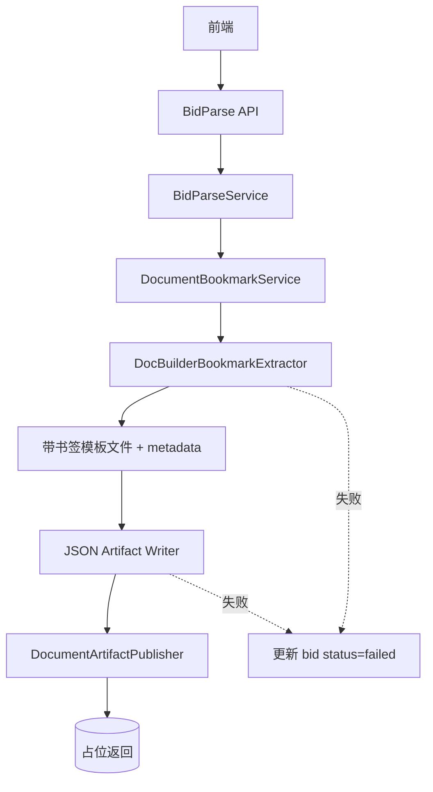
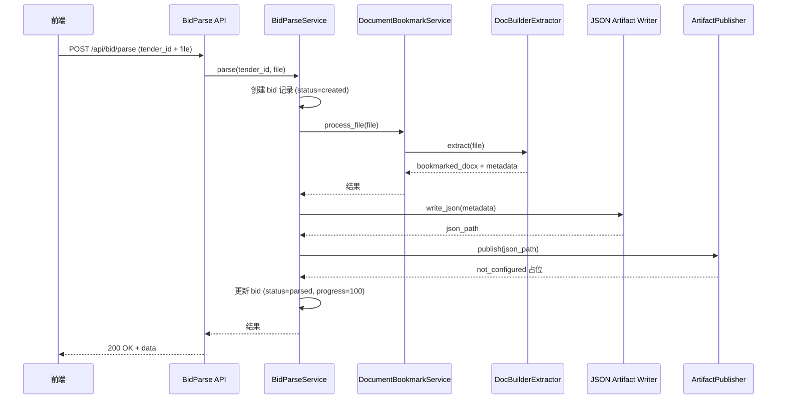
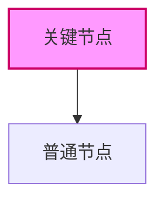

# Brainstorming Skill — Spec 模板规范

> 本文档定义 superpowers `brainstorming` 技能在生成 spec 设计文档时的输出规范。适用于 Claude Code 和 Codex 双端。

---

## 模板结构（11 节，按开发逻辑排列）

```markdown
# [功能名称] 设计文档

## 1. 背景与目标

- 解决什么问题
- 为什么做这件事


## 2. 范围

- ✅ 本期做（简洁清单）
- ❌ 本期不做（但写清楚未来怎么接）


## 3. 核心业务结论

> ★ 技术经理第一个看这里。3~5 条关键结论，一句话一条，覆盖 DB 变更、存储占位、接口契约等核心约束。

格式示例：
- 本期 `bid` 表独立新建，不复用现有 `bids` 表
- `template_file` / `json_file` / `result_file` 本期均为 null，不伪造 file_id
- 文件产物通过 `DocumentArtifactPublisher` 统一发布，本期返回 not_configured 占位


## 4. 数据模型

每张表用独立代码块展示，字段格式如下：

```plaintext
### `表名` 表中文名

| 字段名    | 类型         | 可空  | 默认值      | 说明                              |
|-----------|--------------|-------|-------------|-----------------------------------|
| `id`      | bigint       | ❌    | auto        | 主键                              |
| `name`    | varchar(128) | ❌    | —           | 名称                              |
| `file_id` | bigint       | ✅    | null        | 文件关联，**本期为 null**，未来接入后回填 |
```

**字段备注格式规范：**

| 类型 | 写法 | 示例 |
|------|------|------|
| 普通字段 | `简短说明` | `主键` |
| 本期占位 | `★ 本期为 null，未来接入后回填` | `文件关联，**本期为 null**，未来接入后回填` |
| 状态流转 | `* → *` 流转说明 | `状态：created → parsing → parsed` |


## 5. 系统架构

### 5.1 组件关系图

使用 Mermaid `flowchart TB`，描述组件间的调用/数据流向。



### 5.2 目录结构

使用树形文本结构，每个文件一行 `#` 职责注释。★ 标记本期关键文件。

```
backend/app/
├── api/
│   └── bid_parse.py              # 投标文件解析 HTTP 接口
├── document_processing/
│   ├── __init__.py              # 模块入口
│   ├── constants.py             # 书签前缀、编号宽度等常量
│   ├── types.py                 # 类型定义
│   ├── docbuilder_extractor.py  # DocBuilder 书签提取器
│   ├── artifact_publisher.py    # ★ 本期占位发布器
│   ├── json_artifact_writer.py   # metadata → JSON 文件
│   └── temp_files.py            # 临时文件管理
├── models/
│   └── bid.py                   # 投标记录表模型
└── services/
    └── bid_parse_service.py      # ★ 核心编排服务
```

**格式规范：**
- 纯文本树形，用 `├──` / `│` / `└──` 缩进（类似 `tree` 命令）
- `#` 注释一行文件职责，简洁描述
- `★` 标记本期关键/新增文件


## 6. 接口设计

### 6.1 接口定义

```http
POST /api/bid/parse
Content-Type: multipart/form-data
```

### 6.2 请求参数

| 字段       | 类型   | 必填 | 说明              |
|-----------|--------|------|-------------------|
| `tender_id` | string | ❌   | 招标记录 id         |
| `file`     | file   | ❌   | 投标文件模板（docx）|

### 6.3 响应结构

```json
{
  "success": true,
  "message": "投标文件解析成功",
  "data": {
    "bid_id": 1001,
    "status": "parsed",
    "progress": 100,
    "template_file": { "status": "not_configured", "file_id": null, "filename": "..." },
    "json_file": { "status": "not_configured", "file_id": null, "filename": "..." },
    "metadata": { "bk_001": { "type": "paragraph", "original_text": "..." } }
  }
}
```


## 7. 处理流程

### 7.1 时序图（跨组件交互）

使用 Mermaid `sequenceDiagram`：



### 7.2 数据流转图（数据在各层的传递）

使用 Mermaid `flowchart LR` 标注数据标签：


## 8. 异常与边界处理

| 场景             | 处理方式                                           |
|-----------------|---------------------------------------------------|
| 参数校验失败      | 返回 400，message 说明原因，不进入处理流程            |
| 打书签失败        | bid.status=failed，progress 保留失败前百分比         |
| JSON 生成失败     | bid.status=failed，保留已完成 progress               |
| 发布器未接入（本期）| 返回 not_configured，整体仍视为成功                 |


## 9. 测试策略

- **单元测试**：`DocBuilderBookmarkExtractor` 书签提取逻辑
- **集成测试**：`BidParseService` 成功链路 + 异常链路
- **API 测试**：multipart 上传、参数校验、响应结构


## 10. 后续扩展路线

| 本期占位点          | 未来接入方式                        |
|---------------------|-------------------------------------|
| `template_file=null` | 接入对象存储后回填真实 file_id       |
| `json_file=null`      | 接入后写入 file 表并返回             |
| `result_file=null`    | 自动生成投标文件完成后回填            |


## 11. 结论

1~2 句话总结本期设计核心价值点和扩展边界。
```


---

## Mermaid 图表规范

### 触发规则（按内容类型，不按步数）

| 内容特征 | Mermaid 类型 | 说明 |
|----------|-------------|------|
| 组件间调用关系 | `flowchart TB` | 上下流向，适合树状结构 |
| 处理步骤 + 条件/分支 | `flowchart LR` / `TD` | 左右或上下，带分支判断 |
| 跨时间顺序的组件交互 | `sequenceDiagram` | 时序图，描述调用顺序 |
| 数据在各层的传递 | `flowchart LR` + edge labels | 边上加 `|数据标签|` |
| 状态生命周期流转 | `stateDiagram-v2` | 状态机 |
| 系统与人（宏观架构） | `architecture` 或 `C4` | — |

**不需要用 Mermaid 的场景：**
- 配置变更、简单 CRUD、无流程逻辑 → 纯文字
- 目录结构 → 纯文本树形（不用 Mermaid）

### Style 技巧



- `TB` = Top to Bottom（上下）
- `LR` = Left to Right（左右）
- `->>` = 同步调用（sequenceDiagram）
- `-->>` = 返回（sequenceDiagram）
- `|label|` = edge 上的数据标签（flowchart）
- `-.->` = 虚线（失败/异常路径）


---

## 快速对照

| 需求 | 格式 |
|------|------|
| 数据模型字段备注 | `plaintext` 代码块表格 |
| 目录结构 | 纯文本树形 + `#` 注释 |
| 组件关系图 | `mermaid flowchart TB` |
| 时序图 | `mermaid sequenceDiagram` |
| 数据流转图 | `mermaid flowchart LR` + `|label|` |
| 异常处理 | 表格（场景 / 处理方式） |
| 扩展路线 | 表格（占位点 / 未来接入方式） |

---

## 文件位置

| 端 | 路径 |
|----|------|
| Claude Code | `~/.claude/plugins/cache/claude-plugins-official/superpowers/5.0.5/skills/brainstorming/SKILL.md` |
| Codex | `~/.codex/superpowers/skills/brainstorming/SKILL.md` |
| 本文档 | `~/study/my-blob/Superpowers/brainstorming-Spec模板规范.md` |
