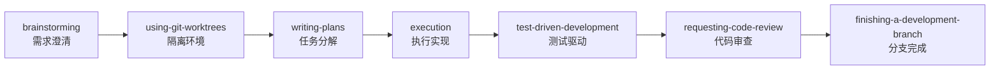
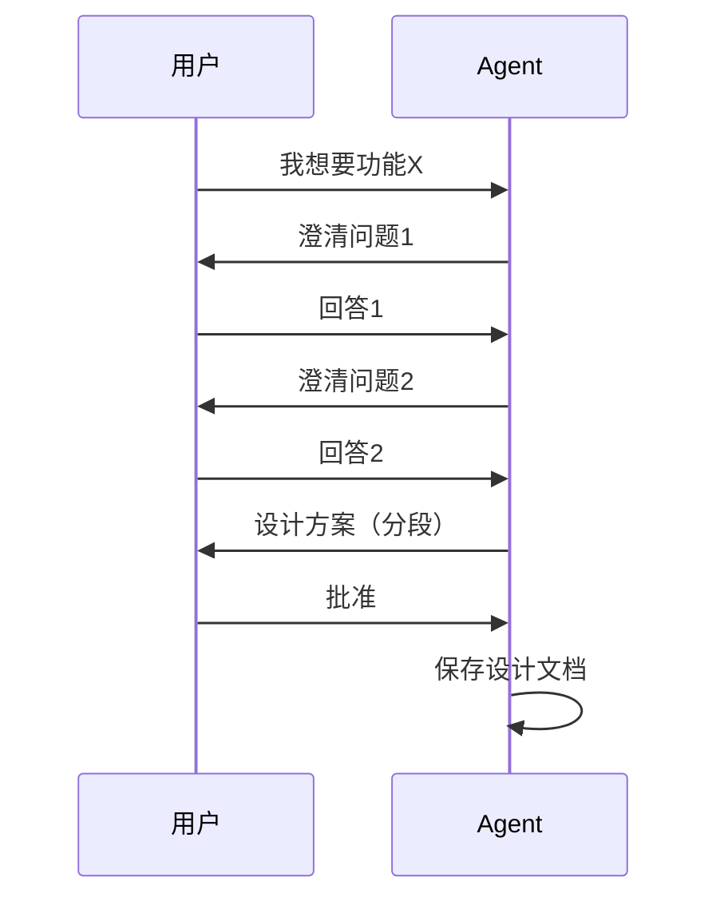
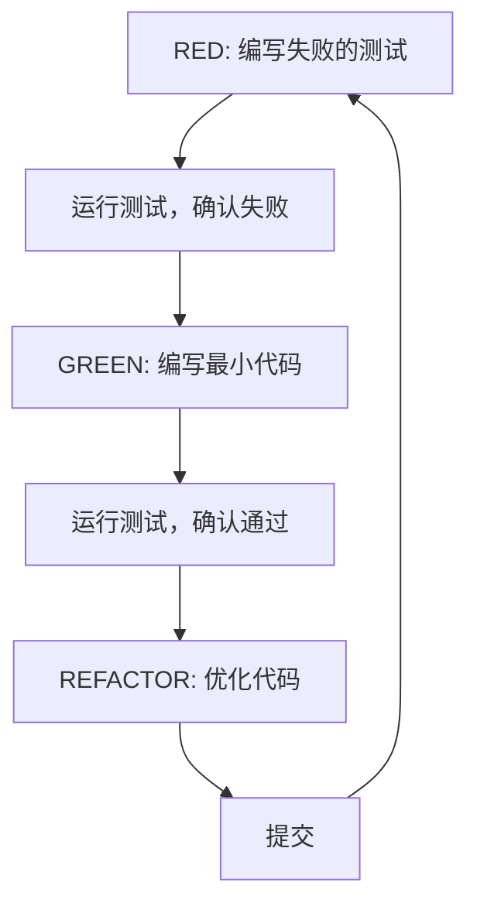
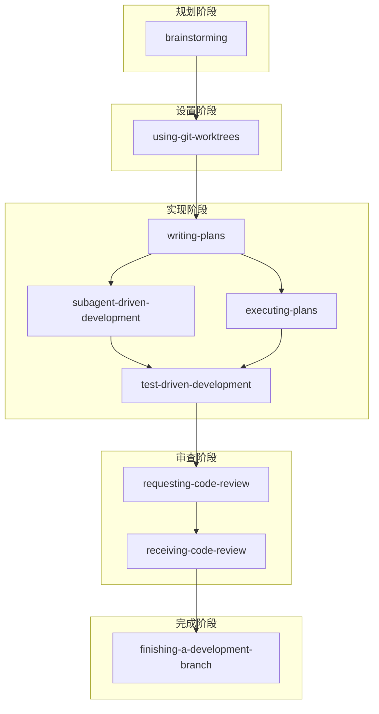
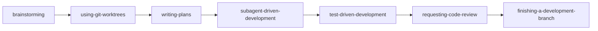
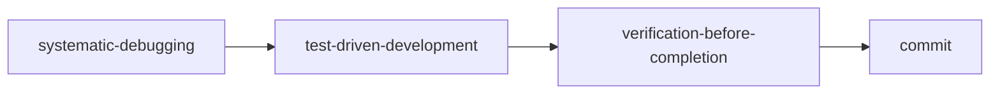
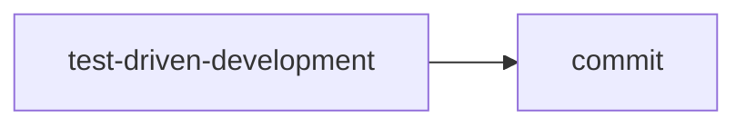
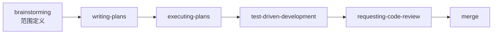

# Superpowers 使用指南

## 概述

**Superpowers** 是一个完整的软件开发工作流框架，专为编程代理（coding agents）设计。它构建在一组可组合的"技能"（skills）之上，支持 Claude Code、Cursor、Codex、OpenCode、Gemini CLI 等平台。

**核心理念：** 当你启动编程代理时，它不会直接开始写代码，而是先通过提问来理解你的真实需求，然后设计、规划、执行，整个过程系统化且可验证。

**GitHub:** https://github.com/obra/superpowers
**Stars:** 106k+
**License:** MIT

## 核心概念

### 工作流程

Superpowers 的工作流程分为 7 个阶段：



### 技能分类

| 类别 | 技能名称 | 用途 |
|------|----------|------|
| **测试** | test-driven-development | RED-GREEN-REFACTOR 循环 |
| **调试** | systematic-debugging | 4 阶段根因分析 |
| **调试** | verification-before-completion | 确保修复有效 |
| **协作** | brainstorming | 苏格拉底式需求澄清 |
| **协作** | writing-plans | 详细实现计划 |
| **协作** | executing-plans | 批量执行带检查点 |
| **协作** | dispatching-parallel-agents | 并行子代理工作流 |
| **协作** | requesting-code-review | 预审查检查清单 |
| **协作** | receiving-code-review | 响应反馈 |
| **协作** | using-git-worktrees | 并行开发分支 |
| **协作** | finishing-a-development-branch | 合并/PR 决策流程 |
| **协作** | subagent-driven-development | 双阶段审查迭代 |
| **元技能** | writing-skills | 创建新技能 |
| **元技能** | using-superpowers | 技能系统介绍 |

## 使用方法

### 安装

#### Claude Code（官方市场）

```bash
/plugin install superpowers@claude-plugins-official
```

#### Claude Code（插件市场）

```bash
/plugin marketplace add obra/superpowers-marketplace
/plugin install superpowers@superpowers-marketplace
```

#### Cursor

```bash
/add-plugin superpowers
```

或搜索 "superpowers" 插件。

#### Codex

```bash
# 让 Codex 执行
Fetch and follow instructions from https://raw.githubusercontent.com/obra/superpowers/refs/heads/main/.codex/INSTALL.md
```

#### OpenCode

```bash
# 让 OpenCode 执行
Fetch and follow instructions from https://raw.githubusercontent.com/obra/superpowers/refs/heads/main/.opencode/INSTALL.md
```

#### Gemini CLI

```bash
gemini extensions install https://github.com/obra/superpowers
```

更新命令：

```bash
gemini extensions update superpowers
```

### 验证安装

启动新会话，尝试触发技能：

```
help me plan this feature
```

```
let's debug this issue
```

代理应该自动调用相关的 superpowers 技能。

### 更新

```bash
/plugin update superpowers
```

## 核心工作流程详解

### 1. Brainstorming（需求澄清）

**触发时机：** 开始新工作之前

**工作流程：**
1. 提出澄清性问题
2. 探索替代方案
3. 分段展示设计
4. 获得人工批准

**输出：** 设计文档



### 2. Using Git Worktrees（隔离环境）

**触发时机：** 设计批准后

**工作流程：**
1. 创建新分支
2. 设置隔离工作区
3. 运行项目设置（安装依赖等）
4. 验证干净的测试基线

**何时跳过：**
- 在现有分支上的小改动
- 不需要隔离的快速修复

### 3. Writing Plans（任务分解）

**触发时机：** 有批准的设计时

**好计划的特征：**
- **粒度小**：每个任务 2-5 分钟
- **具体**：精确的文件路径、完整的代码片段
- **可验证**：明确的完成验证步骤
- **有序**：逻辑顺序，标注依赖关系

**任务格式示例：**

```markdown
Task: Create User model
Files: src/models/User.ts
Steps:
1. 创建接口定义文件
2. 添加验证方法
3. 编写单元测试
Verification: 运行测试，期望全部通过
```

### 4. Execution（执行实现）

**两种模式：**

#### Subagent-Driven Development

- 每个任务分配新的子代理
- 双阶段审查：
  1. 规范符合性（是否构建了计划的内容？）
  2. 代码质量（实现是否良好？）
- 适合：复杂、独立的任务

#### Executing Plans

- 批量执行
- 人工检查点
- 适合：简单、顺序的任务

### 5. Test-Driven Development（测试驱动）

**RED-GREEN-REFACTOR 循环：**



**关键规则：**
1. **永远不要在测试之前写代码** - 如果写了，删除它
2. **最小代码** - 只写足够通过测试的代码
3. **只在绿色时重构** - 测试必须先通过

### 6. Requesting Code Review（代码审查）

**审查标准：**
- 规范符合性
- 代码质量
- 测试覆盖
- 文档完整性

**严重性级别：**
- **Critical**：阻塞进度，必须立即修复
- **Major**：合并前应修复
- **Minor**：可延迟

### 7. Finishing a Development Branch（分支完成）

**选项：**
1. **Merge** - 直接合并到 main
2. **PR** - 创建拉取请求供审查
3. **Keep** - 保存分支供稍后使用
4. **Discard** - 删除分支和工作树

**流程：**
1. 验证所有测试通过
2. 更新文档
3. 清理工作树
4. 选择操作并执行

## 技能关系图



## 常见场景工作流

### 新功能开发



### Bug 修复



### 快速修复



### 重构



## 哲学原则

| 原则 | 说明 |
|------|------|
| **测试驱动开发** | 永远先写测试 |
| **系统化优于临时方案** | 流程胜过猜测 |
| **复杂度降低** | 简化为首要目标 |
| **证据优于声明** | 验证后再宣布成功 |

## 注意事项

### 安装问题

1. **技能不触发**
   - 验证插件/扩展已正确安装
   - 检查代理有读取权限
   - 重启会话

2. **技能过时**
   ```bash
   /plugin update superpowers
   ```

### 使用建议

1. **不要跳过 Brainstorming** - 好的设计节省后续时间
2. **回答要具体** - 帮助代理更好地理解需求
3. **检查点不要跳过** - 保持对进度的控制
4. **测试先行** - 永远不要在测试之前写代码

### 常见错误

| 错误 | 解决方案 |
|------|----------|
| 代码在测试之前写了 | 删除代码，先写测试 |
| 任务太大 | 拆分成更小的任务（2-5 分钟） |
| 跳过审查 | 即使小改动也要审查 |
| 忘记验证修复 | 使用 verification-before-completion |

## 参考资料

- **GitHub 仓库**: https://github.com/obra/superpowers
- **官方文档**: https://github.com/obra/superpowers/blob/main/README.md
- **Discord 社区**: https://discord.gg/Jd8Vphy9jq
- **问题反馈**: https://github.com/obra/superpowers/issues
- **博客文章**: https://blog.fsck.com/2025/10/09/superpowers/

## 更新日志

- **v5.0.5** (2026-03-17): 最新版本
- **License**: MIT

---

**文档创建时间**: 2026-03-23
**创建工具**: tech-doc-writer skill