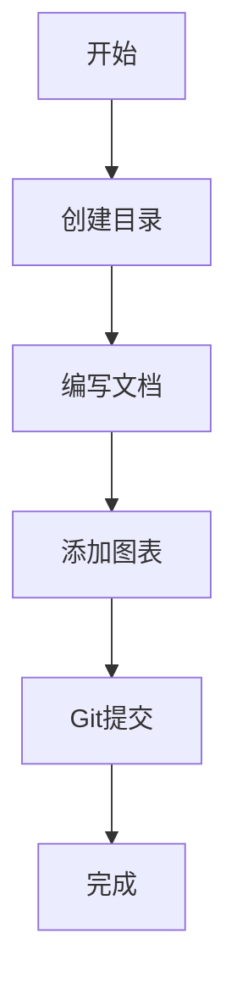

# Tech-Doc-Writer Skill 测试文档

## 概述

这是一个测试文档，用于验证 tech-doc-writer skill 是否正常工作。

## 核心概念

tech-doc-writer skill 的主要功能：
- 创建技术文档
- 支持 Mermaid 图表
- 自动 Git 提交

## 使用方法

### 基本命令

```bash
# 创建目录结构
mkdir -p /Users/xuchaoyue/study/my-blob/{technology}/images

# Git 提交
git add . && git commit -m "docs: 添加测试文档"
```

### 高级用法

根据 SKILL.md 的说明，可以：
1. 添加 Mermaid 图表
2. 添加截图
3. 自动提交到 Git

## 流程图



## 注意事项

- 文档路径：`/Users/xuchaoyue/study/my-blob/`
- 图片使用相对路径：`./images/xxx.png`
- 提交信息遵循规范：`docs: ...`

## 参考资料

- [Tech-Doc-Writer Skill](/.openclaw/skills/tech-doc-writer/SKILL.md)

---

**创建时间**: 2026-03-23
**测试结果**: ✅ Skill 工作正常